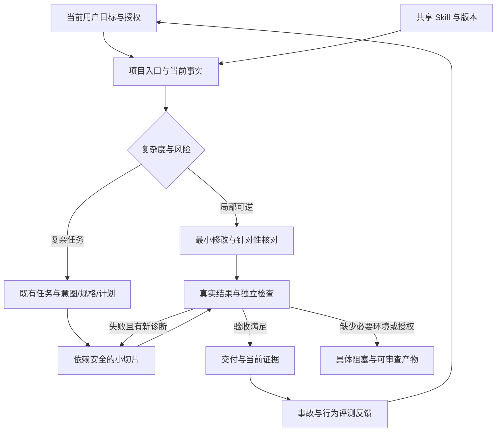

# Anthropic 开发体系研究与跨项目适配

研究日期：2026-09-11。核心资料核对于2026-09-11，补充资料与实际核对时间见来源清单。作者：本次开发体系研究 Agent。本文是研究与适配建议，不能充当产品实现、生产验收或所有宿主自动加载的证据。

研究结论：可跨项目复用的是“明确目标、读取当前事实、按风险执行、依靠结果验证、保留接续证据、用评测改进”的工作方法。具体目录、命令、身份、流程引擎、审批和运行时要绑定各项目现状。通用 Skill 应提供这一方法与适配步骤，不能把 OA 项目的任务状态、技术候选或业务权限写成所有项目的默认值。

## 研究范围与可信度

从用户提供的 Datawhale 文章追溯两篇原文，再沿 [Anthropic Engineering 官方目录](https://www.anthropic.com/engineering)和正文链接核对互补材料。核心覆盖16篇官方文章或介绍页，并补充组织实践、Skill文档、hook协议与官方仓库4项，共20项一手来源，包含有效 Agent、工具、上下文、长期 Harness、评测、Skills、多 Agent、安全隔离、身份及 SDLC；不以转载、搜索排名或社区提示词作为技术结论依据。这是围绕开发体系的系统性检索，不声称穷尽该公司全网内容。

用户文章中的“约 80% 合入代码由 Claude 编写”和“工程师代码产量约 8 倍”可追溯到 Jason Clinton 的内部实践介绍，属于厂商自报，不是本项目的效率或质量承诺。[内部 SDLC 安全实践](https://claude.com/blog/how-anthropic-secures-its-ai-native-software-development-lifecycle)

以下把**原文事实**与**本次适配推导**分开。网页的发布日期不等于内容从未更新；模型版本、API、许可、价格和宿主能力在实际采用时仍需重新核对。机器可读目录见 [development-anthropic-sources.json](../validation/development-anthropic-sources.json)，它是共享Skill来源目录的项目证据快照，记录规范来源路径与哈希。S01—S20沿用同一编号。

## 一手来源与适用边界

| ID | 文章及发布日期 | 原文事实摘要 | 采用边界 |
|---|---|---|---|
| S01 | [Building effective agents](https://www.anthropic.com/engineering/building-effective-agents)，2024-12-19 | 区分固定工作流与动态 Agent；只在效果需要时增加复杂度。 | 原文已提示工具生态变化；不把“直接 API”解释成必须重写成熟运行时。 |
| S02 | [How we built our multi-agent research system](https://www.anthropic.com/engineering/multi-agent-research-system)，2025-06-13 | 多 Agent 适合独立、广度优先研究；委派须有目标、输出和边界。 | 文中多 Agent 约消耗聊天 15 倍 token；多数编码任务可并行部分更少。 |
| S03 | [Writing effective tools for agents — with agents](https://www.anthropic.com/engineering/writing-tools-for-agents)，2025-09-11 | 工具职责、参数、错误反馈和结果裁剪影响任务成功；留出测试集防过拟合。 | 不把每个 API 都包装成工具；评估允许多种正确实现路径。 |
| S04 | [Effective context engineering for AI agents](https://www.anthropic.com/engineering/effective-context-engineering-for-ai-agents)，2025-09-29 | 按需读取高信号上下文，使用引用、压缩与结构化笔记维持长期任务。 | 最少不等于不足；压缩可能丢失约束，运行时检索也有延迟。 |
| S05 | [Equipping agents for the real world with Agent Skills](https://www.anthropic.com/engineering/equipping-agents-for-the-real-world-with-agent-skills)，2025-10-16；开放标准更新 2025-12-18 | Skill 采用元数据、正文、按需资源逐层加载；从真实能力缺口与评测开始。 | 格式可移植不代表权限和工具通用；外部脚本、依赖和网络行为需审查。 |
| S06 | [Beyond permission prompts: making Claude Code more secure and autonomous](https://www.anthropic.com/engineering/claude-code-sandboxing)，2025-10-20 | 文件系统与网络隔离共同约束执行范围，减少逐动作审批。 | 这是特定产品实现；不能用提示词或命令关键词匹配替代隔离。 |
| S07 | [Effective harnesses for long-running agents](https://www.anthropic.com/engineering/effective-harnesses-for-long-running-agents)，2025-11-26 | 首次初始化与后续增量执行分开；功能清单、交接、真实浏览器检查减少过早完成。 | 实验针对全栈 Web；两个角色使用同一 Harness，不等于必须搭两套执行引擎。 |
| S08 | [Demystifying evals for AI agents](https://www.anthropic.com/engineering/demystifying-evals-for-ai-agents)，2026-01-09 | 评估最终环境状态；结合确定性、模型与人工判断；隔离 trial 并读取轨迹。 | 一次通过不是稳定性；评测器也会错，不能仅追求分数。 |
| S09 | [Quantifying infrastructure noise in agentic coding evals](https://www.anthropic.com/engineering/infrastructure-noise)，2026-02-05 | 同模型、同任务可因资源配置产生分数差异；需记录资源与执行约束。 | 文中 Terminal-Bench 极端配置相差 6 个百分点，不能外推成固定修正值。 |
| S10 | [Harness design for long-running application development](https://www.anthropic.com/engineering/harness-design-long-running-apps)，2026-03-24 | 分离生成与评估可发现自评遗漏；新模型后逐项移除不再有效的脚手架。 | 游戏示例为 20 分钟/$9 对 6 小时/$200；仍有漏测，非全面生产能力证明。 |
| S11 | [How we built Claude Code auto mode](https://www.anthropic.com/engineering/claude-code-auto-mode)，2026-03-25 | 动作审批分类器减少打断，但有误放；委派和返回也需检查。 | 属于概率防御。其默认授权判定不覆盖当前宿主或用户的明确指令。 |
| S12 | [Scaling Managed Agents: Decoupling the brain from the hands](https://www.anthropic.com/engineering/managed-agents)，2026-04-08 | 将持久会话、Harness 与执行环境解耦，支持失败恢复，并使凭据远离执行沙箱。 | 是托管服务设计经验；不因此要求所有项目购买该服务或自造元 Harness。 |
| S13 | [How we contain Claude across products](https://www.anthropic.com/engineering/how-we-contain-claude)，2026-05-25 | 环境隔离、模型防御与外部内容检查互补；允许域名也可能承载攻击者账号。 | 沙箱内仍可能损坏工作区；连接器可信不等于其数据可信，子 Agent 输出也不自动可信。 |
| S14 | [Zero Trust for AI agents](https://claude.com/blog/zero-trust-for-ai-agents)，2026-05-27 | 官方介绍强调身份、逐任务权限、记忆投毒防护与按成熟度采用。 | 已读介绍页；链接 PDF 返回不可重试读取错误，未核对全文及其合规映射。 |
| S15 | [How Anthropic secures its AI-native software development lifecycle](https://claude.com/blog/how-anthropic-secures-its-ai-native-software-development-lifecycle)，2026-07-21 | 风险分层、观察模式、抽样审查和单用途身份配合；事故诊断者无直接发布权限。 | 内部实践依赖其身份、CI、监控与人员责任；不能只复制文档便宣称等效。 |
| S16 | [The AI-Native SDLC playbook](https://claude.com/blog/the-ai-native-sdlc-playbook)，2026-08-21 | 六阶段由可追溯产物衔接；实践按依赖采用；明确每类产物的权威系统。 | 原文采用 Git/Claude 例子，也允许接入现有系统；不得机械新增三份文档和逐步确认。 |

## 交叉核对后需要修正的理解

1. **持续应用应带有删除规则。** S07 的长期交接有效；S10、S12 又说明模型能力变化后，固定重置、冲刺或额外角色可能成为负担。本次推导：每条流程机制都要能说明解决哪个已观察失败，升级时在同条件下逐项比较，保留有效机制。当前用户要求保留的安全与权限规则不属于可通过评测随意删除的对象。
2. **计划与人类责任不等于每一步询问。** S16 描述分阶段的人类决定；S06、S11 又专门解决审批疲劳。本次推导：先承接当前已授权目标，准备可审查产物；局部可逆工作继续执行，只有目标重大冲突或实际授权边界变化才需要相应决定。
3. **多角色不保证评审独立。** S02 证明独立研究方向可以获益；S10 承认评审模型仍会宽松打分；S13 指出返回结果可形成信任升级。本次推导：评审直接查看代码、工具结果与运行状态；记录实际执行者，不把同一个模型换个角色名写成独立保证。
4. **测试要防作假，也要容许修正测试缺陷。** S16 的禁止弱化测试示例与 S08、S03 的评测器校准需要同时理解。本次推导：不得删失败断言换绿灯；如果需求或测试本身错误，先保留复现与契约依据，再审查修改测试的理由和差异，补能证明修正正确的独立案例。
5. **可移植的 Skill 不是跨宿主权限系统。** S05 支持资源包移植；S06、S12、S13 把执行边界放在环境中。本次推导：Skill 负责流程与能力发现，实际宿主负责工具和权限；文档、hook、CI 配置、已运行门禁、基础设施隔离分开声明。

## 应纳入通用 Skill 的 12 项采用建议

下表均为本次跨项目工程适配，不是 Anthropic 原文中的统一强制规范。列出的来源支持设计动机；落地后还须以当前项目实测证明有效。

| 建议 | 具体执行方式 | 如何证明持续应用 | 依据 |
|---|---|---|---|
| 1. 先识别项目 | 解析实际 cwd、项目标识、当前用户目标、现有任务入口和允许路径；不能按相邻仓名称猜测。 | 错目录、未知项目、非 Git 目录案例均不串入旧规则。 | S04、S07 |
| 2. 通用方法与项目适配分层 | 通用 Skill 保存决策规则；项目提供入口、权威状态、命令与业务约束；无适配时先只读探测。 | 在不同语言及纯文档项目验证入口，记录未支持宿主。 | S05、S16 |
| 3. 复用一个权威记录 | intent/spec/plan 用已有字段或引用表达；复杂任务才维护依赖节点。 | 新工作不重用已完成任务授权，不生成第二产品看板。 | S16 |
| 4. 以风险选择验证深度 | 低风险局部编辑做针对性检查；权限、状态、数据、外部作用选择相应负例。 | 把风险、验收和命令关联，无法运行的检查标记 NOT_RUN。 | S01、S08 |
| 5. 先打通反馈再扩大自治 | 确认测试命令确实执行、能失败并反馈具体原因，再扩写代码。 | 通过案例之外必须包含预期失败案例；禁止空集通过。 | S03、S08 |
| 6. 验收以真实结果为准 | 按任务检查文件、进程版本、接口、持久状态和用户操作；产物哈希绑定时间与范围。 | 源码有实现、截图、模型自述分别不能替代运行验收。 | S07、S08 |
| 7. 工具少而清晰 | 描述前置、参数、输出、副作用、失败与恢复；优先定位后读，返回可继续定位的证据。 | 错参数、截断、权限拒绝能返回可行动信息，且不泄露秘密。 | S03 |
| 8. 交接保留证据引用 | 保存当前目标、完成/未完成、下一节点、失败及产物引用；恢复时核对当前文件。 | 在新会话或独立进程中能从记录接续，不重复外部作用。 | S04、S07、S12 |
| 9. 有条件使用并行与评审 | 仅按当前授权委派；限定依赖、写范围和输出；按缺陷收益与集成成本调整。 | 真正独立检查原始产物；共享写面不并行，记录遗漏和返工。 | S02、S10 |
| 10. 把行为评测与工具回归分开 | Skill/模型/hook 变化选择真实场景，固定输入、版本、权限与资源；观察行为及最终状态。 | 工具测试通过不冒充模型回放；多次 trial 的失败均保留。 | S08、S09 |
| 11. 在实际边界内自治 | 使用宿主已有身份、沙箱和授权；外部内容只作数据；委派不能扩大原主体权限。 | 文档要求与实际隔离状态分别记录；新审查者先观察，不自动升权。 | S06、S11、S13—S15 |
| 12. 用事故与成本改进体系 | 真实失败补成回归，按返工/逃逸缺陷/时延与费用决定保留或移除机制；按授权启用候选。 | 更新含版本、原因、验证与恢复路径；没有数据时不编造收益。 | S03、S08—S10、S15 |

## 对当前 OA 项目的适配边界

本次读取了 README、CONTEXT、用户需求原文、项目 Skill、开发体系及 28 号开发验收文件。当前项目已经有 [项目 Skill](../.agents/skills/oa-development-system/SKILL.md)、[开发体系](开发体系.md)和 `validation/development-workflow.json` 的 currentTask 入口。应由通用 Skill 路由到这一适配，不再建立并行工作流。

当前 [README](../README.md) 和 [CONTEXT](../CONTEXT.md)明确：底座尚未选定，产品实现未启动。当前检查命令与文档/原型证据有各自范围；72 个产品验收场景仍未执行。[28 号验收设计](设计包/28-开发分期与验收用例.md)规定真实环境、业务回读、负例和恢复。本报告不提升这些状态。

OA 串联人、人员配置数字员工、多流程多实例、角色权限、员工市场、上下文版本与人员确认属于本项目业务基线；应在本项目适配内保留，不能变成其他项目的产品要求。同样，其他仓库的 TaskPacket、claim、运行端口、技术栈及历史批准不能进入此项目默认入口。

## 持续采用的验收边界

通用 Skill 的交付验收应至少区分以下层次：

- **结构可用**：元数据、相对引用、脚本入口与依赖可以读取和检查。
- **工具可执行**：只读探测、校验及适用负例真实执行，有原始结果。
- **实际应用**：本次工程任务明确读取并依其推进，能指出对产物和验证的影响。
- **跨项目可用**：不同项目类型的适配已验证；未验证宿主和项目如实列出。
- **模型行为有效**：真实模型回放与基线比较完成，不能用确定性单元测试代替。
- **持续强制执行**：相应宿主入口或受保护 CI 确实触发并拒绝失败；仅放置文件不能作此声明。

后续每个工程任务读取入口，是持续应用机制；周期性后台扫描、外部发送、自动安装或生产操作须有对应请求与实际配置。本次研究不创建定时任务，也不承诺将来所有工具都会自动遵守 Skill。

## 组织实践与机制删减

组织实践与Playbook并不存在必须二选一的冲突。Fiona Fung描述了更即时的规划方式：通过原型、内部用户和反馈缩短决策周期，保留领域专家对重要风险的判断。与产物链结合后，可采用“复杂决策留下规格，局部改动保持轻量”的方式；不需要把每个修订都变成三份文档和多轮审批。[^17]

本报告的工程判断是：通用开发体系应对任务提供约束与验证方法，而不是替所有项目规定相同组织结构。小型工具、已有大型系统、设计资料项目、生产故障的输入与出口不同。相同的是目标必须准确、实现必须受当前授权约束、结论必须能回到真实证据。将这些不变量写入共享Skill，把业务状态机和命令留给项目适配，才能在迁移时保留能力而避免串项目。

每个新增机制应附一个可反驳假设。例如“新会话总丢失未完成状态”可用跨会话接续试验验证；“审查发现不了授权缺陷”可用已知缺陷样本检验。若加入机制后只有运行成本上升，没有减少相关失败，就不应把它永久固化。安全与授权本身仍受真实政策约束，不能因效率评测被随意削弱。

## 发现机制、hook和供应链的补充核对

个人Skill目录可提供跨项目发现入口，但同名来源有优先级，动态加载还受宿主影响。工程上应保留一个规范目录，其他入口链接同源；项目特例用不同名称或项目适配承接，并核验实际解析路径。复制了目录只能证明文件存在，不能证明所有新会话已经自动采用。[^18]

当前hook协议尤其容易被误读。Claude文档说明，不同事件支持不同返回结构；部分非零退出码和超时不会阻断工具调用。因而“有脚本”“协议夹具通过”“宿主实际触发”“安全边界不可绕过”必须分别验证。生产授权应由实际身份、权限与受保护发布入口承接，不能只依赖一个可编辑的项目hook。[^19]

官方Skill仓库也不能整体按单一许可印象处理。其README明确区分开源Skill和文档类source-available资源。引用结构经验与复制代码的义务不同；取得新Skill时应核对实际子目录许可、依赖和可执行行为。本体系采用方法与本地实现，不需要为复用思想安装整套外部框架。[^20]

## 可持续应用的工程结构

图中的循环有停止条件：验收满足即交付；重复失败必须先取得新诊断；缺少不可替代条件时保留已验证范围和阻塞证据。图不授权后台运行、生产动作或跨项目改写。项目已有GSD、工单系统或任务图时，T节点就是该系统，不再生成平行台账。

通用Skill的脚本应保持职责窄而清楚。只读探测器输出项目标识和命令线索，不执行项目脚本；证据校验器检查记录的完整性与新鲜度，不认证作者或业务真相。能复用项目原检查器时直接复用，不为所有项目强装统一运行时。

共享Skill自身也属于验证输入。若只对项目内的符号链接取哈希，链接目标更新可能不会使报告过期；采用共享Skill的项目需要记录实际使用文件的哈希，并在前后版本变化时使相关验收重新进行。这属于本报告结合当前接入结构得到的工程推导，不是厂商文章提供的现成实现。

## 分阶段采用与衡量

| 采用层级 | 实际工作 | 出口与未满足时的处理 |
|---|---|---|
| 项目接入 | 识别根目录、现有权威记录、命令、权限与版本 | 入口可用且不复制他项目机制；未知项保持UNKNOWN |
| 一次真实交付 | 一个正常路径与关键负例，保留首次失败、修复和回读 | 验收逐项有证据；模拟或不可运行层级明确披露 |
| 跨项目迁移 | 不同技术栈、文档项目、已有流程、简单与复杂任务 | 分别报告案例；有限试用不能推出所有项目已兼容 |
| 行为稳定性 | 固定输入/工具/权限/资源，基线与候选重复试验 | 结果、成本和异常轨迹可比较；无基线不报提升 |
| 自动审查 | 观察运行，校准误报/漏报和领域判断 | 真实负责人决定晋级；不由Skill自行增加权限 |
| 发布与维护 | 接入受保护CI、真实环境、恢复与告警机制 | 验证实际触发与边界；缺基础设施时保持未接入 |

应保存首次尝试，而不只记录最终绿灯。首次通过率、需求到验收时间、审查等待、返工、逃逸缺陷和恢复耗时一起解释，才有可能判断瓶颈是否改善。工具错误、依赖故障、资源不足、模型行为和评分器错误应分别归因，否则提高机器资源也可能被误记为模型能力提升。

评测既要防止弱化断言获得通过，也要允许修复评分器错误。“保留原有测试”通常允许增加新测试；用整个测试文件哈希固定不变会误拒绝合法改进。更合适的检查是核对原断言仍然有效，再独立验证业务结果。评分规则应测量目标，不能把实现路径当作唯一正确答案。

本体系没有可用于推算组织效率提升的长期对照数据。当前适合确认的是文件与脚本可用、代表性任务可执行、失败边界能被检查；全面收益和跨宿主稳定性需要后续在真实项目中积累。

## 补充来源与研究边界

[^17]: Fiona Fung / Anthropic. [Running an AI-native engineering org](https://claude.com/blog/running-an-ai-native-engineering-org). 2026-06-03。对应统一来源目录S17。
[^18]: Anthropic. [Extend Claude with skills](https://code.claude.com/docs/en/skills). 动态文档，2026-09-11核对。S18。
[^19]: Anthropic. [Hooks reference](https://code.claude.com/docs/en/hooks). 动态文档，2026-09-11核对。S19。
[^20]: Anthropic. [anthropics/skills](https://github.com/anthropics/skills). 滚动仓库，2026-09-11核对。S20。

统一目录共20项：16篇文章正文、1个官方介绍页、2份动态文档和1个官方仓库。Zero Trust所链白皮书全文未核对，不纳入已读全文或合规结论。来源发表于不同时期，原文对不同模型和环境的实验结论不能自动外推；动态接口、许可及安全语义在实际采用时须复核。本报告是方法研究和工程适配，不代表产品、生产或全部宿主已验收。实际应用与回归记录见[开发体系](开发体系.md)及其证据链接。
