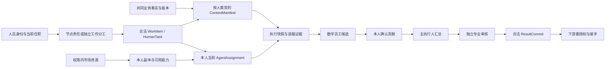

# 全角色界面、权限与操作覆盖矩阵

日期：2026-09-11｜版本：v2.4｜状态：交互设计已验证，产品实现未由本轮验收

## 1. 覆盖口径与当前修正

上一版五个演示视角不能证明全部角色已体现，且管理视角曾复用采购执行页。本版改为 **41 个可切换业务视角，覆盖当前合同中全部 44 个人类角色键**；45 个角色键中的 `PROVISIONING_SERVICE` 只分配给服务账号，不进入人类角色切换器。

41 个视角不是新建 41 个平台角色。业务分工、人员身份、资源关系和条件授权分别处理：一个人可有多个合法职责，同一 `HUMAN_EXECUTOR` 在技术、预算、写作、主执行等不同任务分工下有不同页面。写作人不是另造的系统角色。七类登录验收夹具精确保留，额外职责视角使用明确列出的现有键，不存在万能 ADMIN。

QoderWake 的白底、侧栏、卡片、资源页和对话结构延续 v2.3 的现场参考。本版将内容按本项目职责和服务端投影设计拆分；没有把 QoderWake 的角色配置当作本项目的授权模型。

原型：[08-人员数字员工协作交互原型.html](<08-人员数字员工协作交互原型.html>)。角色数据：[16-角色视角与权限演示数据.json](<16-角色视角与权限演示数据.json>)。逐项追踪：[17-角色需求与验收追踪.json](<17-角色需求与验收追踪.json>)。

## 2. 七类登录夹具与信息架构

所有视角共享一个“工作”主入口，工作台和工作执行作为页面标签。资源、领域管理与个人自助按有效权限出现。用户切换演示身份后回到本人职责首页；无领域权限的直接链接使用“不存在或无权查看”，操作时再检查同一范围。

| 演示身份 | 精确角色集合 | 领域入口与字段投影 | 不应获得 |
|---|---|---|---|
| 普通员工 | MEMBER | 本人工作、本人资料、已授权市场；无他人目录 | 其他人员搜索、租户级管理 |
| 人事运营 | MEMBER + HR_OPS | 人员任职、人事交接、组织视图；FULL_EMPLOYMENT | 认证秘密、高权绑定、权限管理 |
| 身份管理员 | MEMBER + IDENTITY_ADMIN | 身份、供应、会话、人员元数据；FULL_NO_SECRET | 密码、Token、MFA secret、任职编辑 |
| 安全审计员 | MEMBER + SECURITY_AUDITOR | 脱敏人员、权限元数据与审计；MASKED | 姓名、联系方式、业务正文与写动作 |
| 工作流管理员 | MEMBER + WORKFLOW_ADMIN | SOP 目录、实例、阻塞、版本影响 | 默认冒充节点执行人或审批人 |
| 租户所有者 | MEMBER + TENANT_OWNER | 本租户设置和生命周期影响预览 | 隐含人员、权限、审计管理 |
| 权限管理员 | MEMBER + ROLE_ADMIN | 角色、精确授权、版本策略、审批后履约 | 自批、超出批准范围或读取私人上下文 |

市场入口属于条件授予，不按“员工/管理员”标签一刀切。本版部分管理夹具未分配市场范围，所以看不到市场；这不表示管理员永远不能使用市场。员工已获准的资源可直接复制、加入本人资源并选到本人工作；可见、可复制、可编辑、可执行四种权限不能互相替代。专业审核夹具具有只读市场范围。

## 3. 每个业务视角的页面和完整主操作路径

以下每行都对应原型中的独立职责标题、导航、对象/范围、主操作和限制。“完整”指该代表性角色路径可操作并具有阻断条件，不表示该角色所有后端命令或 153 项需求都已实现。范围标签为用户能理解的业务范围；精确 canonical 键仅在此开发文档和数据文件中维护。

| 视角 / 角色键（均含 MEMBER） | 对象与可见范围 | 主操作路径 | 禁止或阻断条件 | 页面组 |
|---|---|---|---|---|
| 普通员工 / `MEMBER` | 本人及授权资源 | 领取合格待办 → 选择本人数字员工 → 保存本人配置 | 未领取工作不能配置；无权资源不出现在目录或计数 | P01 P04 P21 P22 |
| 主执行人 · 甲 / `HUMAN_EXECUTOR` | 本人节点及授权贡献 | 接受技术/预算/写作贡献 → 指定审核 → 提交节点交付 | 缺必需贡献、依据过期或未审核均不可提交 | P02 P03 P04 P16 P20 |
| 技术协作人 · 乙 / `HUMAN_EXECUTOR` | 本人分工及共同技术依据 | 准备清单候选 → 确认新版 → 使依赖旧清单的预算与写作待重核 | 草稿不改变共同事实；不能编辑他人数字员工 | P02 P03 P04 P20 |
| 预算协作人 · 丙 / `HUMAN_EXECUTOR` | 本人分工及授权报价 | 重核预算 → 提交专业贡献 → 等主执行人接受 | 旧依据不可提交；贡献成功不完成主节点 | P02 P03 P04 P16 P20 |
| 写作协作人 · 戊 / `HUMAN_EXECUTOR` | 授权事实及本人写作草稿 | 配置本人数字员工 → 应用已确认清单与预算 → 保存并提交写作贡献 | 写作贡献过期不能提交；接受后仍需独立审核和节点提交 | P02 P03 P04 P16 P20 |
| 节点责任人 / `NODE_RESPONSIBLE, BUSINESS_OWNER` | 本流程责任范围 | 查看责任链与阻塞 → 提出改派或要求返工 → 等接收人确认 | 不得代专业人确认；接收前责任仍归原承担人 | P02 P03 P16 P18 |
| 专业审核人 · 丁 / `REVIEWER` | 被指定交付与证据 | 查看指定交付和依据 → 填写退回理由或审核 → 等执行人提交 | 不得修改执行人配置；意见和审核不自动构成业务完成 | P02 P16 P20 |
| 访问审批人 / `APPROVER, ACCESS_REVIEWER` | 当前指派的审批请求 | 查看精确请求 → 确认范围期限和职责分离 → 批准或拒绝 | 不可代请求人申请；审批不直接履行授权 | P16 P18 |
| 下游接收人 / `HUMAN_EXECUTOR` | 已获授权的交接包 | 核验上游交付、版本和可读性 → 确认接手 → 配置本人数字员工 | 上游未提交或资料未核验不能接手；凭据不随交接转移 | P02 P03 P04 P16 P20 |
| 流程设计者 / `SOP_DESIGNER` | 本人维护的流程草稿 | 定义岗位、输入输出与候选能力 → 保存 → 预检 → 提交评审 | 草稿不覆盖在途实例；设计者不能发布自身流程 | P13 P17 |
| 流程与资源发布人 / `SOP_PUBLISHER, AGENT_PUBLISHER` | 被授权发布的版本 | 查看数字员工或SOP待发布版本 → 核对独立评审 → 发布新版本 | 仅含 AGENT_PUBLISHER 和 SOP_PUBLISHER；不得发布知识、技能、工具、角色策略 | P05 P17 |
| 数字员工维护者 / `AGENT_OWNER` | 本人负责的数字员工 | 维护职责和能力依赖 → 保存草稿 → 演示检查 → 提交独立评审 | 不能自批或自行发布；看不到使用者私有对话与凭据 | P05 P22 |
| 知识维护者 / `KNOWLEDGE_OWNER` | 本人负责的知识源 | 维护来源与引用版本 → 加工检查 → 提交独立评审 | 拥有知识资源不绕过源ACL；本作者不得发布自己版本 | P08 P20 |
| 技能作者 / `CAPABILITY_OWNER` | 本人负责的技能 | 维护输入输出与依赖 → 检查 → 独立评审 → 发布批准版本 | 创建者不得担任独立复核人；未批准不得正式使用 | P06 P13 P22 |
| 工具与连接维护者 / `CAPABILITY_ADMIN, INTEGRATION_ADMIN` | 被授权集成与动作定义 | 维护精确动作与连接条件 → 检查 → 独立评审 → 启用批准工具 | 工具定义不包含使用者授权；不能复制秘密或代办连接许可 | P07 P22 |
| 组织与岗位管理员 / `ORGANIZATION_ADMIN` | 获授权组织范围 | 预览组织岗位调整影响 → 确认本地变更 | 任职变更不自动授予平台高权，不代替身份管理 | P18 |
| 人事运营 / `HR_OPS` | FULL_EMPLOYMENT | 发起任职交接 → 接收人逐项确认 → 完成人事交接 | FULL_EMPLOYMENT；无认证因素、秘密或权限管理入口 | P18 |
| 身份管理员 / `IDENTITY_ADMIN` | FULL_NO_SECRET | 查身份/供应/会话元数据 → 撤销指定示例会话 | FULL_NO_SECRET；撤销不改任职，不能查看Token、MFA载荷 | P18 P21 |
| 权限管理员 / `ROLE_ADMIN` | 角色与绑定元数据 | 精确权限申请 → 独立审批 → 按批准范围履约；发布已复核角色策略 | 不能自批或扩大批准范围；拒绝、过期与无权不可履约 | P18 P16 |
| 安全审计员 / `SECURITY_AUDITOR` | MASKED | 查脱敏人员/权限事件 → 预览最小审计包 | MASKED；没有姓名/联系信息/业务正文/认证材料及写操作 | P18 P19 |
| 安全复核人 / `SECURITY_REVIEWER` | 风险与必要证据 | 核对指派的候选、提出人与证据 → 独立通过或退回 | 本人提出的候选不能自审；安全复核不替代资源发布权 | P06 P07 P18 P19 |
| 隐私负责人 / `PRIVACY_OFFICER` | 脱敏请求与保留元数据 | 核对保留状态 → 保留解除后记录处理决定 | 有法律保留不可批准处理；演示不删除或导出真实数据 | P09 P18 P19 |
| 运行维护者 / `RUNTIME_OPERATOR` | 运行关联与健康元数据 | 未知效果 → 查询回执 → 已完成禁止重试 / 确认未执行才准备恢复 | 未知不能盲目重跑；运维不代业务提交 | P19 |
| 发布运维负责人 / `RELEASE_MANAGER` | 被授权运行版本元数据 | 核对版本证据 → 生成回退计划 | 无证据不能生成计划；原型不部署真实服务 | P19 |
| 租户所有者 / `TENANT_OWNER` | 本租户元数据 | 查看租户元数据 → 预览暂停与恢复影响 | TENANT_OWNER 无隐含人员/权限/审计管理能力 | P18 |
| 工作流管理员 / `WORKFLOW_ADMIN` | 获授权工作流 | 查看SOP目录 → 运行实例 → 节点证据与版本影响 | 流程管理员不能冒充节点执行人，草稿不改变在途固定版本 | P17 P19 |
| 策略维护者 / `POLICY_OWNER` | 本人维护的策略元数据 | 编写策略约束 → 正负例检查 → 提交独立复核 | 策略作者不能自审；生产授权仍由已有合同决定 | P18 |
| 自动化维护者 / `SCHEDULE_OWNER` | 本人计划与运行摘要 | 配置时区与时间 → 保存 → 暂停/恢复计划 | 无效时间拒绝；未保存不能恢复；不产生真实定时任务 | P14 |
| 渠道与专家协作人 / `CHANNEL_BINDING_OWNER, CHANNEL_USER` | 绑定会话及最小必要背景 | 绑定范围内提出咨询 → 收到来源明确的专家意见 | 群成员不等于工作授权；咨询不是审批，不发送外部消息 | P15 P21 |
| 数字团队协调者 / `TEAM_LEADER, TEAM_MEMBER` | 获授权团队及贡献摘要 | 查看团队成员分工 → 检查候选及依赖 → 汇总阻塞 | 成员成功不等于业务完成；成员不互相扩大权限 | P12 P02 |
| 应用集成负责人 / `API_CLIENT_OWNER, API_CALLER` | 本人应用与授权元数据 | 核对本人应用、资源动作和期限 → 预览调用合同 | 应用调用不得代自然人审批，无凭据明文 | P07 P19 |
| 数字员工使用者 / `AGENT_INTERACTOR` | 本人获授权数字员工 | 检查获授权助手就绪 → 准备本地执行候选 → 任务对话 | 未检查不能准备；对话不自动建立任务完成事实 | P05 P11 P22 |
| 应用接入管理员 / `API_CLIENT_ADMIN` | 获授权应用元数据 | 预览指定应用停用影响 → 确认本地停用 | 不授予自然人平台高权，不改变真实凭据 | P07 P18 |
| 派工管理员 / `ASSIGNMENT_MANAGER` | 获授权工作与合格候选人 | 核对任务和合格接替人 → 提出改派 → 接收人确认 | 提案不立即覆盖承担人，不能代接收人确认 | P03 P18 |
| 授权解释审阅者 / `AUDITOR` | 获授权对象的决策摘要 | 查看指定对象的授权解释 → 核对裁剪与有效期 | AUDITOR 不等于 SECURITY_AUDITOR，不自动获得审计库或人事目录 | P18 P19 |
| 个人数据主体 / `DATA_SUBJECT` | 仅本人数据与同意范围 | 选择本人导出/删除请求 → 登记 → 等待处理或保留复核 | 只能本人；请求成功不代表数据已被删除或导出 | P09 P21 |
| 能力改进复核人 / `EVOLUTION_REVIEWER` | 被指派改进与评估证据 | 核对候选反馈与评估 → 独立通过或退回 → 等正式发布 | 提出人不能自审，复核成功不自动升级发布版本 | P09 P06 |
| 知识管理员 / `KNOWLEDGE_ADMIN` | 获授权知识版本与加工状态 | 核对他人知识候选、加工与独立复核 → 发布新版本 | 发布者不同于作者；源ACL和在途引用不静默变更 | P08 P20 |
| 流程发起人 / `PROCESS_INITIATOR` | 可发起流程与本人实例 | 选择已发布SOP → 填写输入 → 责任岗位检查 → 发起实例 | 缺名称或未检查拒绝；重复发起被阻止；不自动启动数字员工 | P01 P17 |
| 安全管理员 / `SECURITY_ADMIN` | 被指派事件与最小必要范围 | 限定安全事件、目的和时效 → 提交紧急访问申请 | 禁止自行激活或自批；时效必须在示例约束内 | P18 P19 |
| 数字员工管理员 / `WORKFORCE_ADMIN` | 获授权数字员工目录及绑定元数据 | 查看授权数字员工目录、归属和版本 → 检查就绪差异 | 管理者无隐含发布权，不获得使用者私人内容或连接授权 | P05 P18 |

## 4. 人、数字员工与上下文如何对应

同一节点可以涉及多个人，但各自独立运行数字员工时仍采用合法独立工作单元，不让多人覆盖同一 WorkItem 的一个 active AgentAssignment。技术人确认事实；预算人确认预算；写作人依据被确认事实和已接受预算编写材料；主执行人决定接受哪些合格贡献。数字员工是各自分工的执行助手，不是人与人之间的授权代理。

共同清单升级后，依赖旧版本的预算与写作进入待重核；“看到了通知”不能代表数字员工重新应用了上下文。每人只看到授权投影，私人聊天、记忆、连接身份不因协作而共享。原型可演示版本失效、本人配置隔离、贡献与提交分离；实际 ContextApplication、装载证据、权限快照与执行 fence 必须沿现有合同及唯一 DSH 边界实现。

本次显式写作路径为：甲要求必需写作贡献 → 乙确认技术新版 → 丙重核预算并由甲接受 → 戊应用当前依据后提交写作 → 甲接受 → 丁审核 → 甲提交 → 接收人核验后接手。必需写作未接受时不能完成节点。

## 5. 资源发布与职责分离

| 类型 | 编写 / 提出 | 独立复核 | 发布 / 启用视角 | 当前合同动作与条件 |
|---|---|---|---|---|
| 数字员工 | 数字员工维护者 | 被指派安全复核人 | 数字员工/SOP发布人 | agent.publish；AGENT_PUBLISHER，发布者不同于作者 |
| SOP | 流程设计者 | 被指派安全复核人；正式产品还需该模板要求的评审门 | 数字员工/SOP发布人 | sop.publish；SOP_PUBLISHER，发布者不同于设计者 |
| 知识 | 知识维护者 | 被指派安全复核人 | 独立知识管理员 | knowledge.publish；KNOWLEDGE_ADMIN/OWNER，扫描、源ACL和作者/发布者分离 |
| 技能 | 技能作者 | 不同于创建者的复核人 | 技能作者的合格发布关系 | general_skill.publish；CAPABILITY_OWNER/ADMIN，独立复核、测试和风险门关闭 |
| 工具 | 工具与连接维护者 | 不同于创建者的复核人 | 工具与连接维护者的合格启用关系 | tool.enable；CAPABILITY_OWNER/ADMIN，创建者与复核人不同 |
| 角色策略 | 策略维护者 | 被指派安全复核人 | 权限管理员 | role.publish；ROLE_ADMIN/SECURITY_REVIEWER，作者/发布者分离，正负例与版本证据有效 |

原型按上述类型约束按钮、选项和操作处理；篡改资源类型也被拒绝。单纯切换到“发布人”不能发布知识或工具。资源键、关系、检查证据与职责分离必须同时满足；这里没有新增平台权限。独立复核的本地状态只演示顺序，不构成真实签署或正式风险门证据。

改进复核单独呈现：`EVOLUTION_REVIEWER` 可评估和决定指派改进；候选通过不自动修改技能/知识现行版本。发布需走现有 evolution.publish 的审批、作者分离与发布证据。紧急访问也只在原型登记申请，不提供绕过独立审批的激活按钮。

## 6. UI 状态、字段与恢复合同

| 状态 | 必须显示 | 恢复与禁止 |
|---|---|---|
| 加载 | 当前职责与局部骨架 | 不展示上个角色的缓存内容 |
| 已授权但空 | 范围内暂无对象、合法创建/领取入口 | 只有明确允许且集合为空时展示空态 |
| 无权 / 不存在 | 统一结果与返回本人工作入口 | 不泄露对象名、数量、内部路径或授权原因详情 |
| 403、网络错误、异常数据 | 分别显示无权、连接失败或数据异常 | 不伪装“暂无数据”；重试前校验会话与范围 |
| 角色/资源撤权 | 原内容保持在允许范围，操作立刻不可用 | 服务端使用时重授权，失效快照不能提交 |
| 修订冲突 / 上下文过期 | 旧草稿、依据版本、影响项 | 回读当前版本、比较并显式重核 |
| 依赖缺失 | 缺本人连接、未发布技能、不可读引用等具体原因 | 配置本人条件或选择其他合法资源 |
| 结果未知 | 调用关联与“待对账” | 查询效果，确认未执行后才能恢复，不盲目重跑 |
| 成功 | 贡献、评审、发布、履约、交付、接手分别显示 | 不把技术成功标成业务完成 |

原型本轮实际演示：角色过滤、直接入口拒绝、操作撤权、旧依据阻断、本人副本隔离、独立审批、资源发布类型、交接前置条件、法律保留、未知效果恢复、输入校验。加载、真实网络错误、SSE断线、分页、持久化、并发冲突及完整 a11y 需要产品实现阶段验收；上表是开发合同，未虚报为本地演示全部已接通。

同一个领域页面提供“职责与操作 / 字段与权限 / 操作记录”标签。桌面沿用 QoderWake 参考侧栏与卡片布局；窄屏折叠导航，保留角色说明与主要按钮；字段不靠颜色独立表达状态。涉及秘密的页面只显示状态与元数据，审计模板只使用假名和最小关联。

## 7. 全部需求与角色的开发追踪

原有 **153 项需求、21 个域、22 个页面组**保持不变。[17-角色需求与验收追踪.json](<17-角色需求与验收追踪.json>)将每项原需求和原验收口径映射到承担职责的视角及原 P 页面组；另附41个ROLE验收故事（Given/When/Then及范围/页面），属于角色场景细化，不增加原153项需求总数。它是需求责任分配，不将角色页的存在标为功能验收完成。

| 原需求域 | 相关视角 | 开发规则 |
|---|---|---|
| WD 员工工作台 | 普通员工、主执行人 · 甲、预算协作人 · 丙、写作协作人 · 戊、流程发起人 | 他人任务不得混入本人列表 |
| HR 人员职责 | 节点责任人、人事运营、组织与岗位管理员、派工管理员、下游接收人 | 转派后的旧执行权必须失效 |
| NC 节点执行配置 | 主执行人 · 甲、技术协作人 · 乙、预算协作人 · 丙、写作协作人 · 戊、下游接收人、数字员工使用者 | 个人偏好不得覆盖节点必需能力 |
| AG 数字员工资产 | 数字员工维护者、流程与资源发布人、数字员工管理员、数字员工使用者、普通员工 | 共享使用权不自动包含编辑权或私人凭据 |
| SK 技能 | 技能作者、工具与连接维护者、能力改进复核人、主执行人 · 甲、写作协作人 · 戊 | 未经发布和批准的技能不得成为正式运行资源 |
| CN 连接器与外部动作 | 工具与连接维护者、应用集成负责人、应用接入管理员、主执行人 · 甲、预算协作人 · 丙 | 连接状态、授权、调用回执不得互相替代 |
| KB 知识与引用 | 知识维护者、知识管理员、主执行人 · 甲、写作协作人 · 戊 | 拥有索引不能绕过源文件读取权 |
| MM 记忆与经验 | 个人数据主体、能力改进复核人、数字员工使用者、隐私负责人 | 私人记忆不能自动进入团队上下文 |
| WS 工作空间与产物 | 主执行人 · 甲、技术协作人 · 乙、预算协作人 · 丙、写作协作人 · 戊、下游接收人 | 文件同名不等于相同版本或合法写入位置 |
| CV 对话与执行 | 主执行人 · 甲、写作协作人 · 戊、预算协作人 · 丙、数字员工使用者、渠道与专家协作人 | 对话成功不能直接改变业务完成状态 |
| TM 数字员工团队 | 数字团队协调者、主执行人 · 甲、数字员工管理员 | 团队能力启用仍服从现有可用性门，成员不得互相扩大权限 |
| FL 节点执行方案 | 流程设计者、技能作者、主执行人 · 甲 | 技术流程完成仅生成业务结果候选 |
| AT 自动化 | 自动化维护者、流程发起人、运行维护者 | 重复触发不能创建重复业务副作用 |
| IM 消息渠道与专家协作 | 渠道与专家协作人、数字团队协调者、普通员工 | 群成员身份不能被当作工作项授权 |
| RS 成果验收与交接 | 主执行人 · 甲、专业审核人 · 丁、访问审批人、下游接收人、节点责任人 | 子任务或运行完成不直接激活下游 |
| SD SOP设计 | 流程设计者、流程与资源发布人、工作流管理员、流程发起人 | 已发布版本和在途实例不得被草稿静默覆盖 |
| AD 组织权限与资产管理 | 组织与岗位管理员、人事运营、身份管理员、权限管理员、策略维护者、安全审计员、授权解释审阅者、租户所有者、安全复核人、安全管理员、应用接入管理员 | 不存在万能管理员读取全部私人内容的默认权限 |
| OP 运行与体验质量 | 运行维护者、发布运维负责人、安全审计员、隐私负责人、安全管理员、应用集成负责人 | 运行成功率不能冒充业务完成率 |
| HC 人员与数字员工关系 | 主执行人 · 甲、技术协作人 · 乙、预算协作人 · 丙、写作协作人 · 戊、节点责任人、下游接收人、派工管理员 | 多人不得覆盖同一个工作项的当前Agent分配 |
| CX 上下文构建与消费 | 主执行人 · 甲、技术协作人 · 乙、预算协作人 · 丙、写作协作人 · 戊、知识维护者、知识管理员 | 写入上下文文件不能单独证明数字员工已读取 |
| SY 上下文变更与一致性 | 主执行人 · 甲、技术协作人 · 乙、预算协作人 · 丙、写作协作人 · 戊、节点责任人、下游接收人、专业审核人 · 丁 | 旧版本贡献不得作为最新依据提交 |

数据模型继续使用 [02-数据模型与ER设计.md](<02-数据模型与ER设计.md>)，角色表现配置不是另一套身份表。实际角色关系引用 Member/RoleBinding/Grant/资源关系，流程责任引用 WorkItem/HumanTask/Delegation，运行助手引用 AgentAssignment，贡献和交接引用现有与候选合同。新增视角不自动增加存量 API 权限。

## 8. 全角色键反向索引

| 合同角色键 | 界面视角 |
|---|---|
| `ACCESS_REVIEWER` | 访问审批人 |
| `AGENT_INTERACTOR` | 数字员工使用者 |
| `AGENT_OWNER` | 数字员工维护者 |
| `AGENT_PUBLISHER` | 流程与资源发布人 |
| `API_CALLER` | 应用集成负责人 |
| `API_CLIENT_ADMIN` | 应用接入管理员 |
| `API_CLIENT_OWNER` | 应用集成负责人 |
| `APPROVER` | 访问审批人 |
| `ASSIGNMENT_MANAGER` | 派工管理员 |
| `AUDITOR` | 授权解释审阅者 |
| `BUSINESS_OWNER` | 节点责任人 |
| `CAPABILITY_ADMIN` | 工具与连接维护者 |
| `CAPABILITY_OWNER` | 技能作者 |
| `CHANNEL_BINDING_OWNER` | 渠道与专家协作人 |
| `CHANNEL_USER` | 渠道与专家协作人 |
| `DATA_SUBJECT` | 个人数据主体 |
| `EVOLUTION_REVIEWER` | 能力改进复核人 |
| `HR_OPS` | 人事运营 |
| `HUMAN_EXECUTOR` | 主执行人 · 甲、技术协作人 · 乙、预算协作人 · 丙、写作协作人 · 戊、下游接收人 |
| `IDENTITY_ADMIN` | 身份管理员 |
| `INTEGRATION_ADMIN` | 工具与连接维护者 |
| `KNOWLEDGE_ADMIN` | 知识管理员 |
| `KNOWLEDGE_OWNER` | 知识维护者 |
| `MEMBER` | 全部人类视角的基础成员身份 |
| `NODE_RESPONSIBLE` | 节点责任人 |
| `ORGANIZATION_ADMIN` | 组织与岗位管理员 |
| `POLICY_OWNER` | 策略维护者 |
| `PRIVACY_OFFICER` | 隐私负责人 |
| `PROCESS_INITIATOR` | 流程发起人 |
| `PROVISIONING_SERVICE` | 服务账号：无员工导航；身份页查看供应元数据，不模拟人类审批 |
| `RELEASE_MANAGER` | 发布运维负责人 |
| `REVIEWER` | 专业审核人 · 丁 |
| `ROLE_ADMIN` | 权限管理员 |
| `RUNTIME_OPERATOR` | 运行维护者 |
| `SCHEDULE_OWNER` | 自动化维护者 |
| `SECURITY_ADMIN` | 安全管理员 |
| `SECURITY_AUDITOR` | 安全审计员 |
| `SECURITY_REVIEWER` | 安全复核人 |
| `SOP_DESIGNER` | 流程设计者 |
| `SOP_PUBLISHER` | 流程与资源发布人 |
| `TEAM_LEADER` | 数字团队协调者 |
| `TEAM_MEMBER` | 数字团队协调者 |
| `TENANT_OWNER` | 租户所有者 |
| `WORKFLOW_ADMIN` | 工作流管理员 |
| `WORKFORCE_ADMIN` | 数字员工管理员 |

## 9. 实际验证与来源

- 角色浏览器检查：41 个可切换视角，807 组布局、250 项交互、82 张截图。
- 市场专项回归：75 组布局、123 项交互、3 张截图。
- 合计 **882 组布局、373 项交互、85 张截图**；布局屏宽为 1440 / 1024 / 390。布局组合与截图数分别统计，不以样本代替全量。
- 角色套件检查全部视角的导航、标题、允许页面与主要标签；截图保存每个视角的桌面和手机职责页。交互覆盖代表性职责主路径及禁止操作，详细逐项结果在原始 JSON 中。
- 脚本错误为0；原型无外部请求。没有真实账号登录、Provider授权、模型执行、OAuth、系统配置、部署或生产数据变更。浏览器通过不等于产品完整权限验收。

[角色原始结果](<validation/v24-role-validation.json>) · [市场原始结果](<validation/v24-market-validation.json>)

角色核对源码 HEAD：`e983c9c0a68200a63f1f8f093575f55f99453774`。语义检索仅作定位，随后读取下列当前文件；不把可能滞后的索引摘要直接当作合同。

| 当前仓来源 | SHA-256 |
|---|---|
| [contracts/authz/platform-roles.yaml](</Users/mac/Documents/ChatGPT/ZKER- staff/contracts/authz/platform-roles.yaml>) | `12263586cd56b40c21416249eafac41b3ba715454ec679e78671a372afe31228` |
| [contracts/authz/actions.yaml](</Users/mac/Documents/ChatGPT/ZKER- staff/contracts/authz/actions.yaml>) | `e7cccbd31a78d49716661f7a7ac08155de1506768c20ab71114340630d80f721` |
| [docs/security/business-role-ui-projection-matrix.md](</Users/mac/Documents/ChatGPT/ZKER- staff/docs/security/business-role-ui-projection-matrix.md>) | `025ba1ab98bf525c372f10fe848df27c4348196b342aa87a60ec6064872ea061` |
| [docs/ui/information-architecture.md](</Users/mac/Documents/ChatGPT/ZKER- staff/docs/ui/information-architecture.md>) | `2a827b844054a167b05c455d6a0a07dd190e426f11f7837a37cb13489e296ca8` |
| [docs/ui/prototype-screenshot-acceptance-matrix.md](</Users/mac/Documents/ChatGPT/ZKER- staff/docs/ui/prototype-screenshot-acceptance-matrix.md>) | `3714a374f989b1d80885a9b13a541e13672140ca84ebc272a55263c79221a1e6` |

本轮延用 v2.3 的 QoderWake 实际界面参考记录，未重新声称核验竞品全部功能。[14-QoderWake界面参考与原型设计.md](<14-QoderWake界面参考与原型设计.md>) 中的 v2.3 数量是历史验证快照；当前覆盖以本文及 v2.4 原始结果为准。

## 10. 多事务覆盖扩展（v2.5）

41个视角及全部44个人类角色键继续保留，首页已扩展为本人跨流程队列。角色视角不再意味着单个业务对象；每笔待办携带准确实例、任务、轮次、业务关系与动作。具体任务选助手与市场能力时，目标始终显示业务单号。七类登录夹具不新增角色或隐含权限：本轮发起按钮仅在具备PROCESS_INITIATOR的演示身份出现，普通执行身份不能靠模板可见自行创建流程。

上文第9节882/373/85为v2.4历史结果。新版OA测试独立记录，见OA补充设计和v2.5验证报告。

完整补充：[OA多流程、多实例与统一工作台设计](<18-OA多流程多实例产品设计.md>)。追踪数据：[21-OA需求细化与验收追踪.json](<21-OA需求细化与验收追踪.json>)。
