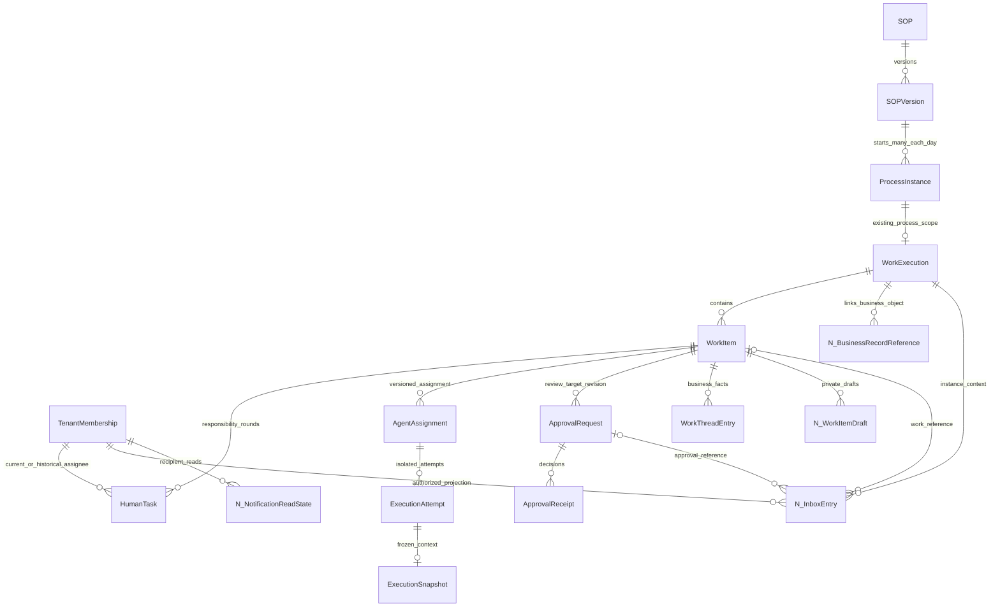
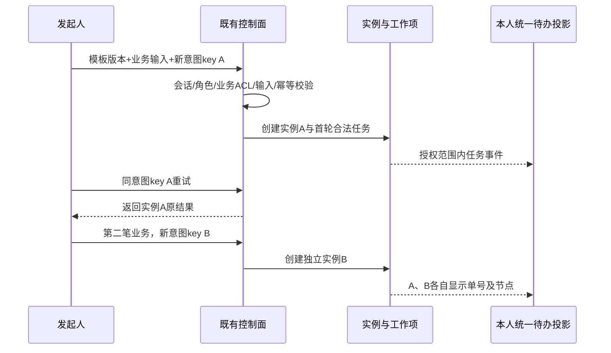
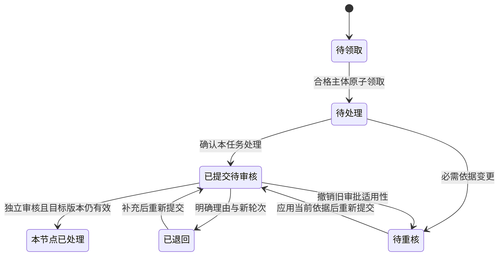

# OA 多流程、多实例与统一工作台设计

日期：2026-09-11｜版本：v2.6｜增量产品设计与本地交互演示，不是已接通业务系统的声明

## 1. 产品修正与关键结论

**一套流程模板一天可以处理多笔业务；一个人可以同时参与多个流程、多个实例，甚至同一实例的多个节点。员工首页应按“需要我处理的事项”聚合，具体执行始终落到唯一实例中的具体工作项。**

本文把用户所说的“事物”理解为业务事务/办件，例如一笔采购、一份合同、一次报销；它不等同于数据库事务。上一版的角色区别已经展开，但首页仍只展示一个当前对象，未充分表现真实 OA 的日常工作量。本版改成统一队列，延用 QoderWake 的视觉与数字员工配置体验，并采用成熟 OA 的单据、实例、待办、流转与历史分层。

核心层次：

| 层次 | 业务含义 | 唯一标识和关系 | 不能混为一谈 |
|---|---|---|---|
| 流程定义 / 发布版本 | “设备采购”怎样办 | SOP / SOPVersion；一个版本创建多个实例 | 模板不是某个员工的当前任务 |
| 业务办件 / 流程实例 | 某一笔采购申请 | ProcessInstance / PROCESS WorkExecution；独立内部 ID 与展示单号 | 同模板同日同名也可以是不同办件 |
| 节点工作 | 该单据中的“预算核对” | WorkItem；属于唯一 WorkExecution | 一个实例不是只有一个待办 |
| 人员职责与轮次 | 本轮由谁领取、协作或审批 | HumanTask / Assignment 历史；每次重新激活明确轮次 | 同一个人不是只有一个任务或一个固定业务角色 |
| 数字员工配置与运行 | 该节点本次由什么助手协助 | 当前 AgentAssignment → Attempt / Snapshot | 同一数字员工定义不等于共享运行会话 |
| 统一工作台 | 本人的跨对象队列 | 服务端授权后的只读投影 | 列表分类不独立决定业务终态 |

## 2. 成熟 OA 参考及取舍

本次仅使用官方公开资料，核对日期为 2026-09-11；采用成熟交互与业务规则，不引入第二套身份系统、流程引擎或 Agent Runtime。

| 来源 | 已核对的机制 | 本项目采用方式 |
|---|---|---|
| [Camunda Tasklist](https://docs.camunda.io/docs/components/tasklist/userguide/using-tasklist/) | 任务队列与流程发起分开；任务摘要包含归属流程、承担人、优先级、创建和到期信息 | 统一队列列出具体工作项，按单号、流程、期限筛选，选择后打开任务详情 |
| [飞书人工任务交互](https://www.feishu.cn/content/600511559565) | 转交、加签、退回等操作分别留痕；多人和并行分支可展开；后续处理人未确定有明确状态 | 时间线记录谁、对哪笔/哪轮、做了什么及理由；不把未确定处理人显示成无人负责 |
| [飞书抄送](https://www.feishu.cn/content/912694085421) | 抄送独立进入“抄送我的”，消息可定位具体事项 | 已读只更新阅读记录，不拥有审批或工作执行权 |
| [飞书催办](https://www.feishu.cn/content/134344362384) | 发起人从“我发起的”定位当前处理人催办，并受流程设置约束 | 精确实例和当前任务、冷却窗口、权限检查、投递回执；不按模板广播给所有人员 |
| [Power Automate 顺序审批](https://learn.microsoft.com/en-us/power-automate/set-up-sequential-approvals) | 前一级批准后才进入后一级 | 显式审批轮次与前置条件；不因列表中的一次同意跳过后续责任 |
| [Power Automate 并行审批](https://learn.microsoft.com/en-us/power-automate/parallel-modern-approvals) | 并行分支可以独立等待审批并汇总 | 区分多笔业务同时运行与同一笔中的并行节点；汇总策略由模板版本固定 |

取舍：OA 负责单据与人的责任流转，数字员工协助节点内的资料处理、检查和候选生成。AI 的技术成功不能代替审批人的决定或业务 ResultCommit。这里不把引擎产品的权限实现直接照搬为本项目授权合同。

## 3. 员工与管理员的使用方式

### 3.1 员工统一工作台

一级导航保持一个“工作”。首页默认“待我处理”，原各领域管理入口和全部 41 个角色视角保留。

| 分类 | 展示对象 | 收录条件与动作 |
|---|---|---|
| 待我处理 | 人员工作、复核/审批、退回补充 | 当前本人有待执行动作；数字员工执行中可另设状态筛选，不能冒充人必须立即处理 |
| 我已处理 | 本人已发生的操作及其当前业务状态 | 已处理不一定实例已完成；提交后等待审核仍能查询本人处理记录 |
| 我发起的 | 本人发起的业务实例 | 跟踪当前节点、阻塞、催办、按政策撤回；不是按模板去重 |
| 抄送我的 | 被授权抄送的单据摘要/版本 | 阅读、标已读；没有隐含审批动作 |
| 待领取 | 本人在合格候选范围的未领取任务 | 领取前检查岗位/任职/委托/范围，服务端原子领取 |

列表显示单号、事务标题、流程类型与固定版本、节点/本轮职责、状态、发起时间、到期时间、优先级、下一步。可继续扩展项目、发起人、执行数字员工、状态、多条件保存视图；这些高级筛选属于后续开发细化，不伪报本轮全部交互已做。

首页统计分别计算任务数、去重实例数、流程类型数和逾期数。例如本版主执行人有 **6 项待办、5 个实例、3 种流程**，同一采购实例中有两个不同节点。不能把六项待办叫做六条流程，也不能把每个节点当作独立业务单据。

### 3.2 同一个人的角色随业务关系变化

自然人的登录身份与当前成员关系不因页面改变。某人可以在采购单 A 是执行人，在合同 B 是协作者，在其他合法实例是指定审核者。每条待办返回其业务关系与动作集合，不让前端用一个永久的“当前岗位角色”判断全部任务。七类 canonical 登录测试夹具仍是精确基线；跨职责场景另用真实 RoleBinding、资源关系与业务指派组合验证。

本版的41项“查看角色”是演示夹具，不是可自行提权的产品菜单。发起能力仍单独检查：本次“流程发起人”夹具具备 PROCESS_INITIATOR；一个只有 HUMAN_EXECUTOR 的夹具不能仅靠“能看模板”创建流程。“我发起的”可以保留历史实例，即使当前发起权限后来被撤销。

### 3.3 管理员不是全部任务的执行人

组织/人事查看授权范围内的任务负荷、离岗未交接和岗位缺口；身份管理员处理会话及供应状态；权限管理员处理精确授予与职责分离；工作流管理员看实例分布和阻塞；运维查看队列、调用、结果未知与容量。业务正文、私人对话、报价等仍按字段策略和资源关系裁剪。

新增原型队列已按字段范围裁剪：管理类视角默认不展示业务正文和金额；安全审计/授权解释/隐私视角使用假名业务引用；搜索只在该视角实际可见字段内匹配，不通过隐藏标题泄露计数。

负荷视图按“人员 × 期限 × 工作量/等待状态”聚合，人工处理时间、AI执行时间和等待审批时间分别统计。不能把团队任务数直接当作人员绩效，不能因租户所有者身份默认读取所有人员任务详情。

## 4. 数据模型与 E-R 增量

E 表示现有领域对象或合同已有概念，N 表示增量读模型/关联候选，不代表需要新建同名物理表。正式开发优先复用现有字段与关系；本轮不执行数据库迁移。

`ProcessInstance → WorkExecution` 沿用原设计的可选过程作用域关系，不另外创建竞争性的“OA实例主状态表”。普通前端以 WorkExecution 为业务实例入口；AD_HOC 仍按现有类型分支执行。逻辑图中的草稿、阅读态和外部业务关联应先核对已有对应能力，避免重复实体。

### 4.1 实例与业务单号

| 字段 | 规则 |
|---|---|
| tenantId | 仅从服务端 Cookie 会话确定；不接受浏览器任选租户 |
| workExecutionId / processInstanceId | 内部稳定唯一 ID；使用现有公开ID/UUID策略 |
| sopId / sopRevision | 创建时固定；旧实例不因模板发布静默升级 |
| businessNumber | 租户、单据类型、编号规则下的展示号；数据库唯一约束，不使用前端最大号加一 |
| businessObjectRef / sourceSystem | 可关联 ERP/CRM/外部OA单据，关联不代表拥有其数据读取权 |
| businessOccurrenceKey | 业务上明确的一次申请/一次事件，用于业务去重；不能简单等于模板ID+日期 |
| initiatedBy / startedAt | 发起人事实与UTC时间；每天可发起多次 |
| formRevision / formSnapshotRef | 本次业务字段及固定版本；外部系统为权威时保存引用和必要摘要 |
| status / revision | 复用权威生命周期与并发版本，统一列表只投影 |
| correlationId / idempotencyRef | 串联请求、事件、任务和回执；不作为业务完成证据 |

### 4.2 任务、草稿、上下文和助手

草稿隔离键最少包含 `(tenantId, membershipId, workItemId, activationRound)`；审批草稿还需要审批请求/轮次标识。仅按 `userId`、`role`、`sopId` 或日期保存，都会在多笔业务或同实例多节点时串数据。

任务配置固定到 `workItemId + active AgentAssignment + configurationRevision`，执行快照再固定到 Attempt。允许数字员工定义被多项工作复用，但本次会话、业务引用、暂存文件、连接授权、预算和取消信号必须隔离。若运行环境/连接器无法提供并发隔离，任务进入队列等待，不共享可变工作空间勉强并行。

重核依据引用 `workExecutionId / workItemId / sourceRevision / ContextManifest`；共享项目知识可合法重复引用，但两笔单据的未确认草稿、审批意见和私有聊天不能自动互传。新增跨单关联需显式选择来源版本并再次检查读取权，不能使用“同流程所以可共享”的推断。

### 4.3 N InboxEntry 只读投影候选

| 字段组 | 必须表达的含义 |
|---|---|
| inboxEntryId / entryKind / sourceRef | 区分 WORK、APPROVAL、CC，不把多来源记录压成一个含糊 taskId |
| workExecutionId / workItemId / humanTaskId | 具体实例、工作项、人员任务；有来源类型不适用时显式null，禁止伪造ID |
| activationRound / sourceRevision | 本轮业务目标与检查版本；退回后旧审批不能继续消费 |
| title / businessNumber / processLabel | 经过授权裁剪的列表文字和搜索字段 |
| relationship / allowedActions | EXECUTOR、REVIEWER、INITIATOR、CC、CANDIDATE 等来自业务关系；与平台角色分别判断 |
| taskState / instanceState / handledAt / readAt | 任务状态、实例状态、本人处理记录、本人已读记录分别存放 |
| dueAt / followUpAt / priority | 截止、稍后提醒、优先级分别表达；不是隐含状态机 |
| assigneeDisplay / agentDisplay | 仅返回本人或被授予的最小摘要 |
| projectionAsOf / sourceWatermark / nextCursor | 授权范围内可解释的一致性与分页水位，避免页面拼接漏项 |

统计和列表必须使用相同授权条件与快照，隐藏对象不得通过数量、筛选选项、搜索建议或导出泄露。个人“待办数”按当前可动作记录计数；“我已处理”按处理事件归属，自动失效但从未由本人处理的审批不计入本人已办。

### 4.4 索引与事务约束（候选）

- 实例查询：`(tenant_id, initiated_by, started_at desc, id)`、`(tenant_id, sop_id, started_at desc, id)`；节点队列按当前承担人、状态、到期与稳定ID索引。实际列名沿当前模型映射。
- 领取：一条原子条件更新/锁内检查，候选资格当前有效且尚未领取；第二个竞争者收到409/412并回读，不能两个都成功。
- 同一次请求重试：`(tenant_id, subject_id, operation, idempotency_key)` 唯一，载荷摘要相同返回原结果，不同返回冲突。明确的新申请使用新key，可以同模板、同日、同内容。
- 退回/改派：保留旧人员任务/审批/Assignment证据，新轮次或新责任记录使旧命令失效；一个工作项至多一个有效AgentAssignment，不限制同一人员只能有一个工作项。
- 提交与通知：权威状态、ResultCommit/关联事件和Outbox按现有事务边界落地；通知投递失败不回滚已确认的人类业务决定，重放不重复创建任务。
- 跨来源队列：消费幂等事件更新读投影，不以聚合缓存完成事务；源失败、暂时落后与真正无待办分开显示。

## 5. 业务流程与状态规则

### 5.1 同模板多次发起

模板与实例都不能以“每天已执行一次”作为默认上限。业务明确要求一天一次时，应当是该模板的可解释业务约束，不能作为全局产品模型。

### 5.2 多项任务与数字员工执行

领取/被分派 → 打开准确单号和节点 → 读取授权上下文 → 选择本工作项助手及能力 → 固定本次配置 → 进入可用运行槽或等待队列 → 生成候选 → 人确认 → 指定审核 → 合法提交与交接。

并发控制分别设租户容量、每人上限、Agent/模型/连接器上限和单工作项上限；高优先级可排前但不能饿死其他任务。取消任务 A 只影响其 Assignment/Attempt，不终止任务 B。预算分为本次、实例及租户预算，不能把同一助手的所有工作消耗混为本单费用。本轮原型不实际执行模型或验证运行槽调度。

### 5.3 审批、退回、改派、撤回和抄送

| 操作 | 前置检查 | 留痕与后继行为 |
|---|---|---|
| 顺序审批 | 当前轮已激活、目标版本有效、审批人合法 | 当前级通过再生成下一级，不预先授予后续提交权 |
| 并行会签 | 固定参与者集合与规则 | 明确ALL、拒绝短路或其他合同允许策略；等待未决者 |
| 或签 | 合法候选组、原子占用/决定 | 首个有效决定后其余任务关闭为不再需要，迟到决定拒绝 |
| 加签 | 当前合同允许、位置/影响明确 | 新增前签/后签/并签关系及理由；旧批准不默认覆盖新增范围 |
| 退回 | 目标节点、理由、影响范围明确 | 原申请重新核对，新轮审批；旧版本回执不能继续用 |
| 改派/代理 | 任职/委托/范围及使用时重授权 | 不替接收者确认；旧人权限和旧运行凭据按合同失效 |
| 撤回/终止 | 当前阶段、已发生外部效果与补偿义务 | 有不可逆效果先走既有补偿，不能直接改状态隐藏历史 |
| 抄送 | 指定受众和可读字段/版本 | 只记录接收与阅读，不形成审批权或完成回执 |
| 催办/升级 | 本实例当前未决任务、合法发起者及冷却窗口 | 去重通知，避免全模板广播；超时升级与重新派工分别处理 |

上述成熟 OA 规则必须映射当前项目合同后实现。本轮可交互展示独立审核/退回、旧审批失效、准确实例催办请求、无处理回执时的本地撤回、抄送阅读和领取。并行会签、或签、加签、代理、补偿等提供完整开发规则，未宣称原型已执行全部分支。

### 5.4 状态分离

这是用户界面状态映射，不替换项目权威状态枚举。“本节点已处理”不等于流程实例完成；还需后续节点、ResultCommit与接手。本地原型为避免虚构后续执行，不自动将实例改为完成。

## 6. UI、错误与恢复

- 默认统一工作台，不自动进入上次唯一的采购节点。各类管理视角也有本人事项列表，领域目录/管理入口仍独立保留。
- 任务详情固定显示业务单号、事务标题、节点、轮次和依据版本。市场顶部显示将配置的具体任务；从普通资源目录采用时只加入本人资源，未选择任务不能自动改某个隐藏节点。
- 同一人的多任务草稿按任务暂存；保存和提交分别反馈。返回列表保留筛选与分页，切换演示身份清除所选任务，防止前一身份详情残留。
- 390px显示单列卡片，主要按钮成组换行；分类横向滚动，详情侧栏折成纵向。桌面显示更多业务字段，避免把实例列表塞进节点画布。
- 请求超时或结果未知时，先按幂等键查询结果；不提示用户重复创建新申请。网络失败、无权、业务输入错误、409/412和真正空态分别恢复。
- “今天”是用户业务时区日期区间，查询转换为UTC边界，含夏令时；SLA应按模板指定自然日/工作日和业务日历计算。示例时间固定便于复测，尚未实现工作日历引擎。
- 保存个人视图仅保存筛选条件，不复制数据或权限。批量操作逐条重授权和版本检查；本轮只演示“批量已读”，不提供批量审批绕过逐单复核。

## 7. 接口与事件增量（候选，非现成端点）

当前源码已有 `fetchMyPendingNodes` 以及 `POST /v1/operations/listHumanTasks:execute` 消费者；节点草稿已按 nodeInstanceId 保存。后者当前读模型只有任务/工作项/状态/承担人等摘要，不能据此声称完整 OA 聚合已实现。

| 能力 | 输入 | 输出/并发/错误 | 既有对象与落地位置 |
|---|---|---|---|
| 统一队列查询 | category、流程/项目/日期、cursor、limit、排序 | 裁剪后InboxEntry、同口径计数、projectionAsOf、nextCursor | 扩展当前工作台/人员任务读模型；聚合不产生业务完成 |
| 流程目录与发起 | sopVersion、业务输入、业务occurrence、idempotencyKey | workExecutionId、实例单号、当前任务；重试原结果，冲突409/412 | 复用现有PROCESS创建与sop.start授权，不新建平行路由栈 |
| 节点读取和草稿 | workItemId、humanTaskId、round、If-Match | 授权字段、配置、草稿revision、allowedActions | 现有WorkItem/草稿消费者；任务维度缓存 |
| 领取/指派/退回 | 精确任务引用、当前revision、理由、合法接收者 | 原子更新、责任历史、新任务轮次、失效旧快照 | 现有claim/assign/approval机制 |
| 本次配置 | workItemId、assignmentId、配置revision、候选版本 | 合格候选与固定执行快照；不得改其他工作项 | 既有选择/Assignment/Runtime Gateway边界 |
| 审核决定 | approvalRequestId、targetRevision、decision、reason | 唯一有效回执；过期/自批/无权拒绝 | 原Approval/ResultCommit语义 |
| 抄送已读 | recipientEntryId、readAt/当前revision | 本人阅读态；业务状态不变 | 复用通知/阅读态能力 |
| 催办/撤回 | 实例ID、未决目标、当前revision、幂等键 | 精确通知/撤回候选及效果对账，不传播其他实例 | 既有通知Outbox/终止补偿 |

事件至少携带租户作用域、业务实例、工作项、当前人员任务/轮次、源revision和eventId；包含任务创建、承担人变化、任务状态变化、审批创建/失效/决定、阅读、实例状态变化。消费以 `(source, eventId)` 去重，以源revision拒绝倒退，缺口回读；通知是投影消费方，不是新的任务状态源。

## 8. 用户故事与优化细化

[21-OA需求细化与验收追踪.json](<21-OA需求细化与验收追踪.json>)给出逐条 Given/When/Then、负例、优先级、角色、页面与原需求ID。OA条目是原153项需求的细化，不另增一套产品需求总数；明确标记哪些有本地演示，哪些待产品实现。

开发顺序：B0先核对现有合同与列表消费者；B1接通实例/任务关联、统一队列和领取；B2任务配置与草稿/上下文隔离；B3独立审批、轮次、退回和交接；B4调度、SLA、Outbox和对账；最后扩展多来源OA集成、高级视图、并行策略与管理负荷。每一阶段均使用现有TaskPacket与合法claim，本轮只修改用户指定设计目录。

## 9. 当前原型与开发边界

[08-交互原型](<08-人员数字员工协作交互原型.html>)保留41个角色，新增统一五类队列、流程/单号/期限筛选、分页、多笔发起、具体任务草稿/数字员工/市场配置/对话隔离、独立审批及过期失效、退回新轮次、领取、抄送已读和本地催办/撤回请求。

[19-多实例示例数据](<19-OA多实例演示数据.json>)是验证时导出的本地虚构夹具，每个角色获得单独的示例任务投影；并不表示真实企业一张单据必然有41人参加。[20-InboxEntry候选Schema](<20-OA统一待办候选.schema.json>)用于约束开发候选结构，不等于数据库或现成API。

已建页面不表示成熟 OA 的全部能力已实现：真实身份、持续化、跨浏览器并发领取、工作日历、并行审批网关、加签/代理、外部OA连接、真实通知投递、真实数字员工并发、全量可访问性与生产验收仍需后续开发验证。本轮不安装OA引擎、不改变正式合同或Provider实现、不产生真实审批/发信/部署。

## 10. 本轮仓库证据

源码核对基线 HEAD：`922ad8823ac5e99a21b8f13569f2e394ab42466a`。语义检索返回 fresh，随后读取当前准确文件。以下为可复核锚点；工作过程中仓内其他变更不视为本轮实现成果。

- [信息架构：工作台与实例/任务/Attempt分层](</Users/mac/Documents/ChatGPT/ZKER- staff/docs/ui/information-architecture.md:84>)
- [交互合同：一个工作入口、不同对象状态](</Users/mac/Documents/ChatGPT/ZKER- staff/docs/ui/ui-interaction-spec.md:37>)
- [MyWorkPage：多nodeInstance草稿和列表](</Users/mac/Documents/ChatGPT/ZKER- staff/apps/web/src/pages/work/MyWorkPage.tsx:36>)
- [人员任务列表消费者](</Users/mac/Documents/ChatGPT/ZKER- staff/apps/web/src/list-human-tasks-api.ts:7>)
- [实例历史：sop、实例、状态、时间独立引用](</Users/mac/Documents/ChatGPT/ZKER- staff/contracts/jsonschema/work-execution-history-item.schema.json:1>)

v2.5历史浏览器/Schema/文档验证见 `validation/v25-*`；v2.6当前结果见文末及总证据文件。v2.4 的882布局/373交互/85截图是历史基线，不能算作v2.5新增覆盖。

v2.5历史验证：1620组布局、482项交互、97张截图；保留41个角色视角，原153项需求不变，新增28条OA场景细化。以上均为本地原型与文档验证。

原始结果：[角色回归](<validation/v25-role-regression.json>) · [市场回归](<validation/v25-market-regression.json>) · [OA专项](<validation/v25-oa-validation.json>) · [Schema校验](<validation/v25-oa-schema-validation.json>)。

## v2.6 产品主旨、B/S与字段核查

本项目是以 OA 工作流为基础的企业 B/S 协作软件：流程连接人、责任和任务，由承担人在自己的任务内配置数字员工。业务发起 → 人员待办 → 本人配置数字员工 → 执行与确认 → 审批或交接 → 下一位承担人。既有平台能力全部保留。

[23-全局一致性与字段核查](<23-OA主旨与BS字段一致性核查.md>)记录实际修正、字段来源和验收边界；[24-业务模板字段候选](<24-业务模板字段候选.json>)区分采购、合同、报销、人事表单。新业务字段为模板候选，不冒充已有后端合同。

[22-开源工作流与成熟前端选型](<22-开源工作流与成熟前端复用选型.md>)是研究建议，当前产品技术栈和代码均未替换。

## v2.6 当前验证结果

本地原型四组浏览器检查合计 **1632组布局、526项交互、109张截图**，页面脚本错误为0。覆盖41个角色视角，采集237个角色与页面组合的字段清单；4类业务模板共17项候选字段。原153项需求、21领域、22页面组及角色基线保留，64个存量合同源文件摘要与字段字典导出快照一致。

字段清点不等于完整语义验收，合同摘要一致不等于全部UI字段已接通后端。本次没有产品代码修改、依赖替换或真实B/S运行验收。v2.5及更早数字保留为历史结果，不累加到本次覆盖。

[当前文档与覆盖核对](<validation/v26-document-validation.json>) · [字段检查原始结果](<validation/v26-field-audit.json>) · [当前桌面待办截图](<validation/v26-oa-main-inbox-1440.png>)。
