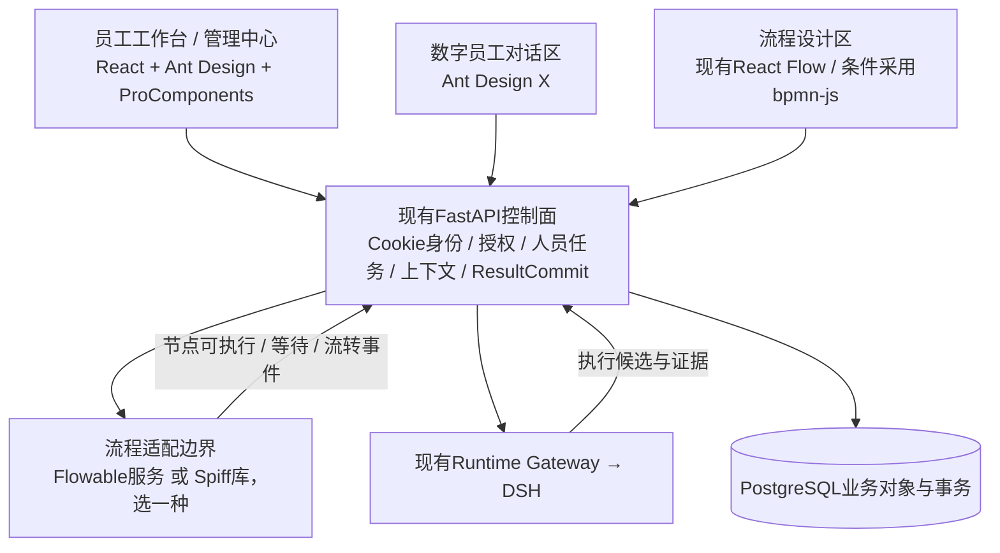

# 开源工作流与成熟前端复用选型

核对日期：2026-09-11。状态：`RESEARCHED_CANDIDATES_NOT_INTEGRATED`。

本文回答“成熟、开源、能复用的工作流代码以及配套前端框架”。推荐基于当前 ZKER-staff 代码与官方仓库、公开源码、发布记录；没有安装候选依赖，没有修改产品代码，没有运行第三方引擎。本文件是选型补充，不替代正式架构决策。

## 1. 明确建议

**前端优先采用 Ant Design + ProComponents，数字员工对话区域按需采用 Ant Design X，流程画布继续使用项目已有 React Flow。** 在现有 React、Vite、React Router 工程中逐步接入这套组件体系。Ant Design Pro 是可参考的应用模板；整包迁入涉及其 Umi、路由和请求机制，不能等同于安装 ProComponents。

**工作流按两个目标选择：**

- 若优先减少成熟 OA 引擎的自研量，首选评估 **Flowable**；它的流程、人工任务、网关、定时器和历史能力更贴近本项目。代价是引入 Java 流程服务，需明确调整当前非 Java 服务边界。
- 若保留当前 Python/FastAPI、非 Java 控制面，先验证 **SpiffWorkflow** 作为嵌入式 BPMN 内核候选。它能复用流程语义，但企业待办、人员策略、持久化并发和管理界面仍需本项目补齐，不能承诺获得与完整 OA 平台等量的功能。
- **Operaton** 是希望一并获得开源 Tasklist/Cockpit 时的有价值备选；**Temporal** 更适合持久执行与故障恢复，不是本次人员 OA 的优先内核。

以上是适配判断，不是已跑通的性能、兼容性或生产结论。产品差异仍是“人员责任 × 业务实例 × 节点数字员工配置 × 上下文与交付”，应保留在本项目领域层。

## 2. 当前项目实际基础

| 当前证据 | 对选型的影响 |
|---|---|
| [Web依赖](</Users/mac/Documents/ChatGPT/ZKER- staff/apps/web/package.json>)：React 18.3.1、React Router 6、Vite，声明 `@xyflow/react ^12.11.6` | React 体系组件可以渐进接入；Vue OA 前端不是可直接复制运行的同栈模块 |
| [SOP画布](</Users/mac/Documents/ChatGPT/ZKER- staff/apps/web/src/pages/sops/SopStateMachineEditor.tsx:11>)实际导入 ReactFlow | 已在复用成熟画布；应完善节点和业务属性，不重复造拖拽底层 |
| [OQ-01/OQ-02](</Users/mac/Documents/ChatGPT/ZKER- staff/docs/ai/decision-register.yaml:63>)固定 PostgreSQL、Python/FastAPI、React/TS和DSH唯一Agent运行边界 | 引入Java引擎是架构候选变更，不是当前已经批准的技术事实 |
| [SOP合同](</Users/mac/Documents/ChatGPT/ZKER- staff/contracts/jsonschema/sop-definition.schema.json>)中边仍以 `from/to` 表达且拒绝额外字段 | 不能声称已兼容全部 BPMN；条件、网关、事件和多实例需要正式建模及转换验证 |
| [节点推进](</Users/mac/Documents/ChatGPT/ZKER- staff/services/control-plane/control_plane/sop_node_advance_after_commit.py:127>)已有同一实例校验、ResultCommit相关检查及行锁 | 引擎接入必须保护现有提交语义；不是在一块空白代码上换插件 |
| [信息架构](</Users/mac/Documents/ChatGPT/ZKER- staff/docs/ui/information-architecture.md:84>)区分 WorkExecution、WorkItem、Attempt与工作台投影 | 第三方Tasklist不应成为第二个人员身份系统或并行业务终态来源 |

语义检索返回 `possibly_stale / served_from_current_index / background_refresh running`，只用于定位；关键结论随后通过当前文件读取核对。检索中的旧审计曾写“节点推进不存在”，当前源码已存在，因此未沿用旧结论。

## 3. 工作流候选比较

“可复用”分为依赖库、独立服务和应用源码移植三种方式，工作量不同。

| 候选 | 已核对的开源范围与能力 | 本项目复用方式 | 匹配优势 | 主要工作与限制 |
|---|---|---|---|---|
| **Flowable** | Apache-2.0；Java BPMN/CMMN/DMN引擎与API | 独立流程服务，经现有控制面适配 | 人工任务与系统任务共存，适合多笔流程、候选领取、委派和复杂分支 | 新增Java运维边界；现有业务状态与引擎token需要明确分工；厂商完整商业产品界面不能算作这个开源仓库的交付 |
| **SpiffWorkflow** | LGPL-3.0；纯Python BPMN库，含人工任务、事件、多实例、子流程和序列化 | 在既有Python执行协调边界中封装库 | 语言与本项目贴合，可复用BPMN解析与执行语义 | 是引擎库，不是完整OA；数据库锁、任务分配、工作日历、租户裁剪、服务恢复与运维管理需接入；保持独立库边界并按实际分发方式核对许可条款 |
| **Operaton** | Apache-2.0；源自Camunda 7社区版，提供引擎、REST、Tasklist、Cockpit、Admin | Java流程服务；配套UI用于受控运维或参考 | 希望取得开源引擎与配套工作流控制台时有优势 | 新项目的维护记录应与继承内核历史分别评估；不能直接覆盖本项目41个角色和节点数字员工工作区 |
| **芋道 ruoyi-vue-pro BPM** | 根仓MIT；Flowable上的业务应用源码，已定位审批、退回、转办、委派、加减签 | 若选Java，可提取BPM应用层适配；当前Python栈以业务代码参考为主 | 中国企业审批业务更接近，减少对退回/加签规则的凭空设计 | 依赖其系统服务、权限、用户/部门模型、MyBatis和Flowable版本；不是几个独立函数；Vue前端需要重做React适配 |
| **Temporal** | 服务端MIT，官方Python SDK；持久化工作流、信号、等待、重试等 | 在明确需要持久调度时通过适配层使用 | 长时间等待、故障恢复与多服务调用有价值 | 人工审批表单、责任矩阵、加签、抄送等不是现成OA应用；引入它仍需实现这些领域能力，本轮不叠加到BPM内核之上 |

能力及许可来源：[Flowable仓库](https://github.com/flowable/flowable-engine)、[SpiffWorkflow仓库](https://github.com/sartography/SpiffWorkflow)、[Spiff许可](https://github.com/sartography/SpiffWorkflow/blob/main/COPYING)、[Spiff官方使用文档](https://spiffworkflow.readthedocs.io/en/latest/bpmn/index.html)、[Operaton仓库](https://github.com/operaton/operaton)、[芋道许可](https://github.com/YunaiV/ruoyi-vue-pro/blob/master/LICENSE)、[Temporal仓库](https://github.com/temporalio/temporal)、[Python SDK](https://github.com/temporalio/sdk-python)。这里仅记录各项目公开许可，不推断整套依赖与所有分发方式已完成核验。

### 3.1 已定位的可复用源码入口

| 源码入口 | 本次实际看到的内容 | 如何使用 |
|---|---|---|
| [Flowable TaskService](https://github.com/flowable/flowable-engine/blob/main/modules/flowable-engine/src/main/java/org/flowable/engine/TaskService.java) | `claim`、`unclaim`、`delegateTask`、`resolveTask`、`complete`、`setAssignee` | 复用公开接口；本项目先完成授权与业务校验，才发出对应引擎命令；`complete`不自动等价于本项目ResultCommit |
| [芋道 BpmTaskServiceImpl](https://github.com/YunaiV/ruoyi-vue-pro/blob/master/yudao-module-bpm/src/main/java/cn/iocoder/yudao/module/bpm/service/task/BpmTaskServiceImpl.java) | `approveTask`、`rejectTask`、`returnTask`、`delegateTask`、`transferTask`、`createSignTask`、`deleteSignTask` | 用于核对中国特色审批的实现依赖、状态变化和边界；如果迁入Java模块，须连同依赖与版本逐项适配 |
| [Spiff示例与模块导航](https://spiffworkflow.readthedocs.io/en/latest/bpmn/index.html) | 模型解析、任务运行、人工任务、序列化、事件和模型差异示例 | 先验证持久化恢复与本项目事务边界，避免只跑一个内存串行示例就确定选型 |

`TaskService` 是公开API源码证据，`BpmTaskServiceImpl`是业务实现源码证据；本次未执行它们，未验证所有异常分支。对于自定义脚本/服务任务，应接现有受控调用边界，不把模型生成的任意代码直接放进控制面执行。

### 3.2 维护状态快照

下表是本次 GitHub API 返回的正式release，不是建议无条件升级到最新版本。

| 仓库 | 本次查询的最新正式release | 发布时间UTC |
|---|---|---|
| Flowable | [flowable-8.0.0](https://github.com/flowable/flowable-engine/releases/tag/flowable-8.0.0) | 2026-02-27 |
| SpiffWorkflow | [v3.2.0](https://github.com/sartography/SpiffWorkflow/releases/tag/v3.2.0) | 2026-08-10 |
| Operaton | [v2.1.4](https://github.com/operaton/operaton/releases/tag/v2.1.4) | 2026-08-21 |
| Temporal Server | [v1.31.2](https://github.com/temporalio/temporal/releases/tag/v1.31.2) | 2026-07-08 |
| ruoyi-vue-pro | [v2026.08(jdk25)](https://github.com/YunaiV/ruoyi-vue-pro/releases/tag/v2026.08(jdk25)) | 2026-09-02 |

Flowable 8发布说明明确切换到Spring Framework 7 / Spring Boot 4，不能假定某个现有Spring Boot 3应用可以直接升级。引擎版本必须与所复用应用代码的依赖一致。[发布说明](https://github.com/flowable/flowable-engine/releases/tag/flowable-8.0.0)

这些记录证明仓库及发布存在，不证明本项目性能、安全或集成已通过。初次通用Python HTTPS请求遇到本机证书错误，改用系统curl后取得上述GitHub元数据；Temporal仓库基础元数据一次超时，许可由官方仓库页面核对。

## 4. 成熟前端组合

### 4.1 推荐组合与页面分工

| 层次 | 推荐 | 在本项目中的用途 | 尚需本项目实现 |
|---|---|---|---|
| 基础UI与主题 | **Ant Design** | 按钮、弹窗、抽屉、标签、树、表单、表格、时间线、响应式布局；统一Token | QoderWake参考风格、产品密度、各状态文案与权限裁剪 |
| 企业页面组件 | **ProComponents** | ProTable/ProForm/ProDescriptions等承接统一待办、人员管理、资源目录与配置表单 | 当前API响应适配、分页筛选语义、字段级授权与缓存隔离 |
| AI协作界面 | **Ant Design X** | 对话消息、输入、附件等交互组件，按需复用 | 消息归属任务、SSE恢复、权限、引用与运行结果绑定；后端仍走当前API与DSH |
| 业务流程画布 | **React Flow** | 保留当前SOP画布，增加人员、数字员工、审批与条件属性呈现 | 节点语义、图校验、模板发布与运行高亮；画布不会执行流程 |
| 标准BPMN编辑 | **bpmn-js，条件采用** | 确定需要标准BPMN编辑/导入导出时使用 | 与SOP扩展字段及选定内核的往返转换；不要把React Flow图任意导出后宣称标准兼容 |

官方来源：[Ant Design](https://github.com/ant-design/ant-design)、[ProComponents](https://github.com/ant-design/pro-components)、[Ant Design X](https://github.com/ant-design/x)、[React Flow](https://github.com/xyflow/xyflow)、[bpmn-js](https://github.com/bpmn-io/bpmn-js)。bpmn-js使用bpmn.io许可，含可见水印要求，并非普通MIT；采用时遵循其当前[LICENSE](https://github.com/bpmn-io/bpmn-js/blob/develop/LICENSE)。

**使用同一组件体系，但员工侧和管理员侧保留不同页面组织。** 员工以任务队列、事项详情、数字员工对话与市场为中心；管理员以组织、策略、版本、运行诊断与审计为中心。任务导航和按钮由已有角色/资源决策投影提供，组件框架不会代替服务端授权。

### 4.2 为什么不直接整包搬后台模板

| 方案 | 可取之处 | 本项目取舍 |
|---|---|---|
| Ant Design + ProComponents渐进接入 | 成熟组件可进入已有React/Vite工程，能保持已有路由和Cookie会话 | **优先**；建立一个组件适配与主题入口，逐页替换同类控件，避免长期保留多套视觉实现 |
| Ant Design Pro整套模板 | 应用壳、示例页面、国际化和工程配置可参考 | 当前模板含Umi Max且使用不同的React/工具链版本；更适合新工程，整体迁入现有工程成本较大 |
| Refine Core + Ant Design | React业务应用框架，提供数据、身份、权限和路由适配接口 | 管理CRUD特别多时有价值；现有API是operation命令风格，需要自定义Provider，不宜再接一套示例登录/Token逻辑；本轮作为备选，不与Pro模板一起套用 |
| 芋道Vue3 + Element Plus前端 | 与其BPM后端组成更接近成品的中国OA界面 | 如果重建Vue/Java产品可考虑；当前React产品更适合作为页面和业务实现参考，不以嵌套另一套后台替代员工体验 |

来源：[Ant Design Pro当前依赖](https://github.com/ant-design/ant-design-pro/blob/master/package.json)、[Refine官方架构](https://refine.dev/core/docs/guides-concepts/general-concepts/)、[Refine Core接口](https://refine.dev/core/docs/core/refine-component/)、[芋道Vue3前端](https://github.com/yudaocode/yudao-ui-admin-vue3)。

### 4.3 当前版本兼容性证据及限制

当前读取的源码分支声明：`antd 6.6.3`支持React `>=18`；`@ant-design/x 2.9.0`要求antd `^6.1.1`及React `>=18`；Refine Core `5.2.0`声明React 18/19，并依赖React Query 5。这些是**分支package.json内容**，不能当作已发布且已锁定的兼容组合。

来源：[antd package.json](https://github.com/ant-design/ant-design/blob/master/package.json)、[X package.json](https://github.com/ant-design/x/blob/main/packages/x/package.json)、[Refine package.json](https://github.com/refinedev/refine/blob/main/packages/core/package.json)。

本次npm registry请求失败，ProComponents包元数据接口也未成功，因此没有编造完整版本锁定表。落地时应在隔离目录取得实际发布包，固定版本并验证React 18、ProComponents、antd、X和Vite构建的共同兼容性，再进入当前项目。不得直接复制官方模板的`latest`依赖列表。此网络限制不影响项目是否存在及架构用途的判断，但版本组合仍是未验证项。

## 5. 人、数字员工和工作流怎样连接

这是候选架构图，不表示已经新增服务：

具体连接规则：

1. SOP固定版本对应引擎的一个部署模型版本；发起时创建独立业务实例并保存稳定的引擎实例引用。一天三笔采购就是三个实例。
2. 引擎激活节点时，现有领域层解析候选人员、职责与授权，形成WorkItem/HumanTask。模型可以表达指定人、候选组或动态规则，发布定义与运行中的实际指派分别保存。
3. 被分配人员在该工作项中选择自己的数字员工版本、技能、工具与知识，形成AgentAssignment及本次配置快照；这些是本项目能力，不要求开源OA引擎理解全部数字员工模型。
4. DSH处理节点内任务并返回结果候选。本项目检查上下文版本、完成条件和审批回执，接受后才向流程内核发送有效推进命令。
5. 同一人跨多个实例的待办由授权读模型聚合；同一个数字员工定义可以复用，每个Attempt的任务、上下文和工作目录必须独立。
6. 工作流token归内核管理；业务交付与审批有效性归现有领域规则管理；对外WorkExecution仍是既有业务入口。必须定义状态映射，不允许两方各自独立宣布同一业务已完成。

若采用外部Flowable服务，业务事务和引擎数据库不是一个本地事务：需要沿用Outbox及幂等收件、去重、状态回读和调和。`业务提交已接受、引擎推进待确认`须有明确可见状态；超时不能再次创建业务单或重复调用有副作用的工具。若采用Spiff库，要验证序列化状态、人员任务、Outbox在同一事务中的保存方式和并发控制，不能仅在内存中保存Workflow对象。

## 6. 实际可以省掉和仍需保留的工作

| 可复用成熟底层 | 必须由本项目定义与实现 |
|---|---|
| BPMN解析、网关、事件、定时等待、引擎实例与任务机制 | 企业岗位/任职与具体任务责任、权限撤回、字段裁剪 |
| 成熟表格、表单、树、弹窗、时间线、AI消息组件 | 统一待办聚合、具体业务单与任务的关联、员工/管理员页面差异 |
| 流程画布的拖拽、缩放、连线和基础编辑 | 人员节点、数字员工候选、技能/工具约束、发布和执行快照 |
| 已有OA退回/加签代码作为规则及实现参考 | 上下文过期、独立审批、Handoff、ResultCommit与DSH边界 |

“成熟框架”不会自动带来这些差异化能力；但足以减少通用交互和流程语义的重复开发。当前证据不足以给出可信的复用百分比或工期节省数字。

## 7. 后续选型验证的最小业务样本

在同一组样本上比較候选内核，而不是比较各自不同的Hello World：

- 同一模板当日三实例；一个人有三个流程、同一实例两个节点。
- 两人同时领取同一任务；只有一个成功，另一人获得可恢复冲突反馈。
- 多人会签ALL/ANY，退回后新轮次，旧回执及迟到AI结果不再生效。
- 用户换数字员工配置只影响指定工作项；上下文变更使相关候选失效。
- 服务重启恢复、推进消息重复、远端成功但本地超时、Outbox重投，均不重复执行业务动作。
- 实例版本固定；升级模板不静默改变运行中实例；不支持的BPMN元素在发布前拒绝。
- 员工、发起人、审批人、流程管理员、人事、审计分别验证页面、字段、操作、直接链接及错误状态。
- 成熟UI组件按现有原型验证1440/1024/390宽度、键盘操作、加载/空/无权/失败、长内容与任务切换。

这些是接入前后要执行的验收样本，**本轮未执行，不计入v2.5已有1620项布局和482项交互结果**。选型研究本身不修改原型；后续用户明确OA主旨与字段核查后的原型版本为v2.6，见23号文档。

## 8. 本轮交付边界与证据

本轮仅新增选型报告及[检索证据](<validation/workflow-frontend-research-20260911.json>)。版本、许可证、源码入口和当前仓库基础已核对；没有声称候选安装、性能测试、实际审批、DSH联调或生产验收已完成。

可以立即作为后续开发方向的判断是：**统一成熟前端组件体系；现有React Flow继续复用；OA引擎只选一个并明确状态归属；数字员工执行继续使用当前DSH边界。** 若保持当前非Java架构，先验证Spiff；若确定复杂OA成熟度优先，再评估采用Flowable服务及其架构代价。

用户后续确认的产品主旨：以OA工作流连接人和责任，由人配置自己任务的数字员工，企业B/S形态及现有代码能力完整保留。候选框架不得覆盖本项目业务权限与功能范围；当前代码技术栈不因选型建议自动改变。
