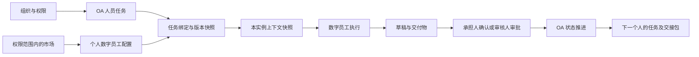

# 从零开发：企业 OA + 数字员工的最小工作量开源选型

核查日期：2026-09-11。状态：`RESEARCHED_NOT_INTEGRATED`。

本报告按本次要求，独立于现有代码重新选型；保留产品目标：企业 B/S 软件，以 OA 流程连接人员和职责，由承担任务的人选择、配置自己的数字员工，支持多流程、多实例、员工市场、权限控制和上下文交接。本报告不变更现有项目技术决策，不替代已有开发设计包，也不表示实施了重构。

## 1. 推荐结论

**在本次检索并核查的候选中，按“成熟 OA 为主、数字员工嵌入人员任务”的产品定位，优先验证芋道 `ruoyi-vue-pro` + 官方 Vue3 前端，复用其已有 BPM 和 AI 模块，预计总体新增工作最少。RuoYi-AI 是最接近的第二选择：如果首期更偏重技能、MCP 和数字员工使用体验，且审批复杂度较低，它可能更快。**

这是基于可见源码、组件整合程度和业务缺口的工程判断，不是部署实测排名，也无法证明覆盖了互联网全部项目。推荐单位是明确范围的模块组合；没有把任何仓库根目录的 MIT 标识当成整包依赖已经全部满足闭源交付要求。

| 顺位 | 建议组合 | 为什么省工作 | 主要剩余成本 | 许可核查结论 |
|---|---|---|---|---|
| **1** | **芋道 ruoyi-vue-pro + yudao-ui-admin-vue3 + 已集成 Flowable / Spring AI** | 组织、权限、表单、待办、审批操作、流程设计器、AI 角色/模型/知识/工具已经在一个体系内 | 任务与个人数字员工绑定、市场授权复制、上下文交接、员工工作台；另须解决本报告查出的依赖和版本问题 | 后端/前端自有代码根许可 MIT；Flowable / Spring AI 为 Apache-2.0；**整包含另外许可的组件，见第 5 节** |
| **2** | **RuoYi-AI + ruoyi-admin + ruoyi-web** | 已有真实 OA 模块，同时覆盖 AI 编排、技能、MCP，前后台可复用 | OA 与 AI 执行之间的业务连接、市场治理、界面统一、社区版功能和发行版对齐 | 三个仓库根许可 MIT；仍需核对固定版本的传递依赖 |
| **3** | **RuoYi-Vue-Plus + Warm-Flow + plus-ui + 一个 AI SDK** | 组织权限和 OA 基础清楚，前后端现成；便于控制实际纳入的模块 | 数字员工配置、模型/知识/工具产品界面，以及全部业务连接层需要更多开发 | 平台和前端 MIT，Warm-Flow Apache-2.0；不是全量依赖认证 |
| 4 | Frappe Framework + 自建数字员工模块 | 表单、数据对象、权限和单据审批可大量配置 | 复杂中国式 OA、跨实例工作台、员工市场和 AI 运行集成 | Framework 为 MIT；不能把 ERPNext 等应用也按 MIT 计算 |
| 5 | Corteza + 单一 AI 执行服务 | 有低代码页面、权限和工作流 | 中国式 OA 操作、数字员工生命周期、上下文和 UI 适配 | 主项目 Apache-2.0；实际扩展分别核对 |
| 6 | Operaton / Flowable / Apache KIE Kogito + 自建业务前端 | 流程引擎成熟或能力充分 | 仍需组织、表单、完整 OA 产品层、员工端和 AI 模块的组合开发 | 相应开源引擎为 Apache-2.0；不能把同品牌商业产品算作免费功能 |

一方许可依据：[芋道后端](https://github.com/YunaiV/ruoyi-vue-pro/blob/master/LICENSE)、[芋道前端](https://github.com/yudaocode/yudao-ui-admin-vue3/blob/master/LICENSE)、[RuoYi-AI](https://github.com/ageerle/ruoyi-ai/blob/main/LICENSE)、[RuoYi-AI 管理端](https://github.com/ageerle/ruoyi-admin/blob/main/LICENSE)、[RuoYi-AI 用户端](https://github.com/ageerle/ruoyi-web/blob/main/license)、[RuoYi-Vue-Plus](https://github.com/dromara/RuoYi-Vue-Plus/blob/6.X/LICENSE)、[plus-ui](https://github.com/CrazyLionCat/plus-ui/blob/6.X-Vue/LICENSE)、[Warm-Flow](https://github.com/dromara/warm-flow/blob/master/LICENSE)。

其余底座：[Frappe LICENSE](https://github.com/frappe/frappe/blob/develop/LICENSE)、[Corteza LICENSE](https://github.com/cortezaproject/corteza/blob/2024.9.x/LICENSE)、[Operaton LICENSE](https://github.com/operaton/operaton/blob/main/LICENSE)、[Flowable LICENSE](https://github.com/flowable/flowable-engine/blob/main/LICENSE)、[Apache KIE](https://github.com/apache/incubator-kie)。后三类适合作为引擎或特定技术栈的底座，但源码可见能力不足以支持“本产品整体工作量更少”的结论。

## 2. 本报告如何理解“完全可商用”

筛选假设是：允许修改、使用自有品牌、闭源交付给客户并收费，不依赖另外购买底座的一方商业授权。保留 MIT 版权/许可文本，以及 Apache-2.0 适用的许可、NOTICE、修改说明等正常义务。软件框架许可不附送商标、模型权重、云模型调用、第三方连接器服务或付费插件的授权。

需要区分三件事：

1. **商业使用**：GPL/LGPL 等也允许商业使用，不能写成“不能商用”。
2. **闭源组合交付的适配成本**：与许可证覆盖范围、修改和组合方式有关，不能由仓库一句介绍推断。
3. **整个产品所有依赖已核查**：需要固定实际构建版本和交付清单。本次仅完成候选筛选、关键源码和许可证核查，没有做全量 SBOM 或交付包审计。

因此下文使用“适合闭源商用的候选模块”，不使用“任意整包拿走、没有任何义务”的表述。没有新增会签或审批要求；发现的问题直接作为模块选择和兼容性验证事项处理。

## 3. 为什么芋道优先，RuoYi-AI 紧随其后

### 3.1 芋道已经覆盖成本最高的 OA 基础

本次读取了真正的任务服务，而不只看宣传页。`BpmTaskServiceImpl` 中有审批、拒绝、退回、委派、转办、加签、减签等实现入口。这些是人员流程的基础，可以减少重新实现任务状态变化的工作。[任务服务源码](https://github.com/YunaiV/ruoyi-vue-pro/blob/master-jdk17/yudao-module-bpm/src/main/java/cn/iocoder/yudao/module/bpm/service/task/BpmTaskServiceImpl.java)。

官方前端有待办、已办、抄送、任务管理页面；简易流程设计器包含人工任务、子流程、抄送、延迟、触发器以及排他/包容/并行分支等组件。现成组件和页面是复用证据，尚不等于本次已经跑通每种异常流程。[BPM 前端目录](https://github.com/yudaocode/yudao-ui-admin-vue3/tree/master/src/views/bpm)、[简易流程设计器](https://github.com/yudaocode/yudao-ui-admin-vue3/tree/master/src/components/SimpleProcessDesignerV2)、[官方 BPM 说明](https://doc.iocoder.cn/bpm/)。

AI 模块也不是只有一个聊天窗口。`AiChatRoleDO` 已包含 `userId`、`modelId`、`knowledgeIds`、`toolIds`、`mcpClientNames`、`publicStatus`；控制器有个人角色的分页、查看、新建、修改、删除入口。它提供了“个人数字员工配置”的可复用起点，但**这些字段不能证明已经具备按 OA 任务授权和隔离的数字员工**。[AI 角色模型](https://github.com/YunaiV/ruoyi-vue-pro/blob/master-jdk17/yudao-module-ai/src/main/java/cn/iocoder/yudao/module/ai/dal/dataobject/model/AiChatRoleDO.java)、[AI 角色控制器](https://github.com/YunaiV/ruoyi-vue-pro/blob/master-jdk17/yudao-module-ai/src/main/java/cn/iocoder/yudao/module/ai/controller/admin/model/AiChatRoleController.java)。

由此推断，最少开发路线是：保留已有人员任务和 AI 配置体系，补“这个人的这个任务使用哪个配置版本、拿到哪些上下文、产出如何确认”的业务连接层。无需同时再部署一整套 AI 管理平台。

### 3.2 RuoYi-AI 是实质候选，不能当成纯聊天壳

其 `FlwTaskController` 实际包含发起、办理、个人/全部待办已办、抄送、终止、委派/转办/加减签、退回、催办等 OA 接口；有 Warm-Flow 依赖。因而它确实有人员流程基础。[OA 任务控制器](https://github.com/ageerle/ruoyi-ai/blob/main/ruoyi-modules/ruoyi-workflow/src/main/java/org/ruoyi/workflow/controller/FlwTaskController.java)、[项目依赖](https://github.com/ageerle/ruoyi-ai/blob/main/pom.xml)。

当前主分支的 MCP 市场控制器存在独立的查看、查询、管理、刷新、导入工具权限；工具支持单项和批量载入。官方 AI 编排说明采用 Vue Flow、LangGraph4j 和 SSE；发行说明也记录了 Skills 能力。[MCP 市场控制器](https://github.com/ageerle/ruoyi-ai/blob/main/ruoyi-modules/ruoyi-chat/src/main/java/org/ruoyi/controller/mcp/McpMarketController.java)、[AI 编排说明](https://doc.ruoyiai.chat/guide/features/orchestration.html)、[发行说明](https://github.com/ageerle/ruoyi-ai/releases)。

但“载入 MCP 工具”不等于已实现你要求的数字员工、技能、工具三类市场统一复制，更不证明复制权限、凭据隔离、版本升级与 OA 任务权限已经打通。当前主分支比 `v3.1.0` 更新；不能把主分支 MCP 市场直接标成该发行版已经验收。历史发行说明还记录过部分功能移到商业版，评估时必须以固定社区代码为准，不能借商业演示页面补齐能力。

### 3.3 两者的实际取舍

| 判断维度 | 芋道 | RuoYi-AI | 对本产品的影响 |
|---|---|---|---|
| 复杂 OA、表单和审批界面 | 本次找到的集成证据更完整 | 有真实 OA 能力，复杂流程/表单同等覆盖尚未验证 | 你的定位以 OA 串人为主，优先前者 |
| 个人角色、模型、知识、工具 | 已在同一平台形成配置基础 | AI/技能/MCP 侧覆盖更突出 | 以首期真实任务验收，而非功能名多少决定 |
| 市场资源复制治理 | 仍需补业务规则 | 有 MCP 市场接口，完整三类市场仍需补 | 两者都不能直接计为完成 |
| 人的任务与数字员工绑定 | 本次未找到足够证据证明开箱实现 | 本次未找到足够证据证明开箱实现 | 是本产品必须开发的差异化层 |
| 前端复用 | 完整 Vue3 管理端、OA 和 AI 页面 | 管理端与用户端分别开源 | 需要员工工作台改造或统一导航，不能只换品牌色 |
| 已发现的采用成本 | 版本兼容疑点、旧甘特图和 Tinyflow 许可边界 | 主分支/发行版/商业演示边界，OA 与 AI 链路整合 | 芋道首位是有条件的工程判断，不是无风险承诺 |

若短期验证发现芋道版本组合或模块剥离需要大范围改造，而 RuoYi-AI 的固定社区版本可以跑通目标 OA 案例，则应改选 RuoYi-AI。当前证据不足以声称两者存在精确的人日或百分比差距。

## 4. 建议直接复用的最小组合

| 层次 | 推荐复用 | 应承担的职责 | 采用边界 |
|---|---|---|---|
| Web 前端 | 芋道 Vue3 / TypeScript / Element Plus 前端 | 组织管理、表单、审批和 AI 设置基础页面 | 延续一套 UI 组件与导航；另做员工工作台和任务助手面板 |
| 业务后端 | `system`、`infra`、`bpm`、所需 `ai` 模块 | 账号组织、资源配置、人类任务、模型/知识/工具管理 | 通过构建依赖选择模块，不把隐藏菜单当成未交付代码 |
| OA 引擎 | 已集成的 Flowable 开源引擎 | 流程定义、实例、人工任务、分支、历史 | 复用既有集成；固定与 Spring Boot 兼容的版本组合 |
| 表单 | 已使用的 form-create / designer | 流程表单和字段配置 | 二者根许可 MIT；业务字段与任务权限仍由服务端执行 |
| AI 接入 | 已集成 Spring AI，按需使用 Spring AI Alibaba | 模型、工具、MCP、RAG、流式执行 | 优先增加 SDK 能力，不搬入第二个完整 Admin |
| Agent 执行 | 首先验证已有 AI 执行模块；不足时在 SAA / AgentScope Java 中选一个 | 人工工具许可、状态恢复、技能和长期任务 | 不同时维护两套 Agent loop 和身份来源 |
| 本产品自有模块 | TaskAgentBinding、上下文快照、交付物、确认交接和市场采用 | 连接人、数字员工及 OA 工作 | 单一任务权威来源，所有执行回到人员任务核验 |

依赖及许可依据：[前端 package.json](https://github.com/yudaocode/yudao-ui-admin-vue3/blob/master/package.json)、[AI 模块 pom](https://github.com/YunaiV/ruoyi-vue-pro/blob/master/yudao-module-ai/pom.xml)、[BPM 模块 pom](https://github.com/YunaiV/ruoyi-vue-pro/blob/master-jdk17/yudao-module-bpm/pom.xml)、[form-create](https://github.com/xaboy/form-create/blob/master/LICENSE)、[表单设计器](https://github.com/xaboy/form-create-designer/blob/master/LICENSE)、[Spring AI](https://github.com/spring-projects/spring-ai/blob/main/LICENSE.txt)、[Element Plus](https://github.com/element-plus/element-plus/blob/dev/LICENSE)。

Spring AI Alibaba 框架及 Admin 前端为 Apache-2.0；其完整 Admin 包含独立 UI 和中间件，直接引入会增加管理面。AgentScope Java 为 Apache-2.0，长期工作区、Skills、HITL 更贴近数字员工，但 SDK 与新 Service 全栈平台应分别评估。[SAA 许可](https://github.com/alibaba/spring-ai-alibaba/blob/f82da0b50f35744c13968191be2b1cd2452ef550/LICENSE)、[SAA Admin](https://github.com/alibaba/spring-ai-alibaba/blob/f82da0b50f35744c13968191be2b1cd2452ef550/spring-ai-alibaba-admin/README.md)、[AgentScope 许可](https://github.com/agentscope-ai/agentscope-java/blob/c5db8f72dbea5c2c70de96885e4167ce5b1b24b0/LICENSE)、[AgentScope Service 说明](https://github.com/agentscope-ai/agentscope-java/blob/c5db8f72dbea5c2c70de96885e4167ce5b1b24b0/agentscope-service/README.md)。

**前端也已有成熟底座。** 从零且以最少工作为目标，没有证据支持先把这些 Vue3 OA 页面全量重写成 React。可以沿用其组件、表单和流程设计器，将 QoderWake 所体现的任务区、数字员工设置、技能/工具选择等交互思路用于员工界面；本次没有取得 QoderWake 可复用源码的许可证据，故不把复制它的前端代码计入方案。

## 5. 芋道必须明确的四个采用问题

### 5.1 根 MIT 不覆盖旧版甘特图依赖的许可

当前前端声明 `dhtmlx-gantt: ^9.1.1`。DHTMLX 官方说明：旧版 Community 采用 GPL，v10 Community 转为 MIT；`^9.1.1` 不会自动升级到 10。不能依据现在主页的 MIT 标识推断当前 9.x 依赖也是 MIT。[前端依赖声明](https://github.com/yudaocode/yudao-ui-admin-vue3/blob/master/package.json)、[DHTMLX 官方许可说明](https://dhtmlx.com/blog/dhtmlx-gantt-licensing-options-explained-gpl-mit-community-pro-editions/)、[迁移说明](https://docs.dhtmlx.com/gantt/migration/)。

最小采用方案：首期无需 PMS/MES 甘特图时，不纳入相关构建模块及依赖；需要时验证迁移到 MIT Community 10 的功能覆盖和 API 适配。Pro 功能不因 Community 改为 MIT 而自动包含。不能只删菜单或直接修改依赖版本号就宣称处理完成。本次没有执行剥离或升级。

### 5.2 AI 可视化编排中的 Tinyflow 是独立许可

芋道 AI 模块引用 Tinyflow，前端 `Tinyflow.vue` 导入本地 `./ui` 和样式。Tinyflow Java 与 UI 上游为 LGPL-3.0；不能用外层 MIT 覆盖。LGPL 允许商业使用，但相关库的分发、修改和组合需要按实际方式处理。[AI 模块依赖](https://github.com/YunaiV/ruoyi-vue-pro/blob/master/yudao-module-ai/pom.xml)、[前端引用](https://github.com/yudaocode/yudao-ui-admin-vue3/blob/master/src/components/Tinyflow/Tinyflow.vue)、[Tinyflow Java 许可](https://github.com/tinyflow-ai/tinyflow-java/blob/main/LICENSE)、[Tinyflow UI 许可](https://github.com/tinyflow-ai/tinyflow/blob/main/LICENSE)。

最少工作首期可以先完成“人员任务内运行一个可配置数字员工”，无需同时让员工绘制第二套 AI 工作流。若要求纳入可视化 AI 编排，则把实际所需 Tinyflow 组件单独确定版本和交付方式；若要求仅采用宽松许可证依赖，则另评估替代编辑器及适配成本。这里是范围选择，不表示删除既定业务能力或已完成许可处理。

### 5.3 BPMN 编辑器有可见标识要求

`bpmn-js` 采用 bpmn.io license，允许使用和修改，但对界面中的 bpmn.io watermark 有额外要求。它不等同于可以随意移除标识的 MIT 组件；闭源产品可以保留适用标识使用。需要完全自有界面时，优先评估已有简易流程设计器是否覆盖首期需求，而非未经核查去掉标识。[bpmn-js LICENSE](https://github.com/bpmn-io/bpmn-js/blob/develop/LICENSE)。

### 5.4 当前 Java 版本组合存在直接可复核的兼容疑点

本次读取 `master-jdk17`：根 pom 声明 Spring Boot `3.5.15`，依赖管理声明 Flowable `8.0.0`；同时核对 `v2026.08(jdk17/21)` 的依赖文件，也声明 Flowable `8.0.0`。而 Flowable 8.0.0 官方发行说明明确转向 Spring Framework 7 / Spring Boot 4，不再支持 Boot 3。[根 pom](https://github.com/YunaiV/ruoyi-vue-pro/blob/master-jdk17/pom.xml)、[依赖管理](https://github.com/YunaiV/ruoyi-vue-pro/blob/master-jdk17/yudao-dependencies/pom.xml)、[对应发行标签](https://github.com/YunaiV/ruoyi-vue-pro/releases)、[Flowable 8.0.0 说明](https://github.com/flowable/flowable-engine/releases/tag/flowable-8.0.0)。

这足以记录兼容性疑点，**不足以声称本次实际构建失败**。本次没有构建，也没有核验所有依赖覆盖和运行路径。实施前应验证完整 BOM：选择兼容的 Boot / Flowable / Spring AI 组合，再固定后端、前端和数据库脚本快照；不能简单把 master、最新标签与另一分支的 AI 模块混在一起。

## 6. 业务能力覆盖：哪些能复用，哪些还要开发

标记：“已有基础”指本次官方代码或文档证据；“需补齐”是本产品需求推导；“待验收”表示未运行证明。所有候选均未获得本项目运行验收。

| 需求 | 芋道可复用基础 | RuoYi-AI 可复用基础 | 本产品必须补齐的语义 |
|---|---|---|---|
| 组织、员工、角色、菜单 | 系统管理及权限体系 | 系统管理及权限体系 | 员工、协作人、审核人、主管、设计者、管理员的任务与数据授权 |
| 同流程一天多笔事务 | 流程定义/实例/任务 | 流程实例及任务接口 | 业务单号、每笔实例独立上下文，禁止用流程名称作为会话键 |
| 一个人参与多个流程 | 待办/已办/抄送页面 | 个人待办/已办/抄送接口 | 跨流程统一工作台、优先级、到期、阻塞及搜索 |
| 转办、退回、委派、加减签 | 任务服务实现 | OA 任务操作接口 | 人员变更时旧 AI 执行失效，重新绑定与授权 |
| 流程设计和表单 | 简易/BPMN、表单组件 | Warm-Flow 集成；目标表单范围待验收 | 数字员工可用范围、输入输出契约、人员确认要求 |
| 私人数字员工 | 个人/公共 AI 角色及模型、知识、工具字段 | Agent/Skills 相关能力 | 私人实例、来源版本、默认配置与任务覆盖配置的区分 |
| 技能与工具连接 | Spring AI、工具、MCP 基础 | Skills、MCP 市场及载入入口 | 执行授权、凭据归属、技能版本、禁用和撤权 |
| 员工侧市场 | 公开角色可作为目录基础 | MCP 市场提供部分基础 | 数字员工/技能/工具三类资源的查看、复制、使用、管理分别鉴权 |
| 节点数字员工绑定 | 需补齐 | 需补齐 | 由当前承担人配置，绑定实例任务、配置版本和有效期 |
| 协作人与执行人对齐 | 评论/附件等实际覆盖另验 | 相应覆盖另验 | 协作贡献与最终责任分离；多个人的 AI 不自动成为审批主体 |
| 跨节点上下文交接 | 需补齐 | 需补齐 | 业务字段版本、确认交付物、证据、待决问题及接收确认 |
| 运行恢复和副作用审批 | AI SDK 提供部分能力 | AI 编排/SDK 提供部分能力 | OA 任务状态栅栏、取消、超时、回调幂等、重试不重复外部操作 |
| 可审计交付 | OA 历史与 AI 运行基础分开 | OA/AI 基础分开 | 串起人、任务、配置、运行、文件、确认、交接的审计链 |

本表不以“有接口”代替字段权限、安全隔离或真实流程验收；未发现证据的内容不表述成项目绝对没有。主要证据定位见第 3、4 节，AI 框架细节见[独立 AI 研究](validation/zero-base-ai-candidate-research.md)。

## 7. 推荐架构与最小新增数据关系

以下为从零方案的设计建议，不是已实现接口或现有合同。

**人员任务是业务责任和流程状态的事实源。** AI 的“运行成功”只产生交付物，不直接等同于人员已办理；工具调用许可也不等同于业务审批。每次提交必须重新核验当前办理人、任务状态、配置版本和交付物版本。

| 新增对象 | 关键字段示意 | 关系与约束 |
|---|---|---|
| `MarketAssetVersion` | assetId、type、version、publisher、visibilityPolicy、contentDigest、status | 模板版本不可变；数字员工、技能、工具可分别治理 |
| `PersonalAgent` | ownerUserId、sourceVersionId、configurationRevision | 市场采用生成个人资源；复制时不复制发布者凭据 |
| `TaskAgentBinding` | tenantId、processInstanceId、taskId、assigneeUserId、personalAgentId、configurationRevision、assignmentRevision | 绑定具体人员任务；不能只绑定流程定义；可保留历史但只有当前有效绑定可运行 |
| `ContextSnapshot` | taskId、revision、businessDataVersion、artifactVersionRefs、sourceRefs、unresolvedItems | 同实例、同任务内生成；输入来源和已知缺项可追踪 |
| `AgentRun` | bindingId、contextSnapshotId、status、idempotencyKey、modelVersion、permissionRevision、budget | 重试保留关联，不重复确认交付；执行时再次鉴权 |
| `ArtifactVersion` | runId、authorUserId、storageRef、version、digest、reviewStatus | AI 草稿、协作贡献、已确认版本分离；附件按业务权限访问 |
| `HumanReview` | taskId、reviewerId、artifactVersionId、decision、reason、timestamp | 审核绑定精确交付物版本，旧版本通过不意味着新版本通过 |
| `HandoffPackage` | fromTaskId、toTaskId、confirmedArtifactRefs、dataVersion、questions、acknowledgement | 交接确认成果和必要业务上下文；私人聊天不会全部公开 |

这些是逻辑关系，不要求另建一整套相同实体。例如流程实例、人员、角色继续引用底座现有对象，凭据继续引用统一凭据服务，不在上表保存明文密钥。事务提交、事件 outbox 和回调幂等应沿用选定平台已有机制，避免再造第二套流程状态。

### 执行人、协作人及各自数字员工的关系

执行人承担当前任务的结果责任；协作人在授权范围内贡献内容，可选择自己的数字员工辅助完成贡献。写作人是协作职责的一个具体例子。协作人的 AI 产出进入共享交付物草稿区，由执行人合并并提交；审核人按其审批职责确认。数字员工使用人的授权，不能因属于同一流程而获得所有人员的访问范围。

上下文对齐通过同一业务实例的版本化事实和交付物完成：每次运行记录所用快照；业务字段或上游结果改变时标记过期，提交前要求刷新或明确处理差异；退回、转办、撤回后旧运行不得推动原任务。多个数字员工可以读取获准的同一份确认材料，但不需要共享所有记忆和聊天。

### 角色 UI 的最小安排

| 用户身份 | 复用的界面基础 | 必须新增或改造 |
|---|---|---|
| 普通员工/执行人 | 待办、已办、表单、个人 AI 配置 | 我的工作总览；任务内数字员工面板；确认与交接 |
| 协作人/写作人 | 被授权的任务详情、附件/评论基础 | 贡献区、自己的 AI 配置、版本冲突与提交贡献 |
| 审核人 | 审批详情与操作 | 同屏查看精确版本、来源、AI 运行摘要及未解决问题 |
| 主管/流程负责人 | 任务管理和历史 | 跨实例负载、逾期、阻塞、人员替换及运行异常 |
| 流程设计者 | 流程/表单设计器 | 节点输入输出、允许的数字员工/技能/工具范围 |
| 租户管理员/资源管理员 | 组织、权限、模型、工具管理 | 市场发布范围、资源撤权、预算与凭据治理 |

各身份可以由同一用户兼任；展示哪些入口与当前任务能做什么须分别计算。不能用“切换身份”按钮冒充服务端权限，也不能把管理员市场直接复制给所有员工。

## 8. 为什么一些热门项目不排第一

| 候选 | 本次核实的边界 | 结论 |
|---|---|---|
| **NocoBase** | 当前许可引用 Apache-2.0 并有优先适用的补充条款，涉及品牌、公有低代码/AI 平台 SaaS/PaaS 等限制；商业许可也有平台转售和客户配置访问边界 | 产品方向非常相似，适合研究交互；不符合本次无需额外平台授权、自由做自有产品的默认筛选口径 |
| **JeecgBoot** | 根 LICENSE 尾部有禁止开发竞争软件的附加条款；部分流程/OA 能力有商业版边界 | 不按纯 Apache-2.0 无限制平台底座推荐 |
| **Dify** | 修改版 Apache-2.0；多租户环境和前端品牌有附加限制 | 某些单租户后端用途可商业使用，但不能直接推导为整个多租户白标产品可用 |
| **n8n** | Sustainable Use License，白标收费、托管转售及部分客户凭据后台场景受限 | 不适合作为本次默认许可范围内的可转售流程平台核心 |
| **Flowise** | 2026-08-13 已归档；企业目录及指定文件为商业许可，其余主要 Apache-2.0 | 现成 UI 与企业权限不能混算为自由开源功能，不列绿地项目主选 |
| **Langflow** | 根 MIT；官方安全页明确单进程不提供用户安全隔离 | 可用作受控 AI 编排/隔离服务；OA、身份和租户隔离增加工作量 |
| **Joget Community** | Community GPL-3.0，Enterprise 商业许可 | 可商用，但不满足本报告默认的宽松许可闭源组合优先条件 |
| **ERPNext / Frappe 应用** | Framework MIT；ERPNext GPL-3.0，部分其他 Frappe 应用 AGPL-3.0 | 只按明确的 Framework 和选定应用分别计算，不能整套视为 MIT |

NocoBase 的最新许可不能沿用旧的 AGPL 结论。其 AI 员工和人工节点有 Community 能力，审批插件为 Professional Edition+；AI 节点说明已经包含用户权限、技能、结构化输出和人工审核，产品匹配度值得参考。但与“直接拿整个平台做自有商业产品”的许可适配是两回事。[当前 LICENSE](https://github.com/nocobase/nocobase/blob/main/LICENSE.txt)、[2026 许可调整](https://www.nocobase.com/en/blog/pricing-adjustment-202602)、[AI 员工插件](https://docs.nocobase.com/plugins/%40nocobase/plugin-ai)、[人工节点](https://docs.nocobase.com/workflow/nodes/manual)、[审批插件版本要求](https://v2.docs.nocobase.com/plugins/%40nocobase/plugin-workflow-approval/)、[AI 节点配置](https://docs.nocobase.com/ai-employees/workflow/nodes/employee/configuration)、[商业许可](https://www.nocobase.com/en/commercial)。

其他依据：[JeecgBoot 实际 LICENSE](https://github.com/jeecgboot/JeecgBoot/blob/main/LICENSE)、[Jeecg 官方说明](https://help.jeecg.com/java/)、[Dify LICENSE](https://github.com/langgenius/dify/blob/e7981a6f19435d52ef4b92f71054739ebc2b593e/LICENSE)、[n8n 官方许可 FAQ](https://github.com/n8n-io/n8n-docs/blob/main/docs/n8n-community-license/README.md)、[Flowise 仓库状态](https://github.com/FlowiseAI/Flowise)、[Flowise LICENSE](https://github.com/FlowiseAI/Flowise/blob/9291856d1ea4a4ceea9f8fef8ce14f4f6c81e8eb/LICENSE.md)、[Langflow 安全边界](https://docs.langflow.org/security)、[Joget 官方许可](https://joget.com/platform-guide/licensing-and-total-cost-of-ownership/)、[Frappe 各应用许可说明](https://docs.frappe.io/legal/others/license-and-trademark)。

Frappe 的优势是以数据对象、表单和单据状态较快构建业务；这不足以证明复杂会签和个人数字员工市场无需开发。[Workflow 实现](https://github.com/frappe/frappe/blob/develop/frappe/workflow/doctype/workflow/workflow.py)、[Workflow Action](https://github.com/frappe/frappe/blob/develop/frappe/workflow/doctype/workflow_action/workflow_action.py)。Corteza 有权限和低代码基础，但官方权限模型对某些单记录字段级控制仍需额外设计；中国式 OA 与 AI 任务绑定也要专门实现。[Corteza 权限模型](https://docs.cortezaproject.org/corteza-docs/2024.9/integrator-guide/security-model/index.html)。

## 9. 最小新增工作清单与估算

以下是**待实施工作分解和工程估算，未经基准项目实测**。估算对象是可试点的首个闭环：两个代表性业务流程、有限角色、两个模型适配、三个连接器、数字员工/技能/工具市场基本采用、浏览器端。它不覆盖已有完整产品清单的全部能力，不代表生产高可用、所有连接器或全部部署认证。

| 工作包 | 主要交付及验收点 | 估计人日 |
|---|---|---:|
| A. 固定底座与模块适配 | 前后端可构建；选定依赖许可范围；Boot/Flowable/AI 兼容；保留所需 OA 基础 | 5–10 |
| B. 员工与管理界面 | 一人多流程统一待办；任务详情与数字员工面板；角色数据范围 | 8–12 |
| C. 人员任务绑定 | 个人配置、任务覆盖、版本冻结、转办失效及历史 | 10–15 |
| D. 上下文与交接 | 业务数据版本、协作贡献、冲突处理、退回和下游签收 | 12–18 |
| E. 员工市场 | 三类资源；可见/复制/使用分别授权；采用版本及更新 | 10–16 |
| F. 工具与凭据执行控制 | 个人/组织凭据引用、任务范围授权、外部副作用确认 | 8–14 |
| G. 交付物与运行恢复 | 流式反馈、文件版本、失败/超时/取消/幂等、运行成本记录 | 10–16 |
| H. 端到端验收 | 多人多实例、权限撤销、异常回调、浏览器和部署回归 | 12–20 |
| **合计** | **首个限定范围试点，不是全部产品完成承诺** | **75–121** |

不直接用人数相除承诺工期：数据模型、绑定和上下文存在先后依赖；团队熟悉度、连接器质量、版本适配会影响工期。完整上线还需根据全量需求、性能目标和运维要求单独排期。

从工程结构看，第一、第二组合主要开发上述连接层；第三组合还增加 AI 产品页面和资源管理；仅选引擎的路线还增加更大范围的业务产品层。因此不要为了“集齐功能”同时拼接芋道全套、RuoYi-AI 全套、Langflow 和另一套身份管理。模型/连接器数量与总工作量并非简单反比。

## 10. 真正决定选型的短期验证

下面是后续 2–3 个工作日的对比验证建议，**本次未执行**。优先验证首选；出现难以局部解决的问题时，再对第二选择执行相同用例。不会因为调研而直接安装或修改当前项目。

| 用例 | 通过条件 | 失败后的选择 |
|---|---|---|
| 最小构建和版本 | 固定代码快照、干净依赖安装、OA/AI 同进程或既定部署方式成功运行 | 局部调整兼容组合；若需大改，转验 RuoYi-AI |
| 多实例与多人员 | 同一流程两笔业务同时执行，两人待办、附件和 AI 输入相互独立 | 不计“多租户/多用户已有”作通过，定位具体状态来源 |
| 人配置数字员工 | 员工采用模板并选择模型/技能/工具，绑定自己的一个任务 | 量出配置接口与任务绑定差距 |
| 市场与凭据 | 有权者可复制，无权者无法读取内容；复制不携带他人凭据 | 确认需要补的资源授权层 |
| 转办/退回 | 原运行失去提交权；新办理人重新配置；旧版本不会推进流程 | 验证任务版本栅栏及事件处理成本 |
| 上下文变化 | 上游材料变更使下游旧快照被识别；确认后交接精确版本 | 不能用共享聊天历史替代版本交接 |
| 重复回调与恢复 | 重复成功回调只提交一次；进程重启可恢复；外部操作不重复 | 对照引擎和 SDK 的事务/持久状态边界 |
| 最小交付清单 | 依赖与实际打包内容对应；必要版权/NOTICE/标识保留 | 调整实际纳入模块，记录替换与维护成本 |

这个验证会把“功能看起来更多”变成“哪套在你的真实案例中更少适配”。在上述结果出现前，不把候选标记为可直接商用上线。

## 11. 版本与证据范围

GitHub 的 `latest release`、默认分支、Maven/npm 最新版本不是同一个概念。以下只是本次观察值，不是推荐把它们直接拼在一起。

| 项目 | 本次观察的发行记录或分支 | 使用限制 |
|---|---|---|
| 芋道后端 | API latest：`v2026.08(jdk25)`；另检查 `master-jdk17` 和 `v2026.08(jdk17/21)` | 分支的 JDK/Boot 不同；第 5 节兼容疑点仍待运行核验 |
| 芋道 Vue3 前端 | API latest：`v2026.07`；能力和依赖读取 `master` | 不能假定与任一后端标签天然兼容 |
| RuoYi-AI | API latest：`v3.1.0`；当前 `main` 有后续变更 | MCP 市场等主分支代码不全部归入旧发行包 |
| RuoYi-Vue-Plus | `6.X`，API latest：`v6.0.0` | 配套前端检查 `6.X-Vue` |
| Warm-Flow | 读取 `master` 许可与官方说明 | GitHub latest 返回的 milestone 不能代替 Maven 版本选择 |
| Corteza | `2024.9.x`，发行 `2024.9.10` | 版本命名年份不等同于停止维护 |
| Frappe | `develop`，API latest 返回 `v15.120.1` | 多维护分支，不能理解为全项目唯一最新版本 |
| SAA / AgentScope Java | `v1.1.2.2` / `v2.0.3`，同时固定读取相关主分支 SHA | 功能来源和发行版本分开；SDK 与 Service 成熟度分开 |

实际完成的核查：官方网页检索、GitHub 元数据与源码目录读取、根/关键子模块许可、依赖声明、OA/AI 控制器与数据对象、发行兼容说明。只把外部源码作为研究资料读取，未执行外部脚本、安装组件或导入当前项目。

未完成的验证：全量依赖 SBOM、干净构建、部署、真实模型和 MCP、浏览器体验、权限攻击测试、性能、升级/回滚、生产验收。因此结论是**有证据的候选排序与采用范围**，不是已经验证的交付产品。

证据文件：[选型核查记录](validation/zero-base-oss-selection-evidence.json)；AI 侧补充：[独立候选研究](validation/zero-base-ai-candidate-research.md)。证据记录包含本次只读抓取的 URL、结果码、内容摘要哈希及验证范围；抓取失败的错误路径也保留，并标记已经通过正确路径补证。旧文档和旧原型没有据此改写。
