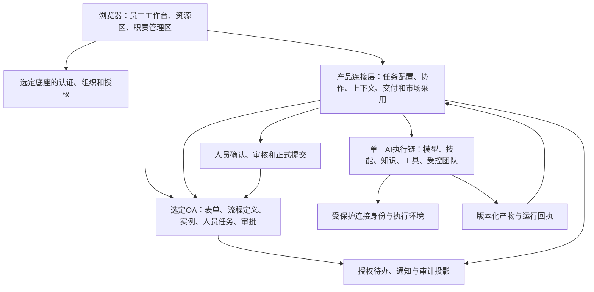
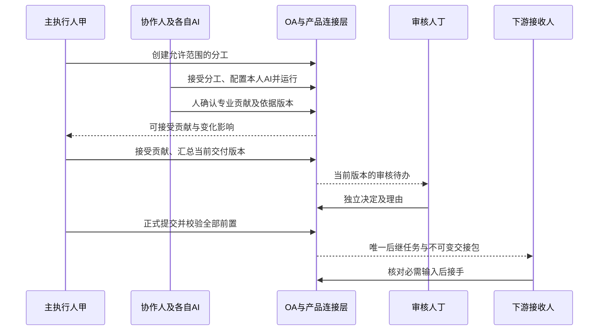

# OA数字员工协作平台 · 完整产品设计文档

版本：1.3｜设计日期：2026-09-11｜文档性质：可评审的产品设计基线  
产品状态：`DESIGN_ONLY_NOT_IMPLEMENTED`｜技术底座：`PENDING_SELECTION`  
适用读者：产品、业务负责人、交互设计、架构、研发、测试与实施人员。

本文依据当前项目的用户需求与已归档深度研究编制，不代表设计已经用户逐项签定，也不代表产品已经实现。需求、字段、状态和验收均为后续开发约束；研发开始前仍须固定底座版本并完成物理模型、真实接口及部署映射。

配套文件：[逻辑数据模型与接口契约](27-逻辑数据模型与接口契约.md) · [开发分期与验收用例](28-开发分期与验收用例.md) · [全量需求与角色追踪](29-全量需求与角色追踪.md) · [机器可读追踪](30-产品设计追踪数据.json) · [完整交互原型](31-完整产品交互原型.html) · [流程图、原型图与断点审查](32-业务流程图原型图与断点闭环审查.md) · [QoderWake与StaffDeck融合研究](33-QoderWake与StaffDeck融合及AI体验研究.md)。

## 0. 阅读顺序与证据边界

| 层次 | 本次采用的来源 | 使用方式 |
|---|---|---|
| 用户明确需求 | [18条用户需求原文](../../history/用户需求原文.md)、本次“基于深度研究结果生成完整的产品设计文档” | 决定定位、完整范围和交付物 |
| 产品业务基线 | [01](01-产品需求与业务规则.md)、[12](12-员工市场复制与使用设计.md)、[18](18-OA多流程多实例产品设计.md)、[23](23-OA主旨与BS字段一致性核查.md) | 保留人员责任、市场、上下文、多实例与能力不缩减规则 |
| 全量追踪 | [10](10-需求追踪数据.json)、[17](17-角色需求与验收追踪.json)、[21](21-OA需求细化与验收追踪.json) | 原153项ID和优先级不改写；10条市场、28条OA细化仍关联原需求 |
| 选型研究 | [25-从零开发最小工作量开源选型](25-从零开发最小工作量开源选型.md)、[AI候选补充研究](validation/zero-base-ai-candidate-research.md) | 使用2026-09-11研究快照及其未验证边界，不将候选推荐改写为已选型 |
| UI研究与字段 | [14](14-QoderWake界面参考与原型设计.md)、[15](15-全角色界面与操作覆盖矩阵.md)、[24](24-业务模板字段候选.json) | 保留视觉依据、角色范围和示例字段，明确与生产字段的区别 |

新项目的设计入口为26—33号文件。01—25号及旧原型保留为需求细节与历史证据；其中的 React、FastAPI、DSH、固定端口、旧库名、TaskPacket、claim 和绝对源码路径不自动成为本项目技术或治理决定。发生冲突时，依次按当前用户指令、用户原文、当前项目上下文、本文与配套设计、历史提案解释；新增设计推导如与用户要求有冲突，应修订设计。

本文不新增商业承诺、部署承诺或功能缩减授权。153项是当前可追踪的需求集合，不是旧产品真实能力的数量上限；后续发现的遗漏能力必须补入保留映射。

<a id="positioning"></a>
## 1. 产品定位、目标与范围

### 1.1 产品定义

面向企业的 B/S 人与数字员工协作平台：成熟 OA 流程规定人之间的责任、任务、审批和交付；每位承担人在自己负责的任务内配置数字员工、技能、知识和工具；数字员工在本次授权范围内执行并形成候选结果，由人核实、汇总、审核并交给下一岗位。

产品价值以“有责任归属且可核验的业务交付”衡量。数字员工可服务多位获授权用户，但每次任务的会话、输入版本、凭据引用、工作空间、预算和运行控制相互隔离。

### 1.2 核心问题与目标结果

| 用户问题 | 设计结果 | 衡量证据 |
|---|---|---|
| 今天参与多种流程，难以定位该做的事 | 跨流程统一待办，直接看到本人职责、交付、期限和下一接收人 | 队列、任务详情及权威任务记录一致 |
| AI可对话，却不能形成可交付成果 | 任务内配置、运行、修改、检查、确认和提交连续完成 | 配置版本→实际执行→产物→人员决定→交接完整关联 |
| 多人及各自AI使用不同资料 | 共用业务事实版本，按参与人投影可见资料 | 依赖变化能使相关贡献待重核，私人资料不泄露 |
| 复制资源后仍不知道能否使用 | 市场动作和就绪条件分开显示，合法资源可自助采用 | 副本来源、个人连接与当前任务资格可复核 |
| AI结束被当作业务完成 | 技术运行、贡献、审批、节点、实例及交接分别表达 | 无有效产物或批准不能推进业务流程 |

### 1.3 范围与交付形态

- 完整范围保留21领域、22页面组、41业务视角及44个人类历史角色键所表达的责任边界。角色键是迁移核对锚点，新底座可映射等价权限，不要求照抄枚举。
- 支持人工执行、AI协助、受控自动执行；默认以AI协助为建议模式，实际默认值由模板版本决定。人工路径不要求模型或工具凭据。
- 支持流程模板、多实例、同实例多节点、临时协作工作、自由对话转任务，以及未关联企业流程的合法临时工作。
- 支持组织部署与租户隔离。首期可以只部署一个租户，但数据和授权不能省略租户边界。不开设面向公众的自助注册/付费漏斗。
- 主入口是浏览器。电脑操作和本机文件访问通过经授权的桥接能力提供；网页不直接把用户本机路径当服务端文件。
- 本次交付设计文档、追踪数据、本地交互原型与截图。正式产品界面实现、底座安装、产品源码迁移、生产写入、Git操作和商业许可认证均不属于本次任务。

<a id="research"></a>
## 2. 深度研究如何转化为产品设计

### 2.1 研究结论与设计落实

| 研究结论/用户约束 | 本设计采用的结果 | 仍须验证 |
|---|---|---|
| 成熟OA已具备组织、表单、人员任务、审批与流程设计基础 | 优先复用底座，差异化研发集中于人员任务与数字员工的业务连接 | 目标案例的会签、退回、转办、版本与表单权限实际运行 |
| 25号报告优先验证芋道前后端及BPM/AI，RuoYi-AI其次 | 保持这一候选验证顺序；本文定义与框架无关的产品合同 | 固定社区源码、BOM、前端后端配套及干净构建 |
| 根许可证不能替代实际交付依赖核查 | 对选入模块单独记录来源、固定版本、许可和交付义务 | 报告提及的甘特图、Tinyflow、BPMN标识与Java版本问题须按实际版本复核 |
| AI角色、工具市场与人员流程已有基础，但没有证实业务闭环 | 明确补齐TaskAgentBinding、上下文版本、贡献、人员确认、交接和市场采用 | 真实模型输入、权限撤销、外部调用及故障恢复 |
| 避免增加多个完整AI管理平台 | 一套人员身份，一套OA权威状态，一条选定的Agent执行链 | 现有AI模块的能力不足时，只增补必要SDK/适配层 |
| QoderWake的优势集中在节点内数字员工工作环境 | 引用其导航、卡片、资源发现、任务反馈思路，加入本项目人员责任与交接信息 | 当前设计与真实界面实现逐页验收；不声称有其源码复用授权 |
| 从零选型不等于削减原能力 | 全部需求逐项保留；分期只表示依赖和验收顺序 | 后续旧代码能力盘点与底座等价映射 |

此表是对本地研究快照的设计推导，不是本次重新联网核验后的候选现状。报告中的75—121人日只针对限定试点，不能作为全部153项功能的工期或报价。

### 2.2 目标系统分层



OA引擎负责企业流程的可执行生命周期。连接层保存差异化业务事实与关联，不再维护可以独立推进同一流程的第二套状态。运行成功只产生候选，企业节点完成必须经过人员与业务合同校验。

<a id="concepts"></a>
## 3. 统一概念与业务关系

| 概念 | 含义与关系 | 示例 |
|---|---|---|
| 流程模板及版本 | 可复用的人员职责与流转定义；发布版本不可变 | 设备采购流程 v3 |
| 业务实例 | 某一次明确业务意图产生的办件，绑定模板版本 | 采购单示例 A，与同日的采购单 B 独立 |
| 节点工作 WorkItem | 实例中的一个业务工作单元；另可存在合法临时工作 | A的“采购方案编制” |
| 人员任务 HumanTask | 本轮具体人员待办及权责，由选定OA任务体系提供权威状态 | 甲本轮编制任务、丁本轮审核任务 |
| 分工 Collaboration | 主工作与独立协作工作的关联 | 乙核技术清单，丙核预算 |
| 数字员工定义与版本 | 可被授权复用的能力配置资产 | 预算助理 v2 |
| 本次任务配置 TaskAgentBinding | 本人针对一个WorkItem的模式、数字员工和资源组合 | 丙在A的预算分工使用个人预算助理 |
| 执行尝试 Attempt | 固定配置和输入后的一次可追踪运行 | 输入修订后重新运行形成新Attempt |
| 贡献 Contribution | 协作人提交的专业成果版本，等待汇总者接受 | 预算表 v2 |
| 正式交付 DeliveryCommit | 当前有效输入、成果、检查和人员决定形成的不可变业务记录 | 已批准采购方案及附件集合 |
| 交接包 HandoffPackage | 供后续工作读取的精确交付版本和必要上下文 | 下游采购岗收到方案包 v1 |

同一人可在单据A任执行人，在B任协作人，在C任审核人；页面视角不改变登录身份。任务的业务责任、资产归属、资源使用权和外部调用身份分别判定。显示单号用于识别，内部稳定ID用于关联；禁止按流程名称、日期或员工姓名拼出运行隔离键。

<a id="roles"></a>
## 4. 角色、权限与责任设计

### 4.1 主要职责矩阵

| 业务视角 | 默认工作入口 | 可在授权内操作 | 不能由该身份推导的权力 |
|---|---|---|---|
| 普通员工/数字员工使用者 | 本人待办、个人资源、市场 | 领取合格任务、配置本人资源、使用获授权能力 | 读取全租户任务、管理源资产 |
| 发起人 | 可发起流程、我发起的 | 创建独立实例、补充、催办、按模板撤回 | 代审批、随意改当前处理人 |
| 主执行人 | 节点工作区 | 自己配置、组织允许的协作、接受贡献、提交 | 替协作人确认、修改对方私人资源 |
| 协作人/写作人 | 我的分工 | 接受/拒绝、自己配置AI、提交贡献、返工 | 关闭父任务、读其他人的私人草稿 |
| 节点责任人/主管 | 责任范围与负荷 | 明确责任、协调异常、依政策调度和延期 | 默认查看全部私人聊天、代替专业审核 |
| 专业审核人 | 指定审核待办 | 比较版本、同意、退回、要求补充 | AI代签、自批、审批无关对象 |
| 访问/风险审批人 | 精确审批请求 | 对资源、动作、期限与用途作决定 | 以一次批准授予无限范围权限 |
| 下游接收人 | 待接手任务 | 检查包版本、可读性和未决项，确认接手 | 因收到通知就获得上游全部资料 |
| 流程设计/发布人 | 流程设计与发布工作 | 定义规则、预检、评审、发布和回退新版本 | 静默改变在途实例版本 |
| 数字员工/技能/知识维护者 | 各自资源目录 | 草稿、测试、版本、发布申请、依赖分析 | 获取全部使用者的业务正文 |
| 组织/人事/身份/权限管理 | 各自职责工作区 | 任职、身份、精确授予、离岗交接 | 自动继承其他管理域和私人内容 |
| 运维/发布/工作流管理 | 健康、实例阻塞、诊断 | 授权恢复、容量与版本管理 | 伪造业务批准、把未知外部结果改为成功 |
| 审计/安全/隐私 | 脱敏事件、指定调查与数据请求 | 解释授权、独立复核、保留冲突处理 | 直接改业务结果或自行批准紧急访问 |
| 自动化/渠道/团队/API维护 | 自己的配置与运行记录 | 管理精确范围的触发、路由和能力 | 从服务身份继承自然人的批准权 |
| 租户所有者 | 租户生命周期与配置 | 授权范围的租户设置 | 自动拥有所有管理员业务读取权 |

全部41视角的名称、目标、页面、动作、负例和44个历史角色键逐项保留在29号文件。正式系统只展示登录者有权进入的工作区，不保留原型中的任意角色切换器。

### 4.2 权限计算与撤销

可执行动作 = 当前有效身份 ∩ 租户/组织边界 ∩ 对象关系 ∩ 动作授予 ∩ 用途及期限 ∩ 本轮任务状态 ∩ 职责分离条件。资源能看、能复制、能改、能共享、能发布、能运行分别判断；列表和计数必须使用同一授权范围。

管理权限和业务内容读取权限分离。对无权知道存在的对象返回统一不可访问反馈；对已获准查看但不能操作的对象显示“当前不能执行”及合法恢复原因。服务端在每次读取、下载、工具调用、恢复和提交时重查授权，前端按钮只反映结果。

转办/离岗/撤权时，人员任务权威状态先更新，关联绑定随责任代次失效；运行可停止则停止，无法立即中止的迟到结果只作历史候选。旧承担人不得继续提交，新承担人重新确认配置与资料。已发生的外部动作进入查证或补偿，不能由撤权抹去事实。

<a id="oa"></a>
## 5. OA流程、实例与统一待办

### 5.1 流程设计与发起

流程设计器复用成熟底座，属性面板按“职责、输入、交付、数字员工、审核、异常”分组。节点至少定义岗位/人员解析策略、输入表单版本、字段可读/可写范围、输出约束、可选执行模式、必需与可追加资源、协作规则、审批策略、截止规则和失败责任人。

发布前检查：开始到结束可达；无孤立节点；分支有默认出口或明确失败路径；循环有最大次数/截止；候选人员可解析；必需资料可供应；输出能映射下游；分支合并和会签规则明确；资源与模型版本合格。设计者可预览员工真实字段与操作，但预览不授予运行权。

已发布版本只读。更新产生新版本，新发起默认采用当前可发起版本；在途实例固定原版本。回退只改变未来选用版本，运行中的迁移须有单独影响分析与处理记录。

发起过程：选择可发起模板→填写模板表单→预览责任路径及所需资料→保存草稿或提交→获得业务单号及当前处理节点。双击/网络重试沿用同一幂等意图；明确再发起一笔使用新意图。同模板同日同内容可为不同业务，不能用“模板+日期”统一去重。

### 5.2 待办信息架构

| 队列 | 收录与计数 | 主要动作 |
|---|---|---|
| 待我处理 | 本人当前有处理义务的工作、审批、返工、接手；AI执行中可筛选 | 打开具体任务、处理请求 |
| 待领取 | 本人在当前候选集合的未领取人员任务 | 原子领取；冲突后回读归属 |
| 我已处理 | 本人真实操作事件，附当前业务状态 | 查看历史、追踪后续；不等于实例完成 |
| 我发起的 | 本人发起实例，不按模板折叠成一项 | 跟踪、催办、按政策撤回 |
| 抄送我的 | 本人获授权的抄送版本和阅读记录 | 阅读、已读；不产生办理权 |

默认列：单号、事项标题、流程及版本、节点、本人职责/轮次、任务状态、实例状态、到期、优先级、下一步。按流程、项目、单号/可见标题、日期、人员责任、AI状态筛选；保存视图只保存条件。任务数、去重实例数、流程类型数、逾期数分别计算。建议默认按逾期/到期、优先级、稳定ID排序，并允许用户调整。

任务详情和草稿以租户、当前成员、工作项、责任轮次隔离；审批另带审批请求ID。跨任务跳转保存各自草稿与筛选；浏览器刷新从服务端恢复，不能将浏览器缓存当权威记录。

### 5.3 OA流转与异常

| 操作 | 条件与决定 | 后继结果 |
|---|---|---|
| 领取/释放/指派 | 当前候选资格、未处理状态、版本一致 | 只改变人员责任；不自动选AI或运行 |
| 委派 | 限定人、任务、动作和期限；保留原责任关系 | 受托办理结果按模板返回，不自动变永久转办 |
| 转办/替补 | 合格接收者、理由、任务版本与现有审批规则 | 旧绑定失效，新人确认配置；责任历史保留 |
| 顺序审批 | 当前级激活、版本有效、合法审批人 | 当前通过才激活下一级 |
| 并行会签 | 固定本轮参与者集合，明确ALL/阈值及拒绝策略 | 达到本轮规则才汇总；阈值策略仅在模板允许时开放 |
| 或签 | 固定候选集和首个有效决定规则 | 首个有效决定原子落地，其余标为不再需要 |
| 加签/减签 | 前签/后签/并签、范围及权限明确 | 重新计算本轮规则；不能用减签无痕规避必需职责 |
| 退回 | 目标、理由、影响范围明确 | 创建新责任轮次；旧审批不覆盖新输入和成果 |
| 撤回/终止 | 阶段允许，检查外部已发生效果 | 有补偿项时交给指定人处理；不直接删除记录 |
| 催办/延期/升级 | 精确实例及未决任务、权限、冷却与业务日历 | 分别记录通知、期限变化或升级决定；不按模板广播 |
| 无合格人员/资料缺失 | 明确原因及处理责任 | 实例可处于阻塞，管理员修复后重新解析，不能随机指派 |

批量已读可用。批量审批只有逐条展示目标差异、逐条授权/版本检查且模板允许时才可进入设计实施；首期默认逐单复核。节假日、工作日和自然日按模板日历计算；UTC存储、业务时区展示，“今天”按真实时区边界查询。

<a id="execution"></a>
## 6. 本人任务配置与数字员工执行

### 6.1 配置字段与继承

| 配置组 | 员工控件与默认 | 服务端规则 |
|---|---|---|
| 执行方式 | 人工/AI协助/受控自动，默认取模板 | 只能选模板和当前资格允许的模式 |
| 数字员工 | 我的、共享给我、节点推荐；非人工必选 | 固定发布版本；当前使用权、依赖、健康和任务资格均成立 |
| 技能与参数 | 多选卡、业务参数、顺序、依赖提示 | 参数按版本化定义校验；必需项不得删除 |
| 知识与业务资料 | 必需资料锁定，可追加授权引用 | 原文版本、解析/发布、可读性与有效期合格 |
| 工具与身份 | 应用动作卡、“以谁的账号执行”、范围摘要 | 精确动作和连接身份授权，秘密值只在服务端解析 |
| 工作空间 | 授权的业务/个人/团队空间 | 任务范围、目录、读写能力和设备状态分别验证 |
| 执行方案/团队 | 单AI默认；符合条件时选方案或团队 | 成员与整体资格、循环上限、预算、停止条件齐备 |
| 模型/预算 | 组织政策与可选模型摘要、本次上限 | 个人只能在允许范围收紧；不自建供应商凭据体系 |
| 输出与补充 | 交付格式、可选项、个人说明 | 个人说明不能覆盖业务硬条件或改变审核职责 |
| 保存范围 | 默认仅本次任务；另选个人偏好/共享模板提案 | 本次配置不影响他人；偏好重用时重新校验 |

有效配置按“组织边界→模板必需规则→本人合法选择”解析，所有字段显示来源和锁定原因。保存与开始分开：保存只持久化配置，开始时重算资格、冻结配置与输入并派发。运行中配置更新生成后续版本，不悄悄改变当前快照。

### 6.2 执行体验与约束

开始后依次显示排队、准备资料、运行中、等待人员、候选已生成、失败/取消等实际状态。第一条服务端进度须在结束前可见；断线按事件水位补取，重连不自动重新运行。公开展示目标、约束、工具计划、来源和检查结果，不要求保存模型内部推理。

运行只接受精确任务和绑定快照；同一WorkItem至多一个有效任务绑定，绑定可表示单AI、团队或人工。团队内部子运行不另设多个竞争的任务绑定。协作人拥有独立WorkItem，因此可各自同时配置AI。

暂停、恢复、停止、人工接管由实际运行能力决定。不支持热更新/恢复时，说明原因并提供保存候选、结束当前尝试、基于新快照开始新尝试的路径。失败保留草稿、阶段产物、已发生动作和未知回执；人工路径可继续完成业务。

### 6.3 外部动作与执行环境

外部写动作卡显示目标系统、对象、拟变更内容、调用身份、范围、可逆性和必要确认。已在现行政策与本次授权范围内的动作不重复审批；超范围或要求人员确认的动作必须获得绑定参数摘要的有效决定。

连接器分别显示已接入、已授权、已授予、节点可用和健康；“可启用”不能写成“已连接”。结果超时或未知先查operation和外部对象，禁止默认重新创建。无法自动查证的动作进入人工核对工作，保留证据和责任人。

模型/工具输出是不可信输入，不能自行提升权限或修改流程规则。工具执行按任务隔离文件、网络、命令与连接身份；所需本机资源必须选择已绑定设备和明确路径范围，设备离线给出等待、改用服务端空间或人工处理入口。

<a id="collaboration"></a>
## 7. 多人分工、贡献、审核与交接

### 7.1 分工和数字员工关系

主执行人定义“谁在何时完成什么、依据哪些资料、交付什么”。预先固定且影响企业路径的分工配置为OA节点/子流程；临时专业协作使用底座合法人员任务能力创建独立工作并关联父项，不能捏造流程节点。只有聊天建议而无独立交付和AI执行需求时，使用授权消息或专家咨询。

协作请求必须带目标、受众、输入版本、交付格式、期限及可操作范围。接受后形成独立分工；拒绝、过期、退出和替补均返回主执行人可处理事项。是否为父项必需贡献必须来自模板已允许的合同，主执行人不能私自增加独立审批门。

主执行人和协作人的数字员工各服务其人及其工作项，通过已授权业务资料和贡献对齐。查看他人的分工进度不授予编辑其数字员工、读取其记忆、使用其外部账户或代确认权限。

### 7.2 采购方案完整场景

1. 发起人同日创建采购A和B；两笔实例分别分配任务，单号、草稿和运行相互独立。
2. 甲在A承担主编制，乙核技术，丙核预算，戊写作，丁独立审核；每个人仅在自己的分工配置AI。
3. 乙确认设备清单v1，丙据此生成预算v1；两份结果都有具体版本和依据。
4. 乙将设备数量修订为v2并确认，系统沿依赖标记预算v1及其衍生写作结果待重核；A中无依赖的工作与B继续。
5. 丙查看差异、重新核预算并提交v2；戊依据被接受的清单和预算修订文稿。各人的私人对话和底价权限仍独立。
6. 甲接受合格贡献并汇总方案；丁审核当前交付版本，可退回精确交付项及理由。
7. 甲在检查、批准和版本仍有效时正式提交，形成不可变交付及交接包；下游岗位获得自己的待接手任务。
8. 下游核对资料可读性、版本、未决项并接手。若关键附件不可读，明确阻塞并通知有权补齐者，不能让AI自行猜测。



### 7.3 正式完成条件

提交时同时满足：当前人员责任有效、任务轮次与版本一致、AI结果绑定当前有效尝试或合法人工来源、必需输入可解析、贡献集合当前合格、产物完整、必需检查通过、必要独立批准仍覆盖当前版本、未知外部效果已经按合同解决。

贡献接受、审批决定、正式提交、下游接手各有独立记录。配置“审核后自动提交”的模板也必须使用同一提交守卫并保留此前人员确认，不能由一个AI成功事件直接推进流程；本设计默认显式人员提交。

交接包包含结构化输出、产物版本和摘要、依据、有效人员决定、未决项、下一步及来源。已正式交付的包不覆盖；迟到贡献、纠正或撤回资料通过新补充包、返工或补充流程处理，并通知实际受影响人员。

<a id="context"></a>
## 8. 上下文构建、变更与一致性

### 8.1 分层与消费

| 层 | 内容 | 使用规则 |
|---|---|---|
| 共同业务基线 | 目标、硬约束、已确认事实、输入/输出版本、期限 | 所有相关工作引用同一事实版本，依赖按字段/来源描述 |
| 人员/分工投影 | 当前人完成其任务所需的可读字段及资料 | 相同事实可有不同投影；缺必需读权则阻塞相关操作 |
| 本人私有资料 | 私人偏好、记忆、草稿、授权私人文件 | 仅在本人合法作用域使用，不自动进入团队或下游 |
| 本次执行快照 | 任务、责任代次、配置版本、上下文版本、策略版本和期限 | 冻结后可追溯；每次实际使用仍需重鉴权 |
| 装载与检查证据 | 准备、投递、运行器确认装载、公开约束核验 | 写入文件不等于装载，模型自述理解不等于业务检查通过 |

硬约束不因历史过长被截断。长文按可回溯来源摘要与授权检索装配；预算不足以容纳必需信息时应返回缺项/容量原因，不能静默丢弃。自由咨询可对可选资料缺失进行明确降级，业务节点不能在缺必需输入时照常派发。

### 8.2 变化影响规则

- 普通讨论只增加消息水位，不把所有工作改为待重核；被有权人员采纳的纠正才形成新业务事实版本。
- 正式事实/附件/决策变化按依赖定位受影响的快照、贡献、检查与审批；无法确认影响时，对引用该来源的相关工作保守要求重核，不影响无关联实例。
- 撤权在下一读写、工具调用、恢复及提交处强制生效；缓存和历史引用不构成授权豁免。
- 变化状态使用“可用、待重核、缺必需输入、冲突、已撤权”；与工作项、运行、审批状态分别展示。
- 受影响成果保留旧版本及其历史用途，完成重核产生新版本；审批必须重新指向实际提交版本，不能复用不适用回执。
- 事件采用聚合内单调序号与去重键。重复忽略、倒序不覆盖、缺口回读；前端显示已同步水位和错误恢复，不凭最后到达的消息覆写权威状态。

### 8.3 冲突与公开解释

结构化事实修订使用版本条件写入；两个有权者同时编辑不采用无提示的最后写入覆盖。文件协作分别保存候选和合并版本。冲突面板显示本人可见的旧值、新值、来源、影响项和处理人；敏感字段只向有权人呈现。

用户能查看“本次依据什么”“本次用了哪些记忆”“哪些变化尚未应用”。已读通知、运行器已装载和内容已通过检查分别留痕。上下文摘要及生成式建议不能成为独立的业务权威来源。

<a id="assets"></a>
## 9. 数字员工、技能、工具与员工市场

### 9.1 资产完整生命周期

| 类型 | 主要字段与创建体验 | 管理和使用路径 |
|---|---|---|
| 数字员工 | 名称、岗位职责、输入、交付、风格、边界、模型和能力依赖；可由批准模板或自然语言草拟 | 草稿→隔离试验→评审/发布→合法使用；详情有概览、技能、知识、任务、记忆、运行、设置 |
| 技能 | 用途、输入输出定义、业务参数、示例、依赖、资源包、顺序/冲突、版本、维护者 | 导入仅解析；错误定位；隔离试验；发布版本进入合格任务候选；精选排序基于真实验收反馈 |
| 工具/MCP | 应用、动作定义、非秘密参数、网络范围、连接模板、健康和版本 | 注册/发现→连通检查→配置本人或服务身份→精确授予→任务使用；零工具、离线、不兼容分别恢复 |

新版本、停用、归档、恢复、替代、导入导出和升级均保留来源、依赖与影响说明。修改内容创建新版本和真实摘要，不能使用固定占位摘要。停用阻止其未来不合法使用，历史运行仍能还原。批量推广按资源与目标逐条预检、给出分批结果，不覆盖在途快照。

### 9.2 员工市场采用

入口在工作台、各资源目录和本次任务配置内。市场统一发现数字员工、技能、工具，执行时仍按类型权限和生命周期处理。目录含用途/类型/可用性筛选、版本、维护者、依赖与当前动作；“我的复制”记录来源和本人修改。

| 采用方式 | 结果 | 限制 |
|---|---|---|
| 加入使用 | 引用源发布版本，建立合法使用关系 | 不取得源编辑权；不是个人可编辑副本 |
| 复制并使用 | 创建个人副本及来源关系；条件齐备回本任务选中 | 不自动运行；原样采用是否免复审由已明确发布政策决定 |
| 复制并编辑 | 创建本人草稿与来源关系 | 修改后重新验证和发布，不能借源批准冒充已批准新版 |

复制内容限已允许分享的定义、参数、非秘密配置、资源包与授权依赖元数据。凭据、OAuth会话、私人记忆、私人对话、任务文件、不可分享授权和源维护权不复制。

目录可见、可复制、可编辑、可运行、适用于当前任务分别判定。缺个人连接时“复制已完成/待配置”；缺发布为“待发布”；不合任务为“此任务不可用”；不能都叫“连接失败”。来源下架需区分停止新复制、安全撤销与权限失效，不能自动删除所有个人副本。

采用命令幂等；同键重试只得到一个确定结果，主动再复制用新意图。中断后查询采用记录；部分依赖失败显示已创建部分及缺项，不假报全部成功。新版来源通过差异预览和显式合并升级，私人修改和在途绑定保持原版本。

<a id="knowledge"></a>
## 10. 知识、记忆、文件与产物

### 10.1 知识与引用

知识目录分我维护、共享给我和可使用。来源支持文件、URL与获授权业务系统，记录导入、解析、加工、测试、发布、失效和更新状态。上传完成不表示可检索；空文档、错误网页和解析失败不得列为合格来源。

支持主题/文件夹、结构化条目、模板加工及定期更新。检索方案以固定业务评测集验证关键词、语义、混合查询、无答案和更新后的表现；不先承诺某引擎优于其他实现。引用记录来源版本、片段、定位和摘要，点击时重鉴权；AI产物的每项关键外部事实应可核验支持关系。

### 10.2 记忆与经验

区分个人、数字员工、项目、团队、节点实例和渠道作用域。每条记忆有来源、负责人、适用范围、有效期、版本和保留策略；提供分类、搜索、纠正、忽略、失效、导出及影响预览。当前任务禁用的记忆不进入后续快照。

任务复盘生成经验建议，只有有依据、可复用且达到既定验证要求的内容才由有权人确认保存。共享必须明确范围，不把私人偏好自动升为团队知识。经验转技能经过不同输入回归和发布；回退版本不等于撤销外部已发生动作。

离岗、撤权、保留期和合法保留冲突通过专门数据处理任务处置；权限撤销应及时阻止未来读取，历史事实的保留和实际删除按配置政策处理，不能凭一个“删除”按钮伪造全部系统副本已经消失。

### 10.3 工作空间与交付物

个人、团队和业务实例空间有清晰归属及任务绑定。文件含名称、版本、对象引用、摘要、类型、大小、来源、分类和访问范围；稳定文件ID与版本识别同名不同内容。预览、下载、片段引用、版本比较和合并候选从同一授权链读取。

产物可为文档、表格、图片、代码或结构化记录；用户在工作区能打开实际文件。多AI协作在独立工作区产生候选，由授权合并人处理冲突；不让并发运行覆盖同一可变文件。跨人交付使用服务端可解析的授权对象引用，不能只保存本机绝对路径。

<a id="extensions"></a>
## 11. 团队、执行方案、自动化、渠道与开放能力

| 能力 | 完整产品行为 | 必要边界和恢复 |
|---|---|---|
| 数字员工团队 | 选择协调者和专业成员；分工目标、输入、输出、轨迹及统一汇总；支持成员替换与接管 | 每个成员当前授权受限；团队预算/并发/最大深度有界；成员失败不能标整体成功；人责不变 |
| 节点执行方案 | 目录、自然语言草拟、表单/画布/高级定义视图；结构化输入、串并行、条件、汇总、人员确认 | 三种视图指向同一版本；无出口和无限循环发布前阻止；技术方案结束只产候选；使用选定运行链 |
| 自动化 | 一次、周期、事件、API、条件拉取；目标明确为新实例、新临时任务或当前任务步骤 | 每种宣称支持的触发实际验证；时区、截止、最大次数、去重、补跑、重试及失败通知明确 |
| 自动化管理 | 测试、触发预览、下一次时间、最近原因、成本、暂停/恢复 | 测试与正式统计隔离；过期/离岗/任务终止/资源撤权后停止受影响动作；每次触发重查授权 |
| 对话转任务 | 自由对话补齐目标、责任、输入、交付后创建或绑定任务 | 不重复办件；明确新目标/新实例边界；私人内容分享前选择范围 |
| 渠道与专家 | 单聊/群聊身份绑定、任务进度、产物链接、@与路由、专家咨询、冷却和主题归纳 | Web与IM使用同一任务；专家意见不充当审批；歧义先澄清；群、成员和单聊上下文分别隔离 |
| 渠道恢复 | 到期提醒、停用、重授权、成员退群、重投与投递回执 | 停用阻止新接入；查证已投递结果再重发；不把发消息成功当业务完成 |
| API/CLI/插件 | 应用身份、精确动作、事件接入、回调验证、限流和诊断导出 | 不构建第二套业务状态；服务身份不得自批；事件校验来源、去重、防重放及版本 |
| A2A与跨执行者协作 | 指明目标分工、用途、接收者、允许动作和返回任务 | 无身份映射不执行；消息不自动建无主任务或无限委派 |
| 条件设备能力 | 浏览器、电脑操作、文件与命令按租户启用、设备配对和任务授权提供 | 实际目标和预览一致；离线可辨认；撤权、越界路径和取消实测 |

条件能力继续保留产品设计与验收要求。没有实际启用或验证的能力显示准确条件态，不用永久占位页面把它算作已上线，也不从完整基线中删除。

<a id="ui"></a>
## 12. 信息架构、页面与交互规范

### 12.1 全局布局

一级区域建议为“工作、数字员工、能力与资源、管理”，通知和个人设置位于全局工具区。管理按领域授权显示，各类管理员仍可拥有自己的业务待办。P编号是稳定设计追踪标识，最终URL在选定前端后映射，旧路由不作新系统已挂载声明。

视觉延续14号资料的实测参考：浅灰侧栏、白色内容区、黑色主要动作、浅绿统计区、细边框卡片。建议桌面侧栏240px，主标题28px/600，正文14—16px，间距按4/8px递增；实际使用选定前端的一套组件与Token，不引入另一套主题体系。品牌名称与图标使用本产品资产，不复制竞品商标或人物素材。

桌面1440px显示队列与必要侧栏；1024px收窄导航、资源两列；390px导航折叠、单列卡片、抽屉全屏、按钮换行。宽表提供列优先级与局部滚动，页面主体不横向溢出。复杂流程设计可以提示使用桌面，员工查看、办理、审批与市场采用仍须窄屏可用。

### 12.2 22组页面完整目录

| 页面 | 核心字段/内容 | 操作与关键状态 |
|---|---|---|
| P01 我的工作台 | 五类队列、授权计数、单号、流程/节点、职责、期限、AI状态 | 搜索/筛选/保存视图/领取/发起；空队列与查询失败分别呈现 |
| P02 节点工作区 | 单号、节点、轮次、目标、责任、交付、下一接收人；任务/协作/配置/上下文/产物标签 | 保存、开始、补充、请求协作、送审、正式提交；显示可行动缺项 |
| P03 参与者与分工 | 人员、分工目标、期限、允许看的AI摘要、贡献及依据版本 | 请求/接受/拒绝/转办/返工/接受贡献；他人私有配置不可编辑 |
| P04 本次配置 | 第6章全部配置、来源、锁定原因、差异与就绪性 | 预览/保存本次/个人偏好/模板提案；保存不等于运行 |
| P05 数字员工目录与详情 | 我创建/共享/团队、职责、版本、能力、任务、记忆、运行、设置 | 创建向导/编辑/试验/发布/分享/归档/恢复/导入导出 |
| P06 技能目录与创作 | 用途、输入输出、示例、参数、依赖、作者、测试及版本 | 导入/校验/试验/发布/选用/升级/回退；错误定位到字段或资源 |
| P07 工具与连接 | 应用动作、身份摘要、范围、期限、健康、调用和回执 | 注册/发现/授权/连接检查/撤销/重授权；不显示秘密原文 |
| P08 知识与来源 | 来源、文件夹、解析加工、版本、可用性、引用和评测 | 导入/加工/测试检索/发布/更新/范围变更；上传与发布分开 |
| P09 记忆与经验 | 范围、来源、时间、有效期、本次使用、冲突、提案 | 查找/纠正/忽略/失效/导出/申请分享/经验转技能 |
| P10 文件与产物 | 空间、文件版本、预览、来源、摘要、引用、Diff | 上传/选择/引用/下载/比较/合并候选；实际文件可解析 |
| P11 对话与执行 | 所属任务、轮次、进度、工具卡、公开检查、阶段产物 | 发送/补充/转任务/停止/支持的暂停恢复；断线重放不重跑 |
| P12 数字员工团队 | 协调者、成员、分工、权限摘要、预算、运行、汇总 | 配置/选择/查看成员成果/替换/接管/终止；部分失败真实展示 |
| P13 节点执行方案 | 输入输出、阶段、分支、资源、停止条件、版本与轨迹 | 草拟/表单或画布编辑/预检/试验/发布/回退 |
| P14 自动化 | 触发、目标、时区、下一次、截止、并发、去重、补跑、成本 | 新建/测试/预览/暂停/恢复/查看触发原因和运行 |
| P15 渠道与专家 | 会话、身份绑定、路由、专家用途、投递和失效状态 | 连接/任务咨询/返回成果/暂停/重授权/查证重投 |
| P16 审核、交付与接手 | 目标版本、变化、逐项检查、产物、批准、未决项、接收可读性 | 同意/退回/补充/正式提交/接手；每个动词绑定不同决定 |
| P17 流程设计与实例管理 | 定义/版本、表单、人员规则、AI边界、异常、在途影响 | 设计/预检/员工预览/评审/发布/追踪实例；发布版只读 |
| P18 组织、人员与权限 | 组织岗位、任职、身份、授予、来源、期限、撤权与交接影响 | 各管理域精确操作；未获权的正文、金额、私聊不投影 |
| P19 运行、用量与审计 | 健康、容量、原始用量、成本来源、失败、未知效果、证据 | 诊断/授权恢复/对账/脱敏导出；无数据不展示虚构KPI |
| P20 上下文与变化 | 必需事实、基线、来源版本、投影缺项、装载证据、依赖差异 | 预览/补资料/查看变化/重核；已读不冒充已应用 |
| P21 通知与个人设置 | 任务定位、处理要求、阅读态、语言/时区/偏好/会话 | 查看/稍后/已读/设置；通知不改变业务终态 |
| P22 员工市场 | 三类资源、用途、版本、依赖、合法动作、我的复制和来源 | 详情/复制使用/复制编辑/引用使用/升级Diff/返回本人任务 |

### 12.3 三个关键界面结构

```text
统一工作台
  工作 / 待我处理                    [发起流程] [资源市场]
  当前可见任务数 | 实例数 | 流程类型数 | 逾期任务数
  待我处理 · 待领取 · 我已处理 · 我发起的 · 抄送我的
  流程/项目/期限/关键词筛选
  单号 | 事项 | 节点与本人职责 | 期限 | 状态 | 下一动作

节点工作区
  采购A / 方案编制 / 第2轮             待处理
  目标 · 本人职责 · 交付标准 · 下一接收人
  任务与对话 | 协作 | 本次配置 | 上下文 | 产物与交付
  当前内容                            必要信息侧栏
  已通过的检查 / 待解决条件            [保存草稿] [当前合法主动作]

员工市场
  将用于：采购A / 本人的预算核对分工（仅从任务进入时显示）
  数字员工 | 技能 | 工具               市场 / 我的复制
  搜索与业务分类                      获授权资源卡
  详情：用途、输入输出、来源版本、复制范围、依赖、当前动作
```

### 12.4 字段、错误与交互规则

- 人员、岗位、资源、文件用服务端授权候选选择器；用户输入名称用于显示，提交稳定ID。金额用固定精度十进制，枚举来自模板版本，日期验证真实日历。
- 控件旁显示必填、来源、只读原因和校验结果。保存草稿允许未完整字段但验证已填字段格式；送审/提交强制完整规则。
- 加载使用骨架；合法零结果给“暂无待办/清除筛选”；网络或服务失败保留上下文并提供重试；无权限不假装空集合；版本冲突保留草稿并引导比较合并。
- 同时显示任务与实例状态，不把“我已处理”“AI结束”“收到交接”混写为“流程完成”。不以色彩作为唯一状态表达。
- 鼠标、键盘、焦点、Escape关闭、弹窗焦点返回、标签语义与读屏名称纳入验收。提交错误聚焦首项，长表单支持定位；400%缩放和窄屏记录实际限制。
- 生产页面不展示实现状态、原型身份夹具、原始秘密、内部协议JSON或虚构运行进度；技术信息只在获授权诊断内展开。

原[交互原型](08-人员数字员工协作交互原型.html)用于讨论布局与旅程，其角色切换、内存数据、固定回复及历史截图均非当前产品验收。本次没有重新生成或运行该原型。

<a id="quality"></a>
## 13. 非功能、通知与运营指标

### 13.1 非功能要求与候选验收档位

下列数值是设计验收建议值，不是测量结果或生产SLA。实施阶段在28号容量与部署清单中记录采用值和调整依据，不可用未测量的指标宣称达标。

| 类别 | 设计要求/候选目标 | 验证方式 |
|---|---|---|
| 性能 | 试点100并发会话、10万条任务历史下，常用读接口p95≤2秒；命令受理p95≤3秒，模型耗时单列 | 固定数据、查询、硬件、网络与窗口的负载报告 |
| 流式反馈 | 已建立事件连接且后端事件已产生后，客户端可见延迟p95≤2秒；模型首字时间另记 | 对比服务端事件与浏览器时间；断线续传检查 |
| 一致性 | 同一业务意图最多一个有效结果；旧责任、旧版本、撤权后提交被拒绝 | 并发争抢、重复/乱序回调、重启注入与对账 |
| 恢复 | 候选试点RPO≤15分钟、RTO≤4小时；恢复同时覆盖DB、文件版本及密钥引用可用性 | 独立环境恢复演练，核对任务/产物/版本关联 |
| 运行容量 | 租户、人员、模型、连接器、任务分别限流；公平排队，预算预留与结算防超占 | 多实例队列与取消隔离、容量边界测试 |
| 安全与隐私 | 租户隔离、职责分离、敏感字段投影、下载重鉴权、秘密集中保管、运行沙箱 | API与浏览器负例、越界工具测试、脱敏记录 |
| 文件与知识 | 文件类型/大小/风险扫描策略可配置；解析失败不发布；引用权限随来源变化 | 上传、解析、下载、知识检索及撤权链路 |
| 可访问性 | 关键路径键盘可操作、焦点可见、表单有名称、状态不用颜色独示 | 实际浏览器与辅助技术检查；不以规范声明代替结果 |
| 兼容与升级 | 目标浏览器和版本明确；变更可迁移、可回退；保留原能力 | 固定浏览器矩阵和升级前后业务回归 |
| 可观测性 | 业务实例→人员任务→绑定→尝试→调用→产物→决定→交接可关联 | 随机抽取交付从原始记录复核；日志不含秘密/内部推理 |

### 13.2 通知设计

需要通知的事件：新待办/分工、被退回、必需依据变化、需要人员确认、资源失效、即将/已经逾期、交接缺资料、未知外部结果与恢复完成。通知按接收者和源事件去重，绑定具体任务和版本，已解决事项不继续作为待处理提醒。

渠道偏好、静默时段与升级例外由组织政策及用户设置组合。投递成功、阅读成功、人员操作与业务完成独立记录；通知失败不回滚已确认业务决定，重投不重复创建任务或外部消息。

### 13.3 指标口径

| 指标 | 定义与事件来源 | 防误读 |
|---|---|---|
| 首次合格交付耗时 | 从任务激活到首次有效DeliveryCommit；报中位数及分位数 | 按流程类型分组，等待时长单列 |
| 到期任务合格完成率 | 统计窗内到期任务中，截至观察点已合格提交且未被作废的数量 / 到期任务数 | 排除测试，取消单独报告；不按AI运行数作分母 |
| 返工率 | 首次送审的交付中被要求返工的数量 / 首次送审交付数量 | 区分业务需求变更与质量缺陷 |
| 交接等待时间 | 交接包可用到目标人确认接手的时长 | 不可读资料等待单列，不假装用户怠工 |
| 过期提交拦截率 | 应拒绝的过期提交中被正确拦截数量 / 经检查确认应拒绝数量 | 真实分母需审计或受控场景，不能只看拒绝次数 |
| 上下文缺失率 | 因必需上下文缺失无法开始的请求 / 有效开始请求 | 用户主动取消、重复意图分开 |
| 重复外部效果 | 相同逻辑动作造成多个非预期外部对象/变更的已确认次数 | 目标为0；无查证能力不能写0 |
| 成本与技术成功率 | 模型/工具原始用量、计价来源及运行终态 | 估算和账单分开，技术成功率不代替业务完成率 |

<a id="delivery"></a>
## 14. 实施入口、决策项与验收边界

建议实施依赖：底座验证与等价映射→单个人员任务完整链→多人协作和交接→完整OA例外/市场/组织治理→高级能力与运营恢复。详细阶段与验证见28号。原P0/P1/P2保持不变，阶段完成不能用来宣称全量需求完成。

| 决策项 | 当前设计处理 | 何时必须明确 |
|---|---|---|
| 技术底座及固定版本 | 优先验证研究首选，保持备选；未选定 | 固定物理数据模型、实际接口及开发依赖前 |
| 试点业务与企业表单 | 采购作为完整叙事；采购/合同/报销/人事字段为候选 | 进入客户业务验收前 |
| 审批与授权政策 | 采用明确职责分离、有限范围授权；具体阈值与会签人数由模板定义 | 发布可运行模板前 |
| 自动执行范围 | 仅已授权、满足风险与人员确认规则的任务内操作 | 启用相应自动化或外部动作前 |
| 部署/容量/保留与灾备 | 第13章提供候选档位，不冒充客户合同 | 性能、隐私及部署验收前 |
| 旧代码功能保留 | 153项与历史角色完整追踪；源码全量比对待实施 | 任何替换或迁移验收前 |

文档完成标准：产品主线完整、全部基线有追踪、关键流程/字段/状态/权限一致、来源和限制可核对。产品完成标准：每个受影响需求都有真实服务端行为、权限正负例、持久化/故障恢复与用户浏览器证据。两种完成状态分别管理。

<a id="ai-experience"></a>
## 15. 全产品AI融合与低学习成本设计（v1.1）

本章响应用户后续明确要求：结合QoderWake和StaffDeck，充分融入AI辅助设置、业务分析、本体知识、主动协助与自主进化，同时降低复杂度。属于原153项之外的12条显式体验增强AI-01—AI-12，原需求不删减、不重新编号。原始依据与源码边界见[33号研究](33-QoderWake与StaffDeck融合及AI体验研究.md)。

### 15.1 让复杂能力待在合适的位置

全产品保留“工作、数字员工、能力与资源、管理”四个一级区域。普通员工首先看到待办、当前工作与可用资源；P03/P04/P10/P16/P20通过工作区内页签或抽屉进入，不再要求从22个独立菜单中寻找操作。22组页面是完整功能分组，不是22个一级导航。流程发起在工作内，流程设计在有权人员的管理区。

常见任务的建议主路径为：打开本人任务→根据当前要求准备结果→核对并办理下一步。若模板要求审核或下游确认，明确显示对应人的下一步，不能为减少点击省略责任。员工无需先创建AI、选择模型或填写技能参数；从模板和本人已获准资源预填，只补影响本次业务的缺项。

默认呈现四件事：要完成什么、AI依据什么、将准备什么、什么需要本人处理。常见模板首屏必答业务项建议不超过3个；确有更多业务必填项时分组引导并说明原因，不人为删掉字段。模型、提示词、并发、分块、向量、计划定义和协议字段放到有权维护者的高级区域。

小范围、可逆且用户明确要求的个人偏好变更，可采用“已应用，可撤销”反馈；涉及任务配置版本、他人影响、正式规则或外部动作时展示差异并按现有规则确认。已具备的权限和已确认的事实不重复询问。

### 15.2 22个页面组的AI作用点

| 页面 | AI替用户准备什么 | 用户需要做什么 / 失败恢复 |
|---|---|---|
| P01 工作台 | 按当前授权事项给出下一步、期限风险与可准备草稿 | 采纳/忽略/稍后；建议不能替代待办状态 |
| P02 工作区 | 总结目标、识别交付缺项、建议下一合法动作 | 核对当前实例和成果；无资料可转人工 |
| P03 协作 | 按任务内容提出专业分工、必要输入和交付草案 | 当前有权人确认分工；不自动委派他人或分享私密内容 |
| P04 配置 | 推荐合格AI及最少依赖，解释默认值与缺项 | 查看差异、只补缺项；保存与启动分离 |
| P05 数字员工 | 从职责描述形成可修改配置草稿和试验任务 | 核对职责、边界与测试结果；不自动公开发布 |
| P06 技能 | 草拟工作方法、参数说明和测试案例，解释依赖 | 作者校验和隔离试验；失败定位，不凭文本完整就发布 |
| P07 工具 | 解释应用动作、推荐已有合格连接并诊断缺项 | 本人完成必要授权；AI不读取或代填他人秘密 |
| P08 知识 | 提炼来源、业务对象及关系候选，带引用回答问题 | 核对关键关系/冲突；看资料即可，无需手工建图谱 |
| P09 记忆与学习 | 识别稳定偏好和可改进方法，展示真实反馈证据 | 纠正/忽略/确认保存范围；未验证提案不自动生效 |
| P10 文件 | 生成结构化候选、比较版本、定位变化和引用 | 预览真实文件、确认合并；冲突保留候选 |
| P11 对话 | 用业务语言表达进度、工具动作、问题和结果 | 直接补充目标与选择；不需要学提示词和运行协议 |
| P12 团队 | 建议最低必要成员与有界分工 | 当前承担人选用，预算/范围默认继承；成员失败可接管 |
| P13 方案 | 从业务目标生成可预检的阶段与分支草案 | 维护者核对输入输出与停止条件；不将画布当运行证明 |
| P14 主动协助 | 将一句话转成触发、范围、产物与期限草案 | 只确认关键范围，允许暂停未来提醒/触发/当前运行，三者分开 |
| P15 渠道/专家 | 识别任务引用、路由候选与最小咨询背景 | 歧义先澄清，发出受控消息按必要确认办理 |
| P16 审核/交接 | 整理差异、检查依据与未决项，提供审查辅助 | 审核人独立决定，承担人交付，下游接手；AI不代签 |
| P17 流程 | 从业务描述草拟流程/表单，预检人员和下游缺口 | 设计者与发布人完成职责；在途实例不静默更新 |
| P18 组织权限 | 解释授权来源和人员变化影响，形成处理建议 | 管理者按精确范围执行；AI不批准权限提升 |
| P19 分析/运营 | 自然语言形成授权只读分析计划、口径卡、图表与下钻 | 核对歧义口径与证据；分析结论不直接批改任务或人员绩效 |
| P20 依据变化 | 定位受影响事实、贡献、审批，给出重核顺序 | 由当前有权者确认新事实，保留旧版本与人工恢复 |
| P21 个人设置 | 解释设置，用自然语言形成本人偏好与提醒建议 | 少量选择即可完成，可撤销；组织政策优先 |
| P22 市场 | 按当前业务推荐最少而合适的资源并预检可用性 | 一次合法采用，缺连接再补；不要求先学习整个资源目录 |

### 15.3 AI辅助设置：推荐、可改、可撤回

AI设置上下文只包含当前页面对应对象、授权内已有值、模板硬条件与本人显式偏好。生成建议引用对象版本和字段级Diff：原值、新值、推荐原因、来源、影响与缺项。用户可单项修改、部分采用、全部拒绝或回到原值。

自然语言理解不直接修改权限或正式规则。任务配置保存时调用27号同一命令及并发守卫；页面中的推荐来源过期则重新预览，不能覆盖他人的新修改。模型不可用时回到预填的普通表单，用户依旧能完成工作。

### 15.4 业务分析：有口径的答案

用户从工作台、当前任务或主管视图问业务问题，例如“本周采购主要卡在哪里”。系统只在当前主体授权数据内形成分析计划，先明确统计对象、去重粒度、时间口径与时区、状态过滤、组织范围、指标定义和快照时间。只有歧义会改变结果时才询问，不把每个问题都变成配置向导。

底层采用只读凭据或受限查询服务、字段白名单、计划校验、限额及超时；不是仅用提示词约束模型。结果展示结论、图表/明细、口径、版本、来源、限制与下钻入口。可见范围裁剪、缓存、下载和聚合均重授权，图表数量不能泄漏无权对象。

无样本、合法零结果、无权限、查询失败、数据过期和模型解释不确定分别呈现。相关性标作线索，不自动推导因果或个人绩效。把分析建议转成行动清单时先形成可审阅草稿，执行仍回到原人员任务与权限链。

### 15.5 本体知识库：业务对象与有来源的关系

用户入口叫“业务知识”或“相关对象与依据”。第一阶段复用既有人员/组织/岗位、流程/实例/任务、产品与供应商等企业已有业务对象、数字员工版本、资料、交付及指标口径的稳定ID；先提供关系和来源投影，不重新复制业务主表，不为展示图谱预先引入大型图数据库或本体编辑平台。

关系可表达负责、协作、审核、属于实例、依赖资料、由运行生成、取代版本和引用指标。企业业务类型按实际数据源渐进补充，不能让模型先编一套完整企业对象。每个派生断言含来源版本/定位、有效期、提取方式、确认人及可见范围。AI推断先作为候选，确认后也不能绕过源系统合法命令改负责人、批准或权限。

知识维护者负责映射、冲突、失效和质量；员工只需在问题或任务旁查看相关对象、引用与影响。来源撤权时，实体邻居、关系名称、聚合和路径也按当前权限过滤；知识图谱不能成为绕过源ACL的新读取入口。来源冲突交给口径/资料负责人，检索相似度不显示为事实可信概率。

### 15.6 主动AI：少打扰、可解释、有限自主

主动机会与自动化计划分开：前者是当前事件产生的可行动建议，后者是已授权的触发配置。机会来自期限、缺项、依据变化、依赖完成、订阅业务事件或周期；卡片显示原因、源版本、影响任务、为何现在出现、将准备的结果以及忽略/稍后入口。

默认允许提示和准备授权内草稿。执行低风险动作需要已存在的有限授权，包含对象、动作、期限/次数、预算和停止条件；每次开始与副作用前重查。不得以“信任AI”总开关取消人员批准、正式交付或权限控制。

相同来源事件和规则按人员任务去重；忽略不表示业务完成，且进入冷却。无新重要事实不重复打扰；多条同类提醒合并摘要。任务结束、人员离岗、授权到期时停止相关机会和触发。用户可分别暂停未来建议、新触发或当前运行，保留已发生动作查证与补偿。

### 15.7 自主进化：用真实验收判断是否更好

改进对象限定为提示配置、工作方法、技能、检索策略和合法偏好。输入来自真实交付、返工、纠正及对比样本。一次点赞/忽略含义有限，不自动当作长期偏好或“正确答案”；人员可查看来源并纠正其含义。

闭环：问题证据→候选修改与Diff→固定基线/候选/案例的离线评估→独立复核→限定人员/任务试用→发布版本→监测退化→停止试用或回退。评估覆盖正常、错误、越权、版本冲突和恢复，原业务验收不得退化。结构合法或文本非空仅为前置检查，不能代替效果证据。

私人经验共享前明确确认范围，评估样本脱敏且有使用权。评估本身不发送真实业务消息或改生产资料。符合已有有限授权的低风险提案可自动准备和评估；公共发布、正式流程变更及安全权限规则仍走当前治理。新版本只影响明确的新使用点，在途快照保持原版；回退不删除旧交付或取消已发生外部效果。

### 15.8 可测体验目标与实施边界

候选目标：首次找到本人下一步中位数≤30秒；已有合格资源的首次配置中位数≤2分钟；常见首屏必答≤3项；指定真实任务无帮助正确完成率≥90%，必须同时报告人数、任务难度和错误数。目标为设计建议，尚无真实用户测试结果。

同时衡量错误正式交付、越权、过期结果、错误口径、无效提醒、纠错成本、人工接管与业务验收。拒绝错误AI建议也可以是正确结果，不能把高采纳率当唯一目标。原型中的分析和进化评估数值均为明确虚构样例，不计入效果指标。

新增AI需求、命令及验收与原21领域/22页面共用身份、版本、数据和执行链。只在现有能力无法表达必要事实时补最小关联；不增加“AI专属管理平台”“本体后台”“进化控制台”等必须让所有员工学习的新系统。


<a id="ai-iteration"></a>
### 15.9. AI 体验落地约束与本次迭代（1.3）

U24重申全产品AI及简明体验，延续AI-01—AI-12，不重复增加需求权威。依据[35号复核](35-全产品AI体验复核与改进.md)，从“页面介绍能力”推进到“用户能采用、纠正、接续和恢复”。所有22页有一个与当前页面相关的协助入口；执行页聚焦已有左侧对话，其余页面打开当前对象的草稿区。没有新增必须学习的AI门户。

| 页面 | 主路径与完成反馈 | 异常与恢复 | 本次原型边界 |
|---|---|---|---|
| P04 协助设置 | 沿用默认→一句话修改→字段差异→单项采用→已保存，可撤销 | 非承担人阻止；版本冲突保留建议，重新比较 | A任务配置夹具；保存不启动执行 |
| P21 我的偏好 | 自然语言预览或四项普通表单→保存本人值→可撤销 | 不覆盖后续修改；换人显示本人值；暂停提示不关闭业务 | 确定性示例意图，刷新清空；真实自然语言尚未接入 |
| P19 分析 | 已知口径→只读查询→实例数/交付数→对应事项→原任务 | 未定义问题先明确口径；无记录、合法0、无权、超时、过期分开 | 当前虚构记录，固定窗口；不声称模型理解任意问题 |
| P08 知识 | 问资料→打开来源→相关对象→有权人核对候选 | 普通人员准备申请；来源更新后重生成；无读权不加载内容 | A事项已获准来源示例；核对不等于共享发布或业务确认 |
| P14 主动协助 | 说明真实缺项→准备同任务草稿→可编辑；周期计划先预览 | 忽略/稍后去重；新源版本可重提示；暂停新触发保留业务状态 | 没有真实调度器；不模拟发送成功 |
| P09 记忆与改进 | 反馈→提案差异→评估证据→独立复核→有界试用→发布/回退 | 缺证据、同人复核、无试用回执阻止发布；在途版本固定 | 评估和试用回执显式虚构；没有真实提升数据 |
| P16 审核与交付 | AI列出当前候选缺项，人员办理原有合法动作 | 版本变化重新核对；不得替代审核、提交或接手 | 同一候选版本；业务守卫沿用原流程 |
| 其余页面 | 当前业务目的→页面内可保存的协助草稿→原业务入口 | 人员/任务/页面隔离；技术项仅维护者展开 | 辅助草稿入口，尚无真实生成、检索或执行 |

低风险个人偏好的直接修改可即时保存并撤销；AI解析仍有歧义时才预览。任务配置涉及执行输入，采用前显示确切差异。共享发布与正式业务按既有权限处理，不增加每次都要确认的“AI审批层”。高级字段不能仅隐藏后失去入口，应继续挂到原资源维护页面。

“全产品融合”同时约束进入、理解、准备、核对、合法执行、反馈和恢复。AI不可用时：任务允许人工继续；偏好可以普通表单保存；分析保留问题并重试；知识返回可读来源而不编造结论；主动协助暂停并保留待办；进化停在证据不足阶段。后台拥有输入使用权时，人员展示仍使用34号独立投影；标题、数量、引用、聚合、反馈样本同样受控。

本次没有测试真实首次上手时间或减少设置步数的幅度。15.8中的体验指标仍为待测目标；22页入口、六个领域状态与断点分别通过局部原型检查后才记录对应证据，不能据此宣称真实AI能力或业务收益已经交付。


<a id="execution-workspace"></a>
## 16. 任务执行工作台与动作级权限（1.2增量）

按U22/U23，P02、P11、任务内P10统一为“左侧对话、右侧主要展示区”：鱼骨式路径连接人员节点、协作产物与历史摘要；右侧可切执行路径、文档、文件夹和摘要。点击聊天引用在右侧预览，点文件可返回来源节点；同一任务共享当前定位，人员与实例之间隔离草稿、对话和授权投影。手机使用对话/展示区切换。完整规则、字段、原型与八项EW细化见[34号工作台设计](34-任务执行工作台与权限分层设计.md)。

权限不按商务/研发名称写死。分别判定对象可发现、路径元数据可见、原文可读、摘要可读、后台执行可用、结果可发布及编辑/下载/分享；角色、组织、人员任务关系只是输入属性。无发现权的节点及隐藏数量不返回，有路径权无内容权则只显示获准路径；已批准发布的摘要可单独开放，不能因此开放源资料。

人员展示投影与后台输入快照分开计算：一般个人助手沿用本人获准输入；任务限定的服务执行可按独立有效授权处理人员不可读的输入。此时受限上下文留在获准执行范围，用户可追问的助手只获得允许发布的事件和结果，不能利用AI绕过源权限。输出默认继承来源限制，按具体接收者和版本通过必要检查/确认后才发布。

权限变更、人员切换与任务切换必须清除旧预览和摘要并拒收旧异步响应；后台使用授权是否仍有效另行判断。详细状态和复用命令见[27号权限投影契约](27-逻辑数据模型与接口契约.md#workspace-contracts)。此增量细化4.2权限及上下文规则，不改变人员责任或新增第二套权限体系。
