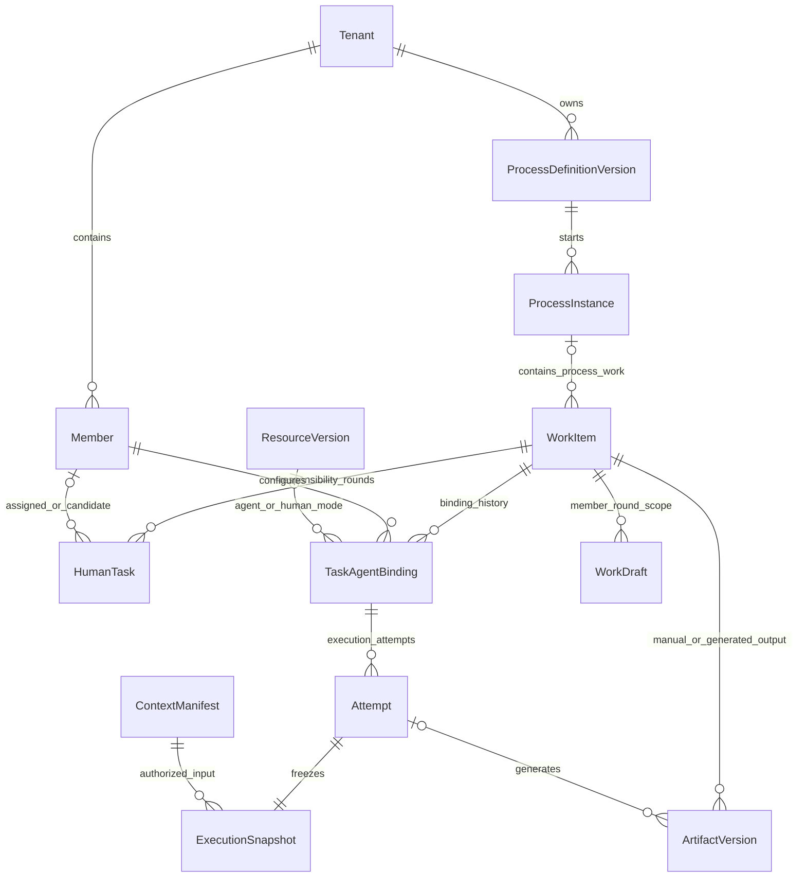
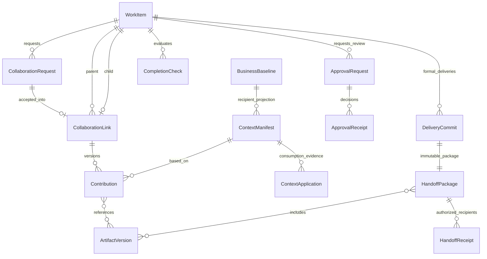
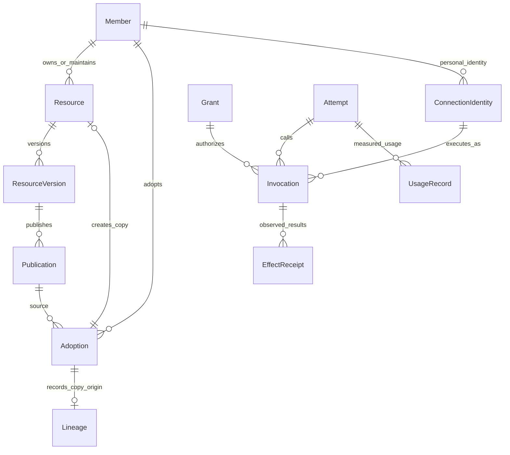
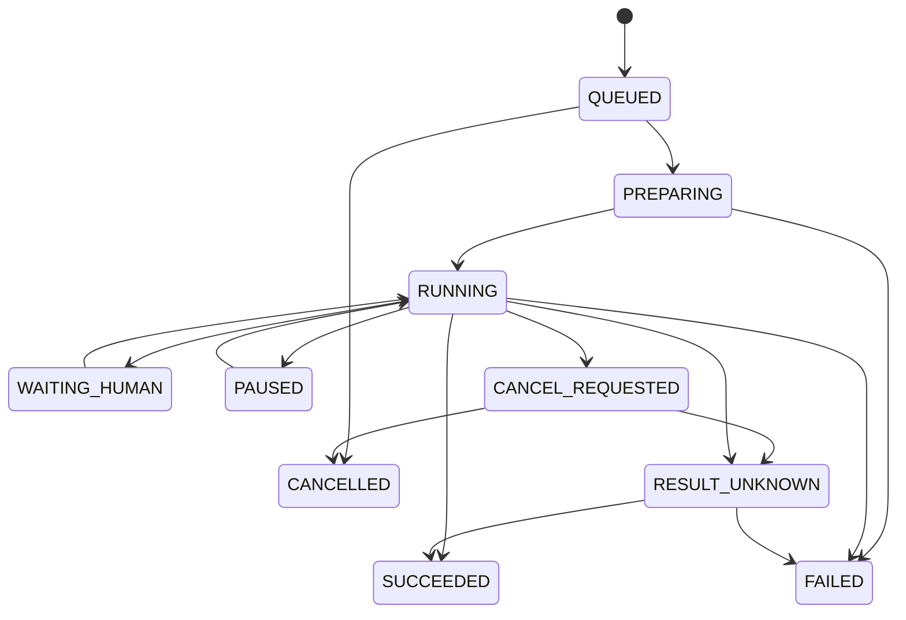

# OA数字员工协作平台 · 逻辑数据模型与接口契约

版本：1.3｜2026-09-11｜`PROPOSED_LOGICAL_CONTRACT_NOT_IMPLEMENTED`  
配套：[产品主文档](26-完整产品设计文档.md) · [验收用例](28-开发分期与验收用例.md) · [需求追踪](29-全量需求与角色追踪.md)。

本文的实体、字段、命令和枚举是新项目逻辑设计，不是在线数据库、已挂载URL或可直接执行的DDL。选定底座后优先映射等价对象和成熟机制；只有缺少业务事实时才扩展，不把本表逐项变成新物理表。旧[02号模型](02-数据模型与ER设计.md)、[04号接口](04-接口与契约变更设计.md)、[11号字典](11-存量合同字段字典.md)用于能力保留核对，其存量字段不代表本项目已经存在。

<a id="ownership"></a>
## 1. 事实归属与命名映射

| 逻辑对象/领域 | 唯一写入权威 | 允许的读模型 | 禁止的重复权威 |
|---|---|---|---|
| Tenant、Member、Organization、Role、Grant | 选定底座的身份、组织和授权模块 | 当前人员范围、资源可用动作 | 连接层另造账号/租户来源 |
| ProcessDefinitionVersion、ProcessInstance、HumanTask | 选定OA及其业务服务 | 实例摘要、统一待办、责任历史 | 连接层绕过OA直接修改流程终态 |
| WorkItem | 业务工作边界；引用底座任务/节点 | 工作区及协作汇总 | 第二份可单独修改的当前承担人 |
| TaskAgentBinding、ExecutionSnapshot、Attempt | 单一任务执行服务及选定运行适配层 | 配置、运行进度、当前就绪性 | 多个Agent loop重复调度同一次工作 |
| BusinessBaseline、ContextManifest | 有权业务人员确认的事实及按接收者投影 | 变化影响、必需输入状态 | 聊天摘要成为可独立改写的正式事实 |
| Contribution、DeliveryCommit、HandoffPackage | 业务连接层经权限与版本守卫落地 | 贡献卡、交付、接手摘要 | 从流式消息推断已批准或已交付 |
| ResourceVersion、Publication、Adoption | 各资源领域与市场采用服务 | 跨类型目录、我的副本 | 用泛型市场接口绕过技能/工具的策略 |
| Audit、Outbox、InboxEntry、Usage | 真实命令/事件、投影和原始用量 | 通知、计数、报表 | 以缓存、已读或前端估算改变业务事实 |

历史术语对应：SOPVersion→ProcessDefinitionVersion；AgentAssignment→TaskAgentBinding；ResultCommit→DeliveryCommit；ExecutionContextBinding语义并入ExecutionSnapshot与ContextManifest的精确引用；DSH→待选的单一运行链。映射表示保留业务语义，不要求替换旧源码或复制其服务拓扑。

HumanTask既可为主处理工作、独立协作工作，也可为审核工作。会签/加签参与者若由底座生成子任务，应保存真实任务引用及所属审批轮次。一个人可同时有多个HumanTask；当前任务承担人从底座权威记录读取。

<a id="er"></a>
## 2. 逻辑E-R图

### 2.1 人员、流程、工作与执行



WorkItem.scope=PROCESS时必须关联实例和真实节点/任务映射；AD_HOC时可无流程实例，但必须有目标、合法创建来源和人员责任。人工执行可有模式配置但不创建虚构Attempt；图中的Attempt一旦创建就必须关联唯一冻结快照。

### 2.2 协作、上下文、决定与交接



多对多关系必须有显式关联记录或校验过的版本引用集合。一个交付包可面向多个下游任务，每个接收任务有自己的投影与接收记录。没有下游的终节点仍保留归档包，可以没有HandoffReceipt。

### 2.3 市场、连接身份与运行回执



组织服务身份也可拥有ConnectionIdentity，必须有明确服务主体和使用范围。REFERENCE采用不创建副本，直接记录源版本的引用使用关系；COPY方式成功才要求localResourceId和Lineage。

<a id="fields"></a>
## 3. 公共类型、字段与约束

### 3.1 公共规则

| 类型/字段 | 规则 |
|---|---|
| ID | 服务端稳定标识；对接底座公开ID与内部ID时保留显式映射，禁止用姓名或显示单号作外键 |
| tenantId、actorId | 从可信认证与服务端成员关系取得；浏览器提供值仅作待校验引用，不能切换租户权威 |
| revision | 业务聚合的正整数并发版本；expectedRevision用于条件写入 |
| responsibilityEpoch | 人员责任/任务激活代次，转办、退回和重新激活递增；与表单版本分开 |
| VersionedRef | {kind,id,version,digest,purpose,required}；版本不可变，使用时校验存在、租户、读权与摘要 |
| digest | 新扩展建议sha256加算法前缀；规范化编码、字段排序和引用集合顺序固定，摘要不包含自身 |
| 时间 | UTC时间戳存储，显示用用户业务时区；日历日期用YYYY-MM-DD，不靠时间戳替代生日/费用日期 |
| money | 十进制字符串或底座精确Decimal与currency组合；不得二进制浮点计算正式金额 |
| secretRef | 仅受保护后端可解引用；普通响应只返回连接摘要/到期，不回传秘密 |
| allowedActions | 当前授权和状态的投影；客户端不能据旧值绕过服务端重验 |
| visibility | 对象/字段投影来自正式政策；不允许仅靠前端隐藏列实现保密 |

### 3.2 核心对象最小字段

下表“必需”表示该生命周期可执行阶段的要求；草稿可缺最终交付字段，但引用一旦存在须合法。

| 对象 | 必需字段/条件字段 | 关键约束 |
|---|---|---|
| ProcessDefinitionVersion | id, tenantId, definitionId, version, name, formSchemaRef, nodeRulesRef, status, digest, publisher/时间（发布时） | 同定义版本唯一；发布不可覆盖；全部节点策略可追溯 |
| ProcessInstance | id, tenantId, engineInstanceRef, definitionVersionId, businessNumber, title, initiatedBy, formSnapshotRef, status, revision, startedAt | 实例与模板版本固定；单号租户内按编号范围唯一；新业务意图可重复同日创建 |
| WorkItem | id, tenantId, scope, processInstanceId/engineNodeRef（PROCESS必需）, sourceIntentRef（AD_HOC必需）, objective, outputContractRef, status, revision | PROCESS与AD_HOC条件互斥；业务状态通过底座完成/关闭路径映射 |
| HumanTask | id, tenantId, engineTaskRef, workItemId, kind, responsibilityEpoch, state, candidatePolicyRef, assigneeMemberId（已指派时）, dueAt?, revision | 一轮主处理权原子分配；多人审核由独立真实任务表达；保留历史轮次 |
| WorkDraft | id, tenantId, memberId, workItemId, responsibilityEpoch, approvalRequestId? , draftKind, contentRef, revision, updatedAt | 唯一成员+工作+轮次+种类；审批草稿再按请求隔离；不分享私人草稿 |
| TaskAgentBinding | id, tenantId, workItemId, humanTaskId, configuredBy, responsibilityEpoch, mode, agentVersionRef?, teamVersionRef?, configVersion, configRef, state, revision | 人工模式不要求AI；AI模式必须有合格单体或团队；一个工作最多一个ACTIVE |
| ExecutionSnapshot | id, tenantId, bindingId, bindingVersion, workItemId, responsibilityEpoch, contextManifestId, contextDigest, resourceVersionRefs, policyRevision, authzEpoch, expiresAt, digest | 不可变；正式运行时全部闭包可解引用；受策略变化影响仍重鉴权 |
| Attempt | id, tenantId, bindingId, snapshotId, workItemId, attemptNumber, status, fence, operationId, startedAt?, endedAt?, checkpointRef?, revision | 每次尝试唯一；状态来自真实运行事件；旧fence拒绝提交 |
| BusinessBaseline | id, tenantId, scopeRef, version, confirmedFactRefs, requiredFactKeys, confirmedBy, confirmedAt, digest | 只含有权确认的业务事实；与一般消息水位分开 |
| ContextManifest | id, tenantId, workItemId, targetSubjectRef, purpose, baselineRef, sourceRefs, requiredFactKeys, policyRevision, expiresAt, digest | 未解析接收人的预览不能派发；引用集合按当前接收者投影 |
| ContextApplication | id, manifestId, attemptId（AI时）, consumerRef, state, observedSequence, appliedSequence, evidenceRefs, deliveredAt?, loadedAt? | loaded必须有可信运行证据；applied不大于observed；人员阅读记录不伪装成AI装载 |
| ArtifactVersion | id, tenantId, artifactId, version, storageRef, digest, mediaType, sizeBytes, ownerScope, workItemId, sourceAttemptId?, createdBy, createdAt | 版本内容不变；本机路径不能充当跨人交付对象；大小非负 |

### 3.3 协作、交付与市场字段

| 对象 | 必需字段/条件字段 | 关键约束 |
|---|---|---|
| CollaborationRequest | id, tenantId, parentWorkItemId, requesterId, recipientRef, objective, inputRefs, outputContractRef, dueAt?, requiredForParent, status, revision | 请求允许尚无子工作；必需性由父合同授权；拒绝/过期有处理回路 |
| CollaborationLink | id, tenantId, requestId, parentWorkItemId, childWorkItemId, baselineRef, requiredForParent, status, revision | 接受后才落地；子工作已有合法人员责任；禁止自指/循环，子项最多一个协作父项 |
| Contribution | id, tenantId, linkId, version, childWorkItemId, basedOnContextRef, artifactRefs, structuredResultRef, checkRef, status, submittedBy/At, decisionBy/At?, reason?, revision | 提交后内容不可变；至少一个合格产物或合同允许的结构化结果；接受不结束父任务 |
| ApprovalRequest | id, tenantId, workItemId, targetKind, targetRef, targetVersion, targetDigest, responsibilityEpoch, engineTaskRefs, ruleRef, status, revision | 专业审核/风险授权/流程审批分别有类型；参与者与模板规则固定到本轮 |
| ApprovalReceipt | id, tenantId, requestId, engineTaskRef, actorId, decision, reason?, targetDigest, decidedAt, idempotencyRef | 决定绑定目标版本；自批和迟到请求按策略拒绝；人工身份不可由Agent冒充 |
| CompletionCheck | id, tenantId, workItemId, targetRevision, baselineDigest, artifactSetDigest, contributionSetDigest, policyRevision, checks, result, createdAt | 检查目标变更就失效；每个检查有规则版本、结果和证据；客户端不能自报通过 |
| DeliveryCommit | id, tenantId, workItemId, responsibilityEpoch, expectedWorkRevision, baselineRef, binding/attempt/fence? , artifactRefs, contributionRefs, checkRef, approvalReceiptRefs, confirmedBy, committedAt, digest | 人工来源必须说明；AI来源闭包完整；同一轮正常提交最多一个有效结果，补充包另记关系 |
| HandoffPackage | id, tenantId, deliveryCommitId, version, structuredOutputRef, artifactRefs, baselineRefs, decisionRefs, unresolvedItems, nextActions, digest | 不可变；归档包不要求有下游，但有下游时必须可按接收者重投影 |
| HandoffReceipt | id, tenantId, packageId, targetWorkItemId, recipientId, packageDigest, status, missingRefs?, confirmedAt?, revision | 同目标与包重复接手幂等；不可读必需输入保持BLOCKED，不写成功时间 |
| Adoption | id, tenantId, actorId, resourceKind, sourcePublicationRef, sourceVersionRef, sourceDigest, mode, targetScope, operationId, status, localResourceId?, readiness, idempotencyRef | COPY完成必须有本人副本及Lineage；REFERENCE不伪造副本；操作结果与可用性分离 |
| Lineage | id, tenantId, localResourceId, sourceResourceId, sourceVersion, sourceDigest, adoptedBy, adoptedAt | 来源可追溯；新版本不静默覆盖副本；不保存源作者秘密 |
| ConnectionIdentity | id, tenantId, identityKind, ownerSubjectRef, provider, accountDisplay, secretRef, scopes, expiresAt?, status | 个人/组织服务/委托分别判定；引用本身不授予调用权 |
| Invocation / EffectReceipt | invocationId, tenantId, attemptId, actionVersionRef, identityRef, targetDigest, parameterDigest, authorizationRef, operationId, status；回执含externalRef、observedState、evidence、observedAt | 不确定状态与失败不同；外部目标及参数变化使旧确认不适用 |

### 3.4 其余领域对象保留

| 领域 | 最小逻辑对象与字段 | 关系与产品约束 |
|---|---|---|
| 技能/执行方案 | SkillVersion、PlanVersion：input/outputSchemaRef, parameters, dependencies, phases, failurePolicy, tests, digest | ResourceVersion的类型化内容；不再造第二套版本中心 |
| 知识 | KnowledgeSource、KnowledgeVersion、Citation：sourceRef, ingestionState, publicationState, locator, version, permissions | 文件/URL/系统引用可解析，检索与引用重鉴权 |
| 记忆 | MemoryVersion、ExperienceProposal：scope, owner, sourceRefs, validity, status, reviewer, retentionPolicy | 私人到共享需要明确发布；失效影响将来消费 |
| 团队 | TeamVersion、MemberSpec：coordinator, members, scopes, outputContract, budget, maxDepth, maxConcurrency | 子运行回到同一任务绑定；不产生额外自然人批准权 |
| 自动化 | Schedule：trigger, timezone, targetKind/ref, inputMapping, nextAt, endsAt, maxRuns, concurrency, dedupePolicy, catchUpPolicy, status | 每次触发有TriggerReceipt并重查权限，不带永久通行授权 |
| 渠道 | ChannelBinding、MessageRoute、DeliveryReceipt：externalConversationRef, memberMap, purpose, workItemRef, externalMessageId, state | 消息去重与身份验证；读消息不等于可执行任务 |
| 工作记录 | WorkThreadEntry：threadId, sequence, authorRef, entryKind, sourceRefs, visibility, contentRef | 消息、决定、贡献有类型；事实通过授权确认成为基线 |
| 用量 | UsageRecord：attempt/invocationRef, provider, units, unitKind, priceRef, costKind, amount, observedAt | 实测与估算分开，未知费用不置零 |
| 通知 | Notification、ReadState：recipient, sourceEventId, taskRef, targetVersion, deliveryState, readAt, resolvedAt | 处理、投递、阅读互相独立 |
| API/设备 | ApplicationGrant、DeviceBinding：subject, capabilities, scope, validity, health, revocationEpoch | 调用与配对只在具体范围生效；设备离线不伪报执行 |

### 3.5 业务表单与UI字段绑定

[24号候选](24-业务模板字段候选.json)保留4类17字段，以下转换为业务设计要求，不声称为客户完整表单或当前后端字段。

| 模板 | 字段与控件 | 类型/校验与权威来源 |
|---|---|---|
| 采购 | 采购项目、申请预算金额、币种 | projectRef或受控名称；amount精确正数≤2位小数（该样例）；currency取模板枚举 |
| 合同 | 关联合同事项、合同相对方、合同类型、含税合同金额、币种 | 对象选择或受控文本；示例仅服务/采购合同；无金额协议须扩展模板条件 |
| 报销 | 报销人员、费用类型、费用发生日期、申报报销金额、币种 | claimantMemberId来自目录；日期真实且不晚于业务今日；费用类型取模板枚举 |
| 人事 | 交接人员、原任职岗位、接收岗位、交接生效日期 | 人员/岗位稳定ID和有效任职检查；日期变更影响交接任务 |

样例金额仅CNY；多币种、税率、发票明细、采购明细、证明材料、合同条款、付款安排等由企业模板补齐，不能把17项当作通用企业全部字段。文本长度、金额上限与日期边界由模板Schema和服务端共同执行；旧原型的固定业务日期与虚构姓名不能进入生产值。

| UI位置 | 显示字段 | 来源与读写 |
|---|---|---|
| P01队列 | businessNumber, title, nodeLabel, relationship, dueAt, taskState, instanceState, allowedActions | InboxEntry授权投影，只读；动作回到权威任务命令 |
| P02工作详情 | workItemId, humanTaskId, responsibilityEpoch, objective, outputContract, nextRecipient, revision | 工作与底座任务关联；表单只写当前允许字段 |
| P04配置 | mode, agentVersionRef, skillParams, knowledgeRefs, identityRef, workspaceRef, budget | 服务端候选和配置解析；显示名称、提交版本引用 |
| P16审核/交付 | targetDigest, checkResults, approvalState, artifactRefs, unresolvedItems | 当前目标与真实检查/决定；审核决定独立命令 |
| P20上下文 | baselineRef, sourceRefs, condition, applicationState, evidenceRefs | 业务基线和消费证据；人员只能确认阅读或提出纠正 |
| P22市场 | resourceKind, version, readiness, allowedActions, origin, missingRequirements | 各类型资源投影；客户端不能自行设READY或发布状态 |

<a id="states"></a>
## 4. 生命周期与状态转换

以下为统一产品状态语义；选定底座后建立完整枚举映射。UI可合并显示但不能丢失原因，连接层不能另设流程执行权威。

### 4.1 流程、工作和绑定

| 对象 | 允许的核心转换 | 条件/禁止转换 |
|---|---|---|
| 模板版本 | DRAFT→IN_REVIEW→PUBLISHED→RETIRED；评审退回DRAFT | 发布后内容不可改；恢复使用通过明确版本政策 |
| 实例 | RUNNING↔SUSPENDED；RUNNING→COMPLETED / CANCELLED / TERMINATED | 仅OA权威按任务和分支规则结束；阻塞原因不一定等于SUSPENDED |
| HumanTask | AVAILABLE→ASSIGNED→IN_PROGRESS→COMPLETED；未终态可CANCELLED/SUPERSEDED | 领取原子；退回/重激活建立新轮次，不把旧已完成记录改回待办 |
| WorkItem | READY→IN_PROGRESS→AWAITING_REVIEW→READY_TO_COMMIT→COMMITTED | 无审核合同可直接到READY_TO_COMMIT；退回用新轮次；仅经正式提交完成 |
| WorkItem异常 | 未终态可CANCELLED；资料条件可单独BLOCKED/NEEDS_RECHECK | 不用一个FAILED同时表达AI失败和业务取消；已交付需返工/补充流程 |
| TaskAgentBinding | DRAFT→ACTIVE→SUPERSEDED / REVOKED / CLOSED | 激活依赖当前人员责任；新绑定使旧绑定不再有效，不删历史 |

转办使旧HumanTask或底座等价责任记录失效，新任务/责任代次接续；如何使用底座任务ID由其合法机制决定，但对外必须能拒绝旧责任代次命令。WorkItem不维护第二份独立assignee字段。

### 4.2 运行与上下文



暂停/恢复边仅在运行器确实支持并确认时开放；PREPARING、WAITING_HUMAN、PAUSED也允许请求取消或因权限/期限失效失败，需保留实际原因。RESULT_UNKNOWN只能通过查证转确定结果，不通过猜测处理。SUCCEEDED仅为技术状态；工具未知效果也可独立阻塞业务提交，即使运行器已结束。

ContextManifest发布为不可变记录。其当前可用性投影为VALID、NEEDS_RECHECK、MISSING_REQUIRED、CONFLICT、REVOKED、EXPIRED；此投影不改快照内容。ContextApplication为PREPARED→DELIVERED→LOADED，之后可UPDATE_REQUIRED/BLOCKED/REVOKED；新输入用新快照和新尝试，除非选定运行器提供经验证的显式版本重绑定协议。

### 4.3 贡献、审批、交接和采用

| 对象 | 转换 | 必须保留的语义 |
|---|---|---|
| 协作请求 | REQUESTED→ACCEPTED/DECLINED/EXPIRED/CANCELLED | ACCEPTED后建立真实子工作与Link；拒绝原因可回到主任务 |
| 贡献 | DRAFT→SUBMITTED→ACCEPTED/RETURNED；SUBMITTED或ACCEPTED可NEEDS_RECHECK | 修改生成新版，旧版SUPERSEDED或WITHDRAWN；贡献终态不代表父项完成 |
| 审批请求 | PENDING→APPROVED/REJECTED/RETURNED；可因目标变化OBSOLETE或取消CANCELLED | 目标版本和本轮参与者一致；已发生决定记录不删除 |
| 交接接收 | PENDING→ACCEPTED；PENDING→BLOCKED→PENDING；未接收可CANCELLED | 包可读性/责任满足才接受；读通知不是接收 |
| 市场采用操作 | PENDING→COMPLETED/FAILED/RESULT_UNKNOWN；UNKNOWN经查证确定 | COMPLETED表示采用结果确定；READY另判，不能混成已运行 |
| 资源就绪性 | READY/NEEDS_AUTHORIZATION/NEEDS_CONFIGURATION/NEEDS_PUBLICATION/INCOMPATIBLE/WITHDRAWN | 状态由实际缺项投影，可同时返回多条原因；任务适用性另判 |
| 外部调用 | PREPARED→WAITING_CONFIRMATION?→DISPATCHED→SUCCEEDED/FAILED/RESULT_UNKNOWN | 参数与目标变化使确认失效；UNKNOWN查证前不得盲重派 |

审核业务默认：主执行人确认候选并送审→独立人员决定→主执行人正式提交。审核节点自身的任务完成由底座办理，ApprovalReceipt只是其决定关联；不得再运行一个与底座竞争的审批循环。最终提交校验该决定仍适用于同一版本。

<a id="commands"></a>
## 5. 应用命令与读取契约

### 5.1 通用请求/响应

命令名是设计标识，不是已上线的REST路径。选型后映射底座已有服务和端点；必要扩展统一使用其认证、错误信封和审计。以下公共字段作用不能省略，但线格式按底座保持一致。

```json
{
  "command": "submitDelivery",
  "target": {"workItemId": "work-example-A", "humanTaskId": "task-example-A"},
  "expectedRevision": 7,
  "responsibilityEpoch": 2,
  "idempotencyKey": "example-one-business-intent",
  "payload": {"checkRef": "check-example-current", "candidateVersion": 3}
}
```

示例ID仅说明结构，不可作为可调用数据。真实服务端从会话解析tenant与actor，读取目标对象和可信检查记录，不接受客户端“已批准/已装载/已完成”的自述。

响应至少有requestId、operationId（异步时）、对象引用、revision、权威业务状态、当前allowedActions及可见恢复原因。异步受理不代表业务成功；HTTP 202返回查询位置或等价操作引用。HTTP 200仍须核对业务结果，不能返回失败的“成功空列表”。

### 5.2 核心命令目录

| ID / 命令 | 输入核心 | 输出与业务副作用 | 服务端守卫与负例 |
|---|---|---|---|
| C01 listInbox/getWork | 类别、合法筛选、cursor、limit；或精确工作引用 | 授权列表/详情、同口径计数、sourceWatermark、nextCursor | 不在无权标题/字段上搜索；投影落后有标识；动作前回权威源 |
| C02 startProcess | 可发起模板版本、表单、业务意图、幂等键 | 单号、实例、首批任务；写底座流程与发起事实 | 发布/发起资格、表单规则、请求摘要；同键异载荷冲突 |
| C03 claim/release/transfer/delegateTask | 任务、版本、责任代次、目标人/范围/期限、理由 | 真实责任变更、新代次/任务、绑定失效事件 | 当前资格与状态；原子竞争；委派不默认转永久责任 |
| C04 saveDraft/saveTaskBinding | 工作/任务、轮次、版本、允许字段或配置引用 | 草稿/配置版本及有效解析差异 | 仅本人当前责任；跨任务字段拒绝；保存不派发 |
| C05 previewContext/eligibleResources | 当前工作、候选配置、目的 | 所需事实、版本、缺项、来源、可用性 | 只读预览不授予将来使用权；无权依赖不泄露 |
| C06 startAttempt | 当前绑定/版本、任务代次、期望工作版本、幂等键 | 快照、尝试、排队位置/事件观察入口 | 重算资源、输入、身份、预算及期限；冻结后派发 |
| C07 controlAttempt | 尝试、命令、checkpoint?、版本和理由 | 取消请求/暂停/恢复结果、确定状态 | 能力真实支持；旧绑定停止写；恢复前查证未知效果并重授权 |
| C08 request/accept/declineCollaboration | 父工作、接收人、目标、输入、交付、期限、必需性；请求版本 | 请求或合法子工作与Link；人员通知 | 父合同、候选资格、接收者；禁止自指/循环和未授权必需门 |
| C09 submit/decideContribution | Link、子工作、版本、依据、产物、检查；accept/return及理由 | 不可变贡献版本、接受/退回记录 | 主子关系、当前承担人、基线有效、检查正确；不关闭父工作 |
| C10 requestReview/decideReview | 目标成果版本/摘要、本轮规则；请求、决定、理由 | 底座审核任务及有效回执、当前审批状态 | 自批/旧版本/非本轮人拒绝；会签规则固定 |
| C11 evaluateCompletion/submitDelivery | 工作版本、轮次、依据、贡献、产物、检查、批准、运行fence或人工来源 | 检查结果；正式交付、包、业务推进操作引用 | 当前读权、版本、成果、批准和副作用一致；结果未知先查 |
| C12 receiveHandoff | 包版本/摘要、接收工作、责任人、期望版本 | 可读性与接手记录 | 当前接收责任、必需引用可解析；重复不多建任务 |
| C13 list/preview/adoptMarket | 类型、源发布版、模式、本人目标、当前任务?、幂等键 | 授权目录、预检、采用操作、副本/引用、Lineage及缺项 | 各类型独立授权；副本不含秘密；REFERENCE不伪装COPY |
| C14 queryOperation/reconcileEffect | operationId或已获权的外部动作引用 | 确定结果/查证进度/人工核对事项 | 对象授权、外部证据和去重；不能仅按超时判失败后重发 |
| C15 readNotification/remind/withdraw | 精确接收项或实例任务、版本、意图、理由 | 阅读态、限流通知或撤回/补偿操作 | 已读不办理；催办限准确未决任务；撤回检查外部效果 |
| C16 propose/confirmBusinessFact | 工作、来源、旧基线、新事实、范围、理由 | 建议/新确认基线、受影响工作集合 | 有权确认者；版本冲突不覆盖；普通聊天不触发全局重核 |

### 5.3 全域扩展接口族

| ID | 能力与最小契约 | 复用及验收边界 |
|---|---|---|
| C17 | 数字员工/技能/方案草稿、测试、发布、停用、导入导出、版本Diff、批量推广 | 输入资源版本和内容摘要；返回操作/测试/发布事实；草稿不伪装已发布，升级不改在途 |
| C18 | 工具发现、连接身份、健康、授权引用、撤销和调用确认 | 输入精确动作/身份/范围；返回脱敏状态；秘密只在受保护服务端 |
| C19 | 知识导入/加工/检索/发布/引用，记忆搜索/纠正/失效/分享提案 | 固定来源、版本、作用域；撤权缓存不继续读；无答案明确返回 |
| C20 | 文件上传完成、解析、授权预览/下载、版本比较与合并 | storageRef及摘要校验；上传请求成功不表示解析成功；合并版本可审阅 |
| C21 | 团队配置、成员子任务、执行轨迹、汇总、替换与接管 | 父尝试、成员版本、预算/深度/并发限制；统一完成合同 |
| C22 | 自动化创建/预览/测试/暂停/恢复/触发接收 | targetKind明确；时区/补跑/去重策略与TriggerReceipt；使用时重鉴权 |
| C23 | 渠道身份绑定、任务路由、专家咨询、消息回执、A2A/API事件接收 | 接收者/会话/任务映射；来源认证、防重放；审批仍走人员决定 |
| C24 | 任职/身份/角色/资源授予、撤权影响、离岗交接、数据处理请求 | 精确动作和期限；管理域分别授权；保留冲突形成任务不吞异常 |
| C25 | 运行健康、用量对账、审计、设备配对、恢复与脱敏导出 | 业务关联、来源与scope；设备权限及诊断权限独立；无数据不造数 |
| C26 | 流程草稿/预检/预览/评审/发布、版本和在途影响 | 复用底座设计器和状态；表单/人员/资源/下游映射一致 |

### 5.4 错误语义与恢复

| 语义 | 建议HTTP等价 | UI行为 |
|---|---|---|
| 未认证 | 401 | 重新登录后回精确工作，重查权限；不重发未知写命令 |
| 禁止/隐藏存在性 | 403或统一404，按当前政策 | 显示不可访问，不暴露名称/统计；合法已知对象可给可见原因 |
| 输入不合法 | 400/422 | 定位字段，保留可恢复草稿 |
| 版本/责任/上下文冲突 | 409或条件请求412 | 返回授权差异与当前版本；刷新比较，不能无条件覆盖 |
| 缺必需输入/依赖 | 底座业务错误码，显式MISSING_REQUIRED/RESOURCE_UNAVAILABLE | 定位缺项、配置或联系有权人员；不要伪空态 |
| 限额/容量 | 429及可用Retry-After或排队受理 | 展示等待/预算原因，不能退避中重复扣费 |
| 服务不可用 | 503 | 保留目标和意图；读取可重试，写入先查operation |
| 已受理/结果未知 | 202或底座等价异步信封 | 显示待确认、operation查询与恢复入口，不能标业务成功 |

<a id="consistency"></a>
## 6. 并发、幂等、事件与事务边界

### 6.1 必需约束

- 所有跨对象引用验证同租户，使用复合外键或可证明的等价约束。缓存键含租户、主体、对象、投影及策略版本。
- 幂等唯一范围为(tenant, actor, command, idempotencyKey)，存请求摘要和确定结果。命令版本变化不能将同意图当新事务；过期保留期要覆盖外部查证窗口。
- 人员任务领取使用原子条件更新或底座锁。绑定ACTIVE唯一约束以tenant+workItem为范围；转办和运行前均核责任代次。
- 贡献内容版本按Link递增；Lineage固定源版本；交付与交接不可变。已交付工作修订必须有明确补充或返工关系。
- 提交同时验证workRevision、responsibilityEpoch、bindingVersion、attemptFence、baselineDigest、artifactSetDigest、检查及批准适用性。人确认不能绕过已失效的工具/资料授权。
- 按任务分配工作目录与外部动作idempotency键。取消A不能影响B；预算按尝试、实例和租户对账，预留失败释放但不抹已实际消耗。

### 6.2 核心事务

| 事务 | 同一可靠边界内应完成 | 边界外与恢复 |
|---|---|---|
| 接受分工 | 请求状态、合法子工作引用、人员责任和Link、事件 | 若底座不能同库事务，使用可查询操作状态；不得存在显示可运行的无主子工作 |
| 冻结执行 | 当前绑定/责任验证、快照、Attempt、派发Outbox及预算预留 | 派发失败恢复同Attempt或明确新尝试，不能重复扣预算 |
| 接受贡献 | 当前基线与父/子版本校验、贡献决定、有序事件 | 更新通知/待办失败不丢决定；重新投影 |
| 正式提交 | 完成检查适用性、DeliveryCommit、HandoffPackage、业务完成事件 | 下游任务通过底座单次办理创建；重复投递不重复激活 |
| 市场采用 | 幂等操作、各类型个人副本/引用和Lineage | 依赖处理部分失败保留进度；不重复副本或共享秘密 |

若OA与连接层同库且底座提供合法事务服务，优先复用其原子边界；若跨服务无法原子提交，使用明确的PENDING_COMMIT操作、Outbox和回读对账。UI在底座尚未确认完成时显示“交付已受理/同步中”，不能提前显示节点已完成。只在查询得到权威完成及匹配交付事实后转为已提交。不得宣称分布式严格exactly-once，验收业务效果幂等和可恢复性。

外部系统写入不纳入本地数据库原子事务。若目标支持幂等键或业务查询则携带并查证；不支持时限制自动重试，形成未知效果核对任务。补偿为新的有权动作，不覆盖原回执。

### 6.3 事件合同

公共字段：eventId、eventType、tenantScope、aggregateType/id、aggregateSequence、sourceRevision、occurredAt、correlationId、causationId、schemaVersion，以及最小业务引用。业务内容按消费者权限投影，事件总线不广播私人正文或秘密。

必须覆盖：实例/人员任务创建与变化、绑定失效、尝试状态、工具效果、事实确认、依赖失效、贡献提交/决定、审批创建/失效/决定、正式交付、交接接收、资源撤销、通知和用量。消费者按(source,eventId)去重并验证序号；发现缺口从权威源补齐，旧事件不能倒退投影。

SSE/WebSocket只负责观察，使用恢复水位及当前快照；重连不得重复调用C06或C11。使用底座现有事件机制即可，不因本设计另外安装事件平台。

<a id="implementation"></a>
## 7. 选型后的开发合同冻结清单

1. 给上述每个逻辑对象记录底座对象/表/服务、来源版本、扩展字段与唯一状态权威；重复对象先合并设计。
2. 给C01—C26映射实际路由、认证、权限动作、请求/响应Schema、状态码、前端消费者和测试；未映射不得宣称接口已接通。
3. 建立数据库约束和事务矩阵、事件版本、时间/金额规则、索引及附件存储映射；实测各跨服务失败窗口。
4. 将41角色视角和44历史角色键映射底座职责、数据范围和对象关系；不得简单以一个ADMIN放行全部管理面。
5. 针对153项保留源需求与原验收，新增本项目实现位置与证据；旧端口和框架修复要求转换为等价可运行行为，不强制回到旧栈。
6. 新Schema标版本，旧数据确实不能还原的字段标未验证，不编造上下文已装载、批准或历史交付。数据库迁移与真实凭据操作属于后续独立实施范围。

本文可用于研发评审、接口细化与测试设计；在上述映射完成前，不应作为可直接执行的迁移脚本或已冻结的线上API规格。

<a id="ai-contracts"></a>
## 8. 全产品AI融合的增量合同（v1.1）

新增AI-01—AI-12复用前述人员任务、资源版本、权限和运行链。以下为必要的逻辑关联，不强制新增同名表、图数据库或独立AI后台。产品说明见[26号第15章](26-完整产品设计文档.md#ai-experience)，研究依据见[33号](33-QoderWake与StaffDeck融合及AI体验研究.md)。

### 8.1 对象与最小字段

| 对象 | 关键字段 | 权威及限制 |
|---|---|---|
| ConfigProposal | id, tenantId, actorId, targetRef/version, purpose, proposedFieldChanges, reason/sourceRefs, scope, missingRequirements, expiresAt, state | 引用当前配置，不存第二份权威配置；最终采用调用C04或原对象命令并重验 |
| AnalysisPlan / AnalysisResult | id, actorScope, question, metricDefinitionRef/version, grain, timeField/range/timezone, filters, authorizedSourceRefs, queryPlanRef/digest, snapshotWatermark, limit/timeout, resultRef, citations, state | 复用受限查询服务；前端/模型不得执行任意写SQL；原始数据为事实，生成结论为解释 |
| BusinessEntityView | sourceSystem, sourceType, sourceId/version, displayFields, schemaMappingVersion, visibility | 来自已有主对象的投影；不复制第二份可独立写的人、项目、产品或流程表 |
| KnowledgeAssertion | id, fromRef, relationType, toRef/value, sourceVersionRefs/locators, method, validFrom/To, status, confirmedBy/At?, supersedesRef?, digest | CANDIDATE不是已确认事实；确认也不授予改变源任务/批准/权限的权力 |
| ProactiveOpportunity | id, recipientRef, workItemRef?, sourceEvent/version, ruleVersion, reason, priorityBasis, proposedAction/target, expectedOutput, dedupeKey, cooldownUntil, state | 授权事项的建议投影，不是新流程任务权威；处理状态不改变业务完成 |
| BoundedActionScope | subject, targetScope, actionSet, validity, maxRuns, budget, riskPolicyRef, stopConditions, grantRef | 优先作为已有Grant/自动化策略的用途限制；不另造绕开权限系统的“AI授权” |
| EvolutionProposal | id, sourceFeedbackRefs, baseResourceVersion, candidateVersion, diff, intendedEffect, scope, evaluationRef, reviewerRef, trialRef, publishRef, rollbackRef, state | 原资源版本领域的改进提案；不得改核心安全或越权政策 |
| EvaluationReport / TrialReceipt | baseline/candidate/model/toolVersionRefs, caseSetVersion, lawfulSampleScope, metricDefinitions, rawResults, regressionGates, reviewer, trialAudience, timeWindow, actualResults, stopReason? | 结构检查与业务对照评估分开；未执行不可写PASS，试用不污染在途快照 |
| RecoveryWork | existingWorkItemRef, existingHumanTaskRef, failureKind, sourceOperationRef, affectedRefs, assignedResolver, fallbackOwner, requiredAction, dueAt, resolutionEvidenceRefs, state | 复用底座异常/人员任务kind，不建立平行工单平台；执行恢复后重跑原命令守卫 |

知识实体、边、路径、关系计数与分析聚合均按当前主体过滤。缓存键至少关联主体授权范围版本、来源版本和查询计划摘要；授权撤销不能仅删页面缓存而继续从图/搜索/下载接口返回内容。

### 8.2 状态与采用

| 对象 | 路径 | 退出/恢复 |
|---|---|---|
| 配置建议 | PREPARED→EDITED?→ACCEPTED / REJECTED；来源变更STALE | 部分采用记录实际字段集；并发冲突保留草稿；低风险本人偏好可直接应用并撤销 |
| 分析 | NEEDS_CLARIFICATION?→PLAN_READY→EXECUTING→READY / NO_DATA / FAILED / UNAUTHORIZED | 来源变化STALE；先修正口径/授权/查询后新执行，不把失败写为零 |
| 知识断言 | CANDIDATE→CONFIRMED / REJECTED；确认后可SUPERSEDED / REVOKED / EXPIRED | 来源冲突交口径负责人；新确认版本不改历史引用 |
| 主动机会 | DETECTED→OFFERED→ACCEPTED / DISMISSED / SNOOZED；可EXPIRED / OBSOLETE | ACCEPTED仅接受建议，执行另建/关联合法Attempt；忽略不关闭业务待办 |
| 进化 | DRAFT→EVALUATING→EVALUATION_FAILED / IN_REVIEW→TRIAL→APPROVED→PUBLISHED | 各阶段可REJECTED/STOPPED；发布后回退旧版本，保留新旧评估及实际影响 |
| 异常恢复任务 | OPEN→IN_PROGRESS→RESOLVED / REASSIGNED / CANCELLED | RESOLVED要求原始问题已查证且原操作重新校验；无法自动消除标BLOCKED并升级 |

### 8.3 命令增量

| ID | 输入 / 输出 | 关键守卫 |
|---|---|---|
| C27 proposeConfig/applyProposal | 当前对象及版本、意图→字段级建议/来源/Diff；选择字段→同一原命令结果 | 不可借AI修改不可写字段；部分采用重新校验组合；不复制秘密，保存不运行 |
| C28 planAnalysis/executeAnalysis/readResult | 问题、当前业务作用域→可读口径/计划；有效计划→只读结果/引用/快照/限制 | 数据源与列权限、只读凭据、查询AST/计划验证、限额、超时；参数化查询，禁止任意执行模型SQL |
| C29 suggestRelations/confirmAssertion/readRelated | 授权资料引用→候选实体关系；人工决定→版本断言；对象→授权关系/来源 | 确认人有资料/口径维护权；不能通过写图更新源任务；路径与计数同样受ACL约束 |
| C30 list/accept/dismissOpportunity | 当前收件人/工作范围→建议；决定及源版本→计划/草稿或合法执行引用 | 去重、冷却、任务当前状态、有限Grant及次数/预算；已过期建议不可继续执行 |
| C31 propose/evaluate/trial/publishEvolution | 基线、候选、合法样本与指标→评估；已验证提案→限定试用/发布/回退记录 | 对照结果真实、业务/安全无退化、当前发布权及必要独立复核；不能只凭结构校验自动发布 |

C27—C31与C01—C26共用幂等、授权、错误与审计。只读或草拟成功不自动办理后续写动作；适用范围变化必须重新确认或按已有精确授权规则判定。

### 8.4 异常责任与恢复事务

发现必需资料不可读、来源冲突、无处理人、外部结果未知或AI建议不可用时，原工作保留准确阻塞原因，使用底座现有人员任务形成有接收人的恢复工作。路由建议：资料问题→资料/口径维护人；连接问题→本人或连接维护人；责任缺口→节点责任人/派工管理员；未知外部效果→当前承担人/被授权运维；质量退化→资源维护者和评审人。

当前未解析到合法处理人时，进入工作流管理员的“待分配异常”，显示来源及缺口并可重新解析，不能标记为已派工。修复动作重查权限，不因收到恢复任务自动拥有数据读取或授权管理权。重复异常按工作+来源+失败类型+有效版本去重；源版本变化时更新关联，不能无限建新单。

恢复完成必须带证据并重算受影响原工作的当前资格；已发生新变更则重新核对，不自动恢复旧Attempt或复用旧批准。结束恢复任务不等于原业务任务完成。


<a id="workspace-contracts"></a>
## 9. 人员展示投影与后台输入授权（1.2增量）

[34号工作台设计](34-任务执行工作台与权限分层设计.md)规定通用权限维度。此处是既有命令的读投影与输入解析细化，不增加第二身份、授权、流程或执行系统。

| 逻辑记录 | 必需字段/关联 | 约束 |
|---|---|---|
| WorkspaceView（只读） | subjectRef, tenantRef, instanceRef, workRef, taskRound, purpose, policyRevision, requestGeneration, visibleNodes/edges, allowedActions | C01返回；边和数量已过滤，无权正文/文件名/摘要/URL不返回 |
| NodeDisplay（只读） | nodeRef, authorizedMetadataFields, lifecycleState, attemptRefs?, visibleArtifactRefs, visibleSummaryRefs | discover、path、summary、content分别判；问号项无权即省略，不返回空数组暗示隐藏数目 |
| ContentView（只读） | authorizedVersionRef, allowedFields/fragments, provenanceDisplay, viewScope, expiresAt, allowedActions | C20/C15读取；同名文件、历史版本、下载及导出分别授权；失效后重读 |
| ExecutionGrant（复用Grant） | executionSubjectRef, grantedBy, workRef, purpose, inputRefs/fields, allowedDestinations, actions, expiresAt, limits, outputPolicyRef, revision | 有权来源授予；用户操作不能自行扩大；服务主体对精确任务生效，不能代替人员审批 |
| Summary/ResultRelease（复用产物版本与批准/交付关联） | sourceVersionRefs, resultVersionRef, classification, recipientScope, purpose, approvedFields, checks, decisionRef?, policyRevision | 默认继承来源限制；跨范围发布需要明确政策及必要决定；发布摘要不改变源ACL |

默认人员助手的输入取本人已有使用授权；若存在合法ExecutionGrant，受限工作由其指定的执行主体读取。VersionedRef、ContextManifest和使用时授权的“主体”必须区分：人员预览用当前人员主体，后台解引用用实际执行主体与该精确用途。后台快照不能作为人员API响应；所有源限制、用途和当前任务守卫继续适用。

| 既有命令 | 此次补充 |
|---|---|
| C01 任务/工作读取 | 返回WorkspaceView，按可信subject和当前关系过滤节点、连接、字段与allowedActions |
| C05 上下文预览 | 仅返回人员可读预览或获准的“后台输入条件已满足”元数据；不返回受限输入及私有来源名称 |
| C06/C07 开始/控制执行 | 校验ExecutionGrant当前版本、用途、工作和期限；撤销后停止新读取，标记在途尝试不可发布，恢复前重新核验 |
| C09—C12 贡献/审核/交付/接手 | 用来源分类和发布接收范围检查候选结果；已有批准仅适用同一结果版本与当前有效政策 |
| C15/C19/C20 消息/知识/文件 | 人员读取、摘要生成、搜索片段、缩略图、预览、版本和下载各自校验；不能客户端全文脱敏 |
| C24/C25 权限/运维 | 发布撤权影响与最小事件元数据；诊断受独立授权约束，不通过日志开放业务输入 |

受限上下文由专用、目的限定的运行消费，人员可交互助手仅获得可发布的结果。输出检查在流式片段、错误文字或文件进入人员通道之前执行；文本提示或敏感词过滤不能单独充当权限机制。发布失败保持受限候选并复用既有恢复任务。

缓存/订阅键至少含租户、主体、工作、任务轮次、用途、策略版本。切换对象增加requestGeneration；旧回包/旧事件丢弃或触发权威回读。撤权清理当前预览、客户端缓存、消息摘要和短期文件地址；禁止离线缓存继续证明权限有效。明确区分：对象不可发现、内容无权、版本失效、网络错误、后台输入不可用、结果发布受阻，向用户只给允许披露的错误与恢复方式。

人员内容撤权不自动等同后台授权撤销；后台授权撤销不自动等同人员内容撤权，分别从正式策略判定。已被外部模型消费或已发生的外部效果无法保证收回，保留证据并走原有查证/补偿。申请共享结论仅创建现有授权/交付请求草稿，不会改变授权。

<a id="ai-ux-contracts"></a>
## 10. AI 体验状态补充（1.3，复用既有对象与 C27—C31）

这些字段是前述逻辑对象的补充约束，物理实现待底座映射，不新增第二套任务、身份或流程状态源。

| 既有对象 | 必需补充与守卫 | 用户结果与恢复 |
|---|---|---|
| ConfigProposal / 本人偏好 | baseRevision、selectedFieldPaths、before/after、明确scope；应用同时检查对象版本与动作授权；撤销引用原变化及expectedRevision | 保存和启动分开；冲突返回当前版本与可披露差异，保留本人草稿；撤销不能覆盖其他后续修改 |
| AnalysisPlan / AnalysisResult | grain、metricVersion、timezone、window、snapshotAt、sampleCount、queryStatus、sourceRefs、authorizedProjection；图表和明细同源 | 有样本且目标0可以显示0；无样本比率为—；无权/超时不返回伪0；来源、口径、授权变化后废弃旧结果 |
| KnowledgeAssertion | sourceVersion、reviewedBy、reviewedAt、status与release状态分开；来源可读和确认该断言是不同动作 | 看过当前来源不是唯一授权依据；核对后仍须按接收者发布；拒绝或来源变化保留历史、撤回可复用状态 |
| ProactiveOpportunity | 去重包含recipient、task、rule、sourceEvent/version；accepted关联原草稿/运行而不新建业务实例；dismiss/snooze与业务状态分开 | 同事件不反复提示；新重要事实可形成新机会；任务结束或责任/授权到期则失效 |
| 已有自动化计划/一次执行 | plan状态与run状态独立；时区、起止、次数、预算、授权范围、错过周期策略、停止条件明确；计划修改带版本 | 暂停新触发不声称当前运行已停止；取消须等回执；未知副作用先查证再恢复 |
| EvolutionProposal | baseline/candidate/testSet/model/tool/policy版本及Diff固定；结构检查、业务评估、独立复核、试用回执分别记录 | 无业务证据不得发布；任何影响评估的版本变化使评估失效；发布更改未来默认，回退不撤销历史外部效果 |
| 页面协助草稿 | 绑定subject、tenant、task、page、sourceVersion与policyRevision；提交前再次验证 | 跨人/跨实例不得混入私有草稿；撤权清理缓存并拒收旧异步响应，重新授权也不得恢复旧投影 |

控制面权限不隐含上述正文、源记录、反馈样本读取权；业务聚合也属于输出资源。接口错误沿既有403/409/缺输入/超时/结果未知等语义返回，不用统一“成功”吞掉差异。AI不能自由提交SQL、绕过动作白名单，或用“确认知识”修改企业源记录。

原型是同步内存夹具：复现部分字段和守卫，但没有实现服务端鉴权、异步竞态、持久化或真实计划运行。完整目标见[35号](35-全产品AI体验复核与改进.md)，原型验证见[AI体验检查](../../validation/ai-experience-check.json)。
