# 业务流程图、原型图与断点闭环审查

版本：1.3｜2026-09-11｜状态：`DESIGN_AND_PROTOTYPE_REVIEW`  
主入口：[完整产品设计](26-完整产品设计文档.md) · [逻辑模型/状态/接口](27-逻辑数据模型与接口契约.md) · [验收方案](28-开发分期与验收用例.md) · [可交互原型](31-完整产品交互原型.html) · [AI体验研究](33-QoderWake与StaffDeck融合及AI体验研究.md)。

本文件把关键人员流程、异常恢复和AI体验画成图，并逐项记录设计断点及其处理出口。图是目标设计；截图来自本次真实浏览器渲染的内存原型，不是新产品后台、模型或客户业务验收。

## 1. 产品业务总流程

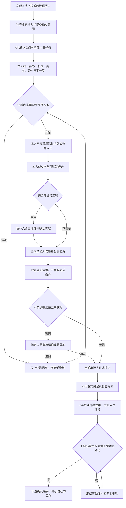

循环不是无限自动重试：补资料、返工或恢复每次必须有新事实/新版本/合法处理动作。无人接手、无法解决或超时按模板升级到明确责任人；用户取消按外部效果与补偿规则办理。

## 2. 多实例与多人各自配置数字员工

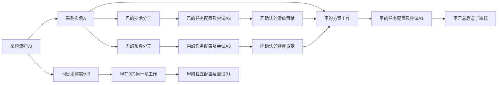

A1/A2/A3共享获授权的共同事实版本，各有私人草稿、会话、凭据引用、工作空间和取消信号。即便X1与X4引用同一个数字员工定义，其运行仍隔离。临时协作必须使用合法独立人员工作，固定流程职责优先复用OA节点/子流程。

## 3. 输入变化、退回与旧结果的处理

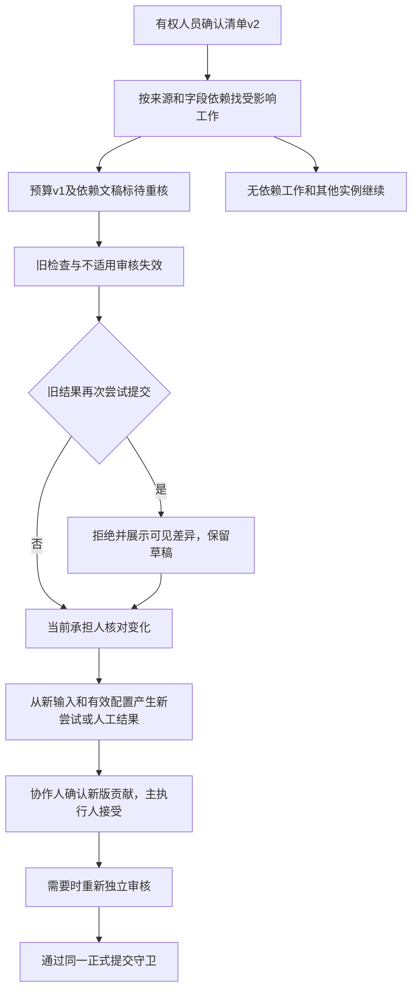

退回另产生明确责任轮次，保留退回人、目标和理由。普通聊天不会自动改业务基线。正式交付之后再出现变化，不回写旧包，进入补充交付或返工流程。

## 4. AI设置与业务分析的简明路径

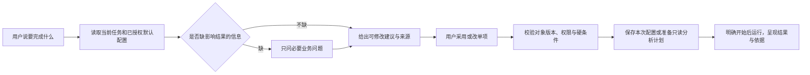

设置界面沿用明确对象的原命令；分析界面明确指标定义、统计粒度、时间、范围及数据快照。模型不可用时仍能用普通表单和人工路径；无权限、无数据、合法零结果和查询失败分别呈现。

## 5. 本体知识：从来源到有依据的关系

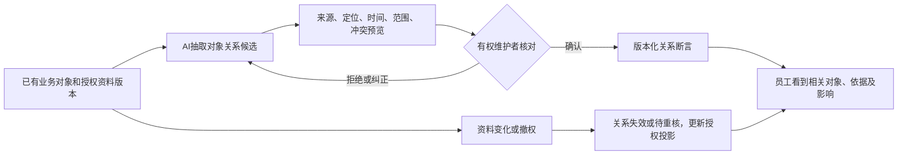

确认关系不直接修改源系统责任、审批或权限。先利用现有稳定ID、类型和来源引用组织关系，避免复制业务主表或要求员工先学习图谱编辑。知识维护者可解决冲突，普通人可在任务/答案旁查看依据。

## 6. 主动协助与自主进化

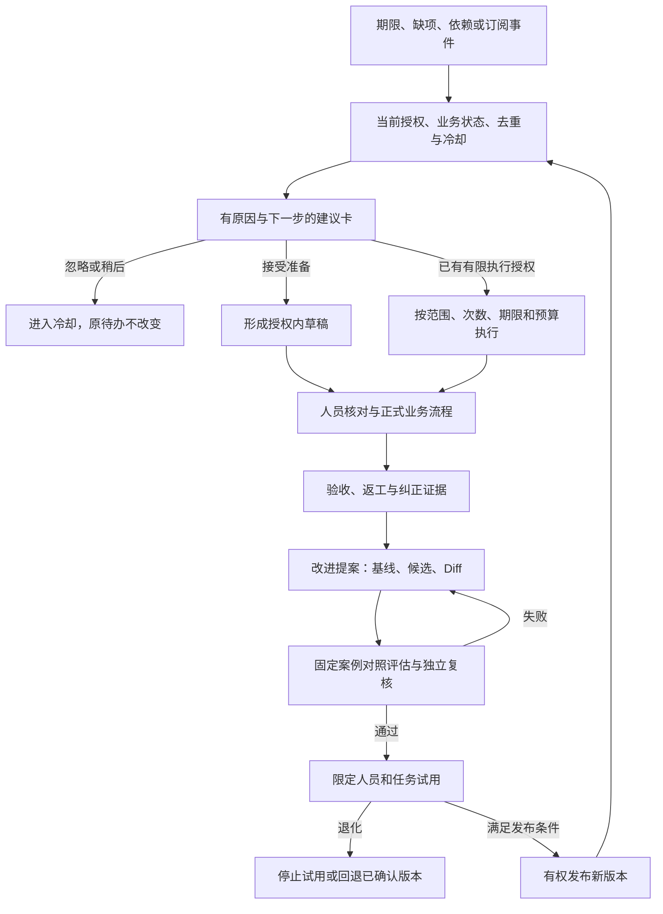

不允许从“结构校验通过”直达“已变得更好”。新发布只影响明确的将来使用点；安全权限规则不在自主进化修改范围。评估与试用也有次数、成本、期限和停止条件，失败不得无限重复提案或反复打扰员工。

## 7. 结果未知与恢复责任

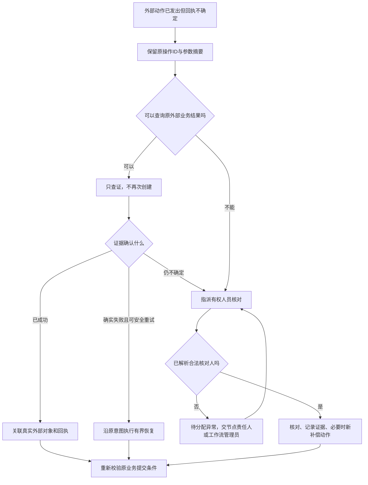

这里补齐了一个容易遗漏的出口：错误提示必须连到合法处理人和恢复动作。异常恢复使用现有人员任务类别，不新增平行工单系统。恢复完成不等于原任务已交付。

## 8. 当前原型图与交互入口

[打开31号原型](31-完整产品交互原型.html)。单文件可直接在浏览器打开，无需安装、构建或外部服务；所有状态在内存，刷新重置。提供41个角色视角、22组页面、四区导航与7条核心引导演练：正常协作、输入过期、人员转办、交接不可读、外部结果未知、市场采用、审核退回。

“设计总览”用于检查全部功能页，不模拟用户授权；普通职责视角按角色页面范围收敛。原型对业务字段、AI建议和高级能力的演示范围分别说明，不将静态页面、示例分析或示例评估冒充实际执行。原型中部分次要资源管理表单仅表达布局与字段，完整后台动作仍按27/28号实施验收。

### 8.1 统一工作台

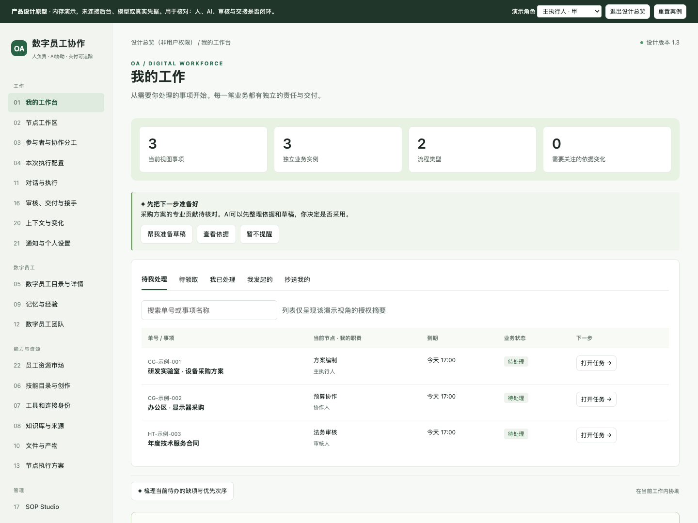

同一入口组织本人事项和AI下一步建议；“忽略建议”和“完成业务”分开。此图处于设计总览，侧栏展示完整功能分组，员工实际默认只显示其授权入口。

### 8.2 默认配置，复杂项按需显示

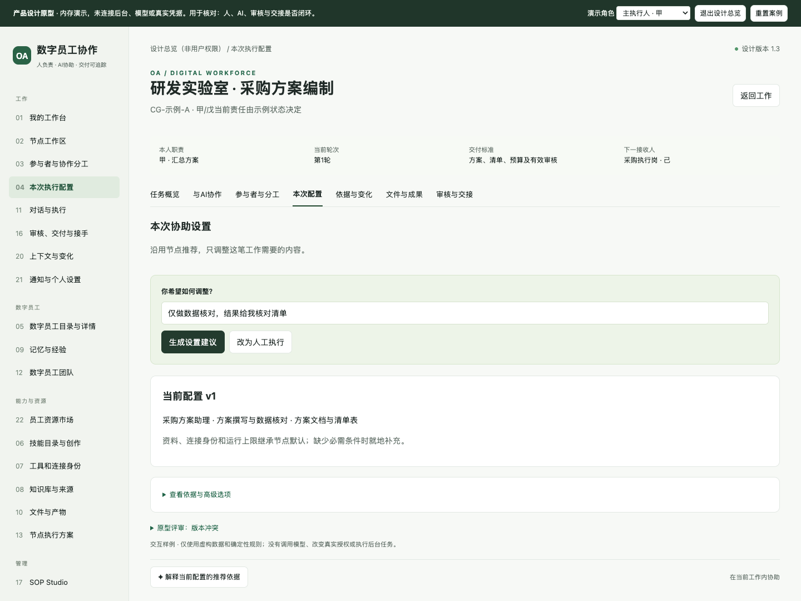

已有默认资源时展示推荐与准备情况，不强迫用户从模型、技能、连接器空表单开始。高级设置折叠，字段和保存范围仍可解释。

### 8.3 审核、正式交付与接手

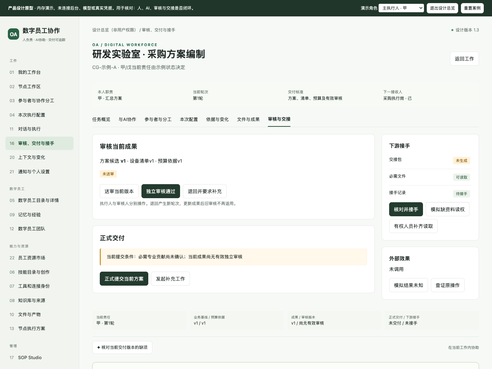

每个动作显示其人员责任、目标版本与缺项；不能把AI输出或独立审核直接显示成业务已交付。

### 8.4 业务知识与关系

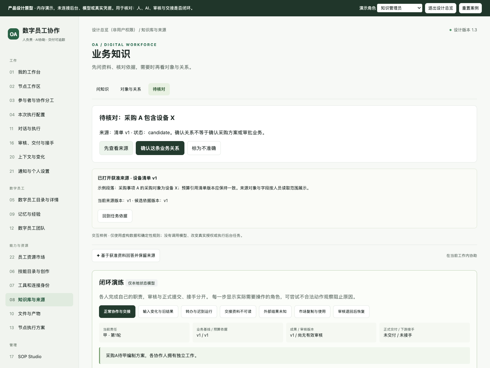

用户看业务对象和依据，维护者核对关系候选。本体概念由后台关系与版本承担，避免增加员工建模负担。

### 8.5 有口径的业务分析

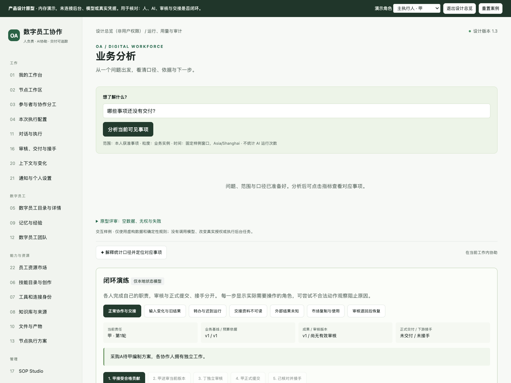

通过“分析示例业务数据”可在原型显示基于虚构数据的结果；正式产品必须有授权只读查询、来源和明细复核。

### 8.6 主动协助与记忆改进

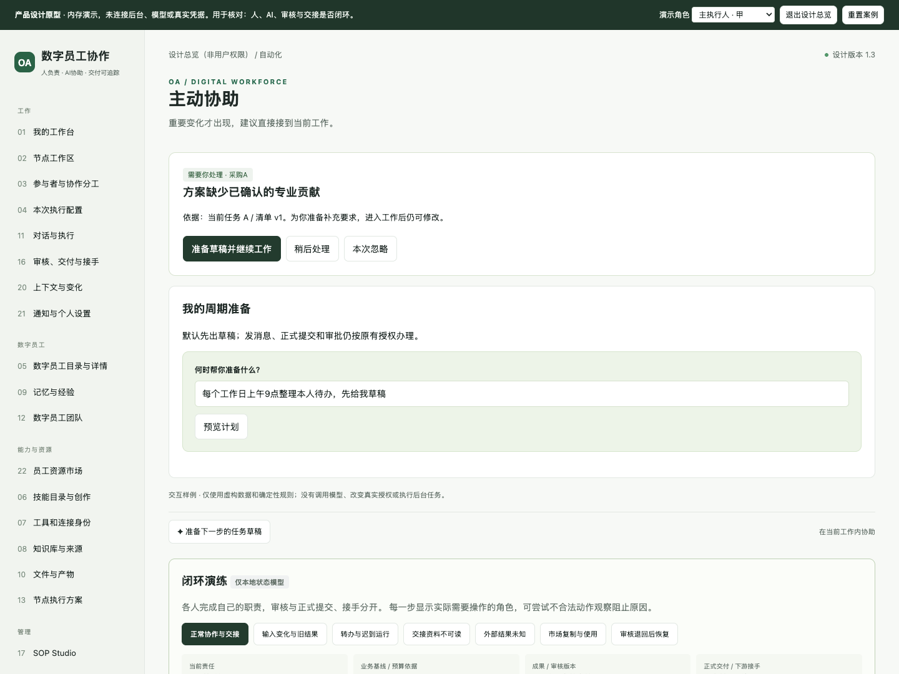

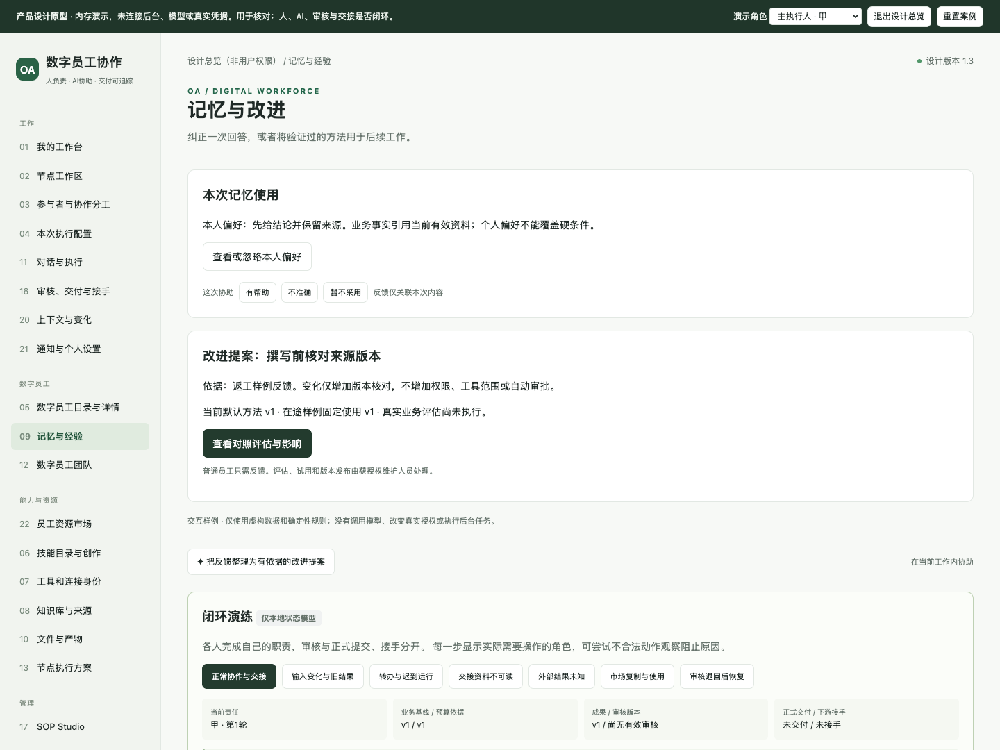

### 8.7 手机配置首屏

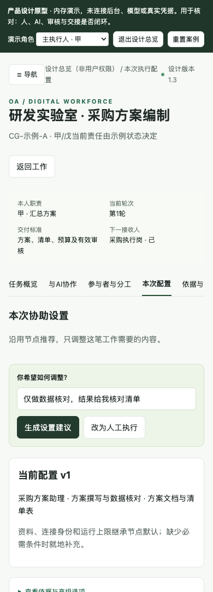

### 8.8 全22页截图索引

每页均有390/1024/1440三种宽度的首屏截图；首屏图片不是完整页面所有状态都已验证的声明。文件和每项布局结果见[原型浏览器检查](../../validation/product-design-prototype-check.json)。

| 页面 | 桌面 | 手机 |
|---|---|---|
| P01 工作台 | [1440](../../validation/product-design-prototype/P01-1440.png) | [390](../../validation/product-design-prototype/P01-390.png) |
| P02 工作区 | [1440](../../validation/product-design-prototype/P02-1440.png) | [390](../../validation/product-design-prototype/P02-390.png) |
| P03 参与者 | [1440](../../validation/product-design-prototype/P03-1440.png) | [390](../../validation/product-design-prototype/P03-390.png) |
| P04 配置 | [1440](../../validation/product-design-prototype/P04-1440.png) | [390](../../validation/product-design-prototype/P04-390.png) |
| P05 数字员工 | [1440](../../validation/product-design-prototype/P05-1440.png) | [390](../../validation/product-design-prototype/P05-390.png) |
| P06 技能 | [1440](../../validation/product-design-prototype/P06-1440.png) | [390](../../validation/product-design-prototype/P06-390.png) |
| P07 工具 | [1440](../../validation/product-design-prototype/P07-1440.png) | [390](../../validation/product-design-prototype/P07-390.png) |
| P08 知识 | [1440](../../validation/product-design-prototype/P08-1440.png) | [390](../../validation/product-design-prototype/P08-390.png) |
| P09 记忆 | [1440](../../validation/product-design-prototype/P09-1440.png) | [390](../../validation/product-design-prototype/P09-390.png) |
| P10 产物 | [1440](../../validation/product-design-prototype/P10-1440.png) | [390](../../validation/product-design-prototype/P10-390.png) |
| P11 对话 | [1440](../../validation/product-design-prototype/P11-1440.png) | [390](../../validation/product-design-prototype/P11-390.png) |
| P12 团队 | [1440](../../validation/product-design-prototype/P12-1440.png) | [390](../../validation/product-design-prototype/P12-390.png) |
| P13 方案 | [1440](../../validation/product-design-prototype/P13-1440.png) | [390](../../validation/product-design-prototype/P13-390.png) |
| P14 主动 | [1440](../../validation/product-design-prototype/P14-1440.png) | [390](../../validation/product-design-prototype/P14-390.png) |
| P15 渠道 | [1440](../../validation/product-design-prototype/P15-1440.png) | [390](../../validation/product-design-prototype/P15-390.png) |
| P16 交付 | [1440](../../validation/product-design-prototype/P16-1440.png) | [390](../../validation/product-design-prototype/P16-390.png) |
| P17 流程 | [1440](../../validation/product-design-prototype/P17-1440.png) | [390](../../validation/product-design-prototype/P17-390.png) |
| P18 权限 | [1440](../../validation/product-design-prototype/P18-1440.png) | [390](../../validation/product-design-prototype/P18-390.png) |
| P19 分析 | [1440](../../validation/product-design-prototype/P19-1440.png) | [390](../../validation/product-design-prototype/P19-390.png) |
| P20 上下文 | [1440](../../validation/product-design-prototype/P20-1440.png) | [390](../../validation/product-design-prototype/P20-390.png) |
| P21 偏好 | [1440](../../validation/product-design-prototype/P21-1440.png) | [390](../../validation/product-design-prototype/P21-390.png) |
| P22 市场 | [1440](../../validation/product-design-prototype/P22-1440.png) | [390](../../validation/product-design-prototype/P22-390.png) |

## 9. 24类断点与闭环修订

下表状态均为**设计规则已补齐，产品实现尚待验证**；原型只能验证其中明确实现的内存场景。每项有触发、处理责任、恢复出口和验收，不用“后续优化”代替当前设计规则。

| ID | 断点与影响 | 处理人 / 已补设计出口 | 验收关联 |
|---|---|---|---|
| BP-01 | 同模板多笔业务被当同一任务，草稿/运行串单 | 当前承担人；实例/工作/轮次隔离，显式新意图 | AC-02/04/11 |
| BP-02 | 员工从复杂配置开始，尚未办事就迷失 | 流程设计者预设合格默认；员工只补缺项，高级设置渐进显示 | AC-61/62/63 |
| BP-03 | 22组功能都变成一级菜单，角色边界混乱 | 产品导航四区，任务内页签；管理域按授权显示 | AC-46/51/61 |
| BP-04 | AI建议字段已被他人修改，采用覆盖新值 | 当前对象维护者；版本Diff、部分采用与冲突恢复 | AC-63 |
| BP-05 | 多人配置AI覆盖同一任务绑定 | 主执行/协作各自独立工作；一工作一有效绑定，团队内部统一汇总 | AC-13/14/39 |
| BP-06 | 转办后旧运行仍能交付 | 派工/接收者；责任代次及fence失效，新人确认配置 | AC-06/59 |
| BP-07 | 审核退回没有新轮次或可返回入口 | 审核人与当前承担人；保留原因，生成新责任轮次并重核 | AC-06/20，原型rework |
| BP-08 | 资料改变但已接受预算仍被使用 | 资料/贡献负责人；依赖影响、待重核、新版本与新检查 | AC-15/17 |
| BP-09 | 模型说已理解，实际没收到必需输入 | 运行维护和业务人员；准备/投递/装载/业务检查独立证据 | AC-16/17/49 |
| BP-10 | AI成功或子任务完成直接推动OA | 当前承担人及审核人；同一正式提交守卫和权威办理 | AC-19/20/21 |
| BP-11 | 本地交付写成成功，OA状态尚未完成 | 业务服务/运维；受理中状态、Outbox和权威回读对账 | AC-21/54 |
| BP-12 | 外部结果未知就重试，造成重复业务 | 当前承担人/有权运维；原操作查询、人工查证及有界补偿 | AC-31/54，原型unknown |
| BP-13 | 下游收到包但不能读，无人负责修复 | 资料维护/授权人；有接收人的恢复任务，缺责任则待分配异常 | AC-22/71 |
| BP-14 | 正式交付后直接改包，历史与下游不一致 | 原业务责任人；补充包/返工工作，原包不变 | AC-23 |
| BP-15 | 市场复制等于使用授权或共享作者账号 | 各资源领域与本人；复制/编辑/运行分别判，缺本人连接单独处理 | AC-27/28/29 |
| BP-16 | 资源、记忆、图谱引用绕过源权限 | 资料/权限维护者；读取、关系路径、计数、缓存、下载都重授权 | AC-34/35/56/65 |
| BP-17 | 分析混淆实例/任务、时间口径和错误/零结果 | 分析用户与指标维护者；口径卡、只读受限计划、明细下钻和错误分层 | AC-64 |
| BP-18 | 本体建设先复制业务主表，引入第二事实源 | 知识维护者；既有ID投影、候选断言与来源版本，源业务命令仍唯一 | AC-65 |
| BP-19 | 主动提醒持续重复，忽略被当完成 | 用户/规则维护者；事件去重、冷却、摘要、稍后，任务状态独立 | AC-66 |
| BP-20 | 停止提醒、自动化、当前运行含义混为一谈 | 用户/自动化维护者；三个动作分开，停止后查证已发生效果 | AC-42/67 |
| BP-21 | 自主进化只过结构检查就发布，未验证效果 | 技能维护/独立评审；固定案例对照、试用、退化阻断和回退 | AC-68 |
| BP-22 | 模糊反馈变成全局偏好或越权规则 | 用户/资源维护者；反馈语义、保存范围、版本、可纠正；不改安全策略 | AC-69 |
| BP-23 | AI不可用时用户无法继续业务 | 当前承担人；默认配置/普通表单/人工路径，保留草稿和明确恢复人 | AC-09/12/71 |
| BP-24 | 功能覆盖数或点击检查被写成用户收益 | 产品/测试；逐条原验收，真实用户样本、任务难度与错误率单列 | AC-60/72 |

## 10. 尚待完善的实施输入

| 未决范围 | 已有设计处理 | 后续必须取得的事实 |
|---|---|---|
| 底座版本、物理模型、实际URL | 逻辑契约与候选验证顺序完整；不假定旧栈 | 固定源码/BOM、构建、等价映射和真实调用 |
| 企业业务字段、岗位路由、会签阈值 | 参数化模板，保留4类17字段候选；无处理人有异常出口 | 企业真实表单、角色与业务样本，由相应负责人确认 |
| 指标与本体映射 | 复用现有对象ID、口径和来源，不强行造庞大模型 | 实际数据源字段、指标口径、关系约束、权限与新鲜度 |
| 主动协助授权范围与提醒频率 | 默认建议/草稿、有限授权、可关闭与冷却 | 试点用户对有效提醒、误打扰、执行范围的实测反馈 |
| 自主进化对照样本 | 评估层次、案例要求、试用和回退清楚 | 合法样本、基线/候选真实结果及独立复核 |
| UI真实易用性 | 当前原型布局与关键路径可检验 | 真实用户可用性研究、读屏、浏览器完整矩阵；不能从截图证明学习成本下降 |
| 全量旧能力与生产级运行 | 原153项、角色/市场/OA基线和新增AI要求完整保留 | 旧代码全量盘点、新系统实现/权限/恢复/部署证据 |

这些是实施前必须填入的实际对象、版本或企业政策，并非已被用户批准的答案。当前设计使用合理默认与明确条件继续，不将它们变成普通员工每次办理都要填写的设置。

## 11. 方法论执行与真实验证边界

本次应用用户指定的[production-grade-task-methodology](</Users/mac/.cc-switch/skills/task-quality-assurance-v2/production-grade-task-methodology/SKILL.md>)，按理解、计划、已有授权确认、执行、验证、深度分析、再验证和交付组织工作；复用[本次结构化任务状态](../../validation/product-design-task-state.json)中的36项清单与质量门。没有假装已安装该技能提到的ClawHub CLI，也没有为形式新增任务平台或重复申请已授权的本地文档工作。

研究技能安排了独立的一手来源研究，主执行另行直接读取研究产物；本体技能只使用类型、关系、来源与约束方法，不初始化另一个长期记忆库。原型技能用于单HTML状态探索，保留在设计目录；用户未授权Git操作，所以没有按技能模板创建分支或提交。

确定性验证分别检查源需求逐项保留、角色/细化/命令/用例引用、文档链接及原型真实浏览器行为。浏览器内存原型通过不能说明服务端鉴权、数据库事务、模型消费、真实图谱/分析、主动执行或自主进化已验证。Skill使用也不构成生产就绪认证。

本轮验证结果：文档来源、追踪与本地链接/章节引用校验均通过；原型浏览器检查133项、页面错误0项，形成73张截图（22页面×3宽度，加7个闭环场景）。结果绑定文件摘要，详见[文档检查](../../validation/product-design-document-check.json)与[浏览器检查](../../validation/product-design-prototype-check.json)。其中新修正了市场三类资源筛选及分别复制、偏好值保留、提醒数量随依据变化、手机导航和跨实例动作隔离。

此前13段Mermaid图源通过代码块及图类型结构检查，未使用独立Mermaid引擎渲染验收；可在支持Mermaid的Markdown阅读器查看。本文件嵌入的PNG为实际浏览器原型截图。没有执行72项真实产品验收场景，也没有开展代表性用户可用性实验；这些限制不会被本轮文档或原型通过结果覆盖。

当前原始结果：[文档完整性检查](../../validation/product-design-document-check.json) · [原型浏览器检查](../../validation/product-design-prototype-check.json) · [研究来源](../../validation/ai-ux-research-sources.json)。

## 12. 1.2任务执行与权限细化

U22/U23将任务执行页明确为左对话、右侧主要展示区，新增鱼骨路径、文档/文件夹/历史摘要联动。权限按主体、对象、动作和当前任务关系判定；商务/研发仅为案例。详细规则及八项EW细化见[34号](34-任务执行工作台与权限分层设计.md)，新增正负例证据见[工作台专项检查](../../validation/execution-workspace-check.json)。本文件嵌入的P02/P10/P11截图随当前原型回归刷新，历史1.1交付在validation/design-v1.1-before-workspace-v1.2.zip保留；专项浏览器通过不表示真实鉴权或模型输出安全已验证。

## 13. 1.3全产品AI操作闭环与复核

[35号研究](35-全产品AI体验复核与改进.md)补齐六领域交互；主设计的22页矩阵保持不变。31号把设置的部分采用/撤销、分析下钻、知识来源核对、主动建议接续、试用发布回退串起来。历史1.2交付保存在`validation/design-v1.2-before-ai-experience-v1.3.zip`。

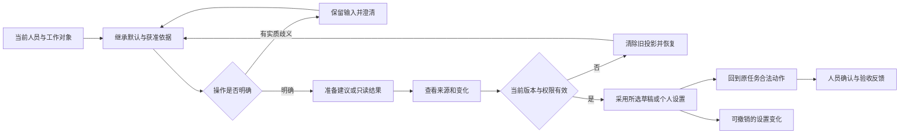

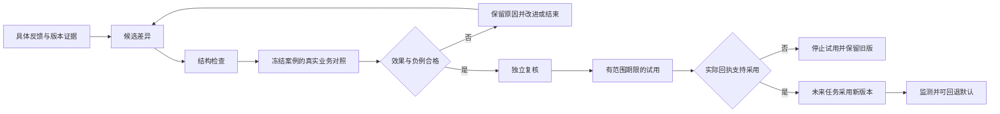

这两张是产品目标流程图；进化图中的真实对照和试用回执在HTML中只有明确标注的虚构样例，不是已实现能力。源图结构可检查，独立Mermaid渲染另行记录边界。

| 本次发现的断点 | 修订结果 | 尚待实施验证 |
|---|---|---|
| 推荐只能整包点“采用” | 字段可改、单项采用、放弃、撤销及版本冲突恢复 | 后端原子更新、审计与真实AI理解 |
| 分析只有固定数值、没有对应事项 | 同源计算、合法0、空/错/无权、按原实例下钻 | 指标服务、真实RLS及导出授权 |
| 知识任何人一键确认 | 打开当前来源、确认权独立、版本变化重核 | 真实检索、来源加工与按接收范围发布 |
| 主动建议原因固定、草稿无去处 | 从当前缺项推导、接续同任务草稿、忽略/稍后/新事件 | 真实事件去重、冷却、调度与运行取消 |
| 一键评估容易误读为提升 | 显式证据样例、独立复核、试用回执门槛、版本回退 | 业务评估器、保留验证集、真实试用监测 |
| 全页AI入口容易产生另一个对话系统 | 同一工作对象内协助；执行页只聚焦已有左对话 | 真实跨页状态、撤权竞态与用户上手测试 |

### 当前交互截图

[设置](31-完整产品交互原型.html?page=P04&revision=1.3) · [分析](31-完整产品交互原型.html?page=P19&design=1&revision=1.3) · [知识](31-完整产品交互原型.html?page=P08&design=1&revision=1.3) · [主动协助](31-完整产品交互原型.html?page=P14&design=1&revision=1.3) · [改进](31-完整产品交互原型.html?page=P09&design=1&revision=1.3)

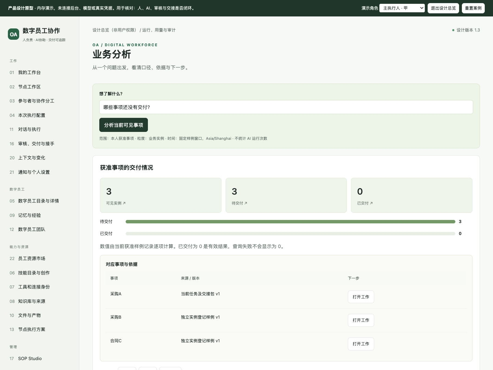

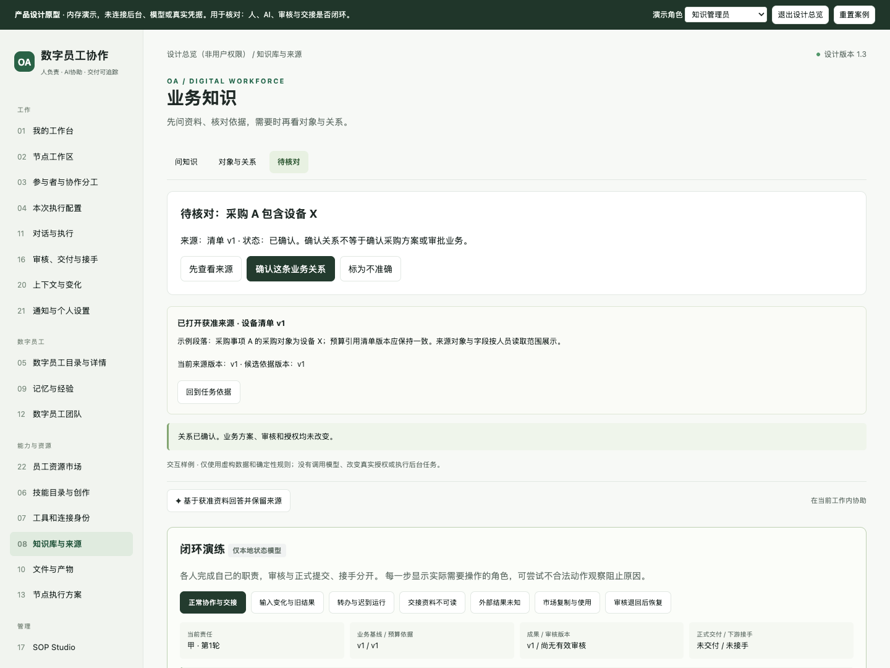

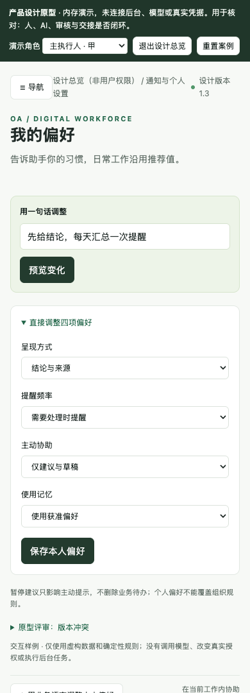

专项结果见[AI体验浏览器证据](../../validation/ai-experience-check.json)，全22页/41视角回归见[基础原型检查](../../validation/product-design-prototype-check.json)，权限工作台回归见[工作台检查](../../validation/execution-workspace-check.json)。所有浏览器证据仅适用于本地虚构HTML。
