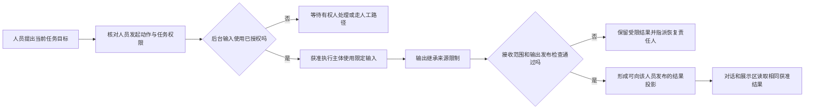
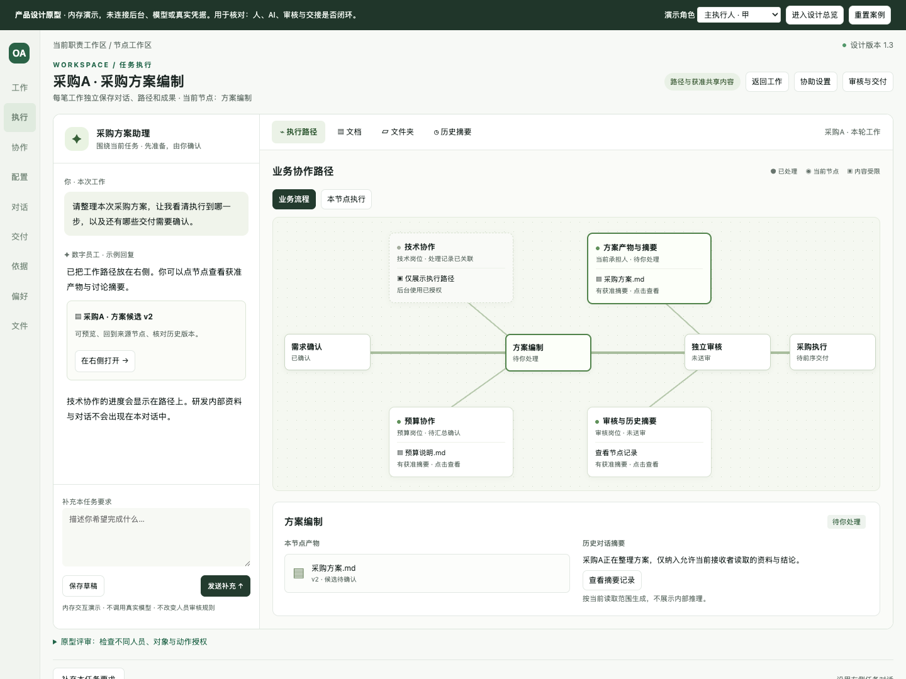
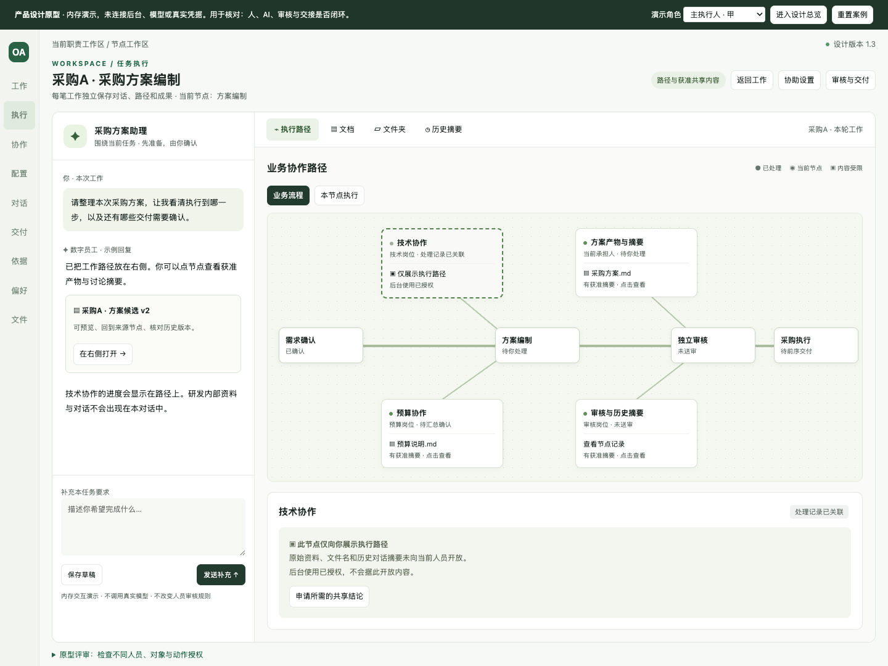
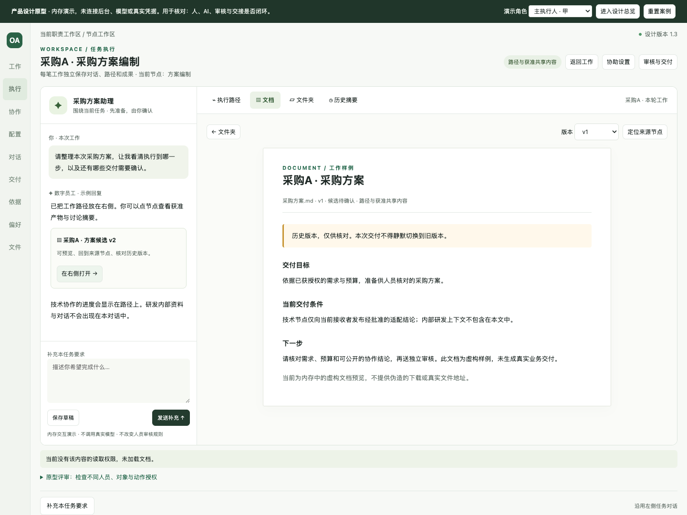

# 任务执行工作台与权限分层设计

版本：1.2｜2026-09-11｜状态：`DESIGN_AND_FICTIONAL_PROTOTYPE_ONLY`

依据：[U22布局要求与U23权限更正](../../history/本轮产品设计需求补充-2026-09-11.md#u22)。关联：[产品主文档](26-完整产品设计文档.md#execution-workspace)、[权限及投影契约](27-逻辑数据模型与接口契约.md#workspace-contracts)、[交互原型](31-完整产品交互原型.html)、[完整追踪](30-产品设计追踪数据.json)。

**任务执行采用左侧对话、右侧大展示区。权限是通用的主体—对象—动作约束；商务与研发仅为示例，不是按部门写死的规则。** 同一个人，在不同实例、节点、资料版本和授权时间内，可以得到不同内容。能查看执行路径，不必然能读节点资料、文件名、历史摘要或后台输入；能让数字员工执行，也不必然获得这些信息的读取权。

## 1. 布局与交互

桌面使用约25%对话、75%展示区，对话宽度约280—328px；中间展示区占剩余宽度。全局导航在执行时收窄并显示简短业务名称，避免把P02等设计编号当成产品菜单。顶部只保留任务定位、当前可见范围、返回工作、协助设置和正式审核入口。P02任务入口、P11对话入口与P10任务文件入口复用同一工作台，不建立三个独立会话或三套执行状态。

左侧保留当前任务的对话、需要人员补充的问题、AI进度与产物引用，底部为输入区。聊天中的文档引用在右侧打开；打开文件不清空对话，也不触发重新运行。AI回复使用人员可读投影，禁止把内部工具日志或隐藏上下文原样作为流式输出。消息为实际发生的对话；历史摘要是有来源和版本的独立可读内容，不展示模型内部推理。

右侧统一四个切换入口：

| 入口 | 主内容 | 联动规则 |
|---|---|---|
| 执行路径 | 鱼骨式业务协作图；可切本节点执行路径 | 点节点定位当前轮次；只展示获准阶段、连接关系、状态和人员字段 |
| 文档 | 具体产物版本、正文、来源节点、历史版本提示 | 文件读取权与版本范围独立校验；可回文件夹或来源节点，不暗改正式交付版本 |
| 文件夹 | 任务内文件夹及其可见文件 | 文件名、路径、缩略图、数量、搜索命中和下载链接均按读取策略处理 |
| 历史摘要 | 所选节点、轮次和会话范围的摘要记录 | 摘要和原文分别授权；正文不可读时不能先获取原文再让浏览器压缩 |

390px窄屏通过“对话/展示区”切换，保留相同任务、节点、选中文档、输入草稿和滚动定位；不把左右两栏压成无法使用的细列。鱼骨图在独立容器内横向滚动，页面本身不横向溢出。所有节点、文件及页签可通过键盘操作，状态不只用颜色表达。

## 2. 鱼骨图表达的事实

横向主线代表流程中的业务节点与正式流转方向；斜向分支代表专业协作、该节点产物和讨论摘要。分支不是另一套流程权威状态。人员任务、AI执行尝试、协作贡献和正式交付保持不同标识。

节点卡至少包含当前允许展示的节点名称、业务状态、当前轮次；负责人、时间、产物数量、失败原因都须分别获准。受限节点可有以下**由服务端决定的投影**：

| 投影 | 用户能看到什么 | 不能推导什么 |
|---|---|---|
| 不可发现 | 不返回该节点、私有边或隐藏数量；只返回允许的流程骨架 | 不能用“还有3个隐藏节点”泄露存在性 |
| 仅路径 | 获准名称/阶段/连线/状态；内容区说明当前不可读取 | 不能返回私有文件名、内部人员名、错误参数或摘要 |
| 已发布共享摘要 | 上述元数据加单独批准、适用于当前接收者的摘要 | 不因此开放摘要来源原文、其他版本或同文件夹内容 |
| 内容可读 | 当前获准的产物、字段、片段或会话版本 | 不因此开放编辑、运行、下载、分享或发布 |

“业务流程”和“本节点执行”两级路径分别呈现。业务页不倾倒模型工具调用细节；执行级展开也只显示允许的动作阶段、可公开结果与恢复入口。失败节点显示当前人员可以处理的原因，敏感原因交给有权的恢复人员。重试保留原尝试和来源，不用新结果覆盖旧运行；循环、并行、取消、跳过、退回与补充工作的路径都需从真实执行记录投影。

## 3. 通用权限模型

复用选定底座的身份、授权和数据策略，不新增平行权限中心。前端不通过部门名称、页面可见、角色名称或“AI已绑定”推导授权。下面是逻辑动作名称，待底座选择后映射到既有权限动作：

| 权限维度 | 对象与范围 | 典型限制 |
|---|---|---|
| discover / read.path | 实例、节点、可公开边及元数据字段 | 节点存在、角色名称、耗时和计数也可能受限 |
| read.content | 文件版本、正文、片段、原始消息 | 按具体对象与版本，不是文件夹名称相同就可读 |
| read.summary | 节点/会话摘要的已发布版本 | 默认继承来源限制；独立发布的摘要可比来源有不同接收范围 |
| use.for_execution | 指定执行主体对指定输入的特定用途 | 期限、次数、模型/工具目的地、当前任务与输入版本都受约束 |
| release.result | 向指定接收人/范围输出具体结果版本 | 可运行不等于可发布；须输出检查与必要的责任人确认 |
| edit / download / export / share | 对应内容及具体操作 | 读取不默认授予下载、批量导出、分享或修改 |
| control.run / inspect.run | 指定运行的取消、恢复、诊断 | 运行维护权不默认开放业务正文或全量模型输入 |

每次判定使用当前可信身份、租户、任职/任务关系、对象及版本、请求动作、目的、环境约束、有效期限、策略版本和任务状态。默认拒绝，显式拒绝优先；缓存决策必须有短期适用范围和撤销机制。人员与服务主体有不同授权记录，但仍由同一底座管理。

部门只是可能参与政策计算的一个属性。示例A中的资料读取授权不能自动用于示例B；同一位技术人员也不能因其岗位而读取所有技术任务。审批人只读当前指派的材料和决定范围，管理员也不默认读取全部业务内容。

## 4. 人员不可读、数字员工后台可用

默认个人助手只能处理本人已获准使用的输入。确需“后台可用、人员不可读”时，须已有由有权主体授予的**任务限定执行授权**：明确执行主体、业务目的、输入对象/版本/字段、允许的模型与工具、次数/时限、输出目的地、结果发布规则和撤销条件。用户发出一句“帮我处理”不能扩大授权；既有有效授权则不重复要求每位员工配置或审批。

敏感输入在获准的专用工作/执行上下文中消费。用户可交互的助手只接收获准的事件和结果投影，不把后台全量上下文复制到同一个可被人员任意追问的对话中。后台可用也不是无限制读取：内部服务身份、外部模型发送、工具调用和人员交付分别检查目的与范围。

输出默认继承来源限制。若业务确需让另一类人员读取简化结论，通过现有交付/审批记录批准该具体版本的公开字段、适用用途与接收范围，保留来源链；这不改变源资料的权限。结构化允许字段、确定性校验、数据敏感性规则和必要人员复核共同约束发布，不能仅靠模型“不要泄密”的提示词、一个敏感词过滤器或对全文自动摘要实现。

历史摘要、搜索片段、工具报错、进度文本、文件名、日志、引用链接和用户反复追问都可能成为间接输出，必须走同一发布边界。流式输出应在内容进入人员通道前受控；无法安全发布时展示允许的进度，并由恢复任务等待处理，不能先发正文再撤回。人工摘要一旦另行获准发布，原始内容仍保持限制。

## 5. 读取投影、撤权和闭环

服务端返回人员展示投影和对应允许动作；后台输入快照由执行授权解析，两者不是同一个JSON删几列。无权正文、文件名、原始摘要、对象地址不得预加载到浏览器、隐藏DOM、前端状态、页面源码或客户端日志。设计总览只用于原型评审，不增加实际读取权。

授权上下文至少绑定 tenant / subject / instance / workItem / taskRound / purpose / policyRevision / requestGeneration；对象及版本另带可验证引用。切换人员、任务或租户时隔离草稿、消息、选中节点和预览；旧异步结果到达时按请求代次丢弃，不能覆盖新视角。事件重复/乱序按权威版本回读，不能让旧授权事件重新开放内容。

撤销内容读取时立即清除当前预览、摘要、客户端缓存及尚未展示的结果，重新获取允许的元数据；直接URL、版本选择、搜索、下载与导出也重新校验。若后台授权仍有效，后台是否继续由该授权及业务责任决定，不能将人员撤权等同后台停止。撤销后台授权则阻止新读取和新调用，尽力中止在途尝试并禁止结果发布；无法收回已经送入外部模型或已经发生的动作，须记录并进入既有查证/补偿流程。

| 断点 | 反馈与处理责任 | 恢复条件 |
|---|---|---|
| 无对象发现权/非法直链 | 统一不可访问，不披露存在性 | 有权来源按现有授权流程处理 |
| 有路径、无正文 | 保持允许的路径；提供“申请所需共享结论” | 已批准的摘要/产物可读；申请本身不授予权限 |
| 读取授权已过期 | 清屏并保留不含受限内容的任务定位 | 新授权生效并重新读取，不复用旧缓存 |
| 后台可用、结果不可发布 | 显示获准进度；由资料/交付责任人处理受限结果 | 输出具体版本、接收者及发布条件通过 |
| 无后台输入使用权 | 暂停依赖该输入的执行，可继续不依赖它的工作 | 有权人处理/替换合法输入/人工完成 |
| 资料版本变化/撤权 | 旧摘要和候选重新检查适用性 | 按新版本重算授权与依赖，不能静默替换已交付版本 |
| 异步旧响应或离线恢复 | 丢弃不匹配上下文的响应，不用旧快照证明当前授权 | 在线重新认证与权威回读 |
| 恢复责任人缺失 | 进入现有待分配异常，由节点责任人/工作流管理员协调 | 解析合法处理人后继续，不在页面无限重试 |

## 6. 八项细化用户故事及验收

EW细化关联原需求与AI-10等现有能力，未增加部门专属功能，也不缩减原153需求、12项AI增强或72个基础跨域验收。下列均为**真实产品尚未执行的验收要求**。

| ID | 用户故事 | Given / When / Then及负例 |
|---|---|---|
| EW-01 | 作为任务承担人，我要同时对话和查看工作结果 | 已有合法任务；打开P02/P11；左对话右展示，右侧占主要宽度；手机可切换且草稿和定位不丢失。不得复制第二会话或混入别的实例。 |
| EW-02 | 作为参与人，我要从鱼骨路径定位节点、产物和历史 | 有串行/并行/协作/退回记录；点节点和产物；同实例、轮次、精确版本互相可回溯。无发现权的节点及私有边不返回，不显示隐藏数量。 |
| EW-03 | 作为获权读者，我要在展示区浏览文件和版本 | 当前获权资料存在；浏览文件夹、预览、切版本并回来源；只有允许文件及版本可读取。越权直链、路径猜测、缩略图、搜索和导出均被拒。 |
| EW-04 | 作为权限策略维护者，我要独立控制路径、摘要与原文 | 同一节点存在不同动作授予；分别查看路径、发布摘要、源文档；只展示该主体/对象/动作获准的内容。部门名称、管理身份和设计总览不得扩权。 |
| EW-05 | 作为业务负责人，我要让获准后台处理受限输入 | 已有任务限定执行授权，人员无原文读取权；启动或撤销后台使用；执行主体按授权消费，人员仍不可读。没有授权不得执行；已发出的输入不能宣称已收回。 |
| EW-06 | 作为结果接收人，我要只收到获准发布的信息 | 运行涉及受限资料；产生摘要、产物、日志、引用与流式回复；按具体接收者和版本发布。未批准结果保持受限，诱导追问不能读出隐藏内容。 |
| EW-07 | 作为多任务参与人，我要在切换或撤权后保持隔离 | 多人员、多实例、旧响应在途；切换身份/任务、撤权或转办；清除旧内容、分开草稿并拒收旧响应。不能依赖前端隐藏或持久旧缓存保密。 |
| EW-08 | 作为任务处理人，我要知道权限不足时由谁恢复 | 有路径无内容、后台无使用权、发布受阻；请求所需结论并处理恢复；现有人员任务承接责任，恢复后重新校验。申请不能自动授权，修复不等于业务已完成。 |

实际产品验收须使用真实身份/服务主体、策略版本、接口响应、文件服务、事件/流式输出和并发撤权。必须检查响应体和对象存储地址，而不只看截图是否隐藏；验证规则不可由受测模型自行判定成功。

## 7. 参考与本轮验证边界

Coze官方对话流文档说明了流式对话、可中断交互与按节点查看运行输入输出的调试能力。本项目据此参考“对话与可视化执行关联”的机制；用户指定的左对话、大展示区与鱼骨布局，以及上述细粒度权限，是本项目设计，未声称Coze已采用同样布局或权限规则。[Coze执行对话流](https://docs.coze.cn/developer_guides_workflow_chat)

原型内所有文本均为虚构夹具，包含专用标记供正负例检查；单HTML必然包含这些演示源码，**不能作为真实受限资料的安全承载方式**。代码中的视角映射只是为演示提供确定输入，不是生产鉴权实现。聊天为确定性本地反馈，不是模型安全或真实外泄防护验证。

本轮浏览器证据见[工作台专项检查](../../validation/execution-workspace-check.json)，全页回归见[原型检查](../../validation/product-design-prototype-check.json)，追踪与源保留见[文档检查](../../validation/product-design-document-check.json)。

