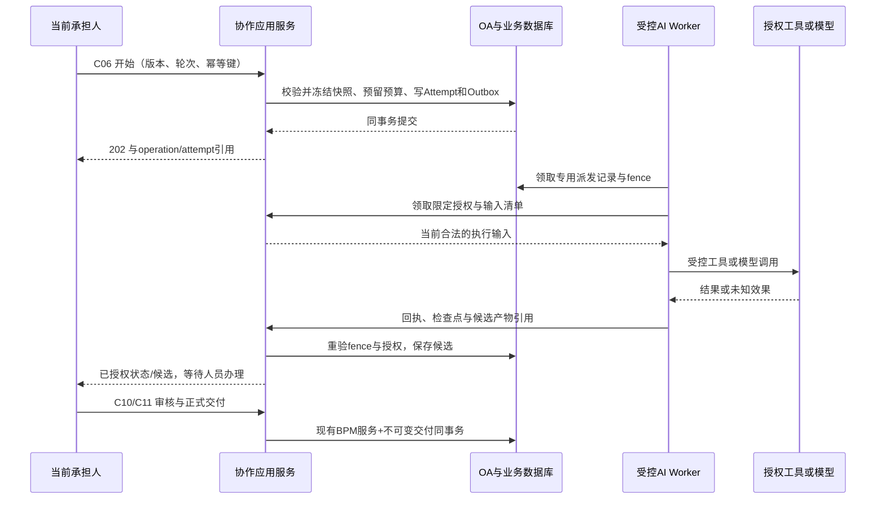

# 技术架构总设计与决策

版本：技术设计1.0｜2026-09-11｜状态：`PROPOSED_ARCHITECTURE / IMPLEMENTATION_NOT_STARTED`。

本技术包对应产品设计1.3，以原153项需求、12项AI增强、8项工作台细化、21领域、22页、41人员视角和C01—C31为输入。用户要求完整技术设计，尚未最终选择框架或授权部署。本文给出可以开展验证和开发分解的主方案，兼容性、容量和业务安全均须按43号POC验证后冻结；不是已运行系统的架构反推。

## 1. 技术文档入口

| 文档 | 开发者应据此解决的问题 |
|---|---|
| [36 开源源码研究与选型](36-开源底座源码研究与技术选型.md) | 版本来自哪个提交，哪些能力能复用，何时淘汰主方案 |
| 本文 | 系统边界、技术决策、主方案与替代条件 |
| [38 模块与前端设计](38-模块边界与前端工程设计.md) | 领域和22页落到哪里，如何保持同一任务与权限上下文 |
| [39 数据与事务设计](39-数据存储与事务一致性设计.md) | 逻辑对象如何映射，怎样防重复、旧结果提交和半交付 |
| [40 API与事件设计](40-接口事件与集成技术设计.md) | 31命令的拟议路由、字段、错误、SSE、外部集成 |
| [41 AI与权限设计](41-AI运行知识分析与安全设计.md) | 工具、RAG、本体、分析、主动执行与进化如何受控 |
| [42 部署运维设计](42-部署运维与非功能设计.md) | 环境、配置、容量、发布、回滚、备份与故障处置 |
| [43 实施验证与追踪](43-技术实施路线与验证矩阵.md) | POC、实施顺序、覆盖映射、未决项与完成门禁 |
| [44 可浏览架构图](44-技术架构交互图.html) | 系统主链、人员权限边界和AI执行边界 |

产品规则继续以[26](26-完整产品设计文档.md)、逻辑对象/状态/命令以[27](27-逻辑数据模型与接口契约.md)、验收以[28](28-开发分期与验收用例.md)、需求ID以[30](30-产品设计追踪数据.json)为准。技术包细化实现方法，不另创需求、用户角色或流程状态权威。

## 2. 推荐方案与规模假设

**有条件的技术设计参照：芋道组织/基础设施/BPM/AI模块，增加一个协作业务模块；统一Vue3前端；AI执行以隔离Worker运行，复用同一SDK工具循环。** 当前固定提交存在兼容性和初始化来源问题，不能直接作为可运行基线，尚不能证明其总体工作量最少。 不同时部署另一个完整Agent Admin或独立OA产品。QoderWake提供交互与能力参考；StaffDeck提供来源清楚的实现机制参考，不默认整库合并。

| 层 | 拟议选择 | 为什么采用及必要条件 |
|---|---|---|
| Web | 官方芋道Vue3、TypeScript、Element Plus及已有路由/状态/请求封装 | 复用管理、流程表单和审批；员工工作台按31号重构；固定配套提交，不直接套演示站 |
| 业务服务 | 芋道`system/infra/bpm/ai` + `collaboration`模块化单体 | 组织、OA和正式交付可在一个合法本地事务内处理，减少分布式一致性工作 |
| 流程 | 固定源码分支实际集成的Flowable | 所有发起、转办、审批及推进调用底座服务，不直接改ACT表；版本以36号实证为准 |
| AI | 固定底座已集成Spring AI能力；一个受控工具执行循环 | 调度器只派发Attempt，不能再成为第二个Agent循环；跨版本SDK更换先验证 |
| 数据 | MySQL优先验证；已有Qdrant适配按检索收益启用；PG单库为条件实验 | 公开SQL未覆盖BPM/AI表，须解决合法完整初始化并验证；Qdrant有实际适配代码；PG不作为开箱基线 |
| 文件 | 复用infra文件接口，接组织已有私有对象存储 | 数据库保存不可变版本引用，读取走授权代理；不要求额外装一套知识文件平台 |
| 缓存 | 底座现有缓存实现 | 仅缓存与协调提示；责任、交付、授权和运行完成记录不以缓存为唯一事实 |
| 异步 | 数据库Outbox+租约Worker，或复用底座已满足条件的同类机制 | 小规模先避免Kafka/RabbitMQ/Temporal；出现真实吞吐瓶颈再替换派发通道 |
| 可观测 | 应用指标/健康、结构日志、OpenTelemetry导出到现有监控 | 不复制业务正文到日志；以operation/attempt/trace定位恢复 |

未提供团队规模和部署环境，因此容量演算暂用“单组织初始部署、200名注册用户、40个活跃Web会话、10个并发AI执行”作为**待压测设计样本**，不是用户事实、采购建议或容量承诺。保留tenant_id及租户隔离，首期不必引入多集群多活。运维资源先按42号工作量模型测算，再确定机器配置。

### 2.1 当前证据阻止直接采用的事项

固定芋道源码 `8e43004cf68a405cd3485f98f8a539b97ca6544a` 声明Java17、Boot3.5.15、Flowable8.0.0、Spring AI1.1.8/Alibaba1.1.2.2；而[Flowable8官方发行说明](https://github.com/flowable/flowable-engine/releases/tag/flowable-8.0.0)明确不再支持Boot3。近两个jdk17/21标签仍有同样声明，不能用换tag掩盖冲突。拟先验证Boot3兼容的Flowable7.2.x修订，不宣称降版本已兼容；若改造面过大，则改选通过POC的备选。

芋道公开MySQL/PG初始化均未覆盖完整BPM/AI应用表；官方外部SQL另有成员使用条款。本项目不下载或依赖受限附件，独立补齐合法DDL的成本必须纳入比较。其前端Gantt与Tinyflow也有单独许可，不能按仓库根MIT处理整包。RuoYi-AI根MIT同样不自动覆盖其目录中的受限文档技能，实际采用需排除并用合格替代能力补齐。完整证据、版本和源码链接见36号。

### 2.2 验证顺序与底座替换边界

RuoYi-AI固定提交的公开SQL覆盖了人员流程、聊天/模型、知识、MCP及AI编排等表，但未经导入和Mapper完整性验证；脚本还包含独立调度数据库，不能盲跑。M0先用其合格子集建立可复现基准，再比较芋道成熟OA服务的收益是否覆盖BOM修订、许可处理和独立DDL成本，Plus作为第三对照。这里调整的是验证优先级，最终底座仍为`PENDING_SELECTION`。

本文及38—42号的芋道目录名、Flowable和Spring AI是条件性实现映射。若采用RuoYi-AI，OA适配换为其Warm-Flow服务，AI适配换为其LangChain4j/LangGraph4j现有能力，前端从一个既有壳整合；不同时保留两套OA引擎、两个管理端或两套Agent执行循环。向量存储复用最终底座真实集成并通过授权检索验证的实现，Qdrant不是所有候选的既成事实。WorkItem、ExecutionGrant、Attempt、Contribution、Delivery及31命令的业务语义和权限/事务守卫保持一致。M0冻结时必须同步修订本文、38—42、技术映射和44图源，不能只替换产品名。

## 3. 状态权威与信任边界

2026-09-11运行层细化见[57号最新框架研究](57-Agent运行框架最新源码研究.md)和[58号业务与性能实施设计](58-Agent技术架构与性能实施设计.md)。原生SDK保留为最低改造验证基线，DSH/pi/Codex均为有条件候选；通过现有运行适配层每Attempt绑定一个精确内核，OA业务权威保持不变。DSH使用pi-ai模型适配不自动等于双循环，但在外层SDK中再自主运行另一完整Agent属于不同风险，必须禁止默认嵌套。

58号细化内核事件与业务状态的映射、会话单写/业务租约区别、外部UNKNOWN查证、等待人释放资源、流式投影和队列预算。37/42号规模仍是设计假设，新增性能目标均未压测。本文条件性芋道/Spring AI映射及RuoYi-AI验证顺序未变；尚未采用任何新运行器，44号图未被当成运行证据。

| 对象/决定 | 唯一权威 | 其他模块的合法使用 |
|---|---|---|
| 人员、任职、组织、菜单/角色 | system及其现有身份源 | 可信主体解析与授权输入；不得建立AI专用人员表 |
| 流程定义、实例、人工任务 | bpm及底层Flowable服务 | WorkItem保存精确引擎引用与派生业务数据；不自行推进BPMN |
| 业务实例表单、工作目标、配置版本、贡献、交付 | 协作模块与原业务源 | 运行冻结引用；看板只读投影；与底座同事务完成正式动作 |
| AI配置、模型、工具、连接配置 | ai/infra既有资源 + 必要不可变发布版 | TaskAgentBinding引用版本；个人采用保留谱系，不复制凭据 |
| Attempt、ToolEffect、用量与检查点 | 受控运行记录 | Worker报告带租约/fence的证据；浏览器事件不能自报完成 |
| 输入可用与人员可见 | 同一授权入口分别计算 | ExecutionGrant用于后台；WorkspaceView/Release用于人员；两者不能互换 |
| 业务知识与关系 | 有来源的派生投影；正式事实回源系统 | 知识图不成为第二套可写业务主表 |

外部模型、检索文档、工具回复、IM消息及市场导入内容均为数据，不能下达新的平台权限规则。Worker不持有OA管理员身份；受限输入不得进入用户可追问的会话。前端和SSE只消费当前主体获准投影。

## 4. 关键调用与事务原则

模型调用与文件上传不能占住人工任务数据库事务。异步允许至少一次投递，但业务效果必须幂等；未知外部结果先查证，不无条件重发。引擎若与扩展表不能共享事务，进入显式PENDING_COMMIT并以operation回读恢复，不能提前展示已提交。[Flowable Spring事务机制](https://www.flowable.com/open-source/docs/bpmn/ch05-Spring/)支持设计方向，所选芋道集成是否使用同一事务管理器仍要POC证明。

## 5. 架构决策记录

以下全部为`PROPOSED`，作为后续M0的候选决策；没有将推荐冒充用户已选底座。

| ADR | 决策与理由 | 代价 / 改选触发 |
|---|---|---|
| ADR-01 | 模块化单体承载OA、组织和协作；运行工作进程隔离 | 模块内必须有依赖约束；确认组织需独立大规模部署后再拆业务服务 |
| ADR-02 | 复用一个OA引擎与正式办理入口 | 需要适配现有审批/任务生命周期；若固定版本核心流程不通过则对比RuoYi-AI |
| ADR-03 | Worker复用一个SDK执行循环，平台只管Attempt与业务证据 | SDK会话/检查点能力不等于OA状态；固定版本不支持安全恢复时退到有界步骤重启，不叠加第二套循环 |
| ADR-04 | 同库事务优先，Outbox用于派发和投影 | 增加有限队列运维；跨库则显式受理/查证，不能称分布式exactly-once |
| ADR-05 | 读取、后台使用、结果发布分判；输出经发布检查 | 要做受限流式输出缓冲、撤权竞态测试；不能仅依靠提示词过滤 |
| ADR-06 | 本体首期用关系表和来源索引 | 大规模图算法暂不引入；性能或业务查询明确需要时再验证图存储 |
| ADR-07 | 一套前端组件、BPM设计模型和任务视图 | 员工工作台需定制；鱼骨是运行投影，不引入第二套流程编辑器 |
| ADR-08 | 复用既有缓存/文件/调度，不引入默认多活或独立事件平台 | 扩容基于测量；42号定义替换组件前需验证的契约 |
| ADR-09 | AI改进发布必须有业务证据、独立复核及有限试用 | 需要建设评估集；结构校验或点赞数不能跳过业务评估 |
| ADR-10 | 主方案版本按同一提交锁定并验证前后端契约 | 上游快照依赖、跨代Boot/引擎不兼容或商业依赖不可剥离时触发淘汰 |

## 6. 商业复用与退出策略

复用源码必须固定实际交付清单，保留适用许可和NOTICE。根仓MIT/Apache并不自动覆盖可视化插件、编辑器、模型、字体、图标及云连接服务。36号记录本次能证明的范围；SBOM、依赖树及组合交付判断属于M0的真实构建输入，不能写成已经核验整个产品可闭源商用。

扩展模块通过公开服务接口及少量有测试的适配器使用底座，避免散改引擎内部；上游合并记录与本项目补丁分别保留。业务对象ID、外部引擎ID和公开opaque ID显式映射。导出流程定义、业务表单、资源版本、交付、引用谱系和授权政策版本；导出本身按接收者授权，排除凭据。备选系统只替换适配层仍须全业务回归，不承诺零成本换引擎。

## 7. 完成与未决边界

本包完成范围是技术设计及其可审阅性；不安装或部署候选项目、不调用真实模型、不变更生产权限。框架组合、数据库兼容、组件许可、容量和恢复能力的未决事项有负责人类型、验证方法及阻断条件，见43号。架构图展示主链与关系，不是完整网络端口拓扑；42号承担部署边界的详细规范。

## 文章复核增补（2026-09-11）

本次文章与一手证据复核见[59号](59-智能体文章证据复核与全栈优化.md)，最小组合与验证顺序见[60号](60-最小技术方案与验证决策.md)。保留一套OA权威、单内核和完整业务能力；额外索引/解析/记忆平台按同样本收益加入，不默认部署全部候选。最终底座仍未采用。
