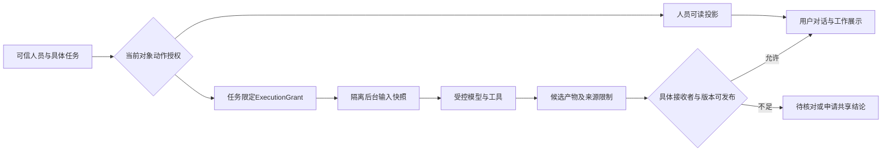

# AI运行、知识、分析与安全设计

技术设计1.0｜2026-09-11｜`PROPOSED / REAL_AI_NOT_VALIDATED`。沿用[34号通用权限](34-任务执行工作台与权限分层设计.md)和[35号体验研究](35-全产品AI体验复核与改进.md)。商务/研发只是示例，规则对所有人员、业务对象和用途生效。

## 1. AI执行架构与身份

Agent内核的最新比较和可实施边界见[57号](57-Agent运行框架最新源码研究.md)、[58号](58-Agent技术架构与性能实施设计.md)。本节“一个SDK循环”约束每个Attempt的实际执行所有权：原SDK为基线，DSH为插件化挑战者，pi/Codex有条件替换；不同时套多层自主循环。运行器原生会话/工具批准不等于企业人员授权、正式审核或交付。跨进程文件锁、数据库租约及提交fence分别验证。

一个SDK负责模型消息/工具循环，协作模块负责人员责任、Attempt、上下文快照、操作证据和交付。不能以加入Spring AI、LangGraph或另一个Agent平台为由产生第二个流程权威。Spring AI提供工具调用与记忆抽象，但工具调用历史、恢复和权限应核固定版本实现，不能把SDK聊天记忆等同于完整业务历史。[Spring AI工具调用](https://docs.spring.io/spring-ai/reference/api/tools.html)、[聊天记忆](https://docs.spring.io/spring-ai/reference/api/chat-memory.html)是当前参考，源码依赖版本以36号为准。

Worker在独立OS进程/容器和任务工作目录运行。任务队列与应用数据库角色限制到必要表；业务内容读取通过带work/purpose/resourceVersion的受控入口。容器默认非root、无宿主目录和Docker socket、只读根文件系统、有限临时盘/CPU/内存/运行时长；任意代码技能在更小的隔离执行器内，不与持有组织连接秘密的服务进程共用权限。

工具调用前后均记录逻辑动作ID与回执。SDK若默认自动循环调用工具，要接入统一ToolGate；不能让未受控工具注册进入默认全局集合。达到次数、预算、期限、深度或上下文上限时返回具体停止原因和已有产物，不能再由另一个协调器无界续跑。

## 2. 权限决策模型

```text
Decision(subject, tenant, object/version, action, purpose, work/epoch, policyRevision, now)
→ ALLOW(allowedFields, constraints, expiresAt) | DENY(publicReason)
```

授权入口复用底座身份和角色/数据范围机制，在确有缺口时增加对象关系与用途约束。管理员、审核人、资料维护人和Worker服务身份都不是“全部业务正文可读”。默认拒绝；未知策略、依赖故障、版本过期不以空数据或默认允许降级。

| 动作 | 判断依据 | 不能隐含的其他权利 |
|---|---|---|
| discover / view_path | 当前工作关系及元数据披露政策 | 不自动暴露节点名、负责人、数量或内部路径 |
| read_content / read_summary | 原文或摘要各自对象、版本、字段与期限 | 可读摘要不开放原文；可读当前版不默认所有历史版 |
| execute_use | 独立ExecutionGrant，限定服务主体、任务、输入及用途 | 不扩大发起人员或当前聊天助手读权 |
| publish_result | 结果digest、来源限制、接收者、审批/规则版本 | 后台已生成不代表可分享；生成者的权限不授予接收人 |
| edit / approve / submit / receive | 当前职责、状态、轮次、版本及独立审核规则 | 读权不等于写权；管理员不代专业决定 |
| export / download / share | 明确对象集合和接收者范围、保留政策 | 预览不自动允许导出；后台批量权限不可回传隐藏总数 |

通用菜单权限只控制入口，业务数据和动作都要执行上述决策。41视角与44历史角色键用于验收夹具，不是要复制成44个硬编码if分支。租户过滤、行级范围、资源关系、字段裁剪和用途共同生效，数据库RLS只是可选纵深控制，不能代替服务端对外部文件和模型输入的授权。

## 3. 人员通道与受限后台通道



用户可追问的对话只能获得人员可读投影及已获准发布的输出。后台原始消息、工具参数、日志和检查点不被附带到用户聊天。输出限制默认继承来源；降低敏感等级需已有明确发布规则或有权人员确认并记录依据，不能只让模型自己脱敏后放行。

撤权时递增policyRevision，撤销相关Grant/Release、失效缓存/订阅，阻止新工具调用及未完成产物发布；Worker收到取消/暂停请求后按真实回执更新。每条延迟输出再次检查policy/epoch/fence；已显示或已导出的内容无法靠“撤权”收回，审计记录事实，后续访问受限。搜索词、文件名、图邻居、小样本聚合、不同错误耗时和数量都纳入泄露负例。

## 4. 知识、本体与记忆

2026-09-11细化见[55号源码与官方研究](55-知识库与记忆开源方案深度研究.md)、[56号实施决策](56-知识记忆技术栈与实施决策.md)。知识/项目文档/任务产物/长期记忆分别管理，以不可变内容版本和业务元数据连接，运行目录按实例、责任轮次、Attempt及执行者隔离。长期记忆采用分作用域的小型主题文档，MEMORY.md仅合成视图；不把全部历史聊天当长期知识。页面延续本次资料、草稿、正式交付与既有路径/摘要页签，普通员工无需设置底层索引参数。

条件技术组合为现有文件/消息服务与关系数据库、LangChain4j；先验证目录/精确/全文读取，Qdrant按语义检索收益启用，Docling按难件启用；不是已采用状态。源码核查发现底座Qdrant查询缺权限filter、缓存缺主体/用途/授权轮次、会话updateMessages无实际写库。M0必须修复并验证，不能以接口类已存在宣称具备安全持久化。撤权还须停止旧执行、重建获准模型上下文、清理派生内容并在恢复备份时应用当前墓碑；30个专项验收见56号。

数据管道：获准源接入→私有暂存→扫描与解析→来源版本/段落定位→chunk及embedding→授权索引→检索重验→答案与引用→候选关系核对→按接收范围发布。解析状态、可检索状态、事实确认和共享发布是四个阶段。数据流失败保留已确认来源和可重试步骤，不产生假引用。

向量检索从可信tenant/subject范围构建filter，检索后再对源对象及字段核验；大规模授权集合需预过滤和分区，不能任意topK后全部删掉而谎称无知识。混合关键词/向量和重排都沿同一可读集合，重排模型也受输入使用权约束。embedding/index版本、维度、分块方法和source digest固定；来源被删除或撤权时立即由读网关拒绝，索引删除异步完成并留回执。

本体先用现有业务ID与`EntityLink/KnowledgeAssertion`关系表表达负责、属于、依赖、生成、引用、取代等。图中节点/边分别有权限和来源版本；没有发现权的节点及数量不返回。实体同名不自动合并；冲突主张并存并交给源事实负责人。实体提取只形成候选，不能写图直接变更任务负责人或批准。

记忆分当前会话、当前任务、本人偏好、共享工作方法。每项含owner、purpose、source、有效期、版本和纠正入口；默认不从一次点赞推断永久偏好。共享需单独授权，删除须覆盖实际存储/索引/缓存范围并按保留规则处理。长期记忆检索和后台学习样本使用权限也不能扩大UI读权。

## 5. 业务分析

不让LLM对任意库执行SQL。首先将问题映射到已发布指标、维度、过滤、时间窗、粒度和允许数据源；只有歧义会改变结论时才澄清。可采用受限AST/查询计划，经列/函数白名单、只读连接、行数/时间/扫描预算限制后执行。用户文字不是SQL片段，参数化并拒绝多语句、写操作、系统表、网络函数和可越权连接。

结果含sourceWatermark、metricVersion、sampleCount、单位/币种、timezone和已授权下钻引用。比率分母为0显示—，样本存在但事件为0显示0，403/超时无可用结果不显示0。图表和明细同源；过期结果不可作为新结论。低样本敏感聚合及重复筛选推断按发布政策抑制，不能把服务账号的更宽统计范围直接给员工。[Fabric权限与只读查询设计](https://learn.microsoft.com/en-us/fabric/data-science/concept-data-agent)作为参考，不假设引入某SDK就已实现这些控制。

## 6. 主动能力与自主进化

主动事件来自现有OA/资料变化/到期/周期机制，经recipient+task+rule+sourceEvent去重，进入opportunity。默认只提示或准备草稿；低风险自动执行必须有已有有限Grant。计划保存、启用、一次触发、一次执行和人员待办分别记录。迟到周期是否补跑必须明确，默认不补发外部写动作；任务结束、转办、授权到期停止相关新触发。

“暂停提醒”“暂停新触发”“取消当前Attempt”是不同命令。取消请求不立即等于取消成功，未知外部效果先查证。多渠道相同事件收敛为同一有效动作，不创建多笔业务。普通员工只看原因、影响、下一步和暂停入口，复杂参数从模板继承。

进化自动化可在已有授权内准备Diff、冻结评估集和运行隔离对照；发布门槛是业务/权限负例无退化、独立复核、限定范围试用与真实回执。基线/候选/案例/模型/工具/政策任一影响性变化使旧评估失效。保留未参与优化的验证集；没有样本就写未评估，不生成提升比例。发布只改变明确的新使用点，在途快照固定；回退不是撤销已发生消息或正式交付。StaffDeck的`static_v1`仅作结构检查参考，不能承担业务效果判定。

## 7. 工具、文件与出站控制

工具定义包含schema、provider、动作范围、风险、身份要求、预算和停止条件。MCP注册不等于任意工具可执行；发现/导入时校验来源、版本、内容摘要及许可，调用时重新解析当前允许动作。HTTP工具限制scheme/host/port及重定向目标，阻断环回、内网探测、云元数据与DNS重绑定路径，按业务确需开放的私网连接单独列明授权。

Worker不将连接秘密放提示词、stdout或产物；出站代理/受保护ToolGate完成解引用，外部日志只记脱敏provider/action/op。原infra公开下载路径必须被禁用/限制到非敏感内容并证明无法绕过；对象存储ACL为私有，授权代理验证每次预览/下载和Range。敏感来源进入模型前还需校验供应商地域、保留/训练政策和组织允许数据分类；没有合法出口时给人工/本地允许方式，不能自动改用另一家模型发送数据。

## 8. 威胁与可验证负例

| 威胁 | 防线 | 必须观察的结果 |
|---|---|---|
| prompt注入让助手忽略规则 | 输入当数据，权限由工具/服务强制 | 检索正文不能使工具获得新动作 |
| 任职/对象ID伪造 | 可信主体、tenant关系、动作重验 | 跨租户/实例统一拒绝且无标题泄漏 |
| 撤权与迟到响应 | policy/epoch/fence及流式发布门 | 旧输出/缓存不能在撤权后恢复可见 |
| 自审批/旧版本提交 | 底座职责和不可变target digest | 模型或作者不能批准自己不具资格的成果 |
| 工具重试重复外发 | logical_action_id、幂等/查证、UNKNOWN | 故障恢复仍只有一个可证业务效果 |
| 文件/导出绕过 | 限制原公开路径、私有存储与统一授权代理 | 拷贝旧URL或访问历史版本仍重验 |
| 插件/技能越权 | 来源锁定、沙箱、动作白名单 | 下载/安装成功不能自动扩大执行权限 |
| 自评分进化 | 固定业务评估+独立复核+试用 | 结构绿灯、点击率和自述不能直接发布 |

这些是实施验收要求。本次只验证文档完整性与架构图，未对真实模型、网络、服务端或文件系统做渗透/授权验收。

## 文章复核增补（2026-09-11）

检索增量、文档地图权限、原子发布、子Agent/直接后端IO及影子评测禁止真实写的补充见[60号](60-最小技术方案与验证决策.md)。逻辑授权约束须贯穿每路召回，不能由ANN物理执行顺序推断已安全；引用发布前按当前policyRevision复核。目录/计数/摘要同样受控。
