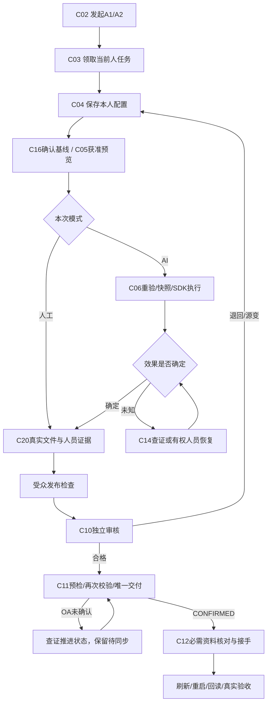

# 全产品实施切片与首期开发规格

开发文档包0.1｜`SPECIFIED_NOT_IMPLEMENTED`｜需求来源：26—35、原30号追踪；实施阶段继承28/43。

## 1. 开发范围与交付定义

首期目标：同一真实人员在同一天发起同模板的两笔业务，分别领取、配置和执行，在各自工作台保存成果，经另一有权人员审核，正式交付并由下游接手；刷新和服务重启后恢复真实状态。人工模式和AI辅助模式均有路径。权限、幂等和版本一致性贯穿首期，不留到“后续加固”。

低代码优先：用候选底座原有设计器配置两节点流程与表单，用已有身份创建测试成员；业务层只补工作合同、任务配置、版本与发布/交付守卫。不得为示例重建身份、流程、插件调度或表单平台。示例表单字段从24号现有字段定义选择，不能把例子固定成只支持商务或研发。

## 2. M0—M5依赖和准入

| 阶段 | 交付 | 依赖 | 实际验收出口 | 不允许提前声明 |
|---|---|---|---|---|
| M0 底座与适配验证 | 固定源码、合法初始化、低代码流程/表单、身份和SDK实验 | 36源码证据与明确实验范围 | 构建成功、真实登录/两实例、原生审批、SDK单次执行、私有文件不可绕过、停启恢复 | 候选被最终采用、全产品可用 |
| M1 最小完整业务链 | M1-01—M1-08、工作区、上下文与交付合同 | M0实际通过且采用记录完整 | 人工与AI各一完整链；刷新/重启/并发/撤权有证据 | 72项AC全部通过 |
| M2 人员协作和资源管理 | 协作贡献、市场、资源版本、SOP、组织细分管理 | M1 | 分工→接受→贡献→汇总→独立审核；复制后补依赖才可用 | 市场复制=任务可执行 |
| M3 知识、分析与团队AI | 知识加工/本体、分析、团队、配置建议 | 来源/权限/版本与M1/M2 | 固定来源问答、数据真零/空值、团队预算、单项采用/撤销 | 结构检查=AI质量提升 |
| M4 主动执行与渠道 | 自动化、机会建议、渠道/专家、集成回执 | 幂等/恢复和可用插件 | 时区/冷却/去重/过期/未知效果验证 | 已接入=可投递成功 |
| M5 有界进化与发布 | 对照评测、独立复核、试用、资源版本发布/回退 | M3/M4的真实数据和回执 | 相同测试集/预算对照、回退、关键回归、发布运维检查 | 候选一例成功=自主进化完成 |

## 3. M1八个可实现故事

### M1-01 登录和双实例工作台

作为发起人，我从同一已发布模板发起A1/A2两项明确业务，看到两个不同实例和本人待办。C02同一幂等键重复返回同一实例；新的意图键生成另一实例。登录、组织、任职和角色复用底座；API从会话派生租户，不接受正文传入主体。待办由C01按本人、角色和对象条件聚合，列表与计数同一授权范围。空列表只有成功授权查询后才出现。

验收：`demo_executor`能看到A1/A2，另一租户看不到标题/数量；两项分别打开且URL、草稿、线程、文件、配置、执行ID均不串。原AC-01/02/03/07按28号逐条核实，合成seed仅帮助建数据，不算执行。

### M1-02 领取、转派和本人配置

作为承担人，我领取合格HumanTask，在P04选择人工或数字员工，默认继承本任务必需输出及预算。C03在OA权威任务执行原子资格检查；C04同时核`humanTaskId + workId + responsibilityEpoch + expectedRevision`。保存配置版本不启动任务。私人偏好只能影响允许覆盖字段，不能覆盖必需输入、审核和组织限额。

两人同时领取只有一个成功；另一人409后重新读取，保留不含秘密的草稿。转派/返工使旧epoch失效，旧Binding失效，旧执行不可提交。按钮不能靠本地角色数组自行启用。低代码只配置可编辑字段及显示规则，服务端守卫保持代码实现或底座原生能力。

### M1-03 来源确认与执行快照

作为承担人，我能看到任务必需事实与自己获准查看的来源；欠缺内容时定位有权补充入口。C16事实提案由有权人员确认形成不可变Baseline；C05只返回人员预览，不能显示后台私有上下文。C06启动前重验来源、用途、授权、目标模型/工具、预算及当前轮次，生成Manifest和ExecutionSnapshot。预览成功不能充当执行授权。

验收：预览后修改/撤销一个必需来源，启动必须阻断或重核；同人另一实例的资料不得自动进入本实例；后台服务拥有来源用权时仍不公开给人。权限服务不可用显示真实503恢复入口。

### M1-04 有界执行与人工替代

作为承担人，我启动一次AI辅助执行，查看阶段和获准发布的成果。底座SDK负责唯一执行循环、工具与检查点；本项目负责绑定快照、fence、幂等和输出边界。C06返回202/QUEUED只代表受理，C01/C07显示真实执行状态。工具异常按动作风险处理，外部写超时进入RESULT_UNKNOWN，只有C14查证，不自动再发。

人工模式不调用模型，仍有实际文件、来源版本、人员证据和必要审核。SDK不支持暂停/恢复时不显示可用按钮；提供“取消后创建新执行”时必须说明新Attempt和仍可能未确认的副作用，不能伪装续跑。

### M1-05 产物与受众发布

作为承担人，我在右侧预览文档和版本，或上传实际成果。上传按prepare→字节隔离区→服务端校验digest/大小/MIME/扫描→complete形成ArtifactVersion。不能信任浏览器声称上传成功。执行结果先成为候选，再按受众和来源版本形成OutputRelease；未获准内容不能进入人员HTTP、SSE、DOM、缓存、缩略图和摘要。

验收：文件名同名不同版本保持可区分；旧版下载、Range和缩略图都重验；受限文件没有公开存储URL旁路。不可预览时提供获准下载/重新上传，保留实际解析失败，不生成假正文。

### M1-06 独立审核与退回

作为审核人，我读取明确候选版本、依据及差异，对自己有权且独立的请求做批准、拒绝或退回。审核回执绑定候选集摘要、基线和责任轮次。候选修改使回执OBSOLETE，不能挪用旧批准。自批、服务账号代批和管理员自动豁免均拒绝。

退回产生新的责任轮次/任务事实；旧任务历史保留。UI给承担人显示退回理由和可披露差异，不静默将旧审核状态抹成待办。

### M1-07 唯一交付及OA推进

作为承担人，我看到交付检查结果并确认提交。C11预检只提供有期限的检查凭据；提交事务再次比较epoch、工作revision、候选digest、Baseline、审批、源文件可用性和运行fence。人工路径检查manualProvenance，AI路径检查Attempt确定成功及snapshot。

唯一约束为`tenant + work + responsibilityEpoch`。原子范围可包含同库OA事务时一起提交；跨边界先记录PENDING_COMMIT与Outbox，用底座支持的幂等业务键推进并查证；没有OA确认不显示已交付。不假装跨库事务，不重复创建下游任务。

### M1-08 下游接手及重启恢复

作为下游承担人，我核对交接包版本和必需资料后接手。C12同时判断当前接收责任和必需附件对接手人的读权；后台可用不足以证明人能接手。重复接手返回原receipt。文件撤权或交付变更时阻断，不保留“可开始”按钮。

完成一条链后刷新浏览器、重新登录和重启已选服务，回读真实工作、版本、交付和接手；SSE断线恢复不能再次执行C06/C11。以数据库/接口事实加浏览器证据验收。

## 4. 首期调用链与失败回路

图中查证不是无界循环：交互查证一次；自动退避最多3次且不再发原副作用；仍未知转有权人员恢复，不能升级为成功。退回需有新输入或版本，不能无条件反复运行。

## 5. AI编程任务包与文件定位

继续使用当前任务记录中的intent/spec/plan。每个实施任务选择一个故事，列出原需求ID、AC/EW、精确命令动作、表/底座等价记录、页面、正负例和回滚点。未采用底座前不虚构Java类路径或前端路由文件。M0采用后先定位已选仓的真实模块和测试入口，将`base_module_ref → actual_file`登记进同一任务，再允许写产品代码。

完成定义：对应原AC的真实行为、精确合同和必要负例均通过；代码生成器或AI写出文件不算完成。未进入本切片的能力保留需求、优先级和后续切片，不强行给它们赋实现状态。

## 6. 全产品领域切片

以下切片与[173项实施映射](../../contracts/implementation-map.json)相连。每条原需求保留原验收及负例；动作列表是精确合同的领域归属，尚不是源代码行级追踪。EW在30号中本身没有caseIds，继续作为EW独立验收，不伪造AC编号。

<!-- DOMAIN_SLICES -->

### SL-WD 员工工作台

阶段：M1。前置：M0合格底座与原生机制映射；M2以后依赖M1权限/版本/交付基础。
复用：原生待办/筛选/发起表单。最小扩展：只补统一工作投影、实例隔离和状态解释。
需求：WD-01, WD-02, WD-03, WD-04, WD-05, WD-06, AI-01。
命令：C01, C02, C03, C04, C15；逐动作字段见48号和命令参考。
页面：P01, P02, P04, P21, P22。
验收：逐条执行implementation-map中的normativeAcceptance与negative，再执行原30号关联AC/EW；成功需实际输出/版本回读，失败必须能恢复。
失败/回退：保留原资源与已发布版本；禁用新增配置/插件入口或回退兼容版本；不得清空历史、扩大权限或删原需求。

### SL-HR 人员职责

阶段：M1/M2。前置：M0合格底座与原生机制映射；M2以后依赖M1权限/版本/交付基础。
复用：原生组织/任务领取/转派。最小扩展：轮次变更、协作父子合同，不重建负责人权威。
需求：HR-01, HR-02, HR-03, HR-04, HR-05, HR-06。
命令：C03, C08, C24；逐动作字段见48号和命令参考。
页面：P02, P03, P18。
验收：逐条执行implementation-map中的normativeAcceptance与negative，再执行原30号关联AC/EW；成功需实际输出/版本回读，失败必须能恢复。
失败/回退：保留原资源与已发布版本；禁用新增配置/插件入口或回退兼容版本；不得清空历史、扩大权限或删原需求。

### SL-NC 节点执行配置

阶段：M1/M3。前置：M0合格底座与原生机制映射；M2以后依赖M1权限/版本/交付基础。
复用：原生参数表单/个人偏好。最小扩展：绑定版本、必需字段覆盖规则、单项AI建议。
需求：NC-01, NC-02, NC-03, NC-04, NC-05, NC-06, NC-07, NC-08, AI-02, AI-03。
命令：C04, C05, C06, C07, C27；逐动作字段见48号和命令参考。
页面：P02, P04, P05, P14, P21, P22。
验收：逐条执行implementation-map中的normativeAcceptance与negative，再执行原30号关联AC/EW；成功需实际输出/版本回读，失败必须能恢复。
失败/回退：保留原资源与已发布版本；禁用新增配置/插件入口或回退兼容版本；不得清空历史、扩大权限或删原需求。

### SL-AG 数字员工资产

阶段：M2。前置：M0合格底座与原生机制映射；M2以后依赖M1权限/版本/交付基础。
复用：原生Agent资源及版本发布。最小扩展：本人/共享/推荐、任务可用性和复制谱系。
需求：AG-01, AG-02, AG-03, AG-04, AG-05, AG-06, AG-07。
命令：C13, C17；逐动作字段见48号和命令参考。
页面：P05, P22。
验收：逐条执行implementation-map中的normativeAcceptance与negative，再执行原30号关联AC/EW；成功需实际输出/版本回读，失败必须能恢复。
失败/回退：保留原资源与已发布版本；禁用新增配置/插件入口或回退兼容版本；不得清空历史、扩大权限或删原需求。

### SL-SK 技能

阶段：M2。前置：M0合格底座与原生机制映射；M2以后依赖M1权限/版本/交付基础。
复用：原生技能编辑/测试/发布。最小扩展：输入输出合同、依赖及商用来源准入。
需求：SK-01, SK-02, SK-03, SK-04, SK-05, SK-06, SK-07。
命令：C05, C13, C17；逐动作字段见48号和命令参考。
页面：P04, P06, P22。
验收：逐条执行implementation-map中的normativeAcceptance与negative，再执行原30号关联AC/EW；成功需实际输出/版本回读，失败必须能恢复。
失败/回退：保留原资源与已发布版本；禁用新增配置/插件入口或回退兼容版本；不得清空历史、扩大权限或删原需求。

### SL-CN 连接器与外部动作

阶段：M1/M2。前置：M0合格底座与原生机制映射；M2以后依赖M1权限/版本/交付基础。
复用：原生OpenAPI/MCP/连接身份。最小扩展：用途Grant、目的地、幂等回执、撤权。
需求：CN-01, CN-02, CN-03, CN-04, CN-05, CN-06, CN-07, CN-08, CN-09, AI-04。
命令：C07, C14, C18, C28；逐动作字段见48号和命令参考。
页面：P01, P02, P04, P07, P19, P22。
验收：逐条执行implementation-map中的normativeAcceptance与negative，再执行原30号关联AC/EW；成功需实际输出/版本回读，失败必须能恢复。
失败/回退：保留原资源与已发布版本；禁用新增配置/插件入口或回退兼容版本；不得清空历史、扩大权限或删原需求。

### SL-KB 知识与引用

阶段：M3。前置：M0合格底座与原生机制映射；M2以后依赖M1权限/版本/交付基础。
复用：原生摄取/解析/检索/引用。最小扩展：来源版本授权、关系确认与输出发布。
需求：KB-01, KB-02, KB-03, KB-04, KB-05, KB-06, KB-07, AI-07, AI-08。
命令：C05, C06, C17, C19, C22, C30, C31；逐动作字段见48号和命令参考。
页面：P02, P06, P08, P09, P14, P16, P19, P20。
验收：逐条执行implementation-map中的normativeAcceptance与negative，再执行原30号关联AC/EW；成功需实际输出/版本回读，失败必须能恢复。
失败/回退：保留原资源与已发布版本；禁用新增配置/插件入口或回退兼容版本；不得清空历史、扩大权限或删原需求。

### SL-MM 记忆与经验

阶段：M3/M5。前置：M0合格底座与原生机制映射；M2以后依赖M1权限/版本/交付基础。
复用：原生记忆/资源版本。最小扩展：范围隔离、纠正与经验证经验发布。
需求：MM-01, MM-02, MM-03, MM-04, MM-05, MM-06, MM-07, AI-12。
命令：C16, C19, C25；逐动作字段见48号和命令参考。
页面：P01, P09, P19, P20, P21, P22。
验收：逐条执行implementation-map中的normativeAcceptance与negative，再执行原30号关联AC/EW；成功需实际输出/版本回读，失败必须能恢复。
失败/回退：保留原资源与已发布版本；禁用新增配置/插件入口或回退兼容版本；不得清空历史、扩大权限或删原需求。

### SL-WS 工作空间与产物

阶段：M1/M2。前置：M0合格底座与原生机制映射；M2以后依赖M1权限/版本/交付基础。
复用：原生文件/版本/目录/预览。最小扩展：私有访问代理、发布副本和版本合并候选。
需求：WS-01, WS-02, WS-03, WS-04, WS-05, WS-06。
命令：C20, C25；逐动作字段见48号和命令参考。
页面：P02, P10。
验收：逐条执行implementation-map中的normativeAcceptance与negative，再执行原30号关联AC/EW；成功需实际输出/版本回读，失败必须能恢复。
失败/回退：保留原资源与已发布版本；禁用新增配置/插件入口或回退兼容版本；不得清空历史、扩大权限或删原需求。

### SL-CV 对话与执行

阶段：M1。前置：M0合格底座与原生机制映射；M2以后依赖M1权限/版本/交付基础。
复用：原生会话与SDK事件。最小扩展：任务唯一线程、公开摘要、断线/未知效果恢复。
需求：CV-01, CV-02, CV-03, CV-04, CV-05, CV-06, CV-07, AI-10, EW-01, EW-02, EW-03, EW-04, EW-05, EW-06, EW-07, EW-08。
命令：C01, C05, C06, C07, C09, C10, C14, C15, C20, C23, C24, C28；逐动作字段见48号和命令参考。
页面：P01, P02, P08, P10, P11, P19, P20。
验收：逐条执行implementation-map中的normativeAcceptance与negative，再执行原30号关联AC/EW；成功需实际输出/版本回读，失败必须能恢复。
失败/回退：保留原资源与已发布版本；禁用新增配置/插件入口或回退兼容版本；不得清空历史、扩大权限或删原需求。

### SL-TM 数字员工团队

阶段：M3。前置：M0合格底座与原生机制映射；M2以后依赖M1权限/版本/交付基础。
复用：原生Agent团队/SDK编排。最小扩展：成员任务用途与共享预算；失败不冒充汇总成功。
需求：TM-01, TM-02, TM-03, TM-04, TM-05, TM-06。
命令：C06, C07, C21；逐动作字段见48号和命令参考。
页面：P02, P12。
验收：逐条执行implementation-map中的normativeAcceptance与negative，再执行原30号关联AC/EW；成功需实际输出/版本回读，失败必须能恢复。
失败/回退：保留原资源与已发布版本；禁用新增配置/插件入口或回退兼容版本；不得清空历史、扩大权限或删原需求。

### SL-FL 节点执行方案

阶段：M2/M3。前置：M0合格底座与原生机制映射；M2以后依赖M1权限/版本/交付基础。
复用：原生节点方案/图编辑器。最小扩展：合法出口/输入输出检查及列表替代，不增加循环。
需求：FL-01, FL-02, FL-03, FL-04, FL-05, FL-06。
命令：C06, C07, C17；逐动作字段见48号和命令参考。
页面：P04, P13。
验收：逐条执行implementation-map中的normativeAcceptance与negative，再执行原30号关联AC/EW；成功需实际输出/版本回读，失败必须能恢复。
失败/回退：保留原资源与已发布版本；禁用新增配置/插件入口或回退兼容版本；不得清空历史、扩大权限或删原需求。

### SL-AT 自动化

阶段：M4。前置：M0合格底座与原生机制映射；M2以后依赖M1权限/版本/交付基础。
复用：原生调度器/触发设计器。最小扩展：时区、去重、冷却、有界授权与过期停止。
需求：AT-01, AT-02, AT-03, AT-04, AT-05, AT-06, AI-09。
命令：C19, C22, C27；逐动作字段见48号和命令参考。
页面：P09, P11, P14, P21。
验收：逐条执行implementation-map中的normativeAcceptance与negative，再执行原30号关联AC/EW；成功需实际输出/版本回读，失败必须能恢复。
失败/回退：保留原资源与已发布版本；禁用新增配置/插件入口或回退兼容版本；不得清空历史、扩大权限或删原需求。

### SL-IM 消息渠道与专家协作

阶段：M4。前置：M0合格底座与原生机制映射；M2以后依赖M1权限/版本/交付基础。
复用：原生渠道/专家/回调适配。最小扩展：成员和工作映射、签名回执、意见不代审批。
需求：IM-01, IM-02, IM-03, IM-04, IM-05, IM-06。
命令：C15, C23；逐动作字段见48号和命令参考。
页面：P15, P21。
验收：逐条执行implementation-map中的normativeAcceptance与negative，再执行原30号关联AC/EW；成功需实际输出/版本回读，失败必须能恢复。
失败/回退：保留原资源与已发布版本；禁用新增配置/插件入口或回退兼容版本；不得清空历史、扩大权限或删原需求。

### SL-RS 成果验收与交接

阶段：M1/M2。前置：M0合格底座与原生机制映射；M2以后依赖M1权限/版本/交付基础。
复用：原生审批/文件版本/流程推进。最小扩展：候选摘要审核、唯一交付、下游必需输入接手。
需求：RS-01, RS-02, RS-03, RS-04, RS-05, RS-06, RS-07。
命令：C09, C10, C11, C12, C14；逐动作字段见48号和命令参考。
页面：P02, P16。
验收：逐条执行implementation-map中的normativeAcceptance与negative，再执行原30号关联AC/EW；成功需实际输出/版本回读，失败必须能恢复。
失败/回退：保留原资源与已发布版本；禁用新增配置/插件入口或回退兼容版本；不得清空历史、扩大权限或删原需求。

### SL-SD SOP设计

阶段：M0/M2。前置：M0合格底座与原生机制映射；M2以后依赖M1权限/版本/交付基础。
复用：原生SOP/流程/表单设计器。最小扩展：节点输入输出合同、责任和人员预览、发布校验。
需求：SD-01, SD-02, SD-03, SD-04, SD-05, SD-06。
命令：C02, C26；逐动作字段见48号和命令参考。
页面：P17。
验收：逐条执行implementation-map中的normativeAcceptance与negative，再执行原30号关联AC/EW；成功需实际输出/版本回读，失败必须能恢复。
失败/回退：保留原资源与已发布版本；禁用新增配置/插件入口或回退兼容版本；不得清空历史、扩大权限或删原需求。

### SL-AD 组织权限与资产管理

阶段：M0/M2。前置：M0合格底座与原生机制映射；M2以后依赖M1权限/版本/交付基础。
复用：原生组织/岗位/Grant/隐私申请。最小扩展：细分管理动作；无通用管理员读全部私有内容。
需求：AD-01, AD-02, AD-03, AD-04, AD-05, AD-06, AD-07, AD-08。
命令：C18, C24, C25；逐动作字段见48号和命令参考。
页面：P07, P18, P22。
验收：逐条执行implementation-map中的normativeAcceptance与negative，再执行原30号关联AC/EW；成功需实际输出/版本回读，失败必须能恢复。
失败/回退：保留原资源与已发布版本；禁用新增配置/插件入口或回退兼容版本；不得清空历史、扩大权限或删原需求。

### SL-OP 运行与体验质量

阶段：M1/M3。前置：M0合格底座与原生机制映射；M2以后依赖M1权限/版本/交付基础。
复用：原生日志/监控/用量/图表。最小扩展：脱敏投影、操作查证、指标口径与分析解释。
需求：OP-01, OP-02, OP-03, OP-04, OP-05, OP-06, OP-07, OP-08, AI-05, AI-06。
命令：C14, C15, C19, C25, C29, C30；逐动作字段见48号和命令参考。
页面：P01, P08, P14, P19, P20, P21, P22。
验收：逐条执行implementation-map中的normativeAcceptance与negative，再执行原30号关联AC/EW；成功需实际输出/版本回读，失败必须能恢复。
失败/回退：保留原资源与已发布版本；禁用新增配置/插件入口或回退兼容版本；不得清空历史、扩大权限或删原需求。

### SL-HC 人员与数字员工关系

阶段：M1/M2。前置：M0合格底座与原生机制映射；M2以后依赖M1权限/版本/交付基础。
复用：原生成员/任务/Agent配置关系。最小扩展：本人配置、代理不能代替自然人确认。
需求：HC-01, HC-02, HC-03, HC-04, HC-05, HC-06, HC-07, HC-08。
命令：C08, C09, C21, C23；逐动作字段见48号和命令参考。
页面：P02, P03, P22。
验收：逐条执行implementation-map中的normativeAcceptance与negative，再执行原30号关联AC/EW；成功需实际输出/版本回读，失败必须能恢复。
失败/回退：保留原资源与已发布版本；禁用新增配置/插件入口或回退兼容版本；不得清空历史、扩大权限或删原需求。

### SL-CX 上下文构建与消费

阶段：M1/M3。前置：M0合格底座与原生机制映射；M2以后依赖M1权限/版本/交付基础。
复用：原生知识/文件/上下文注入扩展。最小扩展：基线/Manifest/快照/装载证据、权限分层。
需求：CX-01, CX-02, CX-03, CX-04, CX-05, CX-06, CX-07, CX-08, CX-09, CX-10, CX-11, CX-12。
命令：C05, C06, C16；逐动作字段见48号和命令参考。
页面：P04, P20, P22。
验收：逐条执行implementation-map中的normativeAcceptance与negative，再执行原30号关联AC/EW；成功需实际输出/版本回读，失败必须能恢复。
失败/回退：保留原资源与已发布版本；禁用新增配置/插件入口或回退兼容版本；不得清空历史、扩大权限或删原需求。

### SL-SY 上下文变更与一致性

阶段：M1/M3。前置：M0合格底座与原生机制映射；M2以后依赖M1权限/版本/交付基础。
复用：原生版本通知/事件机制。最小扩展：源变影响图、旧结果失效、撤权代次与重核。
需求：SY-01, SY-02, SY-03, SY-04, SY-05, SY-06, SY-07, SY-08, SY-09, SY-10, AI-11。
命令：C07, C09, C10, C11, C12, C14, C16, C24；逐动作字段见48号和命令参考。
页面：P02, P04, P16, P19, P20, P22。
验收：逐条执行implementation-map中的normativeAcceptance与negative，再执行原30号关联AC/EW；成功需实际输出/版本回读，失败必须能恢复。
失败/回退：保留原资源与已发布版本；禁用新增配置/插件入口或回退兼容版本；不得清空历史、扩大权限或删原需求。

<!-- DOMAIN_SLICES_END -->

## 7. 每个切片的接续规则

1. 读该领域在30号中的原需求及全部原AC，不用本表摘要替代。
2. 从48/49确定动作、DTO、权威记录、复用能力和新增理由；不能把候选扩展表全部建立。
3. 用原生设计器配置可配置部分并导出版本包，记录模板/表单/规则/插件版本；代码只实现差异。
4. 写一个成功场景和至少一个最重要的失败场景，先验证服务端再验证界面。
5. 独立检查真实产物/回执，更新同一任务证据和需求状态；未运行项保持NOT_RUN。
