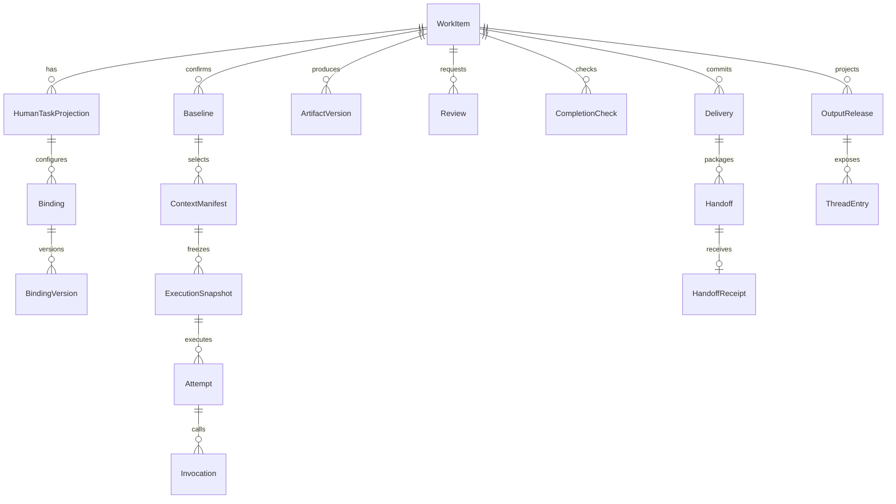

# 字段级数据模型与迁移规范

开发文档包0.1｜`CANDIDATE_NOT_DATABASE_VALIDATED`。本文件细化27/39；[字段字典](../../contracts/data-dictionary.md)与[data-model.json](../../contracts/data-model.json)列出每列类型、空值、默认值、主外键、唯一约束和索引。MySQL 8.4候选DDL只供审查，没有在数据库执行。

## 1. 低代码复用与物理边界

优先复用底座身份、组织、角色、流程、原生表单、资源版本、文件、调度、知识摄取、会话与SDK持久化。用原生扩展字段/关联表/SPI实现新增语义，避免复制同一权威事实。

34张候选表描述所需持久化结构，不是开工建表清单。[storage-reuse-plan.json](../../contracts/storage-reuse-plan.json)逐项指明复用方向；M0必须映射到选定底座真实表/字段/约束，只有存在确证缺口才采用对应扩展DDL。不能把原生低代码表单再逐字段拷贝到一套自造业务表；业务字段通过已发布FormVersion和受控值表/JSON保存。

原有身份和流程状态使用适配器解析外部引用，不建立跨数据库外键。HumanTask中的assignee和state只能是底座权威投影；WorkItem没有第二个负责人字段。人工独立任务也复用底座任务机制或统一任务服务，不另起一套分配循环。

## 2. 记录分组与关系

图表示业务关系，不表示所有实体必须新建表。每个版本引用含kind/id/version/digest；相同artifactId不同version不是同一成果。Workflow模板/实例/节点任务/AI运行的ID空间与业务含义不能混用。

## 3. 字段约束和租户隔离

| 类型 | 存储约定 | 应用守卫 |
|---|---|---|
| 本地实体ID | VARCHAR(64)，复合主键tenant_id/id，utf8mb4_bin | API仅ASCII不透明ID；不可凭ID跳过租户过滤 |
| 版本与轮次 | BIGINT UNSIGNED，默认1 | 范围不得超过JSON安全整数；更新CAS并递增 |
| 摘要 | VARCHAR(71)，sha256前缀+64小写hex | 文件摘要基于实际字节；结构摘要见下节 |
| 时间 | DATETIME(6)，统一UTC | API校验时区、范围和失效；不得用客户端当前时间决定权限 |
| 精确金额 | 业务Schema十进制字符串；原生表单数值列应DECIMAL | 不用binary float；精度及币种按表单合同 |
| JSON | 标注具体SchemaRef，写入前验证；受限内容按原生存储安全措施保护 | 不允许任意JSON绕过命令/字段权限 |
| 外部引用 | 底座原ID或VersionedRef | 服务端核租户、kind、版本、摘要、用途和关联工作 |

每个本地外键必须包含tenant_id，引用目标同租户主键或唯一键；MySQL对应索引要求见[官方外键约束](https://dev.mysql.com/doc/refman/8.4/en/create-table-foreign-keys.html)。同租户外键只阻止跨租户串联，不能替代`binding.human_task_id`确实属于`binding.work_id`等关系检查。关联工作、binding版本、baseline、candidate集合在事务中显式核对。

不可变的配置、基线、贡献、产物字节和回执不得原位覆盖。扫描状态、发布状态、撤权投影属于可变控制字段，不能因“版本不可变”拒绝安全状态更新；实现优先使用原生版本表+状态投影。生产不可变性由服务入口、数据库权限/约束与审计共同保证，本候选DDL没有声称已强制所有状态转换。

## 4. 结构摘要规范

文件digest严格取原始字节SHA256。JSON结构digest采用以下受限规范化配置，不直接以任意语言默认JSON序列化求摘要：只允许UTF-8、无重复键、键按Unicode码点排序、无多余空白、字符串按JSON转义且不做Unicode归一化；浮点数不得进入需签名对象，精确小数使用字符串，整数限制安全范围。数组若表示有序步骤保留顺序；集合型VersionedRef数组先按kind/id/version/digest排序且去重。

对象自身digest字段从摘要输入排除，sourceRef内的digest保留。摘要包显式含schemaVersion、业务种类与对象版本；请求摘要另外含规范HTTP方法/路径/command。上线前前后端/Java之间共享固定向量，不能各自定义排序。API和数据库比对摘要也必须核真实来源版本，摘要不能授予权限。

## 5. 首期事务与竞争

| 事务 | 比较/锁定 | 同原子范围写入 | 外部失败/恢复 |
|---|---|---|---|
| 领取/转派 | OA人任务revision、候选资格、现承担人 | 原生OA责任；epoch变更和失效事件同受控服务 | 无OA确认不返回已领取 |
| 配置保存 | work/humanTask/epoch/revision、字段覆盖规则 | binding当前指针与新binding_version | 冲突409，草稿不覆盖新值 |
| 开始执行 | 当前责任、来源授权、模型目标、预算 | operation、manifest、snapshot、attempt、outbox | worker未收到可重投事件，不新建Attempt |
| 外部调用 | effect_key、有效grant/fence、预算 | invocation PREPARED/DISPATCHED与真实回执 | 未知进入RESULT_UNKNOWN，先查证 |
| 正式交付 | 全守卫；相同work/epoch唯一；review目标摘要 | delivery、工作投影、outbox；同库时纳入OA原事务 | 跨边界PENDING_COMMIT，凭幂等业务键查OA |
| 接手 | 包版本、接收轮次、必需资料对人可读 | 唯一receipt与任务接手状态 | 收据幂等重读，不能重复建下游 |
| 消费事件 | consumer/source/eventId和payload digest | inbox插入与本地业务变化 | 同ID异载荷拒绝并留安全审计 |

统一锁顺序建议：work→humanTask/责任→binding→baseline/审核→operation/delivery；源码使用底座事务管理。跨网络不持有长DB事务锁；网络动作先记录意图，事务外派发，回执再CAS。数据库隔离级别按选定底座验证，不能用“默认隔离足够”代替并发测试。

## 6. 初始化、升级和回滚

[候选SQL](../../contracts/migrations/mysql-candidate/V001__oa_extension_candidate.sql)不包含底座身份/BPM/AI初始化，也不包含DROP、清空、真实账号或种子密码。原始候选SQL与产品实际迁移文件分目录管理，框架不得自动扫描这个参考目录。

M0先取固定commit的合法初始化来源，审查每条破坏性语句，在隔离空库验证；再形成逐表复用计划。正式迁移工具沿用底座已有Flyway/Liquibase/版本SQL机制，不能两套并存。第一次采用时把必要差异改写进原迁移目录，填checksums和真实执行记录。

| 场景 | 迁移策略 | 验证与恢复 |
|---|---|---|
| 新增可选字段 | expand：兼容读者，nullable/default有依据 | 旧应用读取新库、新应用读取缺值各验证 |
| 新增必需字段/索引 | 先可选→分批回填/校验→约束 | 重复值/跨租户/空值报告；不能直接全表覆盖 |
| 改字段含义/Schema | 新版本并存；有界转换，保留来源摘要 | 双版本读取与回退；不可改旧交付字节 |
| 下线插件/字段 | 先禁新引用，再查历史/运行依赖 | 保留版本与审计；有引用不能卸载底层数据 |
| 应用回退 | 回到兼容旧二进制和配置，优先前向修复 | 数据备份恢复须专门授权与演练，不能自动执行down/drop |

MySQL DDL存在隐式提交；不得在文档中承诺用事务回滚整个DDL。引擎端建表/索引耗时、锁等待、执行计划、字符排序、JSON支持和备份恢复均须真实MySQL验证。本机只做静态检查，没有MySQL客户端或数据库执行证据。

## 7. 保留、撤权与删除

记录保留期由组织要求和业务合同配置，普通员工无需逐表设置。operation终态至少覆盖重试窗口；UNKNOWN、未接手交付和法律/业务保留记录禁止自动清理。已撤权不等于删除审计；删除申请走C24 privacy及底座原机制，只有有权审批后的具体范围可执行。

短期上传隔离区与失效草稿可配置清理，实施时先生成候选报告，检查引用、保留锁和正在执行任务，再执行获准清理。备份、搜索索引、预览缓存和对象存储生命周期必须同步考虑；权限变化优先失效访问，异步清理不是权限门禁。
