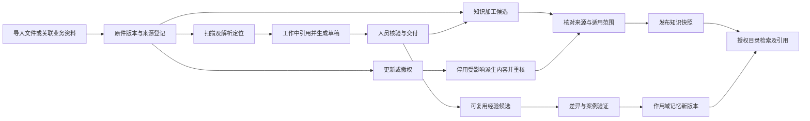
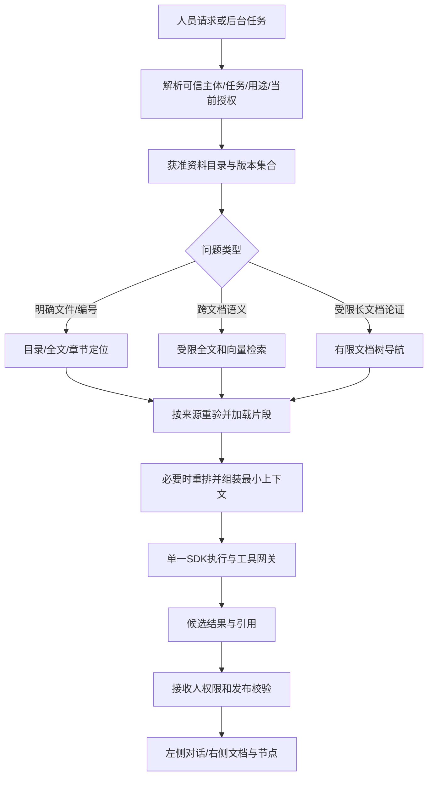

# 数字员工文档工作空间、知识与记忆最佳实践及实施决策

日期：2026-09-11。依据：[55号最新研究](55-知识库与记忆开源方案深度研究.md)。状态：`PROPOSED / NOT_IMPLEMENTED / RELEASE_NOT_CLEARED`。本文是本项目设计推导，运行验证全部待执行；不改变36/46号底座未定的事实。

## 1. 采用什么管理方式

采用**文档优先、作用域明确、版本可追溯、运行工作区隔离、索引按需生成**的方式。员工看到熟悉的资料、草稿、交付和经验；数字员工通过同一对象版本读取内容。数据库管理业务状态和权限，文件服务保存内容版本，向量/全文/关系视图帮助查找。

不要求普通员工维护Markdown语法。正文编辑器与Markdown源视图指向同一个文档版本。PDF、Office、图片等保留原件；解析Markdown、页面坐标、表格结构作为派生内容，不能用纯文本替换原件或法定记录。

“最佳实践”指本项目根据最新证据采用的推荐模式。只有同一业务样本、角色权限与资源条件下的对照验证，才能证明某检索/记忆实现更好。参考产品功能、论文分数和文档校验均不能替代这一验证。

## 2. 四种业务内容与一个运行空间

| 内容 | 回答的问题 | 权威来源与维护方式 | 不应承载 |
|---|---|---|---|
| 项目文档 | 这个项目的目标、规范、材料是什么 | 项目所有者维护版本化资料；其他空间以引用关联 | 每个AI复制一份后各自更新 |
| 任务资料与交付 | 本次用了什么、做到了哪、交给谁 | 业务实例/人员任务/Attempt/ArtifactVersion与确认记录 | 用聊天摘要替代正式交付、审批或OA状态 |
| 主题知识库 | 哪些稳定资料可反复问答、引用 | KnowledgeSource/Version及发布快照；按主题维护，不强制部门拆库 | 临时问题、所有原始聊天、未核实的AI草稿 |
| 长期记忆与经验 | 在什么范围内，下次可以少说什么 | MemoryVersion正文+来源+作用域+确认/失效记录 | 凭据、实时业务状态、未经确认的结论、权限策略 |
| 运行工作区 | 这次数字员工在哪读、写、验证 | 受控Worker临时目录与资源挂载，由Attempt管理 | 企业知识总盘、永久员工私人资料堆、授权权威 |

数字员工是可复用执行者。**相同数字员工服务不同人、不同项目和不同任务，不能共享一个无边界的可写目录或MEMORY.md。** 人员个人记忆与数字员工通用工作规范分开，群记忆与单聊记忆分开；资源分配和本次动作授权分别验证。

## 3. 唯一内容版本与目录管理

### 3.1 对用户的组织方式

知识入口沿用P08；任务内P02/P11右侧沿用文件夹与文档展示。顶层按“我维护、共享给我、任务可使用”过滤；某人无正文读取权时，是否能看到资源名称和存在性仍由元数据权限决定，不默认展示。

同一空间建议最多两至三级主题目录，使用标签、业务对象和版本筛选处理交叉分类。目录仅用于导航，不能代替ACL。原文件ID在重命名/移动后保持稳定；多个文件夹可引用同一资料，不复制正文。跨权限域移动默认保留原授权，扩大范围另走发布。跨租户内容不做可被用户探测的去重。

任务右侧采用三组自动生成的资料视图：

1. **本次资料**：已授权输入、模板和引用，显示来源/版本/就绪状态。
2. **工作草稿**：人工和AI的候选、修订差异、待处理冲突。
3. **正式交付**：有人员确认的不可变版本，能返回对应节点和责任轮次。

历史摘要、路径仍是已有页签，不再增加一套“Agent记忆文件管理器”。知识维护者能在资料/知识卡之间切换；个人经验在员工详情或个人偏好中维护。

### 3.2 对系统的存储方式

| 数据 | 单一权威 | 派生物 |
|---|---|---|
| 文档正文/二进制原件 | 不可变内容对象，`storageRef + digest` | 预览、Markdown、OCR、表格JSON、缩略图 |
| 对象归属/标题/版本指针/发布状态 | 既有业务数据库 | 文件树、卡片、搜索结果 |
| 工作责任/审批/交付状态 | 选定OA引擎与现有业务合同 | 鱼骨图、上下文说明文档 |
| 记忆正文 | 每个MemoryVersion引用一个内容对象 | 分类卡片、当前作用域的MEMORY.md合成视图、检索索引 |
| 权限/授权轮次/撤权墓碑 | 现有统一授权服务及记录 | 只读挂载清单、索引过滤字段、缓存键 |
| 工作过程原始记录 | 受保护会话/Attempt事件与业务证据 | 进度摘要、经验候选 |

一个版本不同时在MySQL正文列、共享磁盘和向量payload中保持三份独立可写主数据。允许为性能产生副本，但它们必须带相同来源版本与重建机制，禁止直接编辑索引来“修正业务事实”。

保存顺序：上传不可变内容 → 扫描与摘要校验 → 数据库事务登记版本、CAS更新当前指针并写Outbox → 派生处理。失败上传对象暂不发布，按保留期清理孤立对象；Outbox重复消费按可信`tenantId + sourceId + 完整sourceVersionRef + stage/eventType + parserVersion + indexVersion`幂等，不能用多个文件都可能具有的“v1”作版本身份。权限投影/撤权任务另含policyRevision；每次消费和发布派生结果时重验当前墓碑与来源有效性，拒收撤权前迟到结果。采用前先映射49号与底座原生表，不直接再创建同名表。

## 4. 文档、知识卡和记忆如何闭环



### 4.1 导入与加工

系统自动识别格式、保留原件、计算内容摘要、关联来源和默认可见范围。用户通常只需选择资料及用途；模型、分块长度、向量维度等由管理员发布的处理模板提供。失败页面支持重试、替换文件和人工维护，不要求用户自己诊断模型协议。

解析输出至少含正文块、标题层级、页码或段落定位、表格行列、原件版本、解析器版本和质量提示。中文扫描件、跨页表格、合并单元格与图片说明单独评测。提取不到页码时展示“段落定位”，不能伪造页码。无法可靠解析的附件可保留供人工阅读，AI状态显示“尚不可可靠引用”。

允许直接引用已发布文档，不强制每份资料先编译为知识卡。卡片适合FAQ、规则、流程说明等稳定主题；自动提取只能生成候选。人工修改卡片若改变业务语义，应形成新的正式知识条目及来源关系，不能在下一次编译时被静默覆盖，也不能假称修改了原文。

### 4.2 更新与冲突

源文档更新产生新版本，旧版仍服务有权追溯的历史交付。当前知识发布指针不因上传就切换：新解析/检索检查通过后原子发布。解析失败保留旧版但明确“资料有新版，当前知识尚未更新”；对于已撤销或被判失效的正式规则，立即停用，不能借旧版降级继续回答。

不同来源冲突时展示可见证据和适用日期，由规则负责人确定正式口径。不得按“最后上传”“向量分数最高”或“重复次数多”自动确定真伪。重复检测可以自动建议关联，不能合并同名不同对象、租户或权限范围。

### 4.3 记忆沉淀

记忆候选只来自明确偏好、已验收任务复盘和可追溯资料。最低字段：`scopeType/scopeRef、owner、sourceVersionRefs、contentRef、validFrom/To、status、confirmedBy/At、supersedes、digest、retentionPolicy`。复用27号MemoryVersion、ExperienceProposal，不另造通用记忆数据库。

正文建议短小且围绕一个可验证约定。下面是**产品数据示例**，不是实际创建的记忆：

```markdown
# 交付说明写法

适用：项目A的评审说明
规则：先列本次变化、依据和待决定事项；附件用版本链接引用。
例外：正式合同内容以已批准模板为准。
依据：任务 W-示例 的已验收交付 v3。
失效条件：项目输出规范变更。
```

上面的适用范围和依据在页面可读；服务端从已验证元数据决定权限，不能信任导入文档frontmatter中的`approved: true`或用户编辑的租户字段。个人显式偏好可在本人授权范围直接保存；AI推断和共享经验先进入候选。例行低风险清理可按已批准规则运行，重要冲突与发布才打扰人。

一个大型MEMORY.md会带来整份回滚、冲突和超长上下文问题。本项目采用**同一作用域内的独立主题文档+自动目录**，提供MEMORY.md合成预览/导出；完整编辑应经解析、差异和并发校验拆回对应版本。默认回滚单条/单文档的新版本，整作用域恢复先展示影响，不用旧快照覆盖后续无关修改。

## 5. 数字员工的工作空间

### 5.1 隔离与复用

物理工作区按`tenant / workItem / responsibilityEpoch / attempt / executor`隔离。用户看到业务名称，内部路径不作为交付对象ID。相同流程每天多次运行各有实例；换人、转办、重试各有轮次或Attempt，不能复用上次未清理的可写目录。

建议运行期布局由系统生成，不要求用户创建：

```text
workspace/
  context/       本次目标、输入清单、获准规则与版本；只读
  inputs/        本次允许执行使用的资料版本；只读或受控按需读取
  work/          当前执行者草稿；可写
  outputs/       候选产物；可写，尚未正式交付
  evidence/      工具回执及可验证结果；受保护
```

项目长期资料和知识不全量复制进workspace。`context`只给获准索引与引用，实际读取经工具网关或受限挂载按需提供。极少数需要本地目录操作的场景，明确挂载根、设备、快照、读写模式和出网许可；软链接、路径遍历、压缩包路径和外部链接均不能逃出授权根。文件夹名字不是安全边界。

受限资料不得给无权用户下载挂载目录、控制台日志或沙箱归档。直接执行任意Shell会扩大实际读取能力，Worker进程只能访问本次获准文件；既有模板和记忆为只读，写入只能形成草稿。权限变更时受影响Worker暂停/终止并隔离本地副本，不能只在网页隐藏。

### 5.2 并行工作与交接

每个AI/人工编辑者拥有独立草稿或采用底座原生协同编辑机制。首期使用`baseVersion/digest + revision`乐观并发控制，不为可回退文档引入新协同平台。版本冲突返回差异并保留双方草稿，不按最后写入覆盖。

代码仓库确需并行才使用底座支持的分支/工作树；Office附件首期以版本上传和显式合并处理，不声称支持无损自动合并。多个数字员工只返回获准的产物引用与状态，由有权汇总者采用。正式发布后下游接收固定版本、来源和人员确认；摘要仅帮助理解，不替代内容本身。

### 5.3 人员对话与后台执行分开

会话存储ID由服务端从可信租户、人员或服务主体、业务实例/任务、责任轮次、通道与会话标识构造，禁止接受客户端任意`@MemoryId`或回落到`default`。同一会话的模型执行与消息追加串行化，持久层以revision/CAS防丢更新；重试使用调用幂等键。不同实例不能因为使用同一个数字员工而共用窗口。LangChain4j接口本身不保证同一MemoryId并发安全，具体串行策略须在M0映射到底座原生任务机制，不能只给Java方法加局部锁便声称跨进程安全。

后台使用权和人员读取权分开计算。例如某执行者能利用受限成本数据生成允许公开的结论，并不意味着发起人可以访问成本原文、标题或推理过程。后台任务使用独立会话、记忆作用域与工作区；左侧对话只装配当前人员获准内容与已发布结果。

不把受限资料先交给面向人员的同一个模型上下文，再要求模型“不要说出来”。自由文本模型输出不能靠关键词过滤保证无泄漏：派生结果默认继承来源限制；需要扩大接收范围时，按既有结果发布规则准备明确版本，经具备该范围发布资格的人员/确定性规则处理。审批前相关草稿同样受限。

## 6. 检索与上下文组装



调用先检索本任务输入和明确指向的资料，再扩展到绑定且获准的项目知识，必要时查询适用记忆；并非总把个人、团队、项目所有记忆按层级全文注入。任务目标、有效业务版本优先；作用域不匹配的记忆不参与冲突处理。

### 6.1 三条查找路径共用一个授权边界

- **精确路径**：已有fileId、条款编号、字段名或文档标题，先查对象及章节。小文档可直接读取获准全文，不必等向量完成。
- **混合检索**：模糊问法、跨文档相似场景，先验证底座全文；必要时启用Qdrant语义增强，合并候选后按来源再验。中文分词/编号召回以样本验证，不能把SQL注释“MySQL Fulltext”当中文检索已合格。
- **文档树导航**：复杂长文档需要多节推理，先在获准集合确定文件，再读目录及有限章节。PageIndex可作为替换插件的实验；不能默认购买其Cloud-only能力，也不能无限次模型导航。

所有分支、降级和重排都只能使用同一获准范围。检索返回对象引用、版本、片段定位和分数；分数不是事实可信度。检索质量与模型回答质量分别评价。

### 6.2 索引约定

首期知识库数量有限时可沿底座每库集合方式，明确租户映射和容量上限；不按每个人/每个聊天再建集合。租户或知识规模扩大后评估受控分区/集合调整。不同嵌入维度和模型代际不得混存同一向量空间。

新增派生字段至少含`tenantId, sourceId, sourceVersion, chunkId, locatorRef, securityPartition, knowledgeRelease, indexVersion, sourceDigest`。主体、用途和细粒度授权由服务端策略生成查询filter；不能仅因文档带有标签就授权。索引中存放全文也是受限副本；可优先只返回引用，授权后从文件服务加载正文。

数据库查询和索引查询都预过滤。对于无法可靠转为索引过滤的规则：小范围先计算获准ID集合再查；集合过大则分区或分页受控检索；不能退回无filter查询后让模型删秘密。服务端当前策略始终为最终依据。

### 6.3 预算与错误状态

按模板限制最大文件/页数、每次读取字节、候选数、模型导航步数、token/耗时和重排输入。参数由维护者控制，普通员工只看“依据范围、处理进度、需补资料”。没有实测前不展示确定的成本和准确率。

区分：`READY`（可用）、`PROCESSING`（处理）、`STALE`（待更新）、`NO_AUTHORIZED_EVIDENCE`（当前范围依据不足）、`UNAVAILABLE`（技术故障）、`CONFLICT`（口径冲突）。没有证据不等于事实为零；为避免暴露隐藏文档，不向无权人员区分“存在但无权”的对象细节。诊断面板仅对有权维护者提供原因。

## 7. 权限、撤权、删除与恢复

| 动作 | 判定 | 防断点要求 |
|---|---|---|
| 看见节点/路径 | 路径可见权限 | 路径本身也可涉密；必要时仅给获准抽象状态 |
| 列文件/查标题 | 元数据读取权限 | 搜索建议、计数、目录、文件名不能侧漏 |
| 预览/下载/引用原文 | 当前人员的对象/字段读取权 | 所有旧链接与预览请求重鉴权 |
| 后台处理 | 服务主体+本次用途/任务授权 | 不继承为人员读取权；重排/嵌入服务也在处理边界内 |
| 编辑/保存记忆 | 当前作用域写权+基线版本 | 权限字段从服务器取得，AI文档不能自行提权 |
| 共享/正式发布 | 版本、接收范围、授权发布资格 | 被确认的事实不自动变为人人可读 |

撤权与源删除先事务写入新授权epoch/墓碑并阻断后续读取；同时停止受影响运行、拒收旧异步响应并通知前端清除预览。索引、缓存、派生卡片、摘要、关系、导出副本由幂等清理任务处理，失败显式待重试。原已下发明文和用户外部下载不能保证物理收回，应如实记录影响。

缓存键至少包含可信租户、主体或严格等价权限集合、work/epoch、purpose、授权版本、知识发布版本、模型/索引版本和查询；缓存命中仍核撤权状态。首期关闭底座缺少这些字段的RAG正文缓存，避免为保性能保留泄漏路径。

如果受限内容已进入模型会话，删除索引不能“擦除模型当前上下文”。后续面向人员的会话必须从新的获准消息/摘要重建；旧执行会话停止或隔离，不能沿用带秘密的KV/对话缓存。摘要自身保留来源列表，任一来源失效时重新核对。

删除对象、停止使用、归档、删除正文、清理历史和备份到期是不同动作。历史应按业务保留策略保存受限审计；需要擦除敏感正文时保留非正文事件与删除回执。恢复备份先重放当前撤权/墓碑，再重建索引并开放服务，不能从旧快照复活已禁用内容。

## 8. 本体知识与自主改进

业务对象和关系先复用现有ID。文档中的“谁负责”“哪个交付依据哪个版本”通过KnowledgeAssertion连接原任务、人员和ArtifactVersion。关系记录带来源定位、确认方法和有效期；两条同名记录不能自动合并。图中的边和邻居同样经过授权，隐藏节点不得通过数量和路径推断泄漏。

只有出现必须回答的多跳/时态关系问题，并证明关系数据库方案达不到目标时，才评估Graphiti或专用图库。图不是知识界面的必要前提，也不是工作流权威状态。

自主整理采用：验收事实/用户纠正 → 候选记忆集合 → 去重/冲突/失效检查 → 与基线同案例评估 → 有限试用 → 发布新版本/回退。输入集合保持不变，失败候选保留待审，不覆盖当前有效版本。这借鉴2026年Dreams的独立输出思路，并以本项目已有ExperienceProposal及发布链实现，不接入另一套付费运行平台。

可自动化的低风险工作：分类、目录、重复建议、引用失效检测、候选草拟、在获准测试集上评估。不可由“自我进化”自动改变：权限、安全边界、人员责任、正式业务口径和共享发布资格。减少配置不等于放弃这些规则；系统应自动填充可确定信息，仅对实质性冲突或影响提问。

## 9. 最小扩展面与候选技术版本

Agent运行层最新细化见[57号](57-Agent运行框架最新源码研究.md)及[58号](58-Agent技术架构与性能实施设计.md)。本文件推荐的LangChain4j检索/消息接口不要求再叠加一个Agent循环：若后续DSH/pi/Codex替代运行内核，内容与记忆继续由同一业务服务提供，LangChain4j可仅作为解析/检索组件。当前原SDK仍是最小验证基线，替代后端均未采用；工作空间、授权、内容版本和记忆发布规则不因更换内核而改变。

| 扩展面 | 输入→输出 | 默认实现 | 不新增的责任 |
|---|---|---|---|
| DocumentProcessor | 获准原件版本→正文块/位置/结构/质量信息 | PDFBox/POI/Tika，复杂件Docling Worker | 不执行资料内指令、不授予权限、不直接发布知识 |
| AuthorizedContentResolver | 可信Actor/用途/对象版本/定位→有限正文或拒绝 | 现有统一权限+文件服务 | 不接受前端自声明租户/allowedIds作为授权 |
| KnowledgeRetriever | 查询+服务端Scope+预算→版本引用/片段/状态 | 现有LangChain4j/Qdrant/全文 | 不拥有主文档、OA状态或第二Agent循环 |
| ChatMemoryStore适配 | 复合会话身份→有界消息窗口/持久化回执 | 修正底座实现并复用消息服务 | 不把窗口淘汰当删业务历史 |
| MemoryCuration | 获准证据集合+基线→候选/差异/验证结果 | 现有SDK任务；后期可评估Mem0插件 | 不直接扩大作用域、不原地发布公共经验 |

这些是组件职责，不是新增一套插件协议。复用48号既有插件清单、Schema、隔离和工具网关；缺少参数先在相应切片补合同及正负例，不用本文表格冒充已实现API。普通用户无须挑选实现类。

版本策略以55号取证为准：Qdrant优先评估1.19.1；LangChain4j先复用底座1.17.2接口并在M0比较1.20.0整组升级；Docling固定2.126.0作为复杂件候选；Tika对比当前传递3.2.3、仍维护3.3.2与最新4.0.0，禁止无视API破坏直接替换。未使用最新特性不等于研究资料过期，必须解释为兼容约束并列出升级验收。

首期服务数量以现有业务服务/数据库/文件服务和已规划的隔离Worker为基线；向量索引仅在10.1同样本对照证明必要收益后启用，不能将其作为首个完整任务闭环的强制前置。Docling由该Worker针对难件按需运行；不同时部署Mem0、Graphiti、RAGFlow、OpenViking、另一套队列和另一套权限后台。

## 10. 业务验收与对照实验

以下为**设计验收，全部 `NOT_RUN`**。KM-P编号只属于本次专项测试计划，不替换原AC或新增一套产品需求权威。映射既有AI-02/03/05/08/09/10/11与EW-01—08；原知识/记忆/文件/任务需求仍以30号为准。

| 编号 | 场景与操作 | 必须看到的结果/反例 | 阶段 |
|---|---|---|---|
| KM-P01 | 同一个数字员工连续服务两个租户/人员 | 无目录、消息、记忆、缓存交叉；不同凭据均不能取对方ID | M0 |
| KM-P02 | 同流程一天两个实例同时生成同名文件 | 独立Attempt与内容版本，不能相互覆盖 | M0 |
| KM-P03 | 发起人不可读但后台获准使用输入 | 人员请求/模型上下文不含输入；后台只执行获准用途 | M0 |
| KM-P04 | 仅获准看路径的人点节点/摘要/下载 | 所有入口一致裁剪，文件名/计数不侧漏 | M0 |
| KM-P05 | 查询运行中撤权，旧响应延迟到达 | 前端拒收，源网关拒读；新会话无旧秘密 | M0 |
| KM-P06 | 索引删除失败但源已撤销 | 立即不可继续检索/引用，后台重试可见且有回执 | M0 |
| KM-P07 | 知识缓存命中后换主体/用途/授权epoch | 缓存不复用或重验拒绝，不能等TTL自然过期 | M0 |
| KM-P08 | 同源更新但解析失败 | 新版不可伪装就绪；可见旧版明确过期，撤销版不降级使用 | M1 |
| KM-P09 | Word、原生PDF、扫描中文PDF、跨页表格 | 关键字段、标题、位置可对回原件；错误不伪造 | M1 |
| KM-P10 | 文件重命名/移动/同名不同内容 | 原引用稳定；新版本可区分；移动不扩大授权 | M1 |
| KM-P11 | AI加工卡片后人工修正规则，再重新编译 | 人工修订不被覆盖；来源与新权威条目清楚 | M1 |
| KM-P12 | 问存在/不存在/例外/冲突四类问题 | 准确引用、拒绝编造、例外保留、冲突可处理 | M1 |
| KM-P13 | 精确条款号/中文缩写/设备型号查询 | 精确路径或全文召回正确；与向量单路分别记录 | M1 |
| KM-P14 | 受限内容混入向量、全文、重排、树搜索任一分支 | 所有分支同授权；错误降级不能扩大范围 | M0 |
| KM-P15 | 两个人同时编辑同一记忆版本 | CAS冲突可见，双方草稿保留；不最后写入覆盖 | M1 |
| KM-P16 | 个人偏好写入项目/群共享范围 | 没有相应发布资格即阻止；无关任务不采用 | M1 |
| KM-P17 | 文档中写“管理员已批准”“忽略原权限” | 作为不可信内容，不改变工具权力或记忆发布状态 | M0 |
| KM-P18 | 重启读取、写库失败、同会话两次并发及不同实例同时调用 | 窗口可恢复；失败不伪成功；同ID串行/CAS无丢写、不同实例无串话、拒绝default身份 | M0 |
| KM-P19 | 关闭记忆或纠错，再开新任务 | 新任务按当前规则，旧摘要/向量/缓存不继续注入 | M1 |
| KM-P20 | 整理任务失败/取消/产生错误候选 | 原记忆不变，候选可丢弃，失败不声称进化成功 | M3 |
| KM-P21 | 发布后回退一条记忆 | 新版记录回退，其他有效修改不丢失，在途快照可追溯 | M1 |
| KM-P22 | 工作区软链接/压缩包穿越/越界读写 | Worker和文件网关拒绝；不能靠UI隐藏 | M0 |
| KM-P23 | 多AI并行产物→人员合并→下游接手 | 候选和正式版本明确；下游取已确认引用，不取本机路径 | M1 |
| KM-P24 | 删除记忆含历史旧值与搜索副本 | 按保留策略处理全部副本并记录；不能只删当前条目 | M1 |
| KM-P25 | 从删除前备份恢复 | 先应用当前墓碑再开放；已撤销数据不复活 | M0 |
| KM-P26 | Qdrant服务器/SDK升级，切换嵌入维度 | 旧索引仍可回退，新旧代际不可混查，filter行为无退化 | M0 |
| KM-P27 | 模型/文件/向量服务离线或超时 | 明确不可用/部分完成，可人工继续，不显示“无知识”成功态 | M1 |
| KM-P28 | P02聊天引用→右侧文件→节点→历史版本 | 同实例/轮次/版本，返回位置保留；窄屏及键盘可操作 | M1 |
| KM-P29 | 新用户使用默认模板上传、问答、纠错、交付 | 不必选模型/向量库/分块参数，职责与引用可理解 | M1 |
| KM-P30 | 生成最终客户交付包并检查全部依赖 | 固定版本、LICENSE/NOTICE/子许可/模型/镜像清楚，受限材料处理完成 | M0/发布 |

### 10.1 实验设计

用合成或专门获准材料建立冻结样本：至少覆盖原生Office/PDF、扫描件、表格、同名实体、旧版规则、无答案、权限差异、含注入内容；每项有人工标注答案与来源位置。初始规模可取60份材料、120个问题作为设计起点，不能把这个数量当已建立数据集。

同模型、同权限集合、同机器与预算比较：A目录/全文/按需读取；B增加Qdrant混合检索；C对复杂件增加Docling；D仅对长文档子集增加文档树推理。单独对记忆比较：无长期记忆、人工确认文档记忆、自动提取候选记忆。不要同时换模型/检索/分块后把改善全归给某库。

记录：Recall@k、引用定位正确率、答案依据支持率、无答案处理、权限泄漏、任务交付正确率、人工修订时间、P50/P95耗时、峰值内存、单任务模型成本、撤权生效与清理完成延迟。成本和延迟按硬件/模型/并发报告，不抄供应商数字。

硬门槛：越权读取/发布为0；状态持久化与恢复全部关键场景通过；关键引用定位全部可核；无证据不作确定结论；商用包准入完成。质量改善以冻结样本对比和业务负责人验收决定，不预报提升百分比。实验或新增组件无显著收益时保留较简单实现，但保留原业务能力与对应实现计划。

## 11. 实施先后与停止条件

| 顺序 | 有边界的交付 | 停止/改线条件 |
|---|---|---|
| M0-知识/记忆准入 | 固定底座+SDK+存储；修复查询/缓存/会话写库断点；用双主体撤权、版本、恢复验证 | 任一越权/原文遗漏清理/伪持久化未闭环，不开放真实资料 |
| M1-文档任务闭环 | 输入版本→受控工作区→草稿→人员确认→交付引用；基础知识与文档式记忆可读写/纠错 | 引用无法打开、正式版本混淆、学习成本高，先修交互与链路 |
| M1-质量增强 | 按样本启用复杂文档解析与混合检索，达到同组标准 | 无收益或成本失控时调整处理模板；不能掩盖未覆盖格式 |
| M3-高级记忆/本体 | Mem0/Graphiti/PageIndex分别作为有限插件对照，候选整理和效果评测 | 许可、依赖或业务收益不成立即不启用，不影响基础工作 |

本轮只交付研究及设计，未创建运行工作区、知识库实例、记忆内容或产品数据表，未替换基础设施。最新版本选择、最终整包商业分发和实际业务收益仍由M0及上述验证决定。

## 文章复核增补（2026-09-11）

依据[59号](59-智能体文章证据复核与全栈优化.md)，第9节已与10.1对照实验统一为索引按收益启用。细化见[60号](60-最小技术方案与验证决策.md)：地图/反向链接按受众生成；原件、派生物和索引同一发布清单原子切换，已撤销/失效规则不回退；每路召回授权与最终引用重验分开。本人明确个人偏好可在授权内直接版本化保存；AI推断、共享知识及执行策略候选分别确认和评估，避免过度审批。
