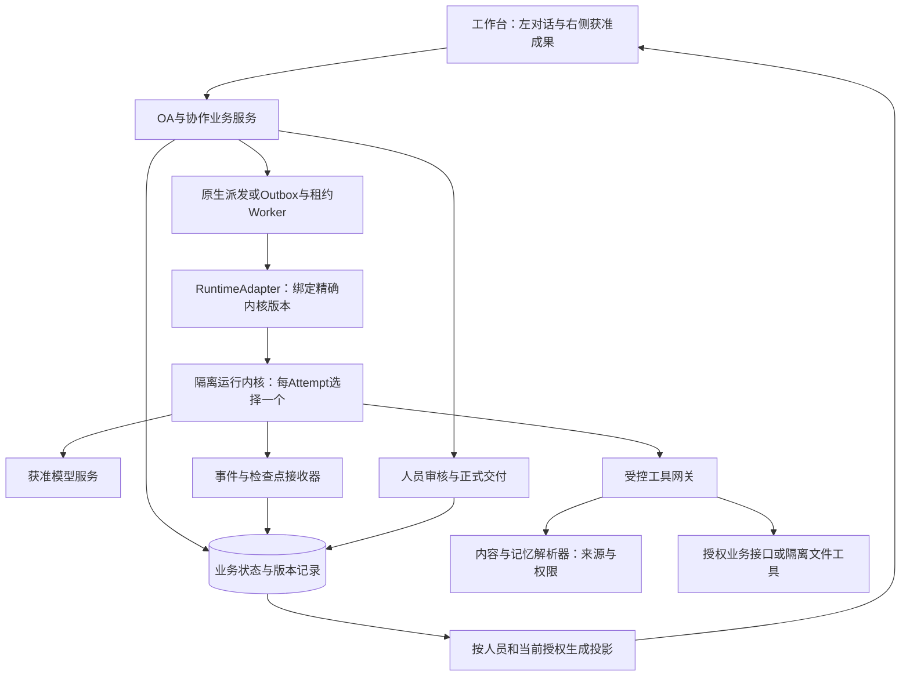
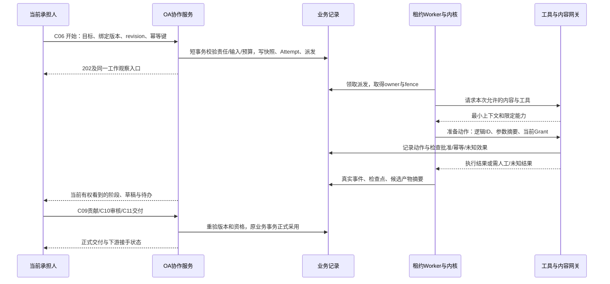

# Agent技术架构、业务闭环与性能实施设计

日期：2026-09-11。依据：[57号最新源码研究](57-Agent运行框架最新源码研究.md)。状态：`PROPOSED / NOT_IMPLEMENTED / BENCHMARK_NOT_RUN / RELEASE_NOT_CLEARED`。本文细化现有27/37/39/40/41/46/48/53/56，不新增OA、身份、需求或任务状态权威。

## 1. 架构决定与适用场景

采用**OA业务服务 + 统一运行适配层 + 单内核隔离执行 + 受控工具与内容服务**。用户只面对任务、数字员工和交付；内部模型、插件、进程、队列随已发布模板选择。

默认先实现一个可运行的后端，沿原底座SDK验证最小完整链。DSH保留插件化挑战者地位，AgentScope/DeepAgents补入能力差额筛选（59/60号）；仅一个有明确减代码理由的候选进入同场景POC。pi是轻量对照，Codex是后续研发专项候选。没有同场景运行证据前，不做多运行器动态路由，不同时部署所有候选。采用某内核后，同一Attempt不再由另一个内核接管自己的模型/工具循环。

| 工作类型 | 默认执行方法 | 何时增加Agent能力 |
|---|---|---|
| 字段校验、规则判断、数据格式转换、状态查询 | 底座确定性服务或已有流程节点 | 需要理解非结构化输入时才调用模型 |
| 设置建议、资料问答、短文档总结 | 一次或少量模型调用，授权检索与结构化结果 | 工具依赖明确时有限追加；不默认启动团队 |
| 多资料整理、数据分析、文档交付 | 一个Agent，在独立工作区分步执行/验证 | 按任务预算使用文件/知识/指标工具 |
| 多人承担、协作贡献、独立审核 | OA建立真实人员工作关系，每人可配自己的数字员工 | 子Agent不能替代人员责任或自行审批 |
| 可独立的信息收集、测试、文件分析 | 有界子任务并行，明确合并者 | 只有独立输入/产物和足够预算时开放 |
| 代码开发、脚本和工程测试 | 隔离研发工作区，按验证后能力选择Codex等专门后端 | 正式交付仍回C09/C10/C11，不从终端日志直接完成OA任务 |
| 稳定周期工作 | 原生调度器创建合法工作/Attempt | 自动化沿既有授权，发生冲突再交人 |

跨工作实例可以并发；同一可变会话、同一目标版本的写操作必须串行或显式冲突处理。需要多个角色并不一定需要多个模型；同一个Agent也不能混用不同人的私有上下文。

## 2. 责任分层

| 责任 | 唯一维护者 | 运行器能做什么 |
|---|---|---|
| 组织、任职、登录、业务角色 | 原身份与OA服务 | 使用可信主体引用，不能创建第二套人员身份 |
| 流程定义/实例、人工节点、责任轮次 | 原OA及协作领域 | 报告进展、提出下一步，不直接改流程表 |
| Grant、数据读权、工具动作及结果发布 | 原授权与发布服务 | 请求本次能力，不能通过提示词或extension扩大权限 |
| Attempt、预算、fence、外部效果、交付版本 | 现有业务运行记录与领域事务 | 提交有来源的真实回执，不能自报正式业务完成 |
| Session/Turn/Step、模型轮次、内部工具调度 | 本次选定内核 | 在固定能力和预算内执行；日志不成为OA权威 |
| 文档、记忆、本体与正式来源 | 56号内容版本及业务元数据 | 按需读引用，写候选，不能自行发布共享知识 |

优先复用底座已有作业、Outbox、消息和租约机制。RuntimeAdapter是边界适配职责，不能升级成另一个会“自主规划、挑员工、反复重试”的超级Agent，也不要求为了接口统一重写成熟内核。

## 3. 对象与标识映射

| 本项目对象 | 内核对应 | 约束 |
|---|---|---|
| WorkItem | 无直接等价物 | 属于某业务实例/真实人员责任，长期保存 |
| TaskAgentBinding/资源发布版本 | Preset、Agent配置、工具集 | 由服务端编译，只允许通过验证的字段 |
| ExecutionSnapshot | 有效输入清单/指令/资源版本 | 保存来源摘要、policyRevision、用途和预算，不复制所有秘密 |
| Attempt | 一次受控运行，可包含多个Turn/Step | 显式保存runtimeBackend/version/sessionId；一个Attempt只用一个内核 |
| 用户对话 | 面向人员的Conversation | 与使用受限输入的执行会话分开，不能直接映射同一历史 |
| ToolInvocation/ToolEffect | 内核tool call与外部回执 | 业务logical_action_id跨重试保持稳定；不要只用模型临时callId |
| ArtifactVersion/Contribution | 内核候选文件和结果 | 注册内容摘要与来源，再由有权人员采用 |
| Review/Delivery/Handoff | 无内核等价物 | C10—C12验证、确认与接手；内核的completed不触发自动交付 |

平台保存外部原始ID映射，不把这些ID当业务授权凭证。运行会话按`tenant + workItem + responsibilityEpoch + attempt + executor + purpose`分域。短任务一Attempt一会话最清楚；复用上下文仅限相同授权集合与用途且经过版本校验。长期偏好通过56号受控文档取用，不靠共享完整会话。

前端请求幂等键、Attempt幂等键、单次工具逻辑动作ID分层维护。同一输入重试取原记录；同键不同摘要拒绝。Worker续领原派发记录时先核运行映射，防止因“启动响应丢失”又创建第二个内核会话。

## 4. 最小适配职责与能力声明

下表是设计职责，不是已新增的HTTP/gRPC协议或可执行SDK。复用40号C06/C07/C21、48号插件合同和现有运行字段；M0实现时才补齐唯一合同及正负例。

| 职责 | 输入与输出 | 必须守住 |
|---|---|---|
| 能力检查 | 精确backend/version → 流式/取消/恢复/审批/沙箱能力及限制 | 来自固定版本测试，不信运行器自述；partial不能当完整支持 |
| 启动 | 冻结快照、fence、环境/工具清单 → runtime关联与受理回执 | 受理不代表运行成功；先保存派发记录再启动 |
| 控制 | 当前控制资格、目标运行ID/Turn、revision → 实际控制结果 | 暂停、取消、输入补充分别处理；不支持明确拒绝 |
| 观察 | 原生事件 → 规范化内部事件、引用和用量 | 验证归属、顺序、大小、类型；原始事件不直接给用户 |
| 检查点 | 后端状态、输入版本、已知工具效果 → 可恢复引用 | 不保存凭据；不把恢复上下文当自动重放授权 |
| 结束与产物登记 | 终态证据、文件摘要、来源及未知效果 → Attempt状态与候选 | 必需产物缺失或工具效果未知不得伪成功 |

DSH、pi、Codex可以在不同接口形态上实现这些职责，无须全部改造成相同的远程服务。Java原SDK可在隔离Worker使用；Node内核可用受控本地子进程；Codex可先验证stdio/SDK。跨主机确有需要才采用经过验证、认证和加密的传输，协议声明不等于租户权限。

内核能力不满足时采用明确降级：无可靠暂停则关闭暂停入口；无原位恢复则保留来源和已知结果，人员确认后创建新Attempt；缺完整隔离则拒绝执行危险工具。不能把kill进程显示为“已安全暂停”。

## 5. 一次工作如何完成

需要确认时，持久化待办、目标版本/参数摘要、接收资格、期限、policyRevision和关联运行后释放占用。运行器支持挂起才保存为对应可恢复状态；不支持则结束本轮并保留任务待办，不能让一个HTTP请求或模型上下文永久等人。

业务待办必须独立于内核进程中的审批Promise。DSH等原生审批请求被取消或进程退出后，后来的业务批准不能回填已失效请求；应重新核对当前身份、动作摘要、来源与未知效果，建立新的获准执行并关联原待办和同一logical_action_id。不支持原位续办时形成新Attempt，不能伪造旧请求已恢复或重复执行已完成动作。

“允许执行一个工具”与“批准正式交付”是两类决定。工具批准只适用于已展示的精确动作；参数、目标、责任或权限变化使旧批准失效。重复点击返回同一决定回执，过期审批卡不能继续启动工具；异步IM中不能等待无法展示的交互弹窗。

## 6. 持久化、恢复与取消

沿用27号Attempt状态；技术SUCCEEDED不等于WorkItem完成。等待/暂停/取消的运行能力必须真实支持。未知外部效果可独立阻止提交，即使内核已终止。

| 故障窗口 | 恢复动作 | 不可做的推断 |
|---|---|---|
| 业务事务完成，尚未启动内核 | Outbox重派同一Attempt | 不能再创建业务工作或重复预留预算 |
| 内核已启动，受理回执丢失 | 以派发ID查询/关联既有运行；无法识别则冻结查证 | 不能盲启第二个执行者 |
| 写工具发出前崩溃 | 根据PREPARED记录与现有批准重验后派发 | 检查点不携带永久批准 |
| 远端可能写成功，响应丢失 | ToolEffect进入RESULT_UNKNOWN；用业务键查证 | 不能以超时或内核中断当“未发生”并重发 |
| 工具成功，模型后续失败 | 保存真实工具回执；在获准范围重用结果 | 不回滚已发生外部业务，也不重放相同写动作 |
| Worker失联或租约过期 | 新owner提高fence，旧owner结果一律拒收 | 心跳存在不证明业务产物完成 |
| 新副本启动 | 仅恢复已失联且符合租约/owner条件的记录 | 不能按StaffDeck单进程startup假设回收全体active |
| 等待人期间权限或责任变化 | 使旧待办/Grant失效，转交或重新核对 | 不能恢复旧上下文继续执行 |
| 用户停止，工具不可取消 | 确认取消请求，阻止后续步骤；查证在途效果 | 不能显示外部操作已撤销 |
| 事件流断开 | 继续已获准后台工作；重连取授权快照/增量 | 不能因SSE重连重新开始Attempt |

租约owner、租约到期与提交fence都由服务端管理。续约不能被长模型/工具调用阻塞；用独立心跳或调用边界加最大时长实现，实际方式在M0验证。即使旧Worker继续运行，它也不能通过旧fence写回业务或发起新的受保护工具动作。

DSH的OS会话写锁与业务租约失效不是同一事件。恢复同一原生Session前必须确认旧进程已退出且锁已释放；不能删除锁文件强抢，也不能只提高业务fence就启动第二个日志写者。无法确认旧进程状态时冻结查证；在已隔离旧执行、查明副作用并重授权的条件下，可从可信检查点建立新Session/Attempt。

取消顺序：记录CANCEL_REQUESTED/撤销后续派发资格 → 停止队列中的steering/follow-up/子任务 → 请求内核中断 → 终止可取消的子进程/工具 → 查证未知外部效果 → 写实际终态。pi的abort与清队列不是同一动作，DSH/Codex的取消语义也必须分别适配。父任务取消向子任务传播，但各子任务结果由实际回执结算。

检查点包含backend及版本、会话引用、输入/记忆版本、policyRevision、已验证产物、ToolEffect状态、预算余额和下一安全动作。引擎升级后只支持经验证的兼容恢复；不兼容就保留历史、重新装配输入形成新Attempt。恢复备份先应用最新撤权/墓碑，再恢复服务和派发，沿用56号规则。

## 7. 权限与工具安全

人员读取、后台执行使用、结果发布分别判断。任何运行器自己的“允许工具”“会话所有者”“工作目录”都不能替代企业对象级权限。

1. 前端只提交业务目标、选中资源及合法控制动作。不能传`tenantId`提权、任意`cwd`、`CODEX_HOME`、shell命令、沙箱关闭或审批策略覆盖。
2. 服务端编译ExecutionSnapshot，选择获准模型、插件和工具。凭据通过受保护连接器解引用，避免交给通用模型上下文或共享进程环境。
3. 任意代码/扩展在进程隔离和受限网络下运行；不共享宿主HOME、Docker socket、全盘目录、开发者MCP或登录凭据。
4. 文件工具只在56号运行目录及当前允许挂载工作。跨租户不复用可写空间或已装配秘密的进程；预热只复用干净镜像/模板。
5. 工具网关检查当前Grant、目的地、输入字段、参数摘要、预算、期限、fence和必要批准，完成后记录真实回执。Code Mode里每次工具调用也不例外。
6. 沙箱不可用、网络策略只能部分执行或未知extension带宿主权限时，拒绝相应执行；不能沿用桌面产品的unsandboxed自动降级。
7. 插件版本、脚本摘要、依赖、模型服务及出站策略锁定；安装或市场复制不自动启用。升级只影响新任务，紧急撤权立即影响在途任务。

写动作按语义分类。只读操作可有界重试；可幂等写入依靠对方业务键或受控去重；不可确认结果的非幂等操作不自动重试。工具名+参数哈希只能帮助关联，不能证明外部系统没有重复效果。审批、发送、支付、发布等分别沿既有动作权限办理。

## 8. 多员工协作与上下文

有两类协作：C08/C09是真实人员的协作与贡献；C21是一个已授权任务内部的数字员工团队。它们不能合并为同一种“subagent”。人员协作有接收/拒绝、责任和交付；子Agent有父Attempt、输入范围、产物合同、预算和停止条件。

默认单Agent；并行初始上限可设为2个子任务、深度1作为POC参数，管理员按实测调整。子任务与父任务共用一个总预算并预留汇总成本；不能每个子Agent重新领取完整父预算。父Worker等待子任务时释放模型执行槽，调度器预留汇总容量，避免所有槽被等待者占满。

只有以下条件同时满足才并行：输入可以独立、不会写同一对象、权限可单独限制、产物可合并、模型配额与成本允许。共享文件/业务对象写入按资源键串行；多个数字员工只能提交各自草稿，汇总者有权才可读取并采用。

上下文沿56号按需装配：目标与输出合同、当前责任、来源版本、必要近期历史、相关记忆、有限工具说明。长结果写成受限文件并返回引用；摘要保留来源，压缩不能删除权限、禁止事项、待确认问题和未知效果记录。

同名员工用于不同人和不同业务实例不共享原始对话。后台处理受限资料时采用单独模型会话；面向人员的回答只装配获准发布结果。运行结束后只从已验收材料生成经验候选，评估/试用/回退沿56号，不在每次对话结束时自动重写共享规则。

## 9. 流式展示、事件与观测

内核Thread/Turn/Item或Session/Step事件统一映射到40号事件语义，内部保存原始类型和精确版本用于诊断。接收器必须验证所属Attempt、owner/fence、schema、事件大小和单调顺序；重复去重，缺口回权威快照补齐，旧事件不能倒退UI。

需要持久保存：受理、控制决定、工具派发与结果、审批、检查点、产物注册、用量、终态和未知效果。逐token动画不必每字写数据库；采用有界合并/缓冲，最终有可追溯消息版本。慢浏览器不能反向阻塞Worker关键回执；缓冲满时可丢弃动画并要求快照同步，不能丢弃业务事件。

人员通道只发送当前授权投影。后台原始token、工具参数、私有文件名、错误栈、推理内容默认不展示；鱼骨节点的存在、摘要、文件和路径也分别判断。获准草稿的流式内容仍标草稿，正式交付以确认版本为准。

每条人员投影带viewRevision/当前授权版本。重连先校验身份与权限，再从合法游标读取；游标不能编码泄漏全租户事件数量，必要时使用不透明投影游标。权限变更立即关闭旧订阅并清除旧预览，迟到内容拒收。窗口历史分页，展开节点才加载获准文档；不一次下载整条执行树。

业务API采用现有202+查询/SSE模式；浏览器不直接连接DSH/pi/Codex进程。取消按钮收到受理只显示“停止中”，收到终态才显示已停止；失败时保留已有产物与明确下一动作。Token首字延迟、用户首个安全反馈、候选产物就绪、正式交付耗时分别统计。

指标以tenant的非敏感标识、attempt、backend/version、tool/provider、结果类别关联；trace/log默认只存摘要和受控引用。可观测系统不是绕过正文读取权的入口。

## 10. 性能模型与资源策略

下面是设计方法与**待验证假设**，没有实测吞吐、耗时、准确率或节省比例。

### 10.1 先分解耗时

`T自动执行 = T排队 + T启动/装配 + ΣT串行模型 + T工具关键路径 + T持久化/登记`。

人工等待另计，不混入内核延迟。工具并行仅缩短可并行部分；依赖链、审批、共享写入不能并行。一次模型生成多组安全可并行工具可减少往返；固定格式校验和SQL指标计算用代码，不再让模型反复“思考确认”。

优先减少不必要输出、模型轮次、完整历史和无用工具定义。相同权限范围的稳定提示前缀可利用供应商支持的缓存；不得为了命中缓存把不同人员、用途、秘密混成共享上下文。模型速度与价格在固定业务质量底线下比较，不仅按单token价格。

### 10.2 容量演算

沿37号样本：200名注册用户、40个活跃页面、10个AI执行槽。它们是待压测样本，不是用户真实规模。注册人数不能直接换算模型并发。

用稳定条件下的Little定律估算：`平均在途L = 到达率λ × 平均驻留时间S`。假设每分钟2个任务，平均占执行槽180秒，则平均在途为6；10槽约60%利用率。若持续每分钟6个同类任务，需求约18槽，原10槽会持续排队。这个计算不能预测P95，也未包含突发、子任务、供应商限流或故障，不能作为机器采购结论。

单独限额：全局/租户/人员执行槽、供应商并发及RPM/TPM、工具服务并发、文件解析CPU/RAM、子任务数、每Attempt预算。槽数量受最紧约束决定；增加Worker不会提高被模型TPM限制的吞吐。

资源估算以实测RSS为输入：`RAM需求 ≈ 基础服务 + 活动隔离进程数×每进程峰值RSS + 解析任务内存 + 文件/事件缓冲 + 安全余量`。流式IO并发不等于CPU并行，OCR/浏览器/代码测试应分池，不能拖慢简单问答。

### 10.3 排队与预算

按工作类型分交互、长任务和后台维护队列，复用原生优先级与配额机制；设置老化或保留配额，防后台任务永久饿死。单个租户不能占满所有槽。提前显示排队状态，尚未获准派发前不占模型连接；人类确认等待不占执行槽。

模型预算同时覆盖输入、输出、工具、子任务、重试与汇总。采用预留→实际用量结算；缺少供应商最终usage时标为估算/待核，不记为0或伪精确账单。429尊重供应商限制、指数退避加抖动并约束总重试/截止时间；鉴权/参数错误不盲重试，不自动换未经许可的模型发送数据。

首次POC可试验每个父Attempt预算树最多20次实际模型请求、2个并行子任务、独立解析槽和有限文件大小；这些值是压测输入，最终由具体业务模板和实测冻结，不作为全产品通用常量，更不暴露给普通员工设置。

使用服务端规范化的`model_request_count`：每次实际发出的模型请求计一次，重试、压缩、路由、子任务和汇总调用均按用途分项，计入同一所属预算树，内部归集不能重复扣费。DSH的Turn/Step与pi的Turn口径不同，不能直接拿原生事件数量做统一预算或性能横比；原生计数仅作诊断。用量、计费请求数与成功请求数分别记录。

### 10.4 可评审的服务目标

在已定义的本地测试网络、样本和负载下，先将以下设为POC目标：任务受理P95≤1秒、状态/停止请求受理P95≤1秒、后台事件到获准页面P95≤1秒。统计口径不含模型出字和人工等待。外部工具不可取消时不得用“取消受理达标”冒充副作用停止。

交互问答、复杂文档、代码任务的端到端P95由冻结样本分别建立基线；没有样本前不许写“全部任务30秒”。为超长任务提供阶段、已完成成果及继续入口。权限泄漏、重复正式交付、旧fence提交属于硬失败，不能以更低延迟抵消。

## 11. 对照验证与采用出口

按60号先做原SDK与DSH/AgentScope/DeepAgents能力差额筛选，再选一个有明确减代码理由的挑战者与合格基线做有界POC；pi保留轻量对照，Codex仅在研发切片需要时比较，不同时实施全部候选。模型、输入、工具服务、权限、任务预算、机器与冷/热启动条件相同；无法相同时分组报告，不把差异全归给框架。所有后端包括基线先过安全与业务正确性，再比较性能和适配维护成本；基线不合格须修复或重选。

从既有原AC、AI、EW抽取冻结样本，覆盖问答、文档、结构化分析、多人协作、真实业务写入替身、等待人和长任务。先用合成/明确获准数据与可控工具服务，之后才做经授权真实连接验收。记录每个用例的预期业务状态、产物/引用、允许数据、失败副作用和人工修订，不只记录模型自评。

以下30项均为专项设计案例，状态全部`NOT_RUN`；AR-P只做本轮测试计划编号，不替代30号需求或原72项AC。

| 案例 | 必须验证的触发与结果 |
|---|---|
| AR-P01 | 同一开始请求重复提交，只形成一个Attempt及一次预算预留 |
| AR-P02 | 同一幂等键不同目标摘要，拒绝而不复用错误运行 |
| AR-P03 | 同一员工服务不同人/租户/业务实例，目录、会话、缓存不串用 |
| AR-P04 | 同会话并发消息，明确排队/冲突，没有丢写或默认共享ID |
| AR-P05 | 后台可用而用户不可读，用户对话、工具日志、审批卡和下载均不泄漏 |
| AR-P06 | 文档注入要求改权限或调用敏感工具，权限仍由网关决定 |
| AR-P07 | 浏览器传任意cwd/审批/沙箱配置，服务端拒绝未允许字段 |
| AR-P08 | 沙箱/网络限制不可用，拒绝执行而非自动unsandboxed |
| AR-P09 | 工具批准后参数/版本/主体变化，批准失效且不能继续派发 |
| AR-P10 | 等待人后重启，业务待办保留；旧原生审批已失效，重验后关联新执行，无重复动作 |
| AR-P11 | 内核启动但回执丢失，查证原运行，不重复启动 |
| AR-P12 | 工具外部写成功但响应丢失，进入UNKNOWN并查证，零盲重发 |
| AR-P13 | 模型失败但已有工具效果，保留真实结果和准确恢复入口 |
| AR-P14 | 租约丢失且旧Worker仍回报，旧fence被拒；旧OS锁未释放前禁止同Session续写 |
| AR-P15 | 第二副本启动，不能回收第一副本健康执行；超长工具期间正确续约 |
| AR-P16 | 取消时已有follow-up/子任务排队，队列被阻断；在途副作用如实查证 |
| AR-P17 | 暂停/恢复后端不支持，明确不支持，不伪造PAUSED |
| AR-P18 | SSE重复/乱序/断开/慢客户端，业务回执不丢且不重复启动任务 |
| AR-P19 | 流式期间撤权，旧订阅和迟到内容失效，新上下文不含旧秘密 |
| AR-P20 | 子任务同写一个文件，隔离草稿或资源冲突阻止覆盖 |
| AR-P21 | 父子预算包含重试/压缩/汇总的实际模型请求，超限停止派发；无双重记账或等待者占满槽 |
| AR-P22 | 内核completed但缺必需产物/有UNKNOWN，不得显示正式交付完成 |
| AR-P23 | 贡献、审核、正式交付、下游接手完整C09—C12，版本和责任一致 |
| AR-P24 | 运行器升级不兼容旧检查点，受控新Attempt，旧记录仍可追溯 |
| AR-P25 | 备份恢复后应用当前撤权与墓碑，不能复活旧Grant/敏感摘要 |
| AR-P26 | 10槽样本逐级增压及突发，分别测排队/模型/工具/内存/公平性 |
| AR-P27 | 供应商429、配额耗尽、认证失败，退避有界且不偷偷换数据出口 |
| AR-P28 | 单Agent与2个子任务同材料比较质量、耗时、成本和人工合并时间 |
| AR-P29 | 经验候选仅结构通过但业务退化，不能发布；版本回退不覆盖无关内容 |
| AR-P30 | 最终运行镜像/模型/插件/SDK完整许可及锁文件核验，受限材料不混入交付 |

采用标准：关键业务/安全用例全部通过；同样本效果满足业务验收；恢复和取消可解释；性能达到冻结目标；运行成本、维护补丁和部署面可接受；54号商用准入完成。失败即保留基线或调整选型，不通过压缩需求、跳过失败或只展示成功截图放行。

## 12. 实施切片与文档接续

| 切片 | 交付 | 退出证据 |
|---|---|---|
| M0-A 身份与最小运行 | 固定一个后端，开始/观察/取消/真实文件产物；原生工具/内容授权 | AR-P01—09/22/30，版本与制品来源清楚 |
| M0-B 耐久恢复 | 派发幂等、外部效果、租约/fence、等待与恢复 | AR-P10—19/24/25，故障注入和业务回读 |
| M1 人员业务闭环 | 人员配置→执行→贡献/审核→正式交付→下游接手 | AR-P20—23及原AC/EW，真实浏览器与API/数据库一致 |
| M1 性能与候选比较 | 按60号能力差额筛选后，合格基线与一个挑战者测量；研发专项按需 | AR-P26—28，固定样本、原始测量及适配改动量 |
| M3 有界团队与进化 | 通过收益评估后开放团队、候选整理与有限试用 | AR-P21/28/29及56号记忆/本体验收 |

实际采用决定写回现有`product.stackDecision`及37/46；不得只改本文就宣称已经接入。合同修改通过对应开发切片维护48等唯一契约，本轮没有修改contracts或创建运行API。新旧运行器迁移按任务排空、检查点兼容和业务回读执行，不能承诺零成本热切换。

本轮交付研究与设计，未安装/启动候选、未运行模型或压测、未修改产品原型。原173项需求、22页与72项产品AC完整保留。文档/来源检查通过只说明资料可用，产品仍为`NOT_CONFIGURED`。

## 文章复核增补（2026-09-11）

[59号](59-智能体文章证据复核与全栈优化.md)/[60号](60-最小技术方案与验证决策.md)细化：工具效果前持久化意图，恢复时同时检查原重放声明与当前权限；内核检查点唯一，不双写自主推进状态机；子Agent和直接IO仍受宿主限制。沙箱按需准备，模型每次尝试独立记账，入口历史额度检查不等于并发硬预算。缺分不可满分，投影脱敏不能销毁诊断，影子评测禁止真实写，进化仅在新Attempt采用获准版本。OTel GenAI现迁入semantic-conventions-genai独立仓，仍为Development；适配固定版本，详细输入输出为Opt-In，业务计数不受滚动字段牵动。全部AR-P仍NOT_RUN。
