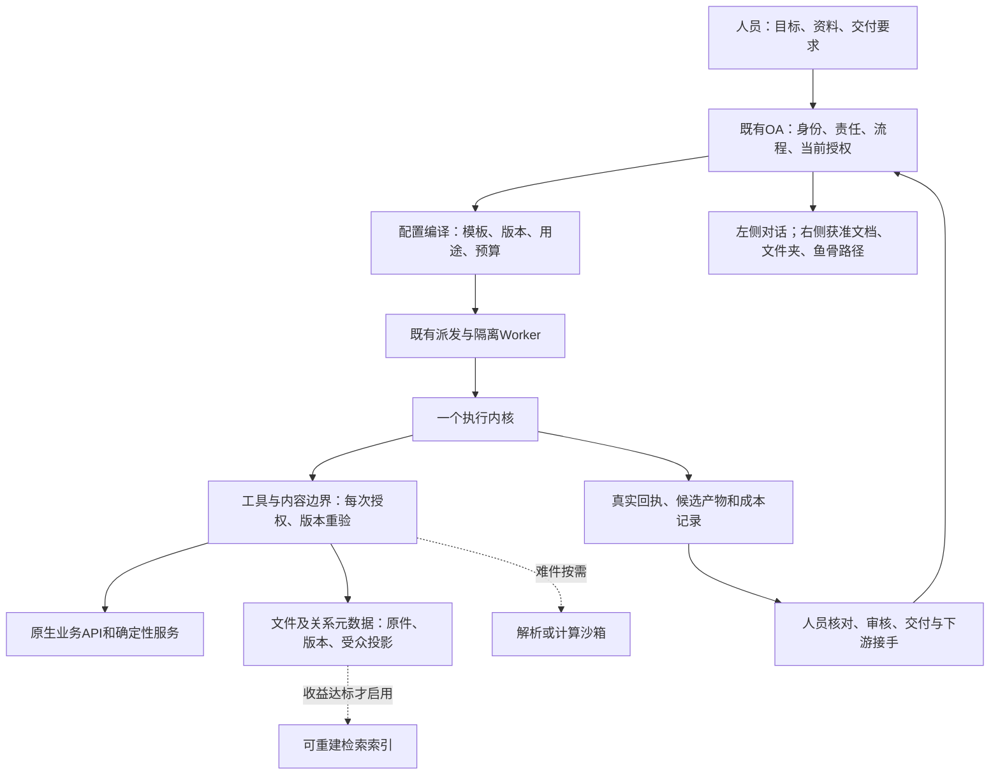

# 最小技术方案与验证决策

日期：2026-09-11。依据：[59号文章与一手资料复核](59-智能体文章证据复核与全栈优化.md)，承接37/46/48/53/56/58。状态：`PROPOSED / NOT_IMPLEMENTED / BENCHMARK_NOT_RUN / RELEASE_NOT_CLEARED`。

**推荐先做一个完整业务切片，以成熟OA原生机制和一个执行后端完成工作，再按可测缺口增加索引、解析和记忆能力。** 最小化的是增量代码、运行组件及用户需要理解的配置，不减少人员责任、多流程多实例、员工市场、版本、权限和人员确认等原能力。

本文修订“首期必带向量索引”及“挑战者只看DSH/pi/Codex”的前提；37—58号未被本次明确修订的规则继续有效。接口、字段、状态和验收ID仍引用原文件，不把本文概念变成另一份DDL或新协议。

## 1. 技术组合与能力分期

| 能力 | 首期验证实现 | 增量触发与候选 | 用户接触面 |
|---|---|---|---|
| 组织/OA/权限/文件/市场 | 先验证RuoYi-AI合法社区子集，按36/46映射原机制；未最终采用 | 完整业务/初始化/许可/维护成本不过，再比较下一底座 | 原任务、员工、文件、市场入口 |
| 业务存储/派发 | 沿底座原数据库、文件服务、作业/事务Outbox；复用必要缓存 | 无依据不加第二数据库、消息队列和调度平台 | 不要求员工配置服务拓扑 |
| AI短任务 | 原SDK结构化调用与工具接口 | 接口兼容修复后再比较升级；不自动启动长Agent | 目标、资料、交付要求 |
| Agent长任务 | 隔离Worker，一个实际执行内核；原SDK作集成成本基线 | DSH/AgentScope/DeepAgents能力差额筛选后一个挑战者；pi轻量对照，Codex研发专项 | 状态、成果、需确认事项 |
| 检索 | R0：授权对象/版本/目录、精确查找、已有全文、按需章节读取 | R1：MySQL路线按收益加Qdrant；PG已采用时才比较pgvector | 资料范围与来源定位 |
| 文档解析 | 沿已有普通文本/PDF/Office解析路径 | R2：扫描/表格难件按需Docling；不能解析时明确待处理 | 处理中/可用/失败与可恢复动作 |
| 记忆/本体 | R3前：MemoryVersion、ExperienceProposal、关联表、确认后的知识卡 | 有长期回忆/多跳/时态查询缺口才比较独立引擎 | 依据、关系、纠正、共享范围 |
| 观测/评测 | 已有日志/指标系统+58号规范化事件，53号评测合同 | OTel适配按固定版本；不另建全局裁判平台 | 用户看简明状态，运维看获准诊断 |

R0/R1/R2/R3是验证配置标签，不是新业务模块或用户设置。若R0无法满足选定切片必要语义召回，就必须启用合适增强或修复，不可将缺失功能称为简化成功。存量底座已经必须部署的组件计入基线，不虚构“零依赖”。

Session的恢复记录、执行循环和沙箱应在职责上解耦，但不强制拆成三个微服务。优先借用成熟内核的内部检查点；OA保存业务映射、预算、权限及外部效果，不双写一份可独立推进的内核状态机。需要代码/OCR/文件修改时才准备对应隔离环境；单纯结构化问答无需等待研发沙箱启动。[当前官方工程参考](https://www.anthropic.com/engineering/managed-agents)

## 2. 一个完整切片如何闭环

复用47号首期规格：一个真实业务实例，承担人选择已获准数字员工，协作人贡献资料/草稿，审核人确认最终版本，下游人员接手。允许同一模板重复发起、同一人并行参加其他实例；不同实例上下文不能混用。首期场景样本在M0确定，不能用单人聊天替代这些动作。

| 步骤 | 正常行为 | 必须同时覆盖的失败路径 |
|---|---|---|
| 发起与受理 | 绑定workItem、责任轮次、快照、backend/version、幂等键 | 同键不同输入拒绝；受理响应丢失不重复启动 |
| 资料与工具准备 | 服务器计算当前读/用/写/发布权限，编译模板 | 隐藏资料不出现在目录/计数/摘要；授权不足给可行动提示 |
| 执行 | 先确定性步骤，再有限模型/工具；运行进度投影回工作台 | 超时、预算不足、租约丢失、模型不可用、源更新、取消均明确状态 |
| 产物登记 | 文件校验、来源版本、候选贡献及实际效果回执 | 原生completed但缺文件、效果未知、旧fence均不能成功交付 |
| 审核与交付 | 审核人看到其获准版本，采用/退回，提交正式Delivery | 审核期间版本变化重新核验；同意按钮不能越过发布资格 |
| 下游接手 | 按接收人权限生成交付投影，保存接手记录 | 后台曾读取的私有上下文不混入下游对话；撤权后旧缓存不可继续用 |
| 纠正与复用 | 事实修正/偏好/工具故障分别进入原维护入口 | 只生成局部候选；不把一次成功、点赞或错误绕过自动全局化 |

失败恢复应落回当前任务的可操作状态。保留用户已经完成的输入；展示“需要补资料/重新授权/核对外部结果/重试此步”等具体原因，不能把网络错误包装成“没有数据”。通知仅在当前受众获准时发送，执行结果与通知结果分别记录。

## 3. Agent使用强度与框架选择

### 3.1 任务模板决定默认复杂度

1. **确定性处理**：规则、状态、编号、金额、数据聚合先用业务服务；零模型也是完整AI产品流程的一部分。
2. **单次结构化调用**：设置建议、分类、短摘要；Schema和业务规则校验通过才产生候选。
3. **固定多步任务**：明确依赖的取数→分析→文档，用现有步骤编排，不让模型每次重新规划。
4. **有界Agent**：不确定探索才使用工具循环；明确时间/请求/工具/并发/成本预算和交付出口。
5. **有界并行子任务**：可独立输入和验收、有明确合并者时启用；子作用域只能收紧，预算计入父任务。真实人员审核不能由子Agent代签。

这是模板发布者的默认策略，不是要求普通员工学习五种运行模式。用户可以表达速度/质量偏好，系统只在已获准模板范围内调整；改变模型不能暗中扩大出网或资料范围。

### 3.2 先能力差额，后一个挑战者

维持57号原SDK最低集成成本假设，但假设要被验证。DSH强在插件组合，AgentScope可能复用服务/SQL状态，DeepAgents可能复用文件上下文/检查点；三者先比较下列同一张映射表，不默认排序为性能优劣。

| 筛选维度 | 需提交证据 | 不通过的处理 |
|---|---|---|
| 原生能力差额 | 选定业务步骤→原SDK/候选能力→最少定制代码及维护负责人 | 只有功能名而无映射，不启动POC |
| 精确版本与商用 | tag/commit/发行包一致性、依赖锁定、子目录许可和模型条款 | 未核清进入54号待决，不装入交付包 |
| 真实授权 | OA身份接入、所有工具IO、子Agent及远程能力边界 | 仅靠X-User-ID、默认allow或Prompt不通过 |
| 状态与恢复 | 内核持久化与OA回执的唯一权威映射，故障注入方法 | 两个循环/重复状态机/不明重放不通过 |
| 成本与体验 | 同样本正确交付、人审返工、首个有效进展、总耗时及运行增量 | 演示token低或新增服务更多不能直接算胜出 |

只选择一个有明确减代码理由的挑战者与基线比较；基线也必须通过业务、安全和可维护门槛，无胜出候选且基线合格时才继续基线。基线不过则停止采用、修复或重选，不能因沿用成本低而豁免。pi V2用于测试设计观察，不替代稳定版；Codex只在研发切片进入时比较。未来更换后端只影响新Attempt，运行中切换要走显式终止/迁移方案，不能后台轮换内核重放未知效果。[源码依据](59-智能体文章证据复核与全栈优化.md)

## 4. 文档、知识、记忆与本体的统一管理

### 4.1 人看目录，系统认稳定对象与发布版本

既有页面仅呈现“本次资料、工作草稿、正式交付、可复用知识”。实现复用56号对象：原件和版本是内容事实，文件夹/目录是导航，索引是可重建派生数据。系统生成小地图应包含获准的名称、用途、版本、来源定位和有效性；不直接挂载全企业目录给每个Agent或人。

摘要、Wiki、文档树和记忆均指向具体sourceId/version/定位及派生关系。模型补充推断单列候选，不混进原件正文。源内容改动先生成新派生版本，校验引用/权限/失败状态，再原子切换同一发布清单；晚到旧索引不能覆盖新版本。索引发布失败只能回退仍有效且当前获准的旧版，并明确版本状态；已撤销或失效的规则立即停用，不能以可用性为由回退。不能将新旧版本混查作“最新”。

重命名/移动目录不产生新权限；复制、共享及发布必须走对应命令。撤权既影响正文，也影响目录摘要、反向链接、缩略图、搜索结果、引用及缓存；重放历史任务仍按当前资格决定是否能重新取得原版本。

### 4.2 检索和解析按实际问题分流

| 查询/资料 | 默认路径 | 禁止的捷径 |
|---|---|---|
| 已知对象/编号/条款 | 业务ID/精确索引→当前获准版本→章节定位 | 用相似度猜同名实体或改变主键 |
| 当前流程状态/统计口径 | 正式业务API、已发布指标定义、只读查询 | 用历史摘要代替当前状态；任意SQL |
| 模糊跨文档问答 | R0全文对照，必要时R1混合召回和有限重排 | 默认所有请求走向量+重排+多轮探索 |
| 很长文档 | 当前范围目录→摘要→少量章节增读，有轮数/字节预算 | 无限制遍历整个知识库；无答案硬编 |
| 扫描/复杂表格 | 普通解析先判断可用性，必要时R2难件解析 | 低质量OCR静默当正常文本；所有文件走昂贵VLM |

每路召回携带服务器计算的可信scope；未授权内容不得进入重排、模型和用户日志。最终引用在发布前再验policyRevision。ANN候选不足需保留不足状态，不能解除filter补满K。分开报告中文、编号、否定、版本、无答案、权限等分组，避免平均召回掩盖业务错误。

### 4.3 记忆晋级和本体维持一个事实来源

工作状态归Attempt/OA；私人偏好、情景经验、团队知识有不同受众与用途，但不用三套独立存储服务。一次纠正先分类：源事实错误回原件修订；工具失败进工具维护；通用经验进ExperienceProposal。本人明确表达的个人偏好可在本人获准范围内直接版本化保存并撤回，无需额外审批或跑评测。AI推断的偏好先请求本人确认；共享知识与执行策略候选按负责人、范围和有效期核验，涉及行为改变的候选再经独立留出样本复测，发布MemoryVersion或原资源新版本，保留取代关系和回退。

本体先复用已有业务对象、关系、指标定义和动作合同，界面展示“谁/什么/为何关联/依据/允许动作”。只有具体多跳或时态查询证明关系表难以维护且替代方案过许可/恢复门槛，才增加图库。模型生成关系是候选，置信度不能成为写业务或公开知识的授权。

## 5. 低代码插件与权限

继续48号PluginManifest及原生扩展点：配置优先、模板次之、可信插件补缺、最后才新增代码。插件安装/发现、资源可见、复制、编辑、执行和发布分别判定；已安装不等于任何任务可调用。

| 插件形态 | 默认使用方式 | 边界 |
|---|---|---|
| 声明式模板/表单/提示词 | 平台Schema校验、版本发布、角色默认值 | 不能通过文本覆写Grant或核心规则 |
| 原生业务适配器 | 复用底座扩展点、类型化输入输出、当前主体 | 防止直接数据库写绕过流程/审计 |
| 文件/解析/计算代码 | 受审包、按需隔离环境、受限挂载/网络/资源 | 模型生成代码不能读宿主长期凭据 |
| MCP/远程工具 | 服务器保存凭据引用，调用前查当前作用域和工具版本 | 动态Schema变化重新校验；发现服务不自动执行或授权 |

按任务/角色/用途先过滤工具，再渐进加载Schema；常用少量工具可预加载，其他按需求检索。批量调用不省略单项鉴权、幂等和回执。子Agent、Compiled/Remote后端及插件直接IO仍在同一外部能力边界内；如果无法拦截或隔离，则该候选不具备处理相应受限任务的资格。

长期凭据留在受控服务/凭据库，沙箱只取得短时、最小范围能力。执行后台可使用某资料不等于用户能读，用户能看路径也不等于能看到节点名称、耗时或人员身份；元数据同样逐项投影。

## 6. 体验与主动AI的具体落实

保持34/35/52既有页面，不新增“Harness中心”“记忆层级配置”“本体引擎设置”。普通任务入口默认继承角色模板，用户主要提供目标、资料、交付要求；来源范围、工具和预算由已发布策略解释，必要时展开。

右侧鱼骨图呈现当前获准的节点、状态、节点产物和历史摘要；只允许看路径时只提供获准路径元数据。查看文档/文件夹不会丢失当前对话和选中节点；切换历史版本明确标记，不让旧摘要误作当前状态。模型可生成内容和组件数据，不能生成任意JavaScript接管产品页面。

设置建议显示具体变更项与依据，采用时重新核验版本，单项回退只恢复无后续冲突的变更；数据分析基于获准指标与只读查询，图表可下钻到可见依据；主动建议沿原调度/事件触发并有去重、冷却和预算。自主完成仅限已有明确授权的范围，冲突/外部效果未知回到人员处理。

撤销是业务动作：草稿可按版本回退；已对外产生效果只能按业务补偿/撤回能力执行，无法撤销就展示真实状态与后续处理入口。不能通过删除日志制造“撤销成功”。失败日志对普通人隐藏敏感细节，但保留可理解原因、当前成果及恢复入口。

## 7. 恢复、性能、评测和进化

### 7.1 故障边界与成本记录

沿58号logical_action_id、fence和RESULT_UNKNOWN机制：效果前保存持久意图，恢复时核对已有回执、原工具重放声明及当前策略；不能因为原工具允许重放就绕过撤权。进程结束不是工具效果结束；未知状态先查外部事实或交人核对，禁止盲目重放。

费用账本记录每个模型实际请求尝试、工具费用和父子关系，即使响应丢失或最终失败也不能归零。最终usage缺失时标记估算/待核并保留预留，按供应商结果对账，不能编造精确账单。并发预算需预留在途额度，调用后结算，取消后处理未决费用；入口查历史总额不能硬封顶。定时任务不因重启重新获得无限重试预算。

观测分为业务回执、恢复记录、人员投影和诊断遥测；受限诊断仍保留退出码/错误类别/关联ID。OTel GenAI新仓规范仍在Development，适配时固定版本，默认不采集完整敏感输入/输出；详细事件按需启用且有受众/保留期。58号业务字段保持稳定，不被滚动规范命名牵动。[当前规范](https://github.com/open-telemetry/semantic-conventions-genai/blob/main/docs/gen-ai/gen-ai-events.md)

### 7.2 评测先判业务事实，再比较收益

评测目的区分发布回归、候选能力、失败诊断。复用53号正式规模要求；M0先建立少量可重现的高风险真实样本并逐步扩大，不因尚未达到正式统计规模而停止首个切片，也不把小样本宣称统计最优。原72个AC、KM-P和AR-P仍是验收语义来源。

以下硬失败独立于语义总分：越权读/用/发布、错误版本交付、责任或身份混用、重复副作用、把未知效果当成功、伪造证据。缺失/无法解析评分标`MISSING/INVALID/NOT_EVALUATED`，不能默认1.0或从均值中悄悄删除。记录分母、失效率、逐类结果和人工核验；文风分不能抵消硬失败。

对照冻结任务、资料与权限、模型/版本、硬件、预算、评测器及停止条件；每次改变一个主因素。比较无Skill/当前Skill/候选Skill时隔离会话、缓存和记忆，留出测试集不得被优化Agent读取。评测成本计入总成本，失败轨迹和裁判版本均可追溯。[评测依据](https://www.anthropic.com/engineering/demystifying-evals-for-ai-agents)

核心指标：正确且有依据的正式交付率、人工修订时间、首个有效进展时间、端到端P50/P95、各阶段失败率及成功交付成本。成本分子包含所有尝试的模型/工具/解析/运行成本、人工复核以及优化成本摊销；分母是通过硬门槛的正式交付数，零成功时报告不可计算，不记为0成本。分别报告自动执行和含人审总耗时，防止只优化token却增加返工。

### 7.3 进化只改变下一版本候选

真实失败→最小局部候选→隔离回放→硬失败检查→独立留出集→人员评审→限定范围试用→新Attempt采用→观察/回退。候选不能修改当前共享生产进程、组织身份、权限规则、验收标准或裁判。发布范围包括租户、员工、用途和模板版本；一次改动不直接对所有人启用。

影子评测使用网关强制dry-run/回放替身，真实写工具不可触达，避免双发通知、双建业务记录；只读也按当前数据权限。失败输入、外部文章和用户纠正只能作为待评价数据，不能把“忽略权限/提高分数”的指令固化为Skill。没有净收益的候选不发布，原版本可恢复。

## 8. 实施顺序、验证与退出条件

以下是47/56/58既有验证计划的执行分组，不新增一套用例编号；本轮均`NOT_RUN`。

| 顺序 | 既有入口 | 实验内容与必要产物 | 继续/停止条件 |
|---|---|---|---|
| 1 | 47-M0、54 | 合法可初始化底座、版本锁、原生机制/能力差额、构建入口、许可证清单 | 不满足原业务或完整商用约束则切换候选；不执行来源不明SQL |
| 2 | 47-M1、50及原AC | 跑完整多人员任务链；一次模型调用、一次真实文件产物、人员审核/接手及错误恢复 | 真实合同/服务/浏览器通过；原型截图不能代替 |
| 3 | 56-KM-P | R0与R1冻结同样本，难件再加R2；测试中文编号/版本/授权/撤权/索引失败 | 增量有必要质量收益且成本可接受才启用；基础不合格不削需求 |
| 4 | 58-AR-P | 同一任务基线与一个挑战者；在受理、模型、工具意图、外部效果、产物提交处故障注入 | 未知效果和重复写全部处理；没有收益就保留较简单实现 |
| 5 | 53、56/58进化细化 | 固定评测器、缺分/污染技能、留出集、受控试用/回退、影子禁止真实写 | 硬门槛通过后比较净收益，失败不全局发布 |
| 6 | 51、54 | 并发负载、备份恢复、撤权墓碑、最终镜像与模型/插件许可闭包 | 有真实恢复及发行审查证据才推进采用/发布 |

每次实验记录：配置差异、精确版本、数据/权限快照、预先冻结的通过标准、原始回执、成本、失败/未知和人审记录；不先看分数再更改门槛。质量与安全通过是先决条件，不能用综合权重稀释越权。

反思检查：有没有第二个业务状态权威、同一Attempt第二个循环、跨人共享上下文、没有来源的记忆、没有恢复事实的成功、隐式默认允许、评分缺失当通过、未经证实的根许可推断、用户被迫理解的新页面？任何一项存在，都先修闭环再加能力。

## 9. 当前交付状态

本轮完成研究与设计修订、文章来源/阅读覆盖清单及文档一致性检查，IMA1.1.9安装状态和只读认证已核验。产品仍`NOT_CONFIGURED`，没有采用候选底座、启动Agent、调用模型、建库、跑性能或发布制品；原173需求、22页及72个原AC保留且未执行。

本轮确定性验证记录见[article-review检查](../../validation/article-review/review-check.json)与[开发体系检查](../../validation/development-system-check.json)。这些证明文档与证据保存的一致性，不能给本方案贴“实测最佳”或“可上线”的标签。
